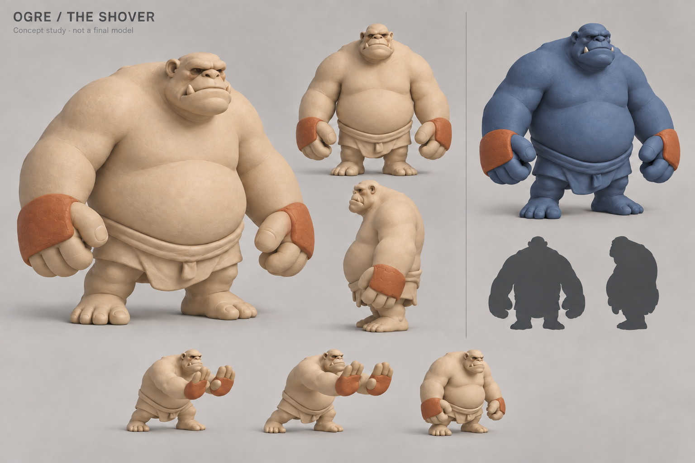

# Ogre design exploration — 2026-09-22

A new design proposal, not recovered artwork. The existing Ogre has a rules identity but no original sculpt in the 16-design art library. It currently falls through to a plain placeholder in the game renderer. In the lab rules it takes adjacent steps and can shove a neighbouring non-king one square away; whether it follows is a rules option. The visual design should communicate physical displacement without implying a new rule.

## Directions considered

| Direction | Distinctive shape / coloured feature | Strength | Risk |
| --- | --- | --- | --- |
| **The Shover — preferred** | Upright, broad-bellied humanoid; small heavy-jawed head; huge flattened palms; terracotta hand pads | Reads as a deliberate pusher, with clean leg space and a clear shove gesture | Needs more deliberate shape design than a generic fantasy brute |
| Hillback | Tall sloping back, low face, massive shoulder/neck mound; coloured elbow pads | Unusual, lumbering silhouette and strong weight | Can drift toward the crouched Beast or Guard's shoulder mass |
| Clay Mason | Squarer barrel torso, broad apron, large bare workman's hands; coloured short apron panel | Handmade personality, simple surfaces, coherent clay construction | Apron can hide steps and the concept suggests a tradesman more than an Ogre |

The Shover separates itself from the Guard's enclosed armour dome and the Beast's toothy, crouched creature silhouette. Its body stays in the army clay family; one exact attached feature carries its identity colour. No club, shield, horns or dangling gear are needed to explain the shove.

## Concept sheet and its limits

The concept sheet explores front/side/three-quarter views, alabaster and ink-blue versions, silhouette thumbnails and a shove gesture. It was generated with built-in ImageGen using the existing Guard, Beast and handmade-material captures as style references. Prompts are saved alongside the image. The sheet is an art-direction aid, not an exported mesh, final topology or an automatic multi-view reconstruction.

The first pass put too much accent on wrist bracers and retained unnecessary anatomical details. A targeted refinement moves the accent toward the pushing hand surfaces and simplifies the anatomy; a final palette correction keeps the blue army's exposed hands blue. The neutral views still read somewhat like hand guards, while the gesture views explain the palm-pad intention more clearly. Exact pad boundaries and agreement between every view must be authored in the model rather than inferred from generated pixels. The final mesh should use a small face, broad clean planes, restrained clay impressions and four chunky digits including the thumb, so the hands remain legible at board size.

## How to build it without a source sculpt

1. **Author a clean editable Blender blockout.** Start with the body, wedge head, upper/lower arms, broad palms, thighs, shins and feet. Use broad connected masses and simple bevels; keep legs separated and the short tunic above the knees. Set scale against the existing Guard and Beast. Judge a black silhouette from front, side and the game's oblique camera before small details.
2. **Check it in the actual renderer early.** Put both armies beside the Guard/Beast at 0.5 px and at full-board scale. The two priorities are immediate recognition and clear feet. A beautiful studio sheet can conceal failures at game scale.
3. **Add identity after the shape works.** Heavy lower jaw, blunt nose, a slightly uneven brow and tunic edge. Avoid tiny teeth, straps and pores that disappear into texture noise. Give the palm pads separate geometry or explicit face regions, with a small rounded clay ridge; the accent is not a painted height band.
4. **Build joints into the geometry.** Put supporting loops around the knees/elbows and keep the palm pads on rigid hand surfaces. A short tunic and exposed lower legs make this easier to animate than the existing long-robed pieces. Four influences per vertex are enough; no dense automatic weight soup is necessary.
5. **Author weight rather than squash.** A slow alternating planted step, modest hip translation, independent foot lift and delayed head/hand follow-through. The shove has three readable beats: brace, extend both palms/transfer weight, recover. Keep torso volume stable. Existing walk and capture preview hooks can test it without adopting any rules.
6. **Export two useful mesh densities.** Preserve the close-up sculpt; make a separate board-scale mesh with the same silhouette, colour features and joints. Set the actual triangle budget after checking the view and device workload. Baked glTF clips and the existing two material roles fit the current engine; no new engine or online mesh-generation service is required.

Acceptance should include both armies, multiple orbit angles, overlap with neighbouring pieces, visible planted steps, no outfit/limb intersections, bounded surface strain, clean reset/cancel, and readable hand accents. The Ogre remains a proposed design until the owner judges its fit with the cast.
