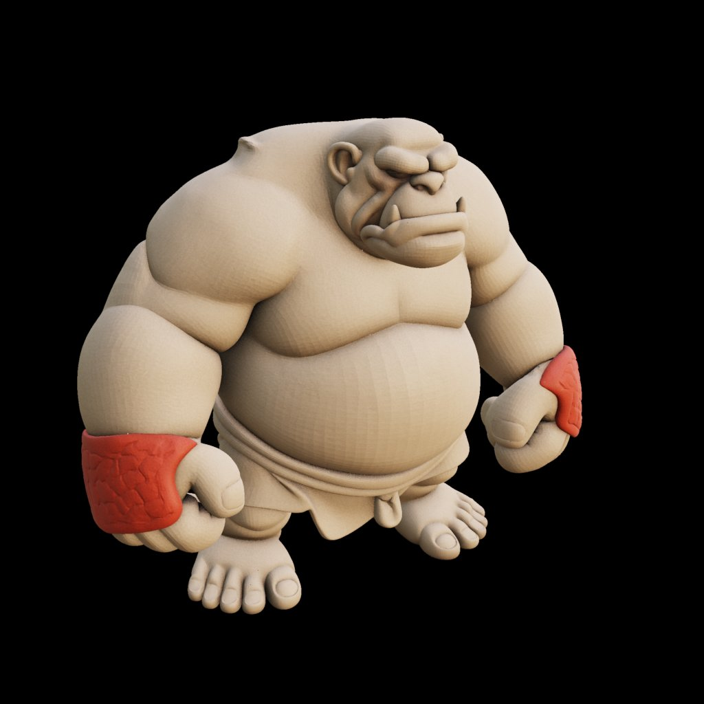
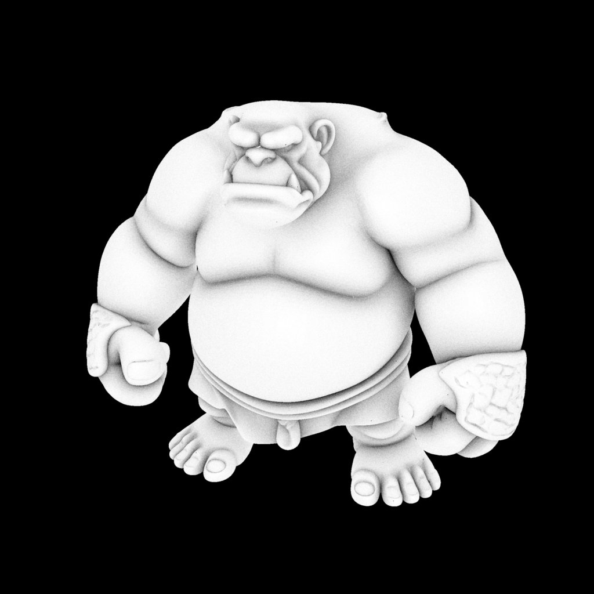
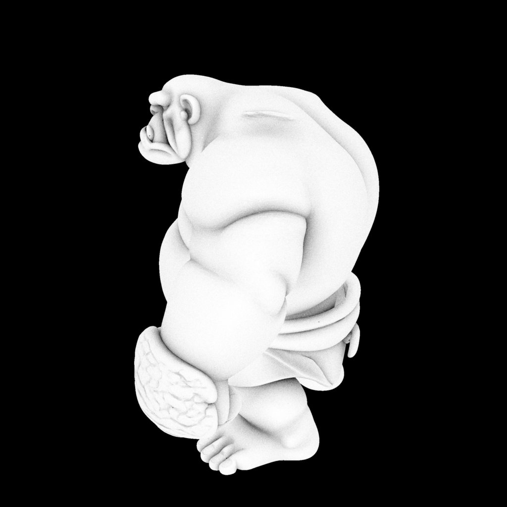
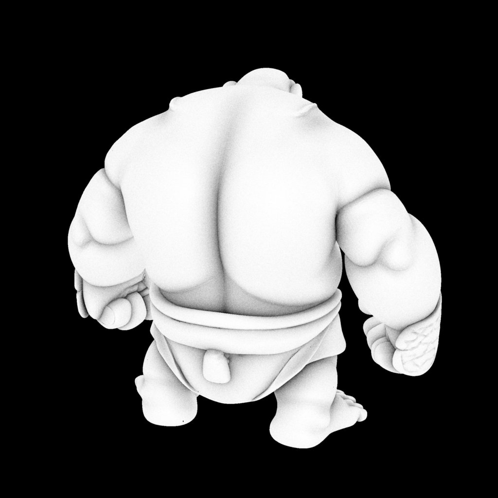

# Ogre replacement research — 2026-09-22

The owner rejected the procedural Ogre from `914ec07`. Its tests establish animation/runtime correctness, not fidelity to the approved Shover study. The replacement must be judged on its silhouette and face before animation work. This investigation does not change the live Ogre or undo the separate board-mesh engine improvements.

## Result

**Use consistent views of the approved character to reconstruct a sculpting base, then refine that mesh in Blender.** Klayzen's licensed Ogre is the strongest library donor found, but changing its face, armour and anatomy to the Shover is substantial work; it is not an interchangeable ready-made replacement. These are visual assessments of previews, not verified mesh-quality claims. The authorized single-view TRELLIS.2 test below provides useful evidence, but fails the art and export gates; it is not accepted for the game.

- [Visual comparison](index.html), also served at `http://localhost:5190/docs/graphics-prototype/ogre-replacement/index.html`.
- [Original approved sheet](../ogre-concept/ogre-shover-concept.png).
- [Prepared single-view input](shover-input.png): built-in ImageGen isolated the large left hero, retaining the broad body, face, hands and short legs. Visually compared with the sheet; 1254 × 1254 RGBA, alpha spans 0–255. This is a generated extraction, not a pixel-exact crop. [Exact extraction prompt](input-prompt.txt).
- No donor mesh has been downloaded. The owner explicitly approved uploading the isolated image to Microsoft's public TRELLIS.2 Hugging Face demo for one reconstruction test. That test produced rendered 3D views, but GLB extraction failed twice. No usable mesh was downloaded or integrated.

## Actual TRELLIS.2 trial

Input: `shover-input.png`. Service: `https://microsoft-trellis-2.hf.space/`. One generation, resolution 1024, seed 0, randomization off, remaining generation controls at the demo defaults. The preview completed and exposed eight viewpoints in normal, neutral clay, base-colour and three lighting modes. This is the service's rendered reconstruction preview, not another ImageGen illustration and not a locally inspected mesh.

| Neutral front-facing view | Neutral side view | Neutral back view |
| --- | --- | --- |
|  |  |  |

**Visual judgment:** the overall mass and broad hands are closer to the study than our rejected procedural model. However, the crown of the head is flattened into an overly high back, the brow and facial folds are overbuilt, arm/chest ridges exaggerate segmentation, and the back invents anatomy absent from the reference. These are reasons to reject this pass as a final sculpt, not problems that clay shading alone will fix. Single-view inference has to invent the unseen surfaces; consistent reference views are a better next experiment.

**Export outcome:** the first GLB extraction requested 300,000 faces / 2048-pixel texture. It returned a generic `Error` and an empty download value. Retrying the same generated state at 100,000 faces / 1024 texture also returned `Error`. No paid generation, new account, or additional reconstruction was started. The demo supplied no actionable error details, so the root cause is unconfirmed. An [upstream issue reports the same symptom](https://github.com/microsoft/TRELLIS.2/issues/8), but does not prove this run has the same cause.

The four JPEG previews above were downloaded from the generated page images using the browser's media download operation and preserved without editing. The Blender inspection could not run because no GLB was produced. Triangle count, watertightness, topology, animation readiness and actual in-engine performance therefore remain unverified.

## Model-library candidates

| Candidate | Verified source facts | Visual fit and adaptation work | Access / uncertainty |
| --- | --- | --- | --- |
| [Stylized Ogre — Klayzen](https://sketchfab.com/3d-models/stylized-ogre-gameready-character-e723ecbfdd82413cac16f1cab196ee5f) | CC BY 4.0; public metadata reports 10,038 triangles / 5,612 vertices. Creator describes skin and rig. | Best donor: broad belly, large hands, sculpted anatomy. Remove shoulder cape, chains and armour. Close/rebuild the exaggerated open mouth; reshape shoulders, head and limbs to the study; add short tunic and exact clay pads. | Sketchfab page and public metadata checked. Download click opens login; anonymous download API returns 401. Rig, topology, separate-part structure and neutral pose remain untested. Attribution and modification notice must accompany use. |
| [Ogre — xGhostArtx7](https://blendswap.com/blend/12011) | CC0; creator lists 7,444 triangles / 3,816 vertices, texture and rig; Blender 2.6-era file, 2.44 MB. | Simpler belly and short outfit, but narrow shoulders, small hands and basic face. Needs substantial proportion and face work. | A user comment reports hip/shoulder weighting and elbow detachment problems. This is a report, not reproduced evidence. Download package not inspected. |
| [Ogre Creature — Sazerac](https://blendswap.com/blend/4979) | CC0; creator lists Rigify; Blender 2.6-era source, 50.6 MB. | Connected anatomy and a developed face, but lean, muscular and long-limbed. Weak match for the Shover's continuous heavy body. | Download page requires sign-in. AnyRPG's comment says it repaired the rig and weights for its own use; that does not verify the original archive. |

All three source previews were visually inspected. Klayzen's exact metadata was read from [Sketchfab's public model endpoint](https://api.sketchfab.com/v3/models/e723ecbfdd82413cac16f1cab196ee5f). The comparison page embeds the authors' original remote previews, with links and credits; they are not copies of adapted assets. No embedded model-viewer files were extracted to bypass download authentication.

Other searches were filtered rather than promoted as candidates: OpenGameArt's generic “Ogre” result is [2D concept art](https://opengameart.org/content/ogre), not a mesh; [Jerry the Ogre](https://www.cs.cmu.edu/~kmcrane/Projects/ModelRepository/) is a head asset, not a full-body solution. “Free”, “rigged” and “game ready” in a listing do not prove suitable topology or commercial reuse rights.

## Concept-to-3D routes

### First shape test: Microsoft TRELLIS.2

The current [official repository](https://github.com/microsoft/TRELLIS.2) and [model card](https://huggingface.co/microsoft/TRELLIS.2-4B) provide a single-image model and GLB output. Official local requirements are Linux, NVIDIA GPU with at least 24 GB VRAM and CUDA; this is not a verified native-Mac path. Its [public Hugging Face demo](https://huggingface.co/spaces/microsoft/TRELLIS.2) exposes upload, generation and GLB extraction without an initial login wall. Anonymous preview generation worked in our trial; GLB export did not.

The model/repository list MIT. The [project page](https://microsoft.github.io/TRELLIS.2/) separately limits the materials shown there to research use; do not assume rights to its gallery examples. That notice's application to generated outputs is not established by this research. Preserve input provenance and check applicable deployment/dependency terms before commercial adoption.

The [demo source](https://huggingface.co/spaces/microsoft/TRELLIS.2/raw/main/app.py) says images are temporarily cached on Hugging Face and deleted after the session, and that Microsoft does not access/retain them. Opaque images go through a separate BRIA background-removal service. Our prepared PNG has genuine alpha; the inspected `preprocess_image` branch uses that alpha directly and skips removal. The owner explicitly approved this upload under the browser tool's upload rule.

TRELLIS.2's current upstream interface is single-image. Do not advertise multiview support based on an unmerged PR. Original [TRELLIS](https://github.com/microsoft/TRELLIS) documents experimental multiview conditioning and warns about inconsistent images.

### More controlled multiview: Tripo

Tripo documents [image-to-multiview](https://developers.tripo3d.ai/en/docs/generation-image-to-multiview), [view editing](https://developers.tripo3d.ai/en/docs/generation-edit-multiview) and [multiview reconstruction](https://developers.tripo3d.ai/en/docs/generation-multiview-to-model/standard). The last requires a front image plus at least one other view of the same object under consistent lighting. It supports a face limit and geometry without generated textures; set both `texture=false` and `pbr=false` because PBR otherwise forces texturing on. A rig is a separate step, not proof of clean deformation.

It needs an account/API key and generation credits. The [current Studio pricing](https://www.tripo3d.ai/pricing) lists free output as public/noncommercial and paid plans with commercial/private use. Studio subscription pricing does not establish an API job's cost. Check [commercial-use conditions](https://www.tripo3d.ai/help/privacy-policy/how-to-use-tripo-models-commercially) and [upload/privacy terms](https://www.tripo3d.ai/privacy) for the actual service path before committing. No subscription or credits were purchased.

### Open multiview fallback: Hunyuan3D-2mv

The [official model](https://huggingface.co/tencent/Hunyuan3D-2mv) and [example](https://github.com/Tencent-Hunyuan/Hunyuan3D-2/blob/main/examples/shape_gen_multiview.py) use front/left/back conditioning. The repository lists about 6 GB VRAM for shape generation and 16 GB for shape plus texture; the example explicitly uses CUDA. Native Apple/MPS multiview execution here is unverified.

Its [community license](https://github.com/Tencent-Hunyuan/Hunyuan3D-2/blob/main/LICENSE) is not MIT/Apache. It contains territorial and use restrictions, including excluding the EU, UK and South Korea. Although Tencent claims no rights in outputs and distinguishes outputs from model derivatives, those provisions do not remove its other conditions. This makes it a less straightforward default for a broadly distributed game.

## Concrete proof-of-concept and adaptation plan

1. **First test completed; next use controlled multiview.** The single-view TRELLIS.2 trial exposed anatomy problems and failed export. Create front/side/back references with identical body mass, head height, hand shape, pad placement and neutral pose, then use Tripo's multiview workflow on a suitable account, or obtain Klayzen's official archive as the donor route. A different service upload/account/purchase has not been authorized. Do not repeatedly rerun the failed demo without new evidence about the export fault.
2. **Inspect the actual mesh in Blender with a neutral material.** Compare front, side, back and the game camera against the study. Check shoulder slope, continuous belly/torso, small recessed head, broad jaw, hand size and short legs. Inspect hidden back/hand surfaces, joined fingers and outfit intersections. Texture realism must not conceal wrong geometry.
3. **Repair the sculpt and simplify deliberately.** Make palms/fingers readable, form the brow/eye sockets in the mesh, remove incidental noise and keep one clean tunic hem. Author coloured pads as explicit rounded surfaces on both hands; settle their inconsistent placement in the concept. Preserve the established army colours and feature-only accent.
4. **Approve the static shape before rigging.** Render both armies beside Guard and Beast at 0.5 px and board distance; include orbit and overlap. If the reconstruction has the wrong body/face, reject it here. If needed, test Tripo's consistent multiview route or adapt Klayzen's licensed base after obtaining the official archive.
5. **Prepare animation topology and export.** Rebuild deformation zones where necessary; use stable torso volume, planted alternating feet and soft delayed hand/head follow-through. Preserve the accepted animation direction: no whole-body step squash. Add Walk/Shove, exact accent material roles and the existing clay layer as appropriate. Export close-up and board GLBs through the current Three.js pipeline.

The renderer does not need replacing for this asset. It already accepts better sculpt geometry, baked skeleton animation, clay materials, outlines, capture effects and board-distance meshes. The unmet requirement is a faithful sculpt.

## Verification performed

- Creator previews inspected; license/download facts checked against primary pages and public metadata, with creator claims distinguished from tested geometry.
- Current image-to-3D docs, model licenses and demo preprocessing inspected; one explicitly approved cloud reconstruction completed its preview, with two failed export attempts on that same state.
- Prepared transparent input inspected against the hero reference, and image mode/alpha verified programmatically.
- Neutral front/side/back and textured preview images inspected and saved. No Blender or in-engine mesh checks could run without an exported mesh.
- Browser comparison page checked for loaded images, source links, layout and legibility. No game files changed; game tests are not relevant to this research-only change.

Research assistance used the project's research skill for an independent primary-source check of reconstruction options. The image was prepared using built-in ImageGen, not the CLI fallback. Artistic acceptance of any future mesh remains with the owner.
