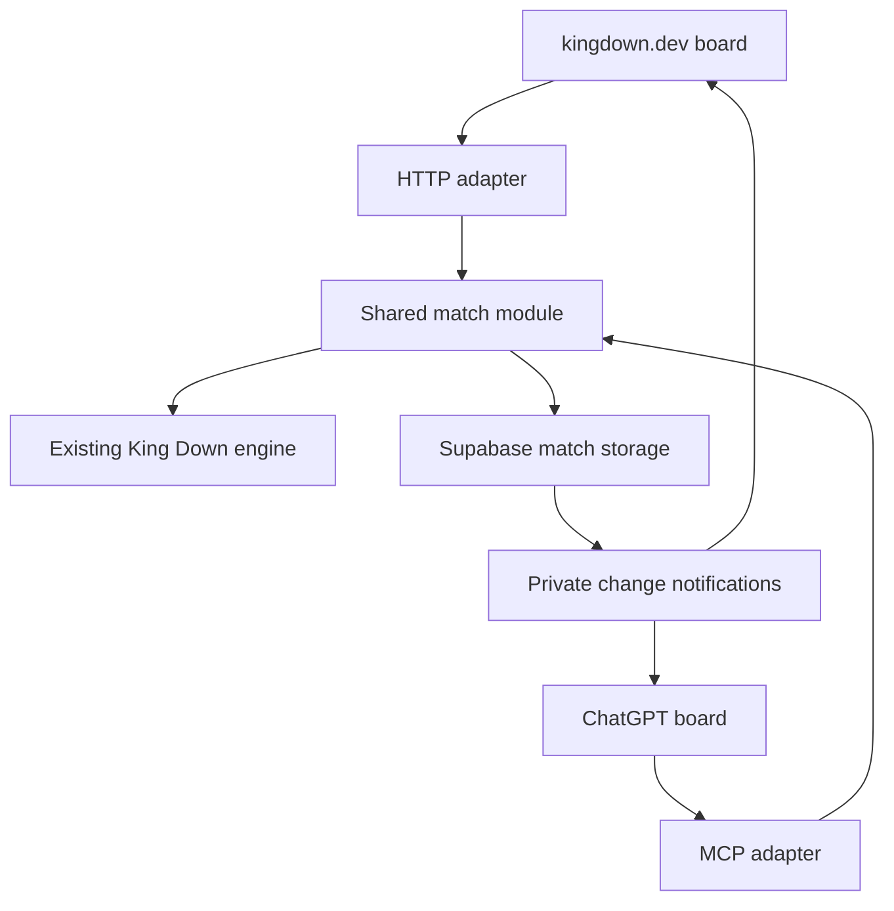

# King Down plugin — preparation while the game evolves

Prepared October 7, 2026. **Packages 1–3 are implemented locally on `codex/match-foundation`; production integration remains planned.** The [module guide](../match-foundation.md) records the interface, verification and limits. The owner is still developing kingdown.dev. This work should support that evolving game, not freeze its current rules or duplicate its code. The [market register](chatgpt-chess-market.md) is the canonical competitor record; the [feasibility report](chatgpt-plugin-feasibility-2026-10-07.md) holds platform/product research.

## Recommended shape

The next-step [environment research and experiment plan](chatgpt-plugin-environment.md) now recommends a small private playable host experiment and validation-only CI, with durable authenticated storage developed alongside it. Resolve actual account, renderer, worker and recovery behavior before making full multiplayer a prerequisite. The research separates documented support from host behavior we have not tested.

Keep **one game implementation**, with the website and ChatGPT as two ways to play. Game rules, legal moves, results and computer search stay in the existing engine. A small match module owns validated commands, saved match state and revisions. HTTP and MCP adapters expose that same module to the two clients. Teaching and model interaction are optional. The diagram is the eventual shared architecture; the first preparation slice is local and does not change the working website or provision multiplayer storage/Realtime.

Notifications tell clients to refresh an authorized view; they do not determine legal moves. The ChatGPT board can call tools through the app bridge without generating a model reply. Real-time subscriptions require a separately verified session/permission path; the diagram is a proposed design, not proof that current accounts already support it.

**Use existing Vercel and Supabase first.** The website already uses Vercel, Supabase accounts and personal cloud saves. A server endpoint with transactional match storage and private Realtime is a plausible extension. Cloudflare Durable Objects is an alternative if evidence shows a room coordinator is simpler; its tutorial alone is not a reason to introduce another platform.

Current Vercel documentation supports WebSockets in public beta, so the old categorical “Vercel cannot host sockets” assumption must not determine this choice. Connections have runtime limits and reconnects can reach another instance. Supabase can handle fan-out while Vercel handles ordinary commands, avoiding a requirement for permanent per-match processes. Hosting limits and actual account configuration still need verification. [Vercel WebSockets](https://vercel.com/docs/functions/websockets), [Supabase database notifications](https://supabase.com/docs/guides/realtime/subscribing-to-database-changes)

## What is already available

- [Game](../../src/game.ts) handles legal moves, history, undo and repetition; [setup](../../src/rules/setup.ts) serializes positions/moves. `Game.play` trusts its caller, so the match module must select a move from current legal actions and enforce terminal status.
- The browser [search worker](../../src/ai/worker.ts) receives rule snapshots. Existing [Node worker loading](../../src/sim/ts-worker.ts) and [bootstrap](../../src/sim/worker-boot.mjs) provide a local isolation pattern. Import `Game`, not the browser `Engine` wrapper or DOM-heavy `main.ts`.
- Supabase [client](../../src/account/client.ts), [sync](../../src/account/sync.ts) and [migration](../../supabase/migrations/0001_accounts.sql) support personal data. The owner-editable `saved_game` field is **not authoritative shared match storage**.
- [package.json](../../package.json) already includes TypeScript, Vitest, Playwright and tsx. No additional dependency is necessary to prove a local match-command layer.
- The existing [Pages workflow](../../.github/workflows/pages.yml) is a manually invoked publishing workflow. It is not a validation-only CI gate. The standing production Vercel process publishes static `dist`; backend deployment must be added explicitly rather than assumed to accompany it.

## Preparation packages and acceptance checks

| Work | Concrete deliverable | Completion evidence |
|---|---|---|
| **1. Shared match commands** | Small typed interface for creating/loading a match, reading its permitted snapshot and submitting a legal move. Include command ID, expected revision, actual turn and terminal result. | Invalid/stale/post-game commands preserve state; retried commands apply once; a reused ID with different input is rejected. |
| **2. Isolated engine execution** | Local Node worker importing the current engine with the match's rule snapshot. No engine rewrite or copied rules. | Alternating two differently configured games produces the same results as isolated runs; restart/replay restores legality, turn and repetition. |
| **3. Save and release contract** | Initial position/setup, validated history, rule snapshot, schema/engine revision and match revision. Unsupported versions produce an explicit result. | Deterministic round trip, correct special moves and repetition; an incompatible engine cannot silently reinterpret the save. |
| **4. Multiplayer persistence and access** | Reviewed match/seat/invite/command schema, atomic commit operation and per-player read policy, initially local/staging. | Two clients racing one revision cannot both commit; illegal/out-of-turn or unauthorized moves fail; invite reuse and cross-match access behave correctly. |
| **5. Thin plugin integration** | MCP adapter invoking the same match commands, minimal native board shell and current package metadata/CSP. Reuse existing artwork and renderer capabilities where practical; `main.ts` couples them to DOM controls, so embedding still requires an adaptation check. | Protocol calls return the same results as website commands; direct board play requires no model response; real host test later confirms rendering/assets/auth. |
| **6. Validation without publishing** | Focused tests plus separate typecheck/test/build CI that never deploys. | Tests fail on broken turn handling, save/replay, concurrency or authorization; existing browser behavior remains passing on integration. |

**Start with packages 1–3 as one end-to-end local slice.** It proves the most durable seam with no cloud account changes. Then persist those same operations transactionally and expose them to clients. Do not build placeholder interfaces for unspecified providers, a general-purpose game SDK, a separate rules registry or a second account system.

The first implementation is in new `src/match/` files and tests, in an isolated worktree because the owner is actively changing the app. It imports the engine and leaves rules, artwork, renderer, UI and account files unchanged. CI/package changes are a separate integration step. The source-based engine fingerprint deliberately rejects incompatible saves; it is not yet a deployed release policy.

## Keeping pace with changing rules and visuals

**Import the current engine; never maintain a plugin copy.** This lets most mechanic changes flow to the integration automatically. New behaviors can still require protocol or rendering work, and the acceptance tests should expose those dependencies. Artwork/layout changes need not alter the match contract.

The existing engine has mutable module-global `RULES`, cached legality in `Game` and persistent search scratch tables. A local worker per match is a simple correctness proof, not a decision to keep unlimited workers alive in production. A production operation can reconstruct the correct match in an isolated execution context. Merely switching global rules beneath cached games is unsafe. Reset search tables when changing games/rules.

A **rule snapshot is not an engine version**: code changes can change the meaning of identical saved parameters. Record engine identity now. During development, explicitly refuse unsupported replay. Before public multiplayer, choose an active-match release policy: preserve the matching engine until games finish, or use a clear maintenance boundary for incompatible updates. Do not implement a speculative multi-version hosting system now, and do not silently migrate games to new mechanics.

The focused fixture set should cover Archer shots without movement, Beast chains, Ogre pushes, Maester swaps, promotion, terminal positions, repetition and Haste same-side continuations. Use the engine's real turn/move number, never ply parity. No tournaments or training runs are required for these checks.

## Database and identity decisions

**Moves are commands, not uploaded replacement boards.** The service loads match revision R, validates the legal move and caller, then commits history/state only if R and authorization still match. Unique command IDs prevent retry duplication. A stale result returns current state instead of overwriting another player's move. Do not hold a database lock while a remote engine call runs. [Postgres locking](https://www.postgresql.org/docs/current/explicit-locking.html)

Keep authoritative matches separate from personal cloud saves. Client permissions should not permit arbitrary match writes. Server secrets remain server-side; any privileged database function must have narrow grants and explicit identity/seat checks. Realtime sends a match/revision signal or a deliberately permitted view, not hidden hands or raw private engine state. [Supabase row security](https://supabase.com/docs/guides/database/postgres/row-level-security), [private Realtime authorization](https://supabase.com/docs/guides/realtime/authorization)

Use the existing Supabase user identity where practical, but distinguish **website login, host MCP authorization and widget subscriptions**. They do not share browser storage automatically. Start website commands through its session and plugin board commands through the authorized MCP bridge. Do not expose a long-lived host OAuth/refresh credential to the iframe. Direct subscriptions need a tested, short-lived authorization path compatible with the database's verification and room policies.

Supabase now documents an OAuth 2.1 server and MCP authentication using existing users. This can avoid another identity vendor, but needs project setup, consent, client registration and actual ChatGPT compatibility checks. Existing website sign-in is not proof of that configuration. Token audience and room authorization must agree across MCP, database and Realtime. [Supabase MCP authentication](https://supabase.com/docs/guides/auth/oauth-server/mcp-authentication), [token security](https://supabase.com/docs/guides/auth/oauth-server/token-security), [OpenAI auth](https://developers.openai.com/plugins/build/auth)

Local Supabase can provide actual transaction/RLS tests when Docker/CLI are available. In-memory tests prove command behavior, not SQL atomicity or authorization. Tool availability on this Mac was not checked in this planning pass. [Local development](https://supabase.com/docs/guides/local-development)

## Work to postpone

Final widget design and animation tuning should follow the evolving website. Card/deck UX, Workshop redesign, ranking, public matchmaking, clocks and generated teaching content are product features with separate dependencies. They are not prerequisites for the shared match foundation. Optional PiP is an actual-host presentation test, not an architecture dependency.

Cloud actions come after the local slice: inspect live project capabilities, create a separate staging environment, apply reviewed schema/access policies, configure OAuth, and deploy/test private MCP/API endpoints with two accounts. A separate backend release can keep matches stable while website visuals change. No production DNS changes, public deployment, marketplace submission, paid resources or account changes were made by this research.

## Verification of this plan

Grounded in the existing game, worker, account, migration and CI files plus current primary Vercel, Supabase and OpenAI documentation. The initial research changed no game code. The subsequent local implementation and its verification are recorded in [the module guide](../match-foundation.md) and `TASKS.md`; packages 4–6 retain their remaining integration checks. Staff-level simplification: reuse the current engine and hosting/account stack; prove one complete match-command path before provisioning extra infrastructure or restructuring the app.
