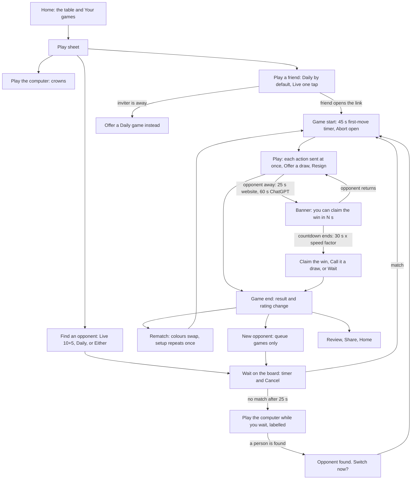
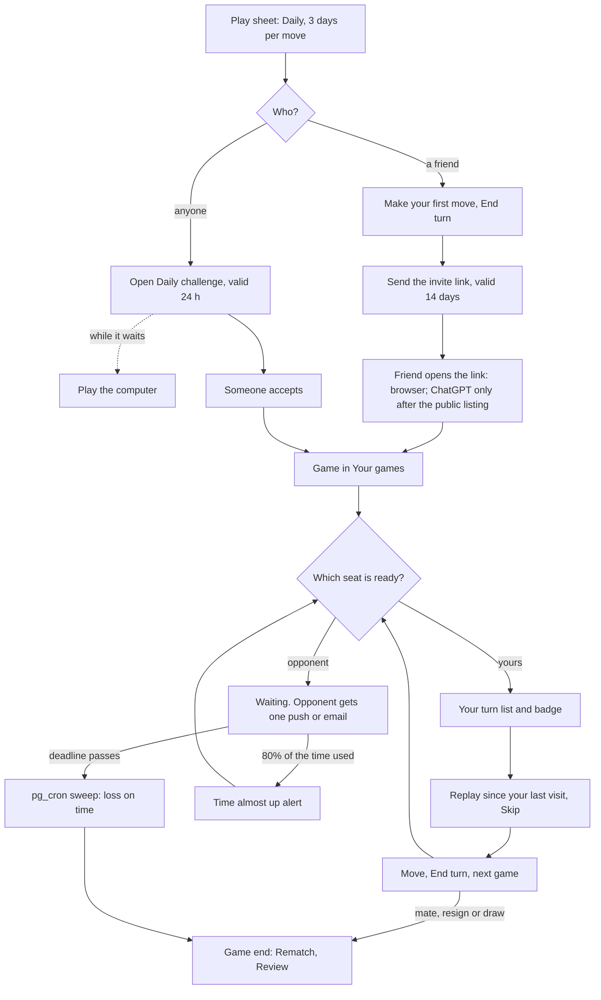
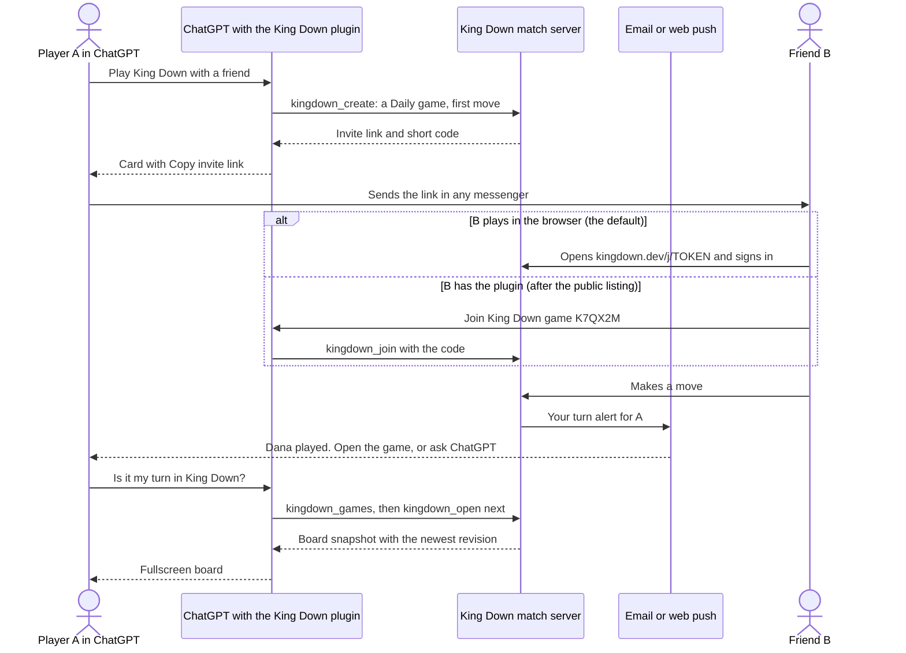
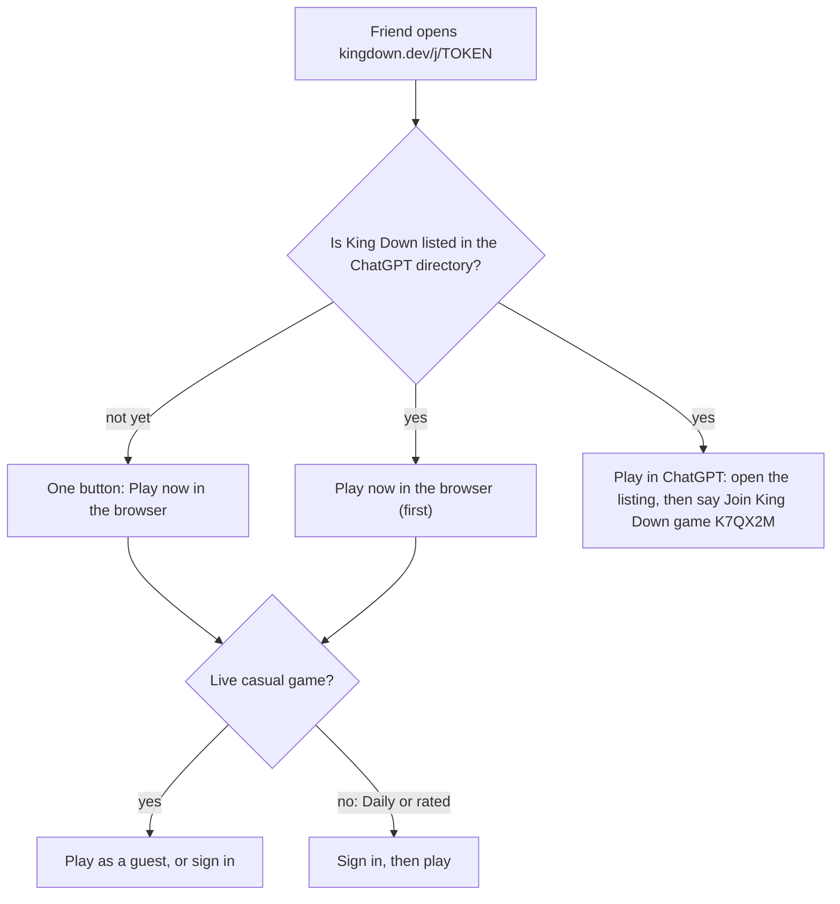

# 01 · User journeys and UX: live and Daily play, website and ChatGPT, accounts

## 1. Summary

Online chess games share one simple path: a Play button, three ways to start, a short wait, the game, and an end screen with Rematch. Most sites let a new person play a casual game first, and ask for an account only for ratings, saved games or Daily games. King Down will have few players online at once, so friend invitations and Daily games come first, and the computer is always ready. Email or phone alerts tell players when it is their turn, because ChatGPT cannot alert them. Today a friend can use the ChatGPT plugin only after a manual setup, so invitations open a board in the browser until OpenAI lists it. UK online-safety law can already apply to today's friend games in ChatGPT, so King Down needs written risk checks now, a Report button and clear terms. One King Down account already works on the website and in ChatGPT, and it now needs a unique public handle and simple privacy settings. Section 11 lists the choices that only you can make, with our pick for each.

Research report for King Down Chess, 2026-10-10. This is part 01 of the report in `docs/research/multiplayer-2026-10-10/`. Ticket: [01 — Deep research](../../specs/accounts-multiplayer/issues/01-deep-research.md). This revision adds the gap findings on ChatGPT access (gap 1), small digital board games (gap 5) and UK and EU online-safety law (gap 6), and it removes the contradictions with parts 02 and 03. A checker read the gap findings on 2026-10-10. This revision applies the checker's verdicts, and it uses the phase plan of part 03 (phases 0 to 5).

## How to read this section

- **Labels.** Each recommendation has one label:
  - **Common practice**: most products we studied do it.
  - **Best practice**: an official guideline, a law, a regulator's guidance or published research supports it.
  - **Our inference**: we reason from the evidence; no product or guideline proves it.
- **MVP** means the first public multiplayer release. This part uses the phase plan of part 03, section 9.1: 0 Measure, 1 Friends and Daily, 2 Live, 3 Open play and ratings, 4 Awards and the public launch, 5 Later. The MVP is phases 1 to 4, and each MVP item gives its phase, for example "MVP, phase 1". **Later** means phase 5: behind flags, after the public launch, when players ask for it or the player pool grows.
- **Terms.** This part uses one term for each meaning:
  - **Daily game**: an asynchronous game with a deadline for each move, for example 3 days. "Daily" is the name of the mode, so it always has a capital D, as in parts 02 and 03. Chess.com calls it "Daily", and Lichess calls it "correspondence". The button label is **Daily**.
  - **live game**: a game with a running clock, while both players are online.
  - **the computer**: King Down's own computer player. The button label is **Play the computer**. "Bot" names a computer player in other products only.
  - **handle**: the unique public name of a player, for example @dana.
  - **turn** and **action**: a turn ends when play passes to the opponent. A Haste turn has two actions.
  - **first-move timer**: the time that a side has to start its first turn.
- **Finding IDs.** IDs in square brackets point to the appendix files in this folder:
  - [ux-live:F3] and the other `ux-*` IDs: [appendix-a-user-journey-findings.md](appendix-a-user-journey-findings.md);
  - `rk-*` IDs: [appendix-b-ranking-findings.md](appendix-b-ranking-findings.md);
  - `tc-*` IDs: [appendix-c-technical-findings.md](appendix-c-technical-findings.md);
  - `gap1`, `gap2`, `gap5` and `gap6` IDs: [appendix-d-gap-findings.md](appendix-d-gap-findings.md).
  
  The main source URLs are also given next to the key recommendations and in section 12, so the evidence stays traceable without the appendices. The checker of the gap findings also added some facts that have no ID. The text calls each one a "checker fact", names its gap, and gives its source link.
- **Evidence limits.** The shared web-search budget ran out in each research thread. After that, researchers read only pages with known addresses. Some product facts rest on help pages, open-source code or community posts. A checker read the gap findings (gaps 1, 2, 5 and 6) on 2026-10-10. Where the checker corrected a finding, this section uses the corrected claim and marks it "corrected". Where the checker could not verify a finding, the text marks it "unconfirmed". Appendix D can still show "unchecked" in its Check column; the verdicts in this section are the later ones. Where a finding has medium or low confidence, the text says so. This section uses no refuted finding.
- **Not legal advice.** Section 5.7 reads UK and EU law from primary texts. A lawyer must confirm the scope and the duties.
- **Scope.** Ratings, leaderboards and awards are in part 02. Databases, connections and hosting are in part 03. This part names a technical item only when it changes what the player sees.

## 2. The common journey

The tables below compare the journey steps across the products we studied. "Prevalence" gives the count from the findings. "Status" says how standard the step is.

### 2.1 Live play and accounts

| Step | Chess sites (Lichess, Chess.com, ChessKid) | Variant and board-game sites (PyChess, OGS, BGA, Lishogi, 81Dojo, Colonist) | Card and casual apps (Hearthstone, Marvel Snap, Duolingo Chess, Chess Clash) | Prevalence | Status |
|---|---|---|---|---|---|
| Play with no account | Lichess: casual games. Chess.com: Guest Play at a chosen skill level. ChessKid: account needed | PyChess: live only, never rated. 81Dojo: anonymous play | Duolingo: account needed. Others: not documented | 3 of 7 live chess products; 3 of 4 board sites checked [ux-live:F1] [ux-other:F23] | Common |
| Rated and Daily games need an account | Lichess: rated games and correspondence only when signed in. Chess.com: the guest article does not say | PyChess: no anonymous correspondence, anonymous games never rated. 81Dojo: register to play rated | — | Every product with guest play that states a rule [ux-live:F1] [ux-guidelines:V1] | Common |
| Three ways to start: the computer, a friend, a stranger | Lichess: Quick pairing, Create a lobby game, Challenge a friend, Play against the computer. Chess.com: Start Game, Custom Challenge, Play a Friend, Play Bots | PyChess: Create a game, Play with a friend, Play with AI, Auto pairing. Lishogi: the same three | Duolingo: one "Play a Person" button | 6 of 6 web board sites have friend and stranger, 5 of 6 show the computer [ux-other:F1]; 6 of 6 chess lobbies [ux-live:F2] | Universal |
| One-tap quick play | Lichess: 11 time tiles plus Custom. Chess.com: Start Game remembers your last time control. ChessKid: 5, 10 or 15 min only | BGA: "Play now". OGS: Quick Match tab | Hearthstone, Marvel Snap: one queue button | 7 of 7 live chess products [ux-live:F3] | Universal |
| List of open challenges next to auto-match | Lichess: Lobby tab. Chess.com: open challenges as a list or chart; variants have a lobby and no quick pool | PyChess, OGS, BGA, 81Dojo: seeks or tables plus auto-match | Card games: one queue only | 5 of 5 board sites, 0 of 4 card games [ux-other:F5]; 3 of 3 niche modes [ux-live:F6] | Standard for small pools |
| Wait in several queues at the same time | Not found | BGA: several "Play now" clicks. PyChess: many variants and time controls. OGS: "Flexible". 81Dojo: wait and auto-pair | — | 4 of 5 board sites [ux-other:F7] | Common on small sites |
| The allowed rating gap grows with the wait | Chess.com: ±25, then ±50, cap ±200. Lichess: pairing waves; the allowed gap grows by up to 460 points after many missed waves | 81Dojo: asks to confirm a match found after 3 min. PyChess: no range set means no limit | Hearthstone: widens after a few seconds | All matchmakers checked [ux-live:F4] [ux-other:F8] [ux-guidelines:F15] | Universal |
| Light wait state with Cancel | Lichess: spinner in the tile, Esc cancels; mobile: overlay on the empty board | 81Dojo: no cancel in the first 30 s (exception) | — | Every chess product checked [ux-live:F5] | Universal |
| Invite a friend by link, code or name | Lichess: URL, QR code, username, reusable link. Chess.com: friend list, profile, chess.com/play/name | PyChess: invite link and "host a game for others". Colonist: room link. Tabletopia: link or 6-digit code | Marvel Snap: Battle Mode. Hearthstone: Friendly Challenge | 7 of 7 live chess products; every product checked [ux-live:F7] [ux-other:F4] | Universal |
| Friend games are unrated by default | Lichess: friend games can be rated (exception) | OGS: ranked games cannot be private. 81Dojo: password rooms are unrated | Hearthstone, Marvel Snap: no rank change | Most products [ux-other:F4] [ux-other:V3] | Common |
| Random colours with strangers, a choice with friends and the computer | Lichess, Chess.com | — | — | 2 of 2 [ux-live:F8] | Common |
| First-move timer and an abort window | Lichess: 15–35 s (1.5 times for Chess960), abort until both sides move. Chess.com: 15, 20 or 60 s | PyChess: no first-move timer outside tournaments | — | 2 of 3 chess servers; no 3-2-1 countdown in any product [ux-live:F9] [ux-live:V4] | Common |
| Resign (with a confirmation), offer a draw, abort, flip, sound, chat | Lichess, Chess.com | PyChess, plus "Give 15 seconds" | — | 4 of 4 with documented controls [ux-live:F12] | Universal |
| Takebacks in live games | Lichess: with consent, even when rated. Chess.com: none in live games | PyChess: yes | — | 2 of 3 [ux-live:F13] | Varies |
| Chat controls and preset messages | Chess.com: everyone, request, friends or off, plus Quickchat. Lichess: free text plus one-tap presets, and kid mode. ChessKid: no chat between kids | — | Hearthstone: six emotes only, with mute | 6 of 7 live chess products [ux-live:F15]; only Hearthstone replaces text with emotes [ux-guidelines:F18] | Universal (controls) |
| Disconnect: grace time scaled to the speed, then a result | Lichess: 30 s times 1, 2, 4 or 10, then claim the win or a draw. Chess.com: 10% of (base + 40 × increment), 30 s to 3 min, then the game ends | PyChess: 30–60 s, then a loss. BGA: a bot plays for the leaver | League of Legends: remake vote | 3 of 3 [ux-live:F16] [ux-guidelines:F12] | Universal |
| End screen: result, rating change, Rematch, New opponent, Review | Lichess (New opponent only after queue games). Chess.com: "Game Review" button | PyChess: Rematch, New opponent, Analysis board | Words With Friends: Rematch | 3 of 3 confirmed end screens, medium confidence [ux-live:F19] [ux-live:V5] | Universal |
| Rematch swaps colours; a random start position repeats once | Lichess: the Chess960 position repeats on the first rematch | — | — | 1 product documents it [ux-live:F20] | Rare, but fits King Down |
| Leavers and stallers: private warning, short bans, own pool | Lichess: play ban, not shown on the profile. Chess.com: warning to acknowledge, short restriction, separate pool | BGA: public karma score. OGS: a cancel after move 6 counts as a loss | League of Legends: LeaverBuster | 4 of 4 escalate in steps [ux-live:F18] [ux-guidelines:F14] [ux-other:F17] | Universal; public marks are rare |

### 2.2 Daily games (asynchronous play)

| Step | Chess sites | Board and Go sites | Word games and platforms (Words With Friends, Scrabble GO, Game Center) | Prevalence | Status |
|---|---|---|---|---|---|
| Daily play is a time control in the same Play flow | Chess.com: Daily in the time list. Lichess: Correspondence tab | BGA: "game speed" option. OGS: a long clock | Word games: asynchronous only | 4 of 4 hybrid products [ux-async:F1] | Universal |
| A "Your turn" list or count | Lichess: "N games in play" with a your-turn badge. Chess.com: "Daily Games" on home | OGS: turn counter; a click opens the next board | WWF: "Your move" tab. Game Center: Your Turn and Their Turn | 6 of 6 [ux-async:F2] | Universal |
| Most urgent game first | Lichess: live games, then your turn, then least time left | — | — | Lichess only [ux-async:F3] | Some |
| Move, then go to the next game | Lichess: next-game route. Chess.com: not confirmed | OGS: auto-advance setting | Not documented | 3 chess and Go sites (Chess.com unconfirmed) [ux-async:F4] | Common on chess sites |
| Move confirmation in Daily games | Lichess: on by default for correspondence | OGS: separate correspondence submit mode | — | 3 of 3 (Chess.com unconfirmed) [ux-async:F5] | Common |
| Time per move | Lichess: 1, 2, 3, 5, 7, 10 or 14 days. Chess.com: days per move | BGA: from 24 moves a day to 1 move in 2 days. OGS: six clock types | WWF: 5 or 11 days. Scrabble GO: 7 days. Game Center: 1 week by default | Chess and board sites: 4 of 4 let players choose; casual apps: 3 of 4 use a fixed limit [ux-async:F6] [ux-async:F7] | Universal (a deadline) |
| The server ends timed-out games with nobody online | Lichess: a sweeper every 5 s. Chess.com: automatic win by default, 60-day hard limit | BGA: opponents can skip the late player (old doc) | WWF: auto-resign. Scrabble GO: closes the game | 5 of 6 automatic [ux-async:F8] | Common |
| Early games do not count | Chess.com: a Daily game starts after 4 moves. Lichess: deletes unplayed games after 3 days | — | Scrabble GO: no loss before 4 turns | 3 of 3 [ux-async:F22] | Common |
| Low-time warning | Lichess: push at 80% of the time used. Chess.com: Premium auto-vacation under 90 min | OGS: auto-vacation, on by default | Not documented | 3 of 3 chess and Go sites [ux-async:F9] | Common |
| Vacation | Chess.com: earned days, all games pause. Lichess: none | OGS: manual and automatic | Not documented | 3 of 11 [ux-async:F11] | Some |
| Turn alert that checks presence | Lichess: push only when you are away. Chess.com: email after you log off | BGA: one email until you return. PyChess: no push while you are active | WWF: push | 3 of 3 that state a rule [ux-async:F13] [ux-other:F15] | Universal |
| The alert names the opponent and the move | Lichess: "It's your turn! X played Nf3" | PyChess: the same text | Game Center: the turn message | 4 of 4 [ux-async:F14] | Universal |
| Daily digest | Lichess: opt-in email, off by default | BGA: daily report | — | 2 of 11 [ux-async:F15] | Some |
| Per-event alert settings | Lichess: bell and push per event. Chess.com: web, mobile and email | OGS: one switch per event | WWF: in-game settings | 4 of 4 [ux-async:F16] | Universal |
| Random opponent for a Daily game through a stored open challenge | Chess.com: Start Game makes an open challenge when nobody matches. Lichess: stored seeks, 5 per player | — | Game Center: automatch fills seats. WWF: Pick My Match | 5 of 5 [ux-async:F19] | Universal |
| The inviter moves first, then the friend gets the invite | Lichess, Chess.com: friend challenges take Daily times | — | Game Center, WWF | 2 of 2 that state the order [ux-async:F23] | Common |
| A cap on games, or a "not available" switch | Lichess: 5 seeks. Chess.com: "unavailable" setting | BGA: a small limit that grows | Wordfeud: 30 games | 6 of 11 [ux-async:F24] | Common |
| Nudge | — | — | Game Center: sendReminder. WWF: help text only | 2 of 11 [ux-async:F18] | Rare |
| Conditional moves | Chess.com, Lichess | OGS | None | 3 of 3 chess and Go sites, 0 of 3 word games [ux-async:F25] | Chess sites only |

### 2.3 Small player pools and host apps

| Step | What products do | Prevalence | Status |
|---|---|---|---|
| Bots fill gaps | Hearthstone: bots for new and low-rated players, with no rating effect. Yomi: a bot game while you wait. Colonist: bots fill rooms. Scrabble GO: an automatic opponent | 4 of 8 card and strategy games; 2 of 11 asynchronous products [ux-other:F9] [ux-async:F20] | Common in commercial games |
| Bots carry a label | 81Dojo: "COM_" names. PyChess: BOT title. OGS: "Computer" list. Marvel Snap: no label (community report only) | 4 of 4 community sites [ux-other:F10] | Common on community sites |
| Computer play is a permanent mode | Lishogi, PyChess, Backgammon Galaxy, Clash Royale, Hearthstone, Colonist. Tabletopia has none | 10 of 11 [ux-other:F11] | Universal |
| Casual and ranked play are separate | Hearthstone, Marvel Snap, 81Dojo, OGS, PyChess, Colonist | 9 of 9 [ux-other:F3] | Universal |
| Few queue options and merged ratings | OGS cut its options in 2024. Lishogi merged five ratings into one in 2025 | 2 of 3 small-pool sites [ux-other:F6] | Common on small sites |
| Scheduled events | PyChess variant arenas get 0–6 players. OGS cancels events that do not fill. Polytopia's Polysseum works with a 15-minute check-in and brackets that the system makes when enough players wait | Low turnout at variant arenas [ux-other:F18]; 1 working check-in model [gap5:F12] | Weak without a check-in |
| Native invite from inside the host | iMessage, Discord, Telegram, Messenger, LINE: yes. ChatGPT: none | 5 of 5 hosts; not in ChatGPT [ux-embedded:F8] | Universal outside ChatGPT |
| Small view in the thread, large view for play | iMessage, Reddit, Telegram, Discord, ChatGPT | 5 of 5 [ux-embedded:F26] | Universal |
| Turn alert through the host | Messenger, Telegram, LINE, Reddit, Slack, iMessage: opt-in and rate-limited. Consumer ChatGPT: none | 6 of 7 hosts [ux-embedded:F14] [ux-embedded:F6] | Common outside ChatGPT |
| No login wall before the first game | OpenAI, Reddit and Discord developer guides | 3 of 3 host guides [ux-embedded:F11] | Best practice |

### 2.4 Digital 1v1 board games with small player pools

The gap 5 researcher checked 14 digital board-game products and services, most with a small player base. The table groups what they do. The counts are out of 14 unless the row says otherwise.

| Pattern | Products and examples | Prevalence | Evidence |
|---|---|---|---|
| Asynchronous turn-based play is the base online mode, with turn notifications | Twilight Struggle: "Full asynchronous support". Hive on Steam (2013): play "even when your opponent is offline". Ticket to Ride added native turn notifications in 2025 | 11 of 14 offer asynchronous play; 8 of the 10 Steam pages checked list Steam Turn Notifications (Splendor and Ticket to Ride do not; Ticket to Ride uses its own native turn notifications) | [gap5:F2] (corrected) |
| Lead with two or three plainly named modes; some web sites keep a custom clock dialog behind the presets | Root renamed its "3m" and "3d" timers to "Live" and "Asynch" (2021). Polytopia: Live and 24 hours. In November 2022 it removed every other timer "to make it simpler for matchmaking", and in January 2023 it added a 7-day timer. hivegame.com: Real time, Correspondence and Untimed, with presets and a Custom dialog for minutes and increment. BoardSpace: live rooms and "Play Turn Based" | 6 of 14 show both live and asynchronous modes | [gap5:F1] (corrected) ([Polytopia, November 2022](https://steamstore-a.akamaihd.net/news/externalpost/steam_community_announcements/4789043687489022976), [Polytopia, January 2023](https://steamstore-a.akamaihd.net/news/externalpost/steam_community_announcements/5035620840528530029)) |
| The server keeps a "who must act" state for each player | Steam Game Notifications: waiting, ready or done, set by the game server, built for asynchronous games "such as Chess". Root stops "Your Turn" alerts for players resigned by a timeout | 8 of 10 Steam pages list it (the count that the checker corrected in gap5:F2) | [gap5:F3] |
| One publisher account carries crossplay | The Asmodee account accepts Steam, PlayStation, Google, Xbox, Nintendo and Epic sign-in. CGE links its account to Steam. Ticket to Ride needs a Marmalade account for online play | 8 of 14 need a publisher account | [gap5:F4] |
| Platform-only identity blocks the move of data and purchases between devices, and crossplay without one account splits friend lists | Polytopia's FAQ: Game Center and Google Play are "completely separate identities", and a move from iOS to Android is not possible. Since December 2022, Polytopia runs its own friends and matches across Steam, iOS and Android, but with no account merge, so one person can appear several times in a friend list. The new Hive iOS app limits friend matches to Game Center | 2 products | [gap5:F5] (corrected) ([Polytopia crossplay, November 2022](https://steamstore-a.akamaihd.net/news/externalpost/steam_community_announcements/4789043687489022976), [crossplay live, December 2022](https://steamstore-a.akamaihd.net/news/externalpost/steam_community_announcements/4991708208075406086)) |
| A split player base empties pools | Hive is split across several venues: the iOS app (Game Center friends only), the Steam app, hivegame.com, BoardSpace, and the Android app, which shares its online play with Board Game Arena on the web. Only the Android–Board Game Arena link is crossplay. A 2018 press note said that "the PC version of Hive has no players" | 1 product (press source) | [gap5:F6] (corrected; medium confidence) ([Hive for Android](https://play.google.com/store/apps/details?id=com.jb.hive.android&hl=en_US)) |
| A friend without the game joins by a link, a free base app, content the host owns, or guest play | hivegame.com: "Only a player with the link can join" (free account needed). Polytopia lobbies can be shared by link. Steam Remote Play Together: only the host owns the game. BoardSpace: guest play. Onitama and the Hive iOS app: a free base app. Polytopia's free mobile app needs a purchase before online play, so it is not a free route | 4 routes; no product checked uses a friend code today, and Polytopia removed its friend codes in 2020 | [gap5:F7] (corrected) |
| Rated play uses one fixed ruleset | hivegame.com rates a game only when all three expansions are in use. BoardSpace has ranked and unranked rooms | 3 products | [gap5:F8] |
| The computer fills or keeps seats | Root's AI takes over for resigned players (patch 1.31.3, October 2024, fixed this feature; it did not add it). Through the Ages offers AI seats online. hivegame.com shows Easy, Medium and Hard bots on the home page | 4 of 14 | [gap5:F10] |
| The lobby shows demand | hivegame.com: open-challenge table, online count, rating-range filter. Root: players "may now do other activities while waiting" | 3 of 14 | [gap5:F11] |
| Replay of the moves since the last visit, with Skip | Root added "Skip Replay" for players who rejoin an asynchronous game | 1 product | [gap5:F14] |
| Monthly or seasonal boards | Root: a monthly reset that counts online games only (December 2025). Ticket to Ride: seasons, with a Hall of Fame and a stats page announced in v1.4.2 (August 2024). Polytopia: a monthly Polysseum board | 3 of 14 | [gap5:F13] (corrected) |

What this means for King Down (*our inference*): one account and one pool for both surfaces; Daily games as the base mode; two named modes; a per-seat "your turn" state; invitation links that open a playable board; and the computer always ready. Part 02 covers the rating and leaderboard rows.

### 2.5 What is standard, what is rare

- **Standard (build these):** guest casual play; three ways to start; one-tap quick play with few presets; two plainly named modes (Live and Daily); an open-challenge list for small pools; a light wait with Cancel; link and code invites; a first-move timer with an abort window; Resign, Draw and Abort; chat controls with presets; a scaled disconnect timer with a visible result; Rematch and Review at the end; Daily play as a time control; one "Your turn" list from a per-seat state; deadlines that the server enforces; presence-aware alerts that name the move; per-event alert settings; separate casual and rated play; one account across platforms; labelled bots on community sites.
- **Rare (optional):** vacation, nudges, daily digests, repeating the random start position on a rematch, replay since the last visit, scheduled events with a check-in, asynchronous ladders, public karma scores, conditional moves (chess sites only).
- **Absent (do not build):** a 3-2-1 start countdown [ux-live:F9]; a native invite or push inside ChatGPT (the host has none) [ux-embedded:F8] [ux-embedded:F6]; a share link that installs a private ChatGPT plugin for another personal account (none found) [gap1:F4].

## 3. Live play on the website

### 3.1 The current navigation: keep, change, add

| Place today | Keep | Add or change | When | Label and evidence |
|---|---|---|---|---|
| Title screen: Start, Continue, Learn the pieces, Play, Workshop | All five buttons | "Play" opens the new Play sheet (3.2). Add a small account chip: the player icon and @handle, or "Sign in". When Daily games wait, show "Your turn · 2" on Continue | MVP, phase 1 | Our inference [ux-async:F2] |
| Home ("the table"): last board, Continue or Rematch, New game, Review, Play today's army | The board and all buttons | Add a "Your games" strip under the board (4.8). A live game in progress shows "Return to game" first. Add the account chip | MVP, phase 1 ("Return to game": phase 2) | Common practice [ux-other:F2] [ux-async:F2] |
| Menu → New game (Play again, Change setup) | "Play again" for games against the computer | "New game" opens the Play sheet | MVP, phase 1 | Common practice [ux-other:F1] [ux-live:F2] |
| New game dialog: the computer, kings' powers, two players on one device; level, side, army | The whole dialog, as the "Play the computer" setup | Add an online setup: Live or Daily, the time, casual or rated, and the colour (casual friend games only) | MVP, phase 1 (Live: phase 2; Rated: phase 3) | Common practice [ux-live:F8] [rk-ratings:F16] |
| Menu → Guide, Board help, Feel | All | — | — | — |
| Menu → Resign ("Lay your king down?") | The confirmation and its words | In online games, add Offer a draw and Abort next to Resign. Abort shows only until each side has completed its first turn | MVP, phase 1 | Common practice [ux-live:F12] |
| Menu → Send the game link (play by link, no server) | Old link games still open and play | New friend games use a server invitation (3.3). Remove the old start path when server invites work (decision 8) | MVP, phase 1 | Our inference |
| Menu → Extra → Account (sign in, picture, name, sign out, delete) | Sign out, Delete my account | Move it to the top of the Menu as "Profile". Add the handle, the icon, sign-in methods, alerts and privacy (section 5) | MVP, phase 1 | Our inference [ux-accounts:F15] |
| Menu → Extra: Tricks, Today's army, Workshop, This game, Look, Coming: Card mode | All | — | — | — |
| No legal pages today | — | Add "Terms", "Safety and reporting" and "Contact" links to the Menu and to the join page (5.7) | MVP, phase 1 (drafts in phase 0) | Best practice [gap6:F6] [gap6:F16] |

The web redesign spec (`docs/specs/web-redesign/spec.md`, line 302) keeps live play out of scope until a live channel exists. This section gives the target journey for when that channel exists.

### 3.2 The Play sheet

The Play sheet replaces the New game step. It has three rows in this order, as on Lichess, PyChess and Backgammon Galaxy [ux-other:F1] [ux-live:F2] ([Lichess mobile play menu](https://github.com/lichess-org/mobile/blob/main/lib/src/view/play/play_menu.dart)). Rows 1 and 2 come in phase 1 (Live friend games in phase 2). Row 3 comes in phase 3 (part 03, section 9.1):

1. **Play the computer.** The first row. It opens today's New game dialog. Wins earn crowns, as now. *Common practice* [ux-other:F11].
2. **Play a friend.** Daily by default; Live is one tap away. It makes an invitation (3.3). *Common practice* for friend invites [ux-live:F7]. The Daily default is *our inference*: asynchronous play is the base online mode in small board games [gap5:F2], and part 03 makes Daily the default speed in `kingdown_create`.
3. **Find an opponent.** Two tiles: **Live · 10 + 5** and **Daily · 3 days per move**. A third choice, **Either**, posts a live seek and a Daily open challenge at the same time; the first match wins and cancels the other [ux-other:F7]. The sheet remembers the last choice [ux-live:F3]. *Common practice* for the tiles. Two plainly named modes are common in small board games: Root renamed its timers to "Live" and "Asynch", and Polytopia offers Live and 24 hours [gap5:F1] (corrected) ([Root patch 1.27.3](https://steamstore-a.akamaihd.net/news/externalpost/steam_community_announcements/5019805792179706538)). The two presets are *our inference*.

Under the tiles, a short list shows the open challenges of other players, each with **Accept** [ux-live:F6] [ux-other:F5] [gap5:F11]. The list shows only when it is not empty. *Common practice.*

Do not copy the 11-tile Lichess grid. Few presets keep a small pool in one queue [ux-other:F6]. Polytopia removed all its other turn timers in November 2022 "to make it simpler for matchmaking" [gap5:F1] ([Polytopia, November 2022](https://steamstore-a.akamaihd.net/news/externalpost/steam_community_announcements/4789043687489022976)). Chess.com says that custom time controls take longer to match [ux-live:F3]. hivegame.com keeps a Custom clock dialog behind its presets [gap5:F1] ([hivegame.com](https://hivegame.com/)). So if friends ask for other clocks later, put a custom clock only in **Play a friend**, behind the presets, and keep it out of the queue. *Our inference.* Lichess runs its quick pools for standard chess only, and its variants use seeks [ux-other:V1] ([PoolList.scala](https://github.com/lichess-org/lila/blob/master/modules/pool/src/main/PoolList.scala)). The 10 + 5 preset is a starting point; tune it with real game lengths. *Our inference.*

### 3.3 Play a friend

- **Setup.** Daily or Live (Daily by default, 3.2).
  - Colour in casual games: White, Random or Black [ux-live:F8].
  - Casual by default. A "Rated" switch shows only when both players have accounts, and both must agree [ux-other:F4] [ux-other:V3].
  - A rated friend game uses random colours and the rated ruleset: the full random pool and, at launch, no kings' powers (part 02, decisions D4, D5, D6) [rk-ratings:F16]. Rated play uses one fixed ruleset in small board games too [gap5:F8] ([hivegame.com FAQ](https://hivegame.com/faq)).
  - *Common practice.*
- **Share screen.** Copy link, QR code, the phone share sheet (`navigator.share`), a 6-character short code, and (Later) invite by handle from your follow list. Use the Lichess words: "The first person to open this link plays you." [ux-live:F7] [ux-guidelines:F17]. *Common practice.* No board game checked uses a friend code today. Polytopia removed its friend codes in 2020, and links are the common route [gap5:F7] (corrected) ([Polytopia developer post, July 2020](https://steamcommunity.com/app/874390/discussions/0/2649756041876569670/)). The King Down short code is not a friend code: it belongs to one invite and expires with it (6.3). *Our inference.*
- **Link lifetime.**
  - A live invite link lasts 24 hours. A live challenge to a named player ends about 20 s after the inviter's page closes, as on Lichess [ux-live:F7] [ux-live:V2] ([ChallengeApi.scala](https://github.com/lichess-org/lila/blob/master/modules/challenge/src/main/ChallengeApi.scala)). *Common practice.*
  - When a friend opens a live link and the inviter is not on the page, show "Dana is not here now. Start a Daily game instead?" with one button. *Our inference:* this keeps a small pool from losing the game.
  - A Daily invite lasts 14 days (4.2).
- **The join page.** The link opens a page with a playable board. The main button is **Play now in the browser**. A "Play in ChatGPT" choice appears only after OpenAI lists the plugin publicly; part 03 lists this step in phase 4 (6.3, 6.8, decision 13) [gap1:F1] [gap1:F5]. *Our inference.*
- **Guests.** A friend without an account can join a live casual game from the link (decision 1; phase 2). Daily and rated games need sign-in [ux-guidelines:V1]. BoardSpace also allows guest play and suggests registration later [gap5:F7] ([BoardSpace lobby help](https://www.boardspace.net/english/lobby-help.html)). *Common practice.*
- **First-time players.** A player who has never played King Down sees a 20-second rules card before the board: the pieces on this board and the two king powers [ux-guidelines:F17] [ux-guidelines:F27]. *Best practice.*
- **Later:** decline with a short reason [ux-live:F7]; a reusable personal link such as `kingdown.dev/@handle` [ux-live:F7].

### 3.4 Find an opponent: the wait

Find an opponent comes in phase 3, with open play and ratings (part 03, section 9.1).

- **Show the wait on the board.** Do not open a new screen. Show the time control, "Looking for an opponent · 0:23" and **Cancel** (Esc on a keyboard) [ux-live:F5]. *Common practice.*
- **Show demand, not emptiness.** Always show the open-challenge list when it has entries. Show "N players online" only when N is 10 or more. hivegame.com shows an online count next to its open challenges [gap5:F11] ([hivegame.com](https://hivegame.com/)). A low count can push new players away [ux-other:F28] [ux-guidelines:F15]. *Our inference* for the threshold of 10; no source tests it.
- **Play the computer while you wait.** After 25 s, show "Play the computer while you wait". The seek stays open. When a person is found, show "Opponent found: @dana. Switch now?" with a short answer time, for example 20 s. A player who leaves the computer game loses nothing, and the computer game ends with no result [ux-other:F9] [ux-other:F10]. Root lets players "do other activities while waiting" for a live game [gap5:F11], and hivegame.com shows its bots on the home page [gap5:F10]. *Common practice* (Yomi, Hearthstone, Root); 25 s is *our inference*. Part 03, section 6.7, uses the same timeline.
- **Confirm a late match.** When a match comes after more than 2 minutes, ask "Opponent found. Play now?" with a short answer time, as on 81Dojo [ux-other:F8] ([81Dojo manual](https://81dojo.com/documents/81Dojo_Manual)). *Common practice.*
- **Widen the rating window fast.** Start narrow, widen on each wait cycle, and allow any opponent after about 60 s while most ratings are provisional. Part 02 section 2.9 gives the numbers [ux-live:F4] [ux-guidelines:F15] [rk-ratings:F18]. Never pair two players when one blocks the other [ux-guidelines:F19]. *Common practice*; the numbers are *our inference*.
- **End the seek when the page goes away.** A seek lives only while the page sends a heartbeat [ux-live:F5] [ux-live:V2]. Root removes players who close the client from its live lobbies [gap5:F11] ([Root patch 1.31.3](https://news.direwolfdigital.com/root-patch-1-31-3-fast-forward-to-fun/)). *Common practice.*
- **One live game at a time** for each player [ux-other:V4]. *Common practice.*

### 3.5 Game start

Live games, with this start sequence, come in phase 2 (part 03, section 9.1).

- **Opponent card.** Icon, @handle, rating with "?" while it is provisional, and an online dot [ux-live:F11] [ux-other:F13]. Later: connection bars. *Common practice.*
- **Colours.** Random in queue games and in every rated game [ux-live:F8] [rk-ratings:F16]. *Common practice.*
- **No countdown.** No product uses a 3-2-1 countdown [ux-live:F9]. *Common practice.*
- **First-move timer: 45 s.** A bar says "Your first move · 0:45".
  - Lichess gives 15–35 s, more for slower games, and 1.5 times that for Chess960, because a random back rank needs more thought [ux-live:F10]. For a rapid game such as 10 + 5, this gives about 45 s.
  - King Down also has a random back rank, and its pieces are fairy pieces. PyChess gives 45 s to setup-heavy variants in tournaments [ux-live:F10].
  - When the timer runs out, the game is aborted with no result, and the server counts repeat cases [ux-guidelines:F13].
  - *Common practice*; 45 s is *our inference*. Part 02 (I2) uses the same 1.5 factor, and part 03 (section 5.7) uses the same 45 s.
- **Main clocks start** after each side has completed its first turn [ux-live:F9]. *Common practice.*
- **Abort window.** Abort stays open until each side has completed its first turn. Count turns, not actions, because Haste can give one side two actions (part 02, section 2.3, rule 4) [ux-guidelines:F12] [ux-guidelines:F13] [rk-integrity:F12]. *Common practice*; the turn count is *our inference*.
- **Stakes line.** When ratings exist, show "Win +11 · Draw 0 · Loss −11" [ux-live:F11]. *Common practice.*

### 3.6 In the game

**MVP controls, phase 1** [ux-live:F12] (*common practice*):

| Control | Rule |
|---|---|
| Resign | Keeps today's confirmation: "Lay your king down?" |
| Offer a draw | The opponent sees Accept and Decline |
| Abort | Only until each side has completed its first turn |
| Flip board, Sound, Settings | As today |
| Chat | Preset messages only; one switch turns them off (8.2) |
| Report | On the opponent card (5.7, 8.2) |

**How turns travel** (*our inference*):

- **Live games.** Each action goes to the server at once, as the ChatGPT board does today (part 03, decision T5). The board shows no End turn button in live games, so the opponent sees each action without delay.
- **Daily games on the website.** The player stages the actions of a turn and can undo them. **End turn** is the move confirmation that Daily games need [ux-async:F5]. It sends the whole turn as one command, so a network failure never leaves half a turn on the server. The opponent gets the alert only when the turn passes.
- **The ChatGPT board** sends each action at once in every game, as today (web-redesign decision D14).
- **The turn line** always names the actor: "Your turn", "Your turn · second action (Haste)", "Black moves again (Haste)". Screen readers get the same line through `role="status"` [ux-guidelines:F24]. *Best practice.*

**Connection and clocks:** the server holds the clocks and forgives a small network delay on each move, as Chess.com and Lichess do [ux-live:F17]. An unconfirmed command goes again after about 1.5 s with the same command ID [ux-live:F17] [ux-guidelines:F30]. *Common practice.* Part 03, sections 6.2 and 6.5, has the details.

**Mobile web:** keep the screen on (Screen Wake Lock API), warn before the player leaves the page, and use touch targets of at least 24 CSS px (44 pt on phones) [ux-live:F22] [ux-guidelines:F22]. *Best practice* for the target size; *our inference* for the web API choice.

**Later** [ux-live:F11] [ux-live:F12] [ux-live:F13] [ux-live:F14]:

- Takeback request, in casual games only. *Common practice*; the rule differs between products.
- One premove. With Haste, the premove fills the player's next own action, and the game cancels it when the turn order changes. *Our inference.*
- Focus mode and "Hide ratings during the game". *Common practice.*
- "Give 15 seconds". *Common practice.*
- Connection bars on each player card. *Common practice.*

### 3.7 Disconnects

The numbers are the same as in part 03, section 6.6: the Lichess timer and claim model [ux-live:F16] [tc-realtime:F23] ([RoundSocket.scala](https://github.com/lichess-org/lila/blob/master/modules/round/src/main/RoundSocket.scala)).

| Case | What the players see | Rule | Label |
|---|---|---|---|
| You lose the connection | A "Reconnecting…" bar. On return, the board loads the server state and does not trust the local board | Retry with backoff [ux-guidelines:F30] | Common practice |
| The opponent is away on their own turn | "Dana is away. You can claim the win in 1:35." | A website seat is away after 25 s with no request (two missed heartbeats). A ChatGPT seat is away after 60 s with no presence call; its board reports presence every 25 s. A hidden desktop tab keeps its heartbeat, so it does not show as away. The countdown runs only on the absent player's turn [ux-live:F16] | Common practice; 25 s and 60 s are our inference |
| Countdown length | — | 30 s times a speed factor, from the absent player's last request: 1 for bullet, 2 for blitz, 4 for rapid, 10 for classical. A 10 + 5 game is rapid, so 2 minutes. A ChatGPT seat never gets less than 60 s (6.5). The server checks the absent player's last request before it accepts a claim [ux-live:F16] [tc-realtime:F23] | Common practice (Lichess); the ChatGPT minimum is our inference |
| The countdown ends | Buttons: **Claim the win**, **Call it a draw**, **Wait** | Lichess model: the remaining player chooses [ux-live:F16] [ux-guidelines:F12] | Common practice |
| Both players are gone | The game ends as a draw with no rating change | Chess.com rule [ux-live:F16] | Common practice |
| A player leaves before each side has completed its first turn | The game is aborted with no result | [ux-guidelines:F13] | Common practice |
| Guests (Later) | A shorter grace time | Lichess halves it for anonymous players [ux-guidelines:V5] | Common practice |

Chess.com uses another formula: 10% of (base + 40 × increment), from 30 s to 3 min [ux-live:F16] ([Chess.com abandonment](https://support.chess.com/en/articles/8593801-how-does-game-abandonment-work)). For 10 + 5 it gives 80 s, near the Lichess value. We use the Lichess rule, so that all three parts give the same number.

### 3.8 Game end and rematch

**The end panel shows:**

- The result and the reason, for example "White wins · Black's king laid down".
- The rating change, once ratings exist.
- **Rematch** (the main button), **New opponent**, **Review**, **Share** and **Home** [ux-live:F19] ([button.ts](https://github.com/lichess-org/lila/blob/master/ui/round/src/view/button.ts)). *Common practice.*

**Rules for the panel:**

- **New opponent** shows only after queue games. A friend game ends with Rematch and Review only [ux-live:V5]. *Common practice.*
- **Rematch** goes to the opponent as an offer. The new game swaps the colours and keeps the time control [ux-live:F20] ([Rematcher.scala](https://github.com/lichess-org/lila/blob/master/modules/round/src/main/Rematcher.scala)). The first rematch repeats the same back rank and kings, so each player plays both sides of that setup. The next rematch deals a new setup. Lichess does this for Chess960 [ux-live:F20] [ux-live:F10]. *Common practice* (Lichess); the King Down use is *our inference* (decision 10).
- **Review** opens today's move replay. A shared review board is Later [ux-other:F22].
- **Courtesy presets**: "Good game", "Well played", "Thanks" [ux-guidelines:F32]. *Common practice.*
- **Opponent card actions**: Follow, Block and Report (5.5, 5.7, 8.2). *Common practice.*
- **Crowns** come from wins against the computer at Casual or stronger, and from any finished online game against a person, whatever the result. An online game counts only when it passes the abort and early-end rules, and a player gets at most 3 online crowns a day, so that friends cannot trade quick games for crowns (decision 9, the same as part 02, decision D13). Crowns from online games come in phase 4.
- **After a guest's first online game**, show one line: "Sign in to keep this game and get a rating" [ux-guidelines:F2]. *Best practice.*
- **Later: "Play on against the computer."** When an opponent leaves a casual game and the game has ended, offer to continue the same position against the computer, as a new unrated game. Root lets its AI take over for resigned players (patch 1.31.3 fixed this feature), and Through the Ages offers AI seats in online games [gap5:F10] (corrected) ([Root patch 1.31.3](https://news.direwolfdigital.com/root-patch-1-31-3-fast-forward-to-fun/)). The online result does not change, and the computer never takes a seat in the online game (part 03, section 6.7). *Our inference.*

### 3.9 Live play: MVP and Later

The MVP column gives the phase of part 03, section 9.1. Later is phase 5.

| Item | MVP | Later |
|---|---|---|
| Play sheet with the computer, a friend, an opponent | Phase 1 (Find an opponent: phase 3) | |
| One live preset (10 + 5) and "Either" | Phase 3 | A second preset when the queue is busy |
| Open-challenge list with Accept; online count only at 10 or more | Phase 3 | Filters |
| Wait on the board, Cancel, the computer while waiting (after 25 s) | Phase 3 | |
| Friend link, QR code, short code, share sheet; Daily by default | Phase 1 | Invite by handle, personal link, decline reasons, a custom clock for friends |
| Guest joins a friend's live casual game | Phase 2 (decision 1) | Guest casual quick play |
| First-move timer (45 s), abort window, no countdown | Phase 2 | |
| Resign, Draw, Abort, presets, Report | Phase 1 | Takeback, premove, Focus mode, "Give 15 seconds" |
| Away after 25 s (website) or 60 s (ChatGPT); claim the win or a draw | Phase 2 | Connection bars, shorter guest grace |
| End panel, Rematch (setup repeats once), Review | Phase 1 | Shared review, share card, "Play on against the computer" |
| Screen Wake Lock, leave warning | Phase 2 | |

## 4. Daily games

### 4.1 Start

Daily is one tile in **Find an opponent** and the default in **Play a friend**. It is not a separate page or product [ux-async:F1]. *Common practice.* Daily friend games come in phase 1; open Daily challenges come with Find an opponent in phase 3 (part 03, section 9.1). Asynchronous play is the base online mode in 11 of 14 small digital board games checked, because it does not need two players online at the same time [gap5:F2] ([Twilight Struggle on Steam](https://store.steampowered.com/app/406290/Twilight_Struggle/)).

When no Daily seek matches, "Find an opponent" stores an open Daily challenge that waits [ux-async:F19]. It lasts 24 hours, or until the player cancels it. Lichess keeps open challenges 24 hours by default [tc-identity:F31]. While it waits, offer "Play the computer while you wait" [ux-async:F20]. A player can have at most 3 open Daily challenges, the same cap as in part 03; Lichess allows 5 seeks [ux-async:F24]. *Common practice*; the cap of 3 is *our inference*.

### 4.2 Daily invitations

- The inviter makes the first move when they play White. Then the invite goes out, and the link opens a game where it is the friend's turn [ux-async:F23]. *Common practice* (Game Center, Words With Friends).
- The link opens on kingdown.dev. ChatGPT is a second choice only after the public listing (6.3). The friend must sign in, because a Daily game needs a stable identity for alerts [ux-guidelines:V1].
- The invite lasts 14 days. Lichess keeps correspondence challenges for up to 2 weeks [ux-live:F7] [tc-identity:F31]. Part 03 (section 5.1, `game_invites`) uses the same limit. *Common practice.*
- The 3-day limit for a first turn (4.4) starts only when the friend takes the seat.
- The link carries a random token. The server keeps only a hash of the token, as today's invitations do, and binds it to one game and one seat (part 03, section 5.1, `game_invites`) [tc-identity:F32]. Add a Daily time control to this design [ux-async:F23]. *Best practice.*

### 4.3 Time per move and deadlines

- **Choices:** 1, 3 or 7 days per move, with 3 days as the default [ux-async:F6]. *Common practice*; the default is decision 4.
- **Clock per turn, not per action.** A Haste turn with two actions uses one turn of time. The opponent gets the alert only when the turn passes. Game Center splits "save the turn" from "end the turn" in the same way [ux-async:F30]. Root's timers also reset at the end of a player's turn, not after each action [gap5:F1]. *Common practice* (two products); this is decision 3, a rules decision.
- **Show the deadline** on each game: "Your move · 2 days 4 h left".
- **Later:** an unrated "no time limit" choice for friends [ux-async:F6]. *Common practice.*

### 4.4 Deadlines, timeouts and early games

The server enforces every deadline, also when nobody is online [ux-async:F8]. A pg_cron job checks Daily deadlines every minute and ends late games through the game service (part 03, section 5.3) [tc-data:F7]. Part 03 keeps every timer job in pg_cron, because Vercel Cron runs at most once a minute and is too slow for live clocks [ux-async:V1] ([Vercel cron limits](https://vercel.com/docs/cron-jobs/usage-and-pricing)). *Common practice* (a server sweeper).

| Rule | Detail | Evidence | Label |
|---|---|---|---|
| Loss on time | Automatic by default. hivegame.com also forfeits a correspondence game when the deadline passes | [ux-async:F8] [gap5:F14] | Common practice |
| "Time almost up" alert | At 80% of the turn time. No alert when the player has the game open. No alert before both sides have moved | [ux-async:F9] [ux-async:V4] ([CorresAlarm.scala](https://github.com/lichess-org/lila/blob/master/modules/round/src/main/CorresAlarm.scala)) | Common practice |
| Early endings | A Daily game that ends by timeout or resignation before each side has made 4 turns gives no rating change. Checkmate counts. This is the same rule as part 02, section 2.3, rule 7 | [ux-async:F22] [rk-ratings:F10] ([Chess.com Daily chess](https://support.chess.com/en/articles/8588171-what-is-daily-chess)) | Common practice (Chess.com Daily, Scrabble GO) |
| Games that never start | Cancel the game with no result when a side makes no first turn within 3 days of the start | [ux-async:F22] | Common practice (Lichess) |
| Manual claim (Later) | For friend games, a player can claim the win by hand, with a hard limit of 30 days | [ux-async:F8] [tc-realtime:F23] | Common practice (Chess.com, Lichess) |

### 4.5 Your turn, the move, the next game

**The "Your games" list** has four groups:

1. **Your turn (n)**, sorted by least time left [ux-async:F2] [ux-async:F3]. *Common practice.*
2. **Waiting for opponent.**
3. **Challenges**: sent and received.
4. **Finished**: collapsed.

**Who must act.** The server keeps one "action required" state for each seat: waiting, ready (your turn) or done. It sets this state after each accepted command. Every list, badge, alert and the ChatGPT `kingdown_games` tool read this one state. This is the Steam Game Notifications model, which Steam documents for asynchronous games "such as Chess" [gap5:F3] [gap5:F2] ([Steamworks Game Notifications](https://partner.steamgames.com/doc/features/game_notifications)). A state for each seat also handles Haste, where one side acts twice. *Common practice* for the model; the per-seat use is *our inference*. Part 03 can derive it from the engine's `turn` field.

**Badges.** One server count of "games where it is my turn" feeds every badge: the web navigation, the tab title ("(2) King Down"), the installed-app icon, the push badge and the digest [ux-async:V4] [ux-async:F17]. The app-icon badge has limited browser support. *Common practice.*

**Catch up on open.** When a player opens a Daily game, the board replays the opponent's actions since the player's last visit, with a **Skip** button. This matters most for a Haste turn with two actions. Root added "Skip Replay" for players who rejoin an asynchronous game [gap5:F14]. The board already has a move replay, and each view carries the last commands (part 03, section 4.3). *Our inference* from one product; MVP, phase 1.

**The move:**

- In Daily games, **End turn** is the move confirmation (3.6) [ux-async:F5]. *Common practice.*
- After a Daily move, the board opens the next game where it is your turn. Later, a setting chooses "next game", "stay" or "home" [ux-async:F4]. *Common practice.*

**Later:**

- Queue a Daily move made offline. Send it when the connection returns, and drop it if the match revision has changed [ux-async:F29]. *Our inference*; Lichess mobile does the same check.
- A nudge: at most one per game in 24 hours, and only after the opponent's turn has lasted more than 24 hours [ux-async:F18]. *Our inference*; nudges are rare.

**Do not build:** conditional moves. Fairy pieces, Haste turns and hidden cards make move trees complex [ux-async:F25]. *Our inference.*

### 4.6 Notifications

Alerts come from the account, not from the surface. So the same alert reaches a player who uses the website, ChatGPT or both [ux-async:F31] [ux-embedded:V4] [tc-chatgpt:F11]. *Our inference*, based on the missing ChatGPT channel.

| Event | Default | Rule | Evidence |
|---|---|---|---|
| Your turn (Daily game) | Push when the player opted in; otherwise email, on by default | No alert when the player used that game in the last 60 s. At most one push for each game every 10 minutes. One email, then no more until the player returns. Name the opponent and the move. A tap opens `kingdown.dev/g/<id>` | [ux-async:F13] [ux-async:F14] ([Lichess PushApi](https://github.com/lichess-org/lila/blob/master/modules/push/src/main/PushApi.scala)); part 03, section 5.8 |
| Time almost up | Email and push | At 80% of the turn time, after both sides have moved | [ux-async:F9] [ux-async:V4] |
| Challenge or invite received | Email and push | — | [ux-async:F16] |
| Game over | In the site only; push is opt-in | — | [ux-async:F16] |
| Daily digest | Off (opt-in) | Once a day in the player's local daytime. Your-turn games, least time left first | [ux-async:F15] [ux-embedded:F15] |
| Live challenge from a friend (Later) | Push, opt-in only | Only from people the player follows | [ux-live:F27] |

**Rules for every alert:**

- **Ask in context.** Never ask for push permission on page load. Ask after a user action, such as "Notify me when it's my turn", and show a priming card first that says what the player gets [ux-guidelines:F7] [ux-guidelines:F8]. *Best practice.*
- **iPhone.** Web push works only for a site added to the Home Screen. Explain "Add to Home Screen" first, then ask after a tap [ux-async:F17] [ux-async:V3] ([WebKit, web push on iOS](https://webkit.org/blog/13878/web-push-for-web-apps-on-ios-and-ipados/)). *Best practice.*
- **Short copy.** Titles of at most about 60 characters, bodies of at most about 100. No sends at night [ux-embedded:F15]. *Best practice.*
- **Settings.** The player chooses each event and each channel [ux-async:F16] [ux-guidelines:F9]. *Common practice.*
- **No hidden information.** Never put hidden card-mode information in an alert or in the inbox text. *Our inference.*
- **No marketing** without a separate opt-in [ux-guidelines:F9]. *Best practice.*
- **Email service.** Use a transactional email provider; part 03 picks Resend (decision T11). The built-in Supabase email allows 2 messages an hour and is "not meant for production use" [ux-async:V2]. A missed alert can cost a player the game; the BGA reports of this are unverifiable [ux-async:F32].

### 4.7 Vacation and limits

- **No vacation at launch.** The 80% alert and the 3-day default cover most cases. Only some products have vacation [ux-async:F11], and it causes friction between players [ux-async:F12]. Part 03 also puts vacation after launch (phase 5). *Our inference.*
- **Later: earned vacation** on the Chess.com model: a few days at the start, monthly accrual, a cap, all games or none, a 24-hour minimum, and the opponent sees the pause and its length [ux-async:F10] ([Chess.com vacation](https://support.chess.com/en/articles/8583943-how-does-vacation-work-how-much-time-do-i-get)). Keep it free on both surfaces, because the ChatGPT plugin must not sell or promote paid features [ux-async:V5]. *Common practice.*
- **Limits.** Cap active Daily games. Start new accounts at about 20 and raise the cap with account age, as BGA does [ux-async:F24] [ux-other:V4]. Add a "Not accepting new games" switch [ux-async:F24]. After several declined challenges from one player, offer to block that player [ux-async:F24] [ux-guidelines:F19]. *Common practice.*

### 4.8 One home for live and Daily games

Live and Daily games share one "Your games" list. It sits under the board on the home screen ("the table"), and it is the same list that `kingdown_games` returns in ChatGPT:

1. A live game in progress is pinned at the top: "Return to game · 4:12 left".
2. Then Daily games where it is your turn, least time left first.
3. Then challenges, then games where you wait.
4. Then finished games, collapsed.

Lichess sorts in the same order: live games, your-turn games, then least time left [ux-async:F3]. Lichess mobile shows live games first, then correspondence, in one carousel on the home tab [ux-other:F2] ([home_tab_screen.dart](https://github.com/lichess-org/mobile/blob/main/lib/src/view/home/home_tab_screen.dart)). *Common practice.*

The home board stays the last board, as today. When the list is empty, show one line: "No games yet · Play a friend". *Our inference* from [ux-embedded:F17].

### 4.9 Daily games: MVP and Later

The MVP column gives the phase of part 03, section 9.1. Later is phase 5.

| Item | MVP | Later |
|---|---|---|
| Daily in the Play sheet; 1, 3 or 7 days per move | Phase 1 | Unrated "no time limit" for friends |
| Daily invites; the inviter moves first; link valid 14 days | Phase 1 | |
| Open Daily challenges (24 h, at most 3) with the computer while waiting | Phase 3 | Filters by move speed and timeout rate |
| "Your games" list from a per-seat "action required" state; your-turn badge | Phase 1 | Installed-app icon badge |
| Replay since the last visit, with Skip | Phase 1 | |
| pg_cron sweeper: loss on time, 80% alert, early-game rules | Phase 1 | Manual claim for friend games |
| Email turn alerts with presence check | Phase 1 | Daily digest |
| Web push with priming card | Phase 2 | |
| End turn as move confirmation; next game after a move | Phase 1 | Next, stay or home setting |
| Caps and "Not accepting new games" | Phase 1 | Caps that grow with account age |
| Vacation | | Earned vacation |
| Nudge, offline move queue | | ✓ |
| Conditional moves | | Not planned |

## 5. Accounts

### 5.1 From guest to account

Show value first and ask for an account at a moment of clear benefit [ux-guidelines:F1] [ux-guidelines:F2] [ux-accounts:F2] ([NN/g on login walls](https://www.nngroup.com/articles/login-walls/)). *Best practice.*

| Activity | Guest | Needs an account |
|---|---|---|
| Play the computer, lessons, Workshop | ✓ (on this device, as today) | |
| Join a friend's live casual game from a link | ✓ (decision 1; phase 2) | |
| Casual live quick play | Later, phase 5 (decision 1) | |
| Daily games | | ✓ [ux-guidelines:V1] |
| Rated games, leaderboards | | ✓ [ux-live:F1] |
| A public profile, Follow, challenges by handle, game history on every device | | ✓ |
| Crowns and unlocks on every device | Local only | ✓ |

**How a guest plays online** (*common practice* for the pattern [ux-accounts:F3] [ux-accounts:F4]; the details are *our inference*):

- An online guest needs an identity on the server. Make a Supabase anonymous user only when a guest starts or joins an online game, not on page load.
- Protect anonymous sign-in with Cloudflare Turnstile.
- Delete anonymous users older than 30 days who have no active game.
- A guest gets no handle on any board and no public profile. The opponent sees "Guest". Ofcom names users without accounts as a risk factor, so guest play stays limited to invite links [gap6:F12].
- Today anonymous sign-in is off, so this needs your yes (decision 1). Guests come in phase 2.

**When to ask for an account:**

- After the first win against the computer.
- After the first crown.
- When the player starts a Daily or rated game.
- When the player leaves an unfinished online game.

Never ask on page load [ux-guidelines:F2]. *Best practice.*

**Keep guest progress.** Merge the guest's crowns, lessons, unlocks and current game into the account at sign-in. Then show one line: "Your crowns and games now save to your account." Google's checklist says games should try to keep local progress for later sync, and should tell players that progress saves [ux-guidelines:F4] ([Google Play Games quality checklist](https://developer.android.com/games/pgs/quality)). *Best practice.*

### 5.2 Sign-in choices

| Order | Method | Why | Label |
|---|---|---|---|
| 1 | Continue with Google | The most common social sign-in on board-game sites [ux-accounts:F10] | Common practice |
| 2 | Email me a sign-in code | One email carries a link and a 6-digit code. The code works when the email opens in another browser or device, where a PKCE link fails [ux-accounts:F26]. Allow paste and one-time-code autofill, so the code is not a memory test [ux-guidelines:F6] | Best practice; the mix is our inference |
| More options | GitHub, Facebook (today behind `?facebook=1`) | GitHub is rare on game sites. Facebook needs a data-deletion URL in the Meta dashboard [ux-accounts:F10] [ux-accounts:V1] | Common practice |
| Later | Sign in with Apple | Required only for a future native iOS app with social sign-in [ux-accounts:F11] | Best practice |
| Later | Passkeys | Supabase passkeys are still experimental (beta since 2026-05-28). No chess site checked offers them [ux-accounts:F25] | Our inference |

Show the same choices on the consent page that ChatGPT opens. Do not add a password form for players.

A public ChatGPT listing needs one reviewer account. OpenAI asks for a demo login "without MFA" with sample data, individual or business verification, and domain verification [gap1:F15] ([OpenAI app review](https://developers.openai.com/plugins/deploy/app-review)). So add one admin-made reviewer account with a password, only before the listing [ux-embedded:V1] [ux-accounts:F8]. *Our inference.* Part 03, section 8.9, gives the account options; see the cross-section notes about email-code sign-in.

### 5.3 Handle and profile setup

**First sign-in.** At the first sign-in, show one screen: "Pick your handle". Suggest a free handle, and do not fill it from the provider's real name or email. Today `profile_name()` copies the Google, GitHub or Facebook name into the public `display_name`, and the provider photo into the profile [ux-accounts:F15]. *Common practice.*

**Handle rules**, as on Lichess and Chess.com [ux-accounts:F16] (*common practice*):

- 3–20 characters: letters, digits, underscore and hyphen.
- Start with a letter. End with a letter or digit.
- Unique without regard to case.
- Block slurs, "admin", "moderator", "kingdown", staff names and chess-title patterns such as GM, IM and FM.

**Renames.** A player can rename once every 90 days. Keep old handles reserved, and never give a deleted player's handle to someone else [ux-accounts:F17] [ux-accounts:F13]. *Common practice.*

**Icon only.** The player picks a preset icon from the game's art, for example a king or piece portrait.

- No provider photo, no uploaded picture and no country flag at launch. Lichess has no uploaded avatars, and Chess.com allows a custom avatar only on established accounts [ux-accounts:F19]. *Common practice.*
- Under COPPA, a child's photo is personal information [ux-accounts:F15]. *Best practice.*
- Ofcom counts profiles that let others "determine whether an individual user is likely to be a child" as a grooming risk factor. So show no age, school or location on a profile [gap6:F7] [gap6:F12]. *Best practice.*
- Part 02 also leaves country out at launch (part 02, section 4.2).

**One name for everything.** Use one unique handle for both finding and showing a player, as chess sites do. Add a separate display name only if players ask for names in other scripts [ux-accounts:F18]. *Our inference.*

### 5.4 One account on the website and in ChatGPT

One account across both surfaces already works. The Supabase OAuth 2.1 server signs ChatGPT users into the same `auth.users` as the website [ux-accounts:F9]. The work left is UX:

- **One account, one pool.** Crossplay in commercial digital board games runs through one publisher account. The Asmodee account accepts six platform sign-ins [gap5:F4] ([My asmodee](https://account.asmodee.net/)). Games that use only Game Center or Google Play identity cannot move data or purchases across platforms. Polytopia added crossplay in December 2022 without one account, so one person can appear several times in a friend list [gap5:F5] (corrected) ([Polytopia crossplay](https://steamstore-a.akamaihd.net/news/externalpost/steam_community_announcements/4789043687489022976)). Hive is split across several venues, and a 2018 press note said that its PC version had no players [gap5:F6] (corrected). So never make a ChatGPT-only account or a ChatGPT-only match pool. One King Down account that both surfaces link to also shows each person once in a friend list. *Common practice.*
- **No Sign in with ChatGPT.** In October 2026 it is a limited trial for selected commercial partners [gap1:F17] ([Sign in with ChatGPT quickstart](https://developers.openai.com/siwc/quickstart)). The Supabase account stays the one identity. *Best practice* (the only option that works).
- **Own the account data.** Some publisher account sites are gone: playdek.com showed a parked page on 2026-10-10 [gap5:F16] (low confidence about the effect on play). *Our inference.*
- **Show who is signed in.** The consent page moves to `kingdown.dev/authorize` and says "Signed in as @handle · Use another account" (part 03, section 8.2). A player who picks a provider with a different email gets a second account, so this line prevents mistakes [ux-accounts:F9]. *Our inference.*
- **Sign-in methods panel.** In Profile, a panel lists the linked providers, with Link and Unlink [ux-accounts:F9] ([Supabase identity linking](https://supabase.com/docs/guides/auth/auth-identity-linking)). Manual linking in Supabase is in beta. *Our inference.*
- **One player ID.** Key every match, seat, rating and invitation on the Supabase user ID. Never key them on a provider ID or on ChatGPT's `openai/subject`, whose stability OpenAI has not confirmed [ux-accounts:F6] [ux-accounts:F27] [ux-embedded:F10]. *Best practice.*
- **Profile tool in ChatGPT.** Add the read-only tool `kingdown_profile`, marked `openai/profile`. It returns the Supabase user ID and the handle, never the email (part 03, section 4.5) [ux-embedded:F10] [tc-identity:F11]. Multi-account in ChatGPT may need an eligibility that the docs do not explain, so do not depend on it [ux-accounts:F7] [ux-accounts:V4].
- **Many devices.** A player can play on several devices and surfaces at the same time. A seat belongs to the account, not to a device. The server accepts a command from any session of that account when its revision matches, and sends the new state to every open session [ux-accounts:F28]. *Common practice.*

### 5.5 Friends

Use a one-way **Follow**, as on Lichess. A mutual follow counts as "friend" for privacy rules [ux-accounts:F29]. Show:

- the people you follow who are online now and who let you see it (5.6);
- a "Recent opponents" list, for rematches and challenges;
- a profile page with **Challenge**, **Follow**, **Block** and **Report**.

Do not build a friend-request inbox at first. Four of five products checked use two-way requests [ux-accounts:F29]. A one-way follow needs no inbox and no moderation of requests, which suits a small game. *Our inference.*

Ofcom names follow and friend lists as a risk factor, because they let people "build networks and establish contact" [gap6:F12]. Record Follow, "online now" and the default settings in the UK risk assessment (5.7). *Best practice.* Follow and Block come in phase 1; "Recent opponents" comes in phase 3, with open play.

### 5.6 Privacy settings

| Setting | Choices | Default | Evidence | Label |
|---|---|---|---|---|
| Who can challenge me | Nobody / People I follow / Signed-in players / Everyone, guests too | Signed-in players | Lichess default is "if registered" [ux-accounts:F30]. A narrow default supports a low risk rating [gap6:F7] | Common practice |
| Game chat | Off / Preset messages / Presets plus free text with friends (Later) | Preset messages | [ux-guidelines:F18] [ux-accounts:F22] [gap6:F7] | Best practice |
| Who sees that I am online | Everyone / Mutual follows / Nobody | Mutual follows | ICO "high privacy by default" [ux-guidelines:F20]; Ofcom risk factors [gap6:F12] | Best practice |
| Quiet mode | On / Off | Off | Lichess kid mode turns off all communication [ux-accounts:F20] | Common practice |
| Blocked players | List with Unblock | Empty | A block stops challenges, messages and pairing [ux-guidelines:F19] | Common practice |
| Leaderboards | Listed by handle / Hidden | Listed | Part 02, L12 | Common practice |
| Alerts | Per event and per channel (4.6) | 4.6 | [ux-async:F16] | Common practice |

### 5.7 Age, safety and the law

This section is not legal advice. A lawyer must confirm the scope and the duties.

**Which rules apply.**

| Rule set | When it applies to King Down | What it asks | Evidence |
|---|---|---|---|
| UK Online Safety Act (OSA) | A "user-to-user service" is one where content from one user "may be encountered by another user". Content includes "data of any description", so game moves and handles count. The share of user content does not matter. Today's ChatGPT friend games already let one player's moves reach another player [gap6:F1]. No Schedule 1 exemption fits a game with handles and presets (Schedule 1 has ten paragraphs, but none of its exemptions fits) [gap6:F3] (corrected). Company size gives no exemption. The Act applies with a significant number of UK users, or when the UK is a target market | A written illegal content risk assessment (18 kinds of priority illegal content); a children's access assessment; probably a children's risk assessment; code measures for all services; reports of child sexual abuse content to the National Crime Agency (NCA) since 2026-04-07, with registration on the NCA portal before the first report and fixed retention periods (S.I. 2026/268); since 2026-06-29, an easy way to report intimate image content, and removal within 48 hours | [gap6:F1] [gap6:F3] [gap6:F4] [gap6:F5] [gap6:F8] [gap6:F10]; checker facts, gap 6 ([OSA section 3](https://www.legislation.gov.uk/ukpga/2023/50/section/3), [Schedule 1](https://www.legislation.gov.uk/ukpga/2023/50/schedule/1), [S.I. 2026/268](https://www.legislation.gov.uk/uksi/2026/268/made), [section 10](https://www.legislation.gov.uk/ukpga/2023/50/section/10), [section 20A](https://www.legislation.gov.uk/ukpga/2023/50/section/20A)) |
| Ofcom codes (all services, any size) | Every in-scope user-to-user service | A named accountable person; a moderation function that takes content down fast; easy complaints and appeals; terms that say how users are protected, written for the youngest permitted user; removal of proscribed organisations' accounts | [gap6:F6] [gap6:F9] ([Illegal Content Codes, 9 September 2026](https://www.ofcom.org.uk/siteassets/resources/documents/online-safety/information-for-industry/illegal-harms/detecting-intimate-image-abuse/illegal-content-codes-of-practice-for-user-to-user-services-9sep2026.pdf?v=425251)) |
| EU Digital Services Act (DSA) | Only with a "substantial connection": an EU establishment, a significant number of EU users, or targeting of EU countries. A website that people in the EU can open is not enough. If it applies, King Down is a hosting service, and an online platform only if it spreads user content to the public | Micro and small firms do not have to follow Articles 19–28 or publish transparency reports. Articles 11–18 still apply: contact points, an EU legal representative with no EU establishment, terms content, a notice form, statements of reasons, alerts to the police about threats to life | [gap6:F13] (medium confidence) [gap6:F14] [gap6:F15] [gap6:F16] ([DSA text](https://eur-lex.europa.eu/legal-content/EN/TXT/HTML/?uri=CELEX:32022R2065)) |
| COPPA (US) and the ICO Children's Code (UK GDPR) | Players under 13 (COPPA); UK children (ICO) | High privacy by default; a child's photo is personal information | [ux-accounts:F15] [ux-guidelines:F20] [ux-accounts:F22] |
| OpenAI plugin rules | The ChatGPT surface | Suitable for ages 13–17; no targeting of children under 13; a privacy policy; minimum data; a support contact. ChatGPT has no age controls for apps yet | [gap6:F17] [gap1:F11] [ux-accounts:F8] ([plugin guidelines](https://developers.openai.com/plugins/plugin-guidelines)) |

**Recommendations.**

1. **Treat King Down as a UK user-to-user service now**, not only when multiplayer, handles or public profiles go live. Today's ChatGPT friend games already let one player's moves reach another player, so they probably meet the definition [gap6:F1] (an inference from the statute). The website and ChatGPT count as one service with one set of records, because Ofcom lets similar versions of a service count as one [gap6:F12]. Preset-only messages lower the risk, but they do not take the service out of scope [gap6:F3] (corrected; medium confidence; the checker confirmed the main claim). Ofcom names matchmaking and player profiles as in-scope game features [gap6:F2] ([Ofcom gaming guide](https://www.ofcom.org.uk/online-safety/illegal-and-harmful-content/the-online-safety-act-and-gaming-know-the-risks-know-the-rules-know-how-to-comply)). *Our inference* from the statute and Ofcom guidance.
2. **Write the UK records now** with Ofcom's templates. Start them in part 03's phase 0. Finish them before the first player beyond the testers (phase 1), or earlier if the three-month window below ends first:
   - an illegal content risk assessment that rates all 18 kinds of priority illegal content;
   - a children's access assessment;
   - a children's risk assessment;
   - a record of the code measures in use, with you named as the accountable person.

   The three-month windows start when the service comes into scope, not at the multiplayer launch. Ofcom's guidance says that a new or changed service that falls in scope must complete its risk assessment within three months. The children's access assessment has three months from the first day that the service is available to UK users. So if King Down has UK links, the windows can already run for today's ChatGPT friend games. Check that date first, and finish the records within three months of it (checker fact, gap 6; [Ofcom risk assessment guidance, para 2.19](https://www.ofcom.org.uk/siteassets/resources/documents/online-safety/information-for-industry/illegal-harms/updates/risk-assessment-guidance-and-risk-profiles.pdf), [children's access assessment duties](https://www.ofcom.org.uk/online-safety/illegal-and-harmful-content/childrens-access-assessment-duties-under-the-online-safety-act)). Then repeat the risk assessments before each significant change (s.9(4)): handles and profiles, matchmaking with strangers, Follow, "online now", guest play or free-text chat ([section 9](https://www.legislation.gov.uk/ukpga/2023/50/section/9)). Review them every year [gap6:F5] [gap6:F8] [gap6:F9]. Ofcom fined 4chan £20,000 in October 2025 for not answering a request for its risk assessment. In March 2026 it fined 4chan again: £50,000 for a missing risk assessment, £20,000 for weak terms and £450,000 for missing age assurance [gap6:F11] (corrected) ([4chan investigation](https://www.ofcom.org.uk/online-safety/illegal-and-harmful-content/investigation-into-4chan-and-its-compliance-with-duties-to-protect-its-users-from-illegal-content)). *Best practice* (a legal duty).
3. **Assume that children use King Down, and add no age checks.**
   - Only highly effective age checks let a service say that children cannot use it. Ofcom lists games as content that attracts children, and the ChatGPT audience includes ages 13–17 [gap6:F8] [gap6:F17].
   - A service that bans the worst content and can remove it does not need age checks [gap6:F9].
   - So the terms ban pornography and suicide, self-harm and eating-disorder content. King Down keeps the means to rename, hide or remove any handle or message.
   - *Best practice.*
4. **Minimum age 13 in the terms.** This matches OpenAI's rule for ages 13–17 [gap6:F17]. Lichess states 15, and Chess.com lists local ages from 13 to 18 [ux-accounts:F20] [ux-accounts:V2]. A lawyer confirms the number (decision 7).
   - Do not ask for a birth date or any self-declared age [ux-accounts:F20] [ux-accounts:F21]. A self-declared age counts as a way "to determine the age", so it brings Ofcom's child safety defaults (ICU F1) when grooming risk is high [gap6:F7]. Under ICU F1.4, a child account must then confirm before it sees a message from an account that it is not connected to, or get a notice before time-critical in-game messages (checker fact, gap 6; [Illegal Content Codes, 9 September 2026](https://www.ofcom.org.uk/siteassets/resources/documents/online-safety/information-for-industry/illegal-harms/detecting-intimate-image-abuse/illegal-content-codes-of-practice-for-user-to-user-services-9sep2026.pdf?v=425251)).
   - Do not write "18+" in the terms to avoid the children's duties. Without highly effective age checks, it does not work [gap6:F8].
   - *Common practice* (no birth date); *best practice* (the reasons).
5. **Presets only, as the safety default.** No free text, no private messages, no uploaded pictures, no age, school or location on profiles, and a narrow "who can challenge me" default (5.6).
   - Presets do not remove the grooming question. Ofcom's Code defines a direct message as a message that "can only be immediately viewed" by one recipient account, so a preset that one player sends to one opponent can count as a direct message. Presets can then meet the "communicate one-to-one with child users" condition in Ofcom's grooming risk table. This weakens the inference in [gap6:F7] that presets alone keep the grooming risk low (checker fact, gap 6; [Illegal Content Codes, 9 September 2026](https://www.ofcom.org.uk/siteassets/resources/documents/online-safety/information-for-industry/illegal-harms/detecting-intimate-image-abuse/illegal-content-codes-of-practice-for-user-to-user-services-9sep2026.pdf?v=425251), [risk assessment guidance](https://www.ofcom.org.uk/siteassets/resources/documents/online-safety/information-for-industry/illegal-harms/updates/risk-assessment-guidance-and-risk-profiles.pdf)).
   - So the risk assessment must give the reason for a "low" grooming rating. For example: every preset is a fixed phrase, so it cannot carry contact details, a link or a number, and grooming through it is very unlikely. Keep every preset a fixed phrase with no free field.
   - If free text comes later, allow it only between friends, turn it off by default, and do a new risk assessment first [gap6:F7] [ux-accounts:F22] [ux-guidelines:F18]. Chat that was on by default led to a $275M penalty for Epic [ux-accounts:F22] ([FTC v. Epic](https://www.ftc.gov/news-events/news/press-releases/2022/12/fortnite-video-game-maker-epic-games-pay-more-half-billion-dollars-over-ftc-allegations)). *Best practice.*
6. **One Report flow from day one** (8.2). It serves both laws: Ofcom's complaints measures and DSA Articles 16–17 [gap6:F6] [gap6:F16]. *Best practice.*
   - **Intimate images.** Since 2026-06-29, every regulated user-to-user service must give users and affected persons an easy way to send an intimate image content report (s.20A). The service must take down the reported content, and matching copies, no later than 48 hours after the report (s.10(3A)). King Down has no image uploads, so the practical risk is low. But the Report form needs this path, and any later upload of profile pictures makes the duty real (checker fact, gap 6; [section 10](https://www.legislation.gov.uk/ukpga/2023/50/section/10), [section 20A](https://www.legislation.gov.uk/ukpga/2023/50/section/20A)).
   - **Child sexual abuse content.** The NCA reporting rules are in S.I. 2026/268, in force since 2026-04-07. Before the first report, register with the NCA reporting portal and name a senior person as organisation administrator. Send priority 1 reports at once. Keep the reported content and the related user data, including two weeks of related user data, for one year, and keep the report reference for five years. The duty applies whatever the size of the service. So store reports, logs and preset-message history in a form that King Down can keep for these periods. Ofcom advises in-scope services that do not report to NCMEC to register with the NCA now (checker fact, gap 6; [S.I. 2026/268](https://www.legislation.gov.uk/uksi/2026/268/made), [Ofcom CSEA reporting guide](https://www.ofcom.org.uk/online-safety/illegal-and-harmful-content/duty-to-report-child-sexual-exploitation-and-abuse-csea-content-know-the-rules-and-how-to-comply)) [gap6:F10].
7. **Publish in phase 1, before the first player beyond the testers:**
   - Terms of Service with the content that Ofcom (ICU G1, G3) and DSA Article 14 ask for. The section 10(5) terms must also cover the intimate-image duty. Write the safety and complaints parts at a 13-year-old's reading level.
   - A "Safety and reporting" page that explains moderation, complaints and appeals.
   - A contact page for users and for authorities, with an email address that you read.

   Answer any Ofcom information notice by its deadline [gap6:F6] [gap6:F11] [gap6:F16]. *Best practice.*
8. **EU: ask a lawyer to settle DSA scope.** The answer depends on where the provider is established, on EU targeting (EU languages, euro prices, EU marketing) and on income [gap6:F13] (medium confidence). If the DSA applies, plan only for Articles 11–18, as a micro firm [gap6:F15] [gap6:F16]. With no EU establishment, budget for an Article 13 legal representative, or avoid EU targeting at first. *Our inference.*
9. **No marketing to children.** The ChatGPT plugin must suit ages 13–17 and must not target children under 13 [ux-accounts:F8] [gap1:F11]. *Best practice.*
10. **Under-13 reports.** When a parent reports a child under 13, delete the account [ux-accounts:F21]. *Best practice.*

Ofcom enforces these duties. It fined 4chan for not answering a request for its risk assessment, and then for a missing risk assessment, weak terms and missing age assurance. On 21 April 2026 it opened investigations into two teen-focused chat services, Teen-Chat and Chat-Avenue. Ofcom does not call them small and gives no size figures. Some small UK forums and one browser game, Urban Dead, say that they closed or blocked the UK because of the OSA (community source) [gap6:F11] (corrected) ([Ofcom on Teen-Chat](https://www.ofcom.org.uk/online-safety/illegal-and-harmful-content/ofcom-investigates-telegram-and-teen-chat-sites), [onlinesafetyact.co.uk list](https://onlinesafetyact.co.uk/in_memoriam/)).

### 5.8 Account deletion

- **Keep the opponent's games.** Fix deletion before multiplayer goes live. Today `plugin_matches` uses `ON DELETE CASCADE` on both seats. When one player deletes their account, the opponent's game record goes too [ux-accounts:F14]. Chess sites keep the games and show the deleted player as anonymous [ux-accounts:F13]. Use "Deleted player" in the empty seat. *Common practice.*
- **What deletion removes:** the profile, `user_data`, invitations and sign-in identities [ux-accounts:F12]. *Best practice.*
- **Grace period.** State the timeline, for example a 7-day grace period that a sign-in cancels, as Chess.com does with 10 days [ux-accounts:F13] ([Chess.com account deletion](https://support.chess.com/en/articles/9829268-how-do-i-delete-my-chess-com-account)). *Common practice.*
- **Where to delete.** Keep "Delete my account" in Profile. Add a public kingdown.dev page that explains deletion. In ChatGPT, answer a deletion request with a link to that page [ux-accounts:F12]. *Best practice.*
- **Facebook.** Give Meta a data-deletion instructions URL, because King Down uses Facebook sign-in [ux-accounts:V1]. *Best practice.*

### 5.9 Accounts: MVP and Later

The MVP column gives the phase of part 03, section 9.1. Later is phase 5.

| Item | MVP | Later |
|---|---|---|
| Unique handle at first sign-in; stop the public real name and photo | Phase 1 | Display name in other scripts |
| Preset icons only; no flag, age, school or location | Phase 1 | Short bio, if moderation allows |
| Profile at the top of the Menu, account chip on home | Phase 1 | |
| Guest online play (anonymous user, Turnstile, cleanup, no public profile) | Phase 2 (decision 1) | |
| Merge guest progress at sign-in | Phase 1 (local progress); phase 2 (a guest's online games) | |
| Email code sign-in | Phase 1 | Apple, passkeys |
| "Signed in as" on the consent page; sign-in methods panel | Phase 1 | |
| Follow, recent opponents, block | Phase 1 (recent opponents: phase 3) | Friend requests only if players ask |
| Privacy settings (5.6) | Phase 1 | |
| Report flow (with the intimate-image path), owner queue, statement of reasons, appeal; NCA registration | Phase 1 | |
| Terms, Safety and reporting page, Contact page | Phase 1 (drafts in phase 0) | |
| UK risk assessments and the record of measures | Start in phase 0, now; finish in phase 1, or earlier if the three-month window from today's friend games ends first (5.7); update in phases 2–4 | Yearly review; a new assessment before each significant change |
| Deletion that keeps games; deletion page | Phase 1 | |

## 6. The ChatGPT plugin journey

### 6.1 What the host gives and does not give

ChatGPT is the weakest social host we studied. Other chat hosts give a shared thread, a native invite, a host identity and a turn alert. ChatGPT gives none of these to most players [ux-embedded:F8] [ux-embedded:F14].

| Host fact | Effect on King Down | Design answer | Evidence |
|---|---|---|---|
| Each player plays in a private chat. Group chats began to retire on 2026-07-09 (one news source) | A friend is never in the same chat | Invites travel as kingdown.dev links through any messenger | [ux-embedded:F7] (unverifiable, low confidence) |
| No share sheet and no contact picker. Clipboard write is a permission the host may grant | "Share" cannot open the phone share sheet | "Copy invite link" when the host grants clipboard access, else the link as text to select, plus a short code | [ux-embedded:F7] [ux-embedded:F8] |
| A private plugin reaches another person only through a manual custom-server setup on ChatGPT on the web | Most invited friends cannot open the King Down plugin before a public listing | The join page sends friends to the browser (6.3, 6.8) | [gap1:F1] [gap1:F2] [gap1:F4] |
| No push for most players. MCP Events works only in Work chats and dots (some Pro and business plans), after the user subscribes | ChatGPT cannot tell a player it is their turn | Email and web push from the King Down account | [ux-embedded:F6] [ux-embedded:V4] [ux-async:F31] [tc-chatgpt:F11] |
| The host can close the board iframe at any time, and gives no presence signal | Widget state is not safe | The server holds the match; the board loads from the server on every mount | [ux-embedded:F4] [ux-embedded:F19] |
| After a page refresh, the widget can get its first tool result again (community report) | A reloaded board can show an old position | Draw the snapshot with the highest revision from `kingdown_get` | [ux-embedded:F5] (community source) |
| Inline card: at most 2 actions. Carousel: 3–8 items. PiP has a fixed size and becomes fullscreen on mobile, and OpenAI's newest extensions spec says ChatGPT does not support PiP | Little space for lists and controls | Card for status and invites, carousel for games, fullscreen for the board; no dependence on PiP | [ux-embedded:F2] [ux-embedded:F3] [tc-chatgpt:F6] |
| The model reads `structuredContent` word for word; `_meta` goes only to the widget | The model sees the position, and would see hidden cards and opponent text | Full position, opponent handle and your own hand only in `_meta`; a short summary in `structuredContent` | [ux-embedded:F23] [ux-embedded:V2] [tc-identity:F12] |
| Only anonymized user IDs; a real identity comes from your own OAuth | King Down needs its own sign-in | One Supabase account (already true) | [ux-embedded:F10] [ux-accounts:F9] [gap1:F17] |
| Audience includes ages 13–17. A public plugin may sell physical goods only: no subscriptions, digital content, tokens or credits, and no freemium upsell. It must not show ads. It may link to an information page about plans, but not to a checkout or upgrade page. A player can sign in to a paid account that they already have | No paid unlocks, paid vacation, ads or upgrade links in the ChatGPT board or in the join flow inside ChatGPT; otherwise the review rejects the plugin | Keep comfort features free on both surfaces. Inside ChatGPT, show no ads and no upsell; at most, link to an information page about plans | [ux-embedded:F29] [ux-async:V5]; checker fact, gap 1 ([plugin guidelines](https://developers.openai.com/plugins/plugin-guidelines)) |
| Plugin UI often breaks on the mobile apps and on the new desktop client (community reports, 2026). Android and iOS: a blank widget with no `resources/read` (reported in April 2026; the thread is still open, and OpenAI Support asked for details on 2026-10-09). Android: a blank fullscreen (July to September 2026). The new macOS app and Work: board calls to private tools failed from 2026-09-27 until a fix that was live on 2026-10-06. Whether voice mode runs plugins is not clear: one community post (2026-08-26) says no, and copies of the Help Center disagree | A player can get stuck without a board | "Open in App" always leads to the same game on kingdown.dev | [gap1:F13] (corrected; community reports; voice unconfirmed) ([Android and iOS blank widget](https://community.openai.com/t/chatgpt-android-skips-resources-read-for-mcp-widgets-text-renders-widget-stays-blank/1379702), [Android blank fullscreen](https://community.openai.com/t/bug-android-fullscreen-is-blank-even-with-an-sdk-free-minimal-widget-web-works/1396512), [macOS app and Work](https://community.openai.com/t/new-chatgpt-desktop-app-and-work-part-of-website-no-longer-making-tool-calls-makred-private-plugin-broken/1401394)) |

### 6.2 The same flows in ChatGPT

The conversation is the menu. Tool descriptions start with "Use this when…" and cover the player's words: "play King Down with a friend", "is it my turn?", "show my games", "join game K7QX2M", "resign", "rematch". Test them with a fixed set of direct, indirect and negative prompts [ux-embedded:F25]. *Best practice.* The tool names below are the names in part 03, section 4.5.

| Website step | ChatGPT form | View | When | Evidence |
|---|---|---|---|---|
| Play sheet | "Play King Down" → a card with **Play a friend** (main) and **Play the computer** | Inline card (2 actions) | MVP, phase 1 | [ux-embedded:F2] |
| Find an opponent | "Find me a King Down opponent" → the board with the wait overlay; Daily first | Fullscreen | MVP, phase 3 | [ux-embedded:F2] |
| Your games | "Show my King Down games" or "Is it my turn?" → `kingdown_games`: your-turn games first, each with Open | Inline carousel (3–8); more games in fullscreen or on the website | MVP, phase 1 (replaces "resume the latest game") | [ux-embedded:F27] [ux-async:F2] |
| Next game | "Open my next King Down game" → `kingdown_open` with `next`; a **Next game** button in the board | Fullscreen | MVP, phase 1 | [ux-async:F4] |
| The board | Fullscreen. Do not depend on PiP | Fullscreen | MVP, phase 1 | [ux-embedded:F3] [ux-embedded:V3] [tc-chatgpt:F6] |
| Invite | **Copy invite link** and a 6-character short code, from `kingdown_invite` | Board | MVP, phase 1 | [ux-embedded:F8] |
| Join | Open the link, or say "Join King Down game K7QX2M" → `kingdown_join` | Board | MVP, phase 1 | [ux-embedded:F9] |
| Your turn | An email or push from the account. Its link opens `kingdown.dev/g/<id>`, and the text adds "or ask ChatGPT: open my King Down games" | Outside ChatGPT | MVP, phase 1 (web push: phase 2) | [ux-embedded:F6] [ux-async:F31] |
| Resign, offer a draw | Board buttons, or words. `kingdown_resign`, `kingdown_abort` and the accept action of `kingdown_draw` carry `destructiveHint` | Board or words | MVP, phase 1 | [ux-guidelines:F29] [ux-live:F26] [tc-chatgpt:F19] |
| End and rematch | End card with **Rematch** and **Review** | Inline card | MVP, phase 1 | [ux-embedded:F2] |
| Chat | Preset messages only, through `kingdown_say` | Board | MVP, phase 1 | [ux-guidelines:F20] |
| Report | **Report** on the opponent card calls `kingdown_report`, which sends the report or returns the link to the kingdown.dev report form | Board or words | MVP, phase 1 | [gap6:F6] [gap6:F16] |
| Open on the website | "Open on kingdown.dev" (`openExternal`), and the fullscreen "open in app" target (`setOpenInAppUrl`) to `kingdown.dev/g/<id>` | Board | MVP, phase 1 | [ux-embedded:F28] [tc-chatgpt:F10] [gap1:F13] |
| Computer play without linking | Computer tools accept both `noauth` and `oauth2`; multiplayer tools need `oauth2` and trigger the link prompt | — | Later (phase 5) | [ux-embedded:F11] [ux-embedded:F12] [ux-accounts:F5] |

**Views: inline and fullscreen, not PiP.** Earlier OpenAI guidance names PiP as the mode for games next to the chat [ux-live:F26] [ux-guidelines:F28] ([UI guidelines](https://developers.openai.com/apps-sdk/concepts/ui-guidelines)). But PiP has a fixed size, and ChatGPT shows it as fullscreen on mobile [ux-embedded:F3]. OpenAI's newest extensions spec (2026-10-10) says that ChatGPT does not support PiP, although another OpenAI page still lists it (part 03, section 4.5) [tc-chatgpt:F6] ([OpenAI mcp-extensions spec](https://raw.githubusercontent.com/openai/mcp-extensions/main/docs/spec.md)). A board can declare itself fullscreen-only, so ChatGPT opens it at once [ux-embedded:V3]. So design for inline cards and the fullscreen board only. *Best practice* for the mode limits; the choice is *our inference*.

**Keep the board resource on the render tool only.** OpenAI warns that a widget template on every tool makes ChatGPT re-render the iframe too often. Today all eight King Down tools carry the board resource, including the app-only data tools `kingdown_get`, `kingdown_move` and `kingdown_computer` [ux-embedded:F24]. *Best practice.*

### 6.3 Invitations from ChatGPT

- **The link.** Every invite is an https link, `kingdown.dev/j/<token>`. The link carries a random token. The server keeps only its hash, and the token is single use and bound to one game and one seat (part 03, section 5.1, `game_invites`) [tc-identity:F32]. It replaces today's raw 32-byte token that the friend pastes into Join [ux-embedded:F9]. *Common practice.*
- **The join page before the public listing.** One main button: **Play now in the browser**. This is crossplay; the friend needs no ChatGPT. Do not show "Play in ChatGPT" to normal invitees, because a private plugin needs a manual developer setup [gap1:F1] [gap1:F2] [gap1:F4]. *Our inference.*
- **The join page after the public listing.** **Play now in the browser** stays first. **Play in ChatGPT** opens the directory listing by a direct link; then the page shows the short code and the words "Join King Down game K7QX2M" [gap1:F5] [ux-embedded:F32]. *Common practice*: hosts plan for the friend who does not have the app.
- **The short code.** `kingdown_join` accepts a raw token, a full link or the short code. The code has 6 characters, expires with the invite, and allows at most 10 wrong tries an hour for each user. The server keeps only a hash of the code (part 03, section 5.1). The link stays the strong token. *Our inference.*
- **Colour.** The creator chooses White, Random or Black in a casual game; a rated game uses random colours. Today the creator is always White [ux-live:F8] [rk-ratings:F16]. *Common practice.*

### 6.4 How a ChatGPT player learns it is their turn, and resumes

- **Alerts come from outside ChatGPT.** Email and web push come from the account (4.6) [ux-async:F31] [ux-embedded:V4] [tc-chatgpt:F11]. MCP Events for Pro and Work users is an optional extra, Later [ux-embedded:F6] ([MCP Events](https://developers.openai.com/plugins/build/mcp-events.md)).
- **Resume.** "Is it my turn in King Down?" calls `kingdown_games`, which lists the games with your turn first. "Next game" calls `kingdown_open` with `next`, which opens the most urgent one. The board has a **Next game** button [ux-async:F2] [ux-async:F4]. *Common practice*; the tool names are from part 03.
- **Keep the board disposable.** On every mount, the board calls `kingdown_get` and draws only the server snapshot with the highest revision. Widget state holds only the board ID, and the board keeps nothing in localStorage [ux-embedded:F4] [ux-embedded:F5] [ux-embedded:F16] [tc-chatgpt:F7] ([state management](https://developers.openai.com/apps-sdk/build/state-management)). *Best practice.*
- **Tell the player where the alert goes.** When a game waits, the board says: "We will email you when it is your turn." [ux-other:F15]. *Our inference.*

### 6.5 Live play in ChatGPT

- **Slow live play only (phase 2).** Offer live play only while both boards are open, and only at slow settings: 15 + 10 or slower, or a "live, no clock" game between friends. Warn the player that the clock runs while ChatGPT is in the background. Make Daily games the main mode. Do not offer fast quick play in ChatGPT. Lichess allows slow third-party clients only for rapid, classical and correspondence games [ux-live:F25]. *Our inference* from Lichess practice; this is part 03, decision T8.
- **Longer grace time.** Give ChatGPT seats a minimum disconnect time of 60 s. Players leave the board to type, and a phone closes background connections after about 30–60 s [ux-live:V3]. *Our inference.*
- **Presence.** In live games and live seeks, the board reports presence every 25 s through `kingdown_presence`. A ChatGPT seat counts as away after 60 s with no presence call. If this write tool makes ChatGPT ask the player for approval in tests, drop it; then a ChatGPT seat has no early claim, and the clock decides (part 03, sections 4.5 and 6.6). *Our inference.*
- **Stalled calls.** Tool hints do not control every approval prompt. Players and workspace admins can set when ChatGPT asks, and "Always ask" asks even before a read (6.8, recommendation 8). A safety filter in ChatGPT can also stop a call before it reaches the server [gap2:F8] (corrected). So the board must detect a stalled poll or presence call, and shows a clear way out: "Connection to ChatGPT is slow" and **Open in App** to the same game on kingdown.dev (part 03, section 4.5, poll rule 4). *Our inference*, from a checker fact of gap 2 ([managing app permissions](https://help.openai.com/en/articles/20001495-managing-app-permissions-in-chatgpt), seen in search snippets only).
- **Updates.** Today the board asks the server every 3 s through tool calls, while it waits and is visible. Change it to the adaptive schedule of part 03, section 4.5 [tc-realtime:F30] [tc-chatgpt:F7] [tc-chatgpt:F16]:

  | Board state | Poll `kingdown_get` every |
  |---|---|
  | Live game, opponent's turn, board visible | 2 s |
  | Live game, your turn, board visible | 15 s |
  | Daily game, board visible | 30 s |
  | Waiting for a friend to join, or in a live seek | 5 s for 2 minutes, then 15 s |
  | Board hidden | No polling |
  | The host tears down the board (`ui/resource-teardown`) | Stop |
  | Board becomes visible again, or mounts | Fetch at once |

  *Our inference.*
- **Faster channels.** Keep read-only tool-call polling of `kingdown_get` as the base on every ChatGPT client, as part 03 does (decision T9).
  - OpenAI's docs name a direct `fetch` to a declared https origin [ux-guidelines:F29] [ux-guidelines:V2]. But published apps have had `connect_domains` failures, and one developer moved to tool calls [gap2:F14].
  - A WebSocket in the ChatGPT iframe is in the MCP Apps standard, but OpenAI's docs do not promise it [ux-embedded:F21] [ux-embedded:V5] [ux-live:V1] ([MCP Apps specification](https://github.com/modelcontextprotocol/ext-apps/blob/main/specification/draft/apps.mdx)). Community reports on `wss://` in ChatGPT conflict, and none names a client or a published build [gap2:F13] (corrected).
  - So add a direct path (a fetch or a socket ping) only behind a flag, and only after it passes on all four ChatGPT clients: the web, the desktop apps, iOS and Android. Test a published or workspace-published build, not only developer mode (part 03, section 4.5; phase 5). A plugin that a workspace imports from a marketplace or GitHub sync is Desktop only, so that kind of build cannot test the phones (6.8). *Best practice* (test before you depend on it).

### 6.6 Fair play and hidden information

- **Hide the position and the opponent's text from the model in games between people.** Send the full position, the legal moves and the opponent's handle to the widget in `_meta`. Give the model only a short summary in `structuredContent`, with no opponent text, for example "Your move, move 14" [ux-embedded:F23] [tc-identity:F12] [tc-identity:F35]. This keeps the model from acting as an engine helper and closes a prompt-injection path through handles. *Best practice.*
- **Limit "Ask ChatGPT for help".** Offer it (`ui/message`) only in games against the computer and in casual games [ux-embedded:F30]. *Our inference.*
- **Card mode.** Never send an opponent's hidden hand to any client. Each seat gets its own view [ux-embedded:V2]. *Best practice.*
- **Rated games in ChatGPT** are decision 5.

### 6.7 Lessons from other host apps

| Host | Invite | Turn alert | Update in place | What King Down copies |
|---|---|---|---|---|
| iMessage, GamePigeon | The game message is the invite | Normal Messages alert | A new bubble replaces the old one | One compact status per game; a web page for friends without the app [ux-embedded:F13] [ux-embedded:F31] [ux-embedded:F32] |
| Discord Activities | Invite dialog; share link with a game ID | None in the SDK | — | A deep link to the exact game and turn [ux-embedded:F9]; invites at natural moments [ux-embedded:F17] |
| Telegram Mini Apps | `shareMessage`, start links | Bot message after the user allows it | Game message edits | Signed identity; opt-in alerts [ux-embedded:F10] [ux-embedded:F14] |
| Messenger Instant Games | Friend picker | Push updates, rate-limited | "Last" keeps only the newest update | Send an alert only after the player's own action [ux-embedded:F14] |
| Slack | — | App Home | `chat.update` | A personal home with your own items first = "Your games" [ux-embedded:F27] |
| Reddit games | — | Gated push, at most 2 a day | — | No login before play; the game state survives the login [ux-embedded:F11] [ux-embedded:F15] |
| Cloudflare ChatGPT chess demo | Paste a game ID | None | Widget only | Roll back a move that the server refuses. The demo keeps the game ID in widget state; King Down keeps only the board ID and adds real sign-in and link invites [ux-embedded:F22] |
| Steam (reference only) | Remote Play Together: only the host owns the game | Turn notifications from a per-user session state set by the game server | — | One "action required" state for each seat (4.5) [gap5:F3] [gap5:F7] |

### 6.8 Who can use the King Down plugin

Gap 1 checked who can install and use a third-party plugin in October 2026 [gap1:F1]–[gap1:F17]. help.openai.com, openai.com and chatgpt.com returned 403, so the researcher read developers.openai.com, learn.chatgpt.com and the community forum. A checker read these findings on 2026-10-10. F9 and F10 are unverifiable, so this section marks them "unconfirmed". The checker corrected F13 and F14, and added facts about commerce rules, Desktop-only workspace plugins and regions.

| Path | Who can use it | What a friend does | Fit for invitations | Evidence |
|---|---|---|---|---|
| Public directory listing (after OpenAI review) | Free, Go (only implied by the docs), Plus and Pro. Business: on by default. Enterprise and Edu: off by default; the admin decides. Web, desktop, iOS and Android | Opens a direct link to the listing, or searches for the exact name | Good: one tap from the join page | [gap1:F5] [gap1:F6] [gap1:F7] [gap1:F8] [gap1:F12] ([submission](https://developers.openai.com/plugins/deploy/submission)) |
| Private plugin as a custom MCP server (today) | Each person adds it by hand, on ChatGPT on the web only. Some accounts, Free among them, may still need the Developer mode switch (medium confidence). Work and school accounts need their admin | chatgpt.com/plugins → + → "Add custom MCP server" → server URL → OAuth → accept the "elevated risk" warning → Create as a plugin → Install | Poor for ordinary friends; fine for a closed beta | [gap1:F1] [gap1:F2] [gap1:F3] [gap1:F8] [gap1:F14] ([custom MCP server guide](https://developers.openai.com/api/docs/guides/custom-mcp-server)) |
| Share link or unlisted listing | None found for personal accounts. Workspace sharing stays inside the workspace | — | Not available | [gap1:F4] (medium confidence) |
| Local or repo marketplace | Developers and admins on the desktop. A plugin that a workspace imports from a marketplace or GitHub sync, and that declares MCP servers, is "Desktop only", also with a remote HTTPS server: it does not run on phones | Edits a marketplace file and restarts the app | Not for players; not for testers on phones | [gap1:F16]; checker fact, gap 1 ([plugin management](https://learn.chatgpt.com/docs/enterprise/plugin-management.md)) |
| Sign in with ChatGPT | Selected commercial partners (limited trial) | — | Not available | [gap1:F17] |

**Limits that players meet:**

- A custom-server plugin shows an "Elevated risk" label and a risk warning that the player must accept [gap1:F14] (corrected).
- From June to September 2026, a call to a custom server stopped other apps in the same chat ("This conversation is restricted to developer MCPs"). OpenAI removed this server-side restriction in late September 2026. On 2026-10-01, OpenAI Support wrote that it was removed, and a user reported on 2026-09-29 that the error no longer occurs. So a friend who adds King Down by hand can again use built-in apps in the same chat [gap1:F14] (corrected) (checker fact, gap 1; [community thread](https://community.openai.com/t/openai-s-own-developer-mode-documentation-says-multiple-apps-can-be-combined-but-actual-custom-mcp-openai-apps-behavior-does-not-match/1383485)).
- In June and July 2026, OpenAI's safety checks blocked some custom-server tool calls. A Business team got fewer blocks when it changed its tool descriptions [gap1:F14] ([write actions blocked](https://community.openai.com/t/write-actions-blocked-on-custom-mcp-server-business-plan-workspace-developer-mode-unavailable-at-workspace-level/1384381)). On 2026-08-05, OpenAI Support said that it had found wrong safety blocks on read-only app actions and had rolled out improvements. On 2026-08-16, it said that some requests can still be blocked [gap2:F8] (corrected) ([blocked by safety checks](https://community.openai.com/t/chatgpt-app-mcp-tool-calls-blocked-by-openai-safety-checks-before-reaching-mcp-server/1386059)).
- Write tools ask for confirmation by default, and a tool without `readOnlyHint` counts as a write tool [gap1:F2]. Players and workspace admins can also change when ChatGPT asks (recommendation 8).
- Pro models may not run apps [gap1:F9] (unconfirmed). A June 2026 community post quotes the Help Center, but the checker could not read that page, and the model line-up changed after June 2026.
- Whether voice mode runs plugins is not clear. A 2026-08-26 community post says that voice does not support apps, and copies of the Help Center disagree [gap1:F13] (corrected; unconfirmed for voice) ([ChatGPT voice help](https://help.openai.com/en/articles/20001274-chatgpt-voice), seen in search snippets only).
- Board UI often breaks on single clients: a blank widget on Android and iOS (April 2026, thread still open), a blank fullscreen on Android (July to September 2026), and failed board calls in the new macOS app and Work (2026-09-27 to 2026-10-06) [gap1:F13] (corrected; community reports).
- Availability in the EU/EEA, the UK and Switzerland is unconfirmed [gap1:F10] (unverifiable). Help Center snippets say that "some apps or capabilities" may not be available in those regions. This points to limits for each app, not a ban on all plugins. A third-party blog (2026-10-02) says that apps are blocked there, but its quote can come from the October 2025 launch text (checker fact, gap 1; [Plugins in ChatGPT](https://help.openai.com/en/articles/20001256-plugins-in-chatgpt), seen in search snippets only; [DoxyChat blog](https://www.doxychat.com/en/blog/2026-10-02-chatgpt-apps-sdk-eu-business-chatbot/)).
- A public listing has no fee in the docs. It needs identity verification, domain verification, a demo account without MFA, and passing tests on desktop and mobile. Community reports give 30–120 days of review [gap1:F15] (medium confidence).

**Recommendations:**

1. **The browser is the main way in for every invited friend.** Before the public listing, show "Play in ChatGPT" to no normal invitee. After the listing, show it as a direct link to the directory listing, next to "Play in the browser" (6.3). *Our inference* from [gap1:F1] [gap1:F2] [gap1:F4] [gap1:F5] [gap1:F14]; it matches the host-app lesson that a web page serves friends without the app [ux-embedded:F32]. The corrected F14 makes the private path a little less bad (built-in apps work again in the same chat), but this recommendation stays: the setup is still manual, on the web only, and has no share link. Must.
2. **Submit for the public listing early.** Release website online play and website-to-website invites first. Submit the plugin at the end of part 03's phase 1, so that the review (1–4 months) runs while the later phases are built (part 03, section 4.7, decision T16). Turn on ChatGPT invites for normal invitees after OpenAI publishes the listing. Before you submit:
   - complete individual verification and domain verification at `/.well-known/openai-apps-challenge`;
   - make a demo account without MFA, with sample games (5.2);
   - set `publication.countries` to `[]`, which removes country limits [gap1:F5] [gap1:F15].

   Listing in every country is not EU "targeting" on its own, but a lawyer confirms this with the DSA question (5.7) [gap6:F13]. *Our inference* (decision 13). Must.
3. **A one-page guide for a closed beta.** It says: use ChatGPT on the web; open chatgpt.com/plugins; select +, then "Add custom MCP server"; paste the King Down `/mcp` address; choose OAuth; accept the warning; install. If the option is missing, turn on Developer mode in Settings → Security and login. Work and school accounts need their admin. Every tester also gets the browser link [gap1:F2] [gap1:F3] [gap1:F8] [gap1:F14]. Use this custom-server path for testers on phones too. Do not give testers King Down through a workspace marketplace or GitHub sync: such a plugin is Desktop only (checker fact, gap 1; [plugin management](https://learn.chatgpt.com/docs/enterprise/plugin-management.md)). *Our inference.* Should.
4. **One owner test of sharing.** With a personal Plus or Pro account, look for a Share action on the custom King Down plugin. Check whether a second personal account sees it under "Shared with me", and whether it plays on web, iOS and Android. The docs mention "Shared with me" but document only workspace sharing [gap1:F4] [gap1:F12]. This answers open question 7 in part 03, section 11.2. *Our inference.* Should.
5. **Help text, not plan gates.** Say that the board works on Free, Go, Plus and Pro. Say that a work or school account may need its admin to allow plugins [gap1:F6] [gap1:F7] [gap1:F8]. When the board does not appear, the help text can suggest two tries: a model that is not a Pro model, and leaving voice mode. Both limits are unconfirmed [gap1:F9] [gap1:F13], so write them as tips, not as rules. Check them in the phase 0 client tests, and remove a tip that does not hold. *Our inference.* Should.
6. **Test every ChatGPT client** before submission and after each new ChatGPT version: Android, iOS, macOS, Windows and the web. The new macOS app and Work on the web broke board calls to private tools for about 9 days (2026-09-27 to 2026-10-06), so a client can break without notice [gap2:F7] (corrected). Keep "Open in App" pointed at `kingdown.dev/g/<id>`, so a blank widget always has a way out to the same game [gap1:F12] [gap1:F13] [gap1:F15] [tc-chatgpt:F10]. *Best practice* (OpenAI asks for desktop and mobile). Must.
7. **Regions.** Mark the EU/EEA, the UK and Switzerland as "not yet confirmed" until a tester there opens the listing and plays [gap1:F10] (unverifiable). Until then, the join page shows only the browser path in those countries. Part 03 reads the country header that Vercel adds to each request and does not store it (part 03, section 4.7). The browser path works everywhere, so players there can always play. The Help Center snippets point to limits for each app, not a ban on all plugins, so the ChatGPT path may well work there. Before King Down depends on players in the EU or the UK, check from one of those regions (checker fact, gap 1). *Our inference.*
8. **Read-only hints.** Mark `kingdown_games`, `kingdown_get` and `kingdown_profile` with `readOnlyHint`, so that testers on a custom server see fewer confirmation prompts. Part 03, section 4.5, gives every tool explicit hints [gap1:F2] [tc-chatgpt:F19]. *Best practice.*
   - **Never mark a write tool read-only to avoid prompts.** OpenAI's own Cards Against AI example sets `readOnlyHint: true` on every tool, also on the tools that change the game, because this "tells ChatGPT the tool is safe to call without asking the user first". But OpenAI's review rules set `readOnlyHint` to true only when a tool cannot change state [gap2:F9]. So King Down must not copy the example. `kingdown_presence` (every 25 s) stays a write tool, and the phase 0 test for prompts stays necessary (checker fact, gap 2; [Cards Against AI server](https://github.com/openai/openai-apps-sdk-examples/blob/main/cards_against_ai_server_node/src/server.ts), [Cards Against AI design](https://github.com/openai/openai-apps-sdk-examples/blob/main/src/cards-against-ai/DESIGN.md), [app review](https://developers.openai.com/plugins/deploy/app-review)).
   - **Hints do not stop every prompt.** Players and workspace admins can choose when ChatGPT asks for approval: "Always ask" (it asks even before it reads app information), "Allow read actions", "Allow low-risk actions" (the default when no policy overrides it) and "Allow all actions" (for one app or one account only). So a prompt on a poll can come from a setting, not only from a hint. This can explain why only some testers saw a dialog on every poll. The board must detect a stalled poll and show a clear way out (6.5) (checker fact, gap 2; [managing app permissions](https://help.openai.com/en/articles/20001495-managing-app-permissions-in-chatgpt), [apps in ChatGPT](https://help.openai.com/en/articles/11487775-apps-in-chatgpt), both seen in search snippets only; [examples issue #163](https://github.com/openai/openai-apps-sdk-examples/issues/163)). *Best practice.*

## 7. Keep games happening with a small player pool

| Tactic | When | Label | Evidence |
|---|---|---|---|
| Keep play against the computer and crowns as the core. Add play against people on top. Duelyst closed in 2020 when its player count fell, and Riot moved Legends of Runeterra to its mode against the computer in 2024 | MVP, phase 1 (online crowns: phase 4) | Common practice | [ux-other:F25] [ux-other:F11] |
| One account and one match pool for the website and ChatGPT; never a ChatGPT-only pool | MVP, phase 1 | Common practice | [gap5:F4] [gap5:F5] [gap5:F6] |
| Make friend play and Daily games the main human play. Daily is the default for friend invites and in ChatGPT. A live game uses the same match model as a Daily game, with a short clock | MVP, phase 1 (live friend games: phase 2) | Common practice (Daily as the base mode); our inference (the defaults) | [gap5:F2] [ux-other:F14] [ux-embedded:F6] |
| One queue, one rated mode, two named presets | MVP, phase 3 | Common practice | [ux-other:F6] [ux-other:V1] [ux-live:F6] [gap5:F1] |
| "Either": wait for a live game and a Daily game at the same time | MVP, phase 3 | Common practice | [ux-other:F7] |
| A list of open challenges that anyone can accept | MVP, phase 3 | Common practice | [ux-other:F5] [ux-live:F6] [gap5:F11] |
| Widen the rating window fast; allow any opponent after about 60 s | MVP, phase 3 | Common practice | [ux-live:F4] [ux-guidelines:F15] |
| The computer while you wait (after 25 s), always labelled; the computer never poses as a person, and games against it never change the rating | MVP, phase 3 | Common practice | [ux-other:F9] [ux-other:F10] [gap5:F10] |
| A live link turns into a Daily game when the inviter is away | MVP, phase 2 | Our inference | [ux-live:V2] |
| Show open challenges and recent games; show the online count only at 10 or more | MVP, phase 3 | Our inference | [ux-other:F28] [gap5:F11] |
| Ask for invites at good moments: no open games, after a win, at game end | MVP, phase 1 | Best practice | [ux-embedded:F17] |
| Keep new kings, card mode and custom setups casual until many players use them. Rated play uses one fixed ruleset | MVP, phase 3 (with ratings) | Common practice | [ux-other:F24] [gap5:F8] |
| Protect new players: provisional pairing, and suggest the lessons or a few games against the computer before rated play, with a skip. Never gate friend links | MVP, phase 3 | Common practice | [ux-other:F12] [ux-other:F13] |
| Short, private cooldowns for leavers; no long bans in a small pool | MVP, phase 2 (the leave and stall rules, part 02 I2 and I3; the full penalty ladder: phase 5) | Common practice | [ux-live:F18] |
| One weekly live event at a fixed time, with a 15-minute check-in and brackets that the system makes when enough players check in. Cancel it when few players check in | Later (phase 5) | Common practice (Polytopia); the check-in rule is our inference | [gap5:F12] [ux-other:F18] [ux-other:F19] |
| "Play on against the computer" after an opponent leaves a casual game | Later (phase 5) | Our inference | [gap5:F10] |
| An asynchronous ladder (OGS style): challenge players near you, with automatic acceptance | Later (phase 5) | Common practice (rare) | [ux-other:F20] |
| Post new open challenges to a King Down Discord channel, with an opt-in role | Later (phase 5) | Common practice | [ux-other:F21] |
| A Discord Activity as a third surface for the same board | Much later (phase 5) | Our inference | [ux-other:V2] |
| A short "quick game" mode, if live play grows | Later (phase 5) | Our inference | [ux-other:F26] |

hivegame.com runs real-time, correspondence and untimed Hive for a niche audience on a small stack: Rust with Leptos, one PostgreSQL database and WebSockets. The live site runs on a single Hetzner server behind nginx; the repository's Fly.io configuration deploys only a test instance [gap5:F15] (corrected) ([hivegame source](https://github.com/hiveboardgame/hive), [fly.toml](https://github.com/hiveboardgame/hive/blob/main/fly.toml)). This supports part 03's choice of a small stack.

## 8. Guidelines checklist

### 8.1 Accessibility

- [ ] Click a piece, then click the target square. Drag stays optional. *Best practice* (WCAG 2.5.7) [ux-guidelines:F22].
- [ ] Targets of at least 24 × 24 CSS px, and 44 pt on phones. *Best practice* [ux-guidelines:F22].
- [ ] `role="status"` for turn changes, the Haste second action, opponent moves, the disconnect countdown and incoming presets. `role="alert"` only for low clock time. *Best practice* (WCAG 4.1.3) [ux-guidelines:F24].
- [ ] Read a countdown at most every 7–10 s. *Best practice* (XAG 106) [ux-guidelines:F24].
- [ ] Never show sides or king powers by colour only. *Best practice* (Game Accessibility Guidelines) [ux-guidelines:F22].
- [ ] Daily and untimed friend games are the alternative to clocks. No short timers on menus, invites or sign-in. *Best practice* (WCAG 2.2.1, XAG 116) [ux-guidelines:F23].
- [ ] Image buttons have text labels. *Best practice* (XAG 106) [ux-guidelines:F22].
- [ ] Sign-in never blocks paste or autofill, and never needs a code typed from memory. *Best practice* (WCAG 3.3.8) [ux-guidelines:F6].
- [ ] In ChatGPT, use system fonts and colours, and WCAG AA contrast. *Best practice* [ux-guidelines:F28].
- [ ] The terms and the safety page work with a keyboard and screen readers (Ofcom ICU G3). *Best practice* [gap6:F6].

### 8.2 Safety

- [ ] No free text with strangers at launch. Presets: each once per game, with a rate limit. *Best practice* [ux-guidelines:F18] [ux-guidelines:F20] [gap6:F7].
- [ ] Every preset is a fixed phrase with no free field, number or link. The risk assessment treats presets as possible direct messages and records why the grooming risk is low (5.7, recommendation 5). *Best practice* (checker fact, gap 6).
- [ ] No private messages, no uploaded pictures, and no age, school or location on profiles. *Best practice* [gap6:F7] [gap6:F12].
- [ ] Mute the opponent with one tap. *Common practice* [ux-guidelines:F18].
- [ ] Block and Report on every player card and profile. A block stops challenges, messages and pairing. *Common practice* [ux-guidelines:F19].
- [ ] Offer a block after several declined challenges from one player. *Common practice* [ux-guidelines:F19].
- [ ] Report reasons: Computer help, Rating manipulation, Leaving or stalling, Offensive handle, Harassment, Child safety or illegal content, Other. This list covers the categories in part 02 (I13). *Best practice* [ux-guidelines:F20] [rk-integrity:F27] [gap6:F6].
- [ ] "Child safety or illegal content" has a sub-choice "Intimate image shared without consent", open to players and to affected persons who are not players. The owner removes the content and matching copies within 48 hours (s.10(3A), s.20A). *Best practice* (a legal duty since 2026-06-29; checker fact, gap 6).
- [ ] In ChatGPT, Report calls `kingdown_report`, or opens the kingdown.dev report form. *Best practice* [gap6:F16].
- [ ] An owner review queue. Act fast: rename the handle, hide it, or suspend the account (Ofcom ICU C1, C2). *Best practice* [gap6:F6].
- [ ] The affected player gets a short statement of reasons and a way to appeal (Ofcom ICU D9–D13; DSA Article 17). *Best practice* [gap6:F6] [gap6:F16].
- [ ] A written path to report child sexual abuse content to the NCA, and to alert the police about threats to life. Register with the NCA reporting portal now, and name a senior person as organisation administrator. Keep reported content and related user data for one year, and the report reference for five years (S.I. 2026/268). *Best practice* (a legal duty) [gap6:F10] [gap6:F16]; checker fact, gap 6.
- [ ] Terms, a "Safety and reporting" page and a contact page in phase 1, before the first player beyond the testers. *Best practice* [gap6:F6] [gap6:F16].
- [ ] UK risk assessments written now, because today's ChatGPT friend games may already be in scope, and again before each significant change. *Best practice* [gap6:F1] [gap6:F5] [gap6:F8] [gap6:F9]; checker fact, gap 6.
- [ ] Guests play only through invite links and get no public profile. *Best practice* [gap6:F12].
- [ ] Quiet mode turns off all social features. *Common practice* [ux-accounts:F20].
- [ ] "Who can challenge me" defaults to signed-in players. *Common practice* [ux-accounts:F30].
- [ ] No real names and no provider photos in public. *Common practice* [ux-accounts:F15].
- [ ] Later: hide spectator chat from the players until the game ends. *Common practice* [ux-live:F15].
- [ ] Hidden card information and opponent text never go into alerts, inbox lines or model-visible content. *Best practice* [ux-embedded:V2] [tc-identity:F35].

### 8.3 Notifications

- [ ] Never ask on page load. Ask after a user action, with a priming card. *Best practice* [ux-guidelines:F7] [ux-guidelines:F8].
- [ ] On iPhone, explain "Add to Home Screen" first. *Best practice* [ux-async:F17] [ux-async:V3].
- [ ] No alert while the player looks at the game; one email until the player returns. *Common practice* [ux-async:F13].
- [ ] Each alert names the opponent and the move, and opens that game. *Common practice* [ux-async:F14].
- [ ] One per-seat "action required" state drives every list, badge and alert. *Common practice* [gap5:F3].
- [ ] Settings per event and per channel. *Common practice* [ux-async:F16].
- [ ] Short titles and bodies; digests in local daytime; few sends. *Best practice* [ux-embedded:F15].
- [ ] A separate opt-in for any marketing. *Best practice* [ux-guidelines:F9].
- [ ] A transactional email provider, not the built-in Supabase email. *Best practice* [ux-async:V2].

### 8.4 Reconnection

- [ ] A website seat counts as away after 25 s with no request (two missed heartbeats); a ChatGPT seat after 60 s with no presence call. *Common practice* [ux-guidelines:F30] [tc-realtime:F23].
- [ ] Automatic retry with backoff, and a visible "Reconnecting…" state. *Common practice* [ux-guidelines:F30].
- [ ] Resend an unconfirmed command after about 1.5 s with the same command ID. *Common practice* [ux-live:F17].
- [ ] On return, load the state from the server. Never trust the local board. *Common practice* [ux-guidelines:F30] [ux-embedded:F5].
- [ ] The server holds the clocks and forgives a small network delay. *Common practice* [ux-live:F17].
- [ ] Expect a phone to drop the connection after about 30–60 s in the background; resume from the server state. *Common practice* [ux-live:V3].

### 8.5 Fair-play messages

- [ ] A public fair-play page: no engine or outside help in rated games, Daily games too. *Common practice* [ux-guidelines:F21] [ux-live:F25] ([Chess.com fair play](https://www.chess.com/fair-play)).
- [ ] A warning in the game before any restriction. Then short, private play bans that grow with repeats, with a cap. Never on the profile. *Common practice* [ux-guidelines:F14] [ux-live:F18].
- [ ] When the site closes an account for cheating, its ongoing games go to the opponents, and the opponents get their rating points back (with a cap) and a notice. *Common practice* [ux-guidelines:F21].
- [ ] An abort before real play has no result; the server counts repeat aborts. *Common practice* [ux-guidelines:F13].
- [ ] The computer always carries a label; games against it never change the rating. *Common practice* [ux-other:F9] [ux-other:F10].
- [ ] One set of words on both surfaces: Achievements, Leaderboards, Friends. *Best practice* [ux-guidelines:F33].

## 9. Anti-patterns to avoid

| Anti-pattern | Why it hurts | Do this instead | Evidence |
|---|---|---|---|
| A login wall on the first visit | Users stop at login walls | Play first; ask at a moment of benefit | [ux-guidelines:F2] [ux-embedded:F11] |
| A push-permission prompt on page load | The most common mistake; Chrome hides prompts from sites with low opt-in | Ask after a user action, with a priming card | [ux-guidelines:F7] [ux-guidelines:F8] [ux-guidelines:F31] |
| An 11-tile time grid and many rating types | Splits a small pool into empty queues | Two named presets, one rated mode | [ux-other:F6] [ux-other:V1] [gap5:F1] |
| "3 players online" | A low count can push new players away | Show open challenges and recent games; show the count only at 10 or more | [ux-other:F28] (our inference) [gap5:F11] |
| A ChatGPT-only account or match pool | Splits a small pool; Hive's separate PC pool emptied; without one account, one person shows as several friends (Polytopia) | One account and one pool | [gap5:F5] [gap5:F6] |
| A "Play in ChatGPT" button for a private plugin | Most friends cannot install it without a developer setup | Browser first; ChatGPT after the public listing | [gap1:F1] [gap1:F2] [gap1:F4] |
| Computer players that pose as people | Breaks trust in a small community | Label every computer player | [ux-other:F10] |
| Free chat with strangers, or chat on by default | Moderation work; risk for young players; raises the UK risk rating | Presets only; free text later, friends only | [ux-accounts:F22] [ux-guidelines:F18] [gap6:F7] |
| "18+ only" in the terms to avoid the children's duties | It does not work without highly effective age checks | Minimum age 13; ban the worst content; keep removal tools | [gap6:F8] [gap6:F9] |
| Running friend games or launching multiplayer with no written UK risk assessment | Ofcom fined 4chan for a missing assessment and for ignoring a request to see it. The three-month window can already run for today's ChatGPT friend games | Write the records now; repeat them before each significant change | [gap6:F1] [gap6:F5] [gap6:F11]; checker fact, gap 6 |
| Presets that carry free text, numbers or links | A preset can count as a direct message, and a free field could carry contact details | Fixed phrases only; record the reason for a low grooming rating | [gap6:F7]; checker fact, gap 6 |
| Deleting the opponent's games when one player deletes an account | The opponent loses history | `SET NULL` and "Deleted player" | [ux-accounts:F14] [ux-accounts:F13] |
| A public real name, provider photo or location | Privacy risk; personal data under COPPA; a grooming risk factor | Unique handle and preset icon | [ux-accounts:F15] [gap6:F7] |
| PiP as the ChatGPT board | Fixed size; fullscreen on mobile anyway; the newest OpenAI spec says ChatGPT does not support it | Fullscreen board plus inline cards | [ux-embedded:F3] [ux-embedded:V3] [tc-chatgpt:F6] |
| A chat message for each move (`ui/message`) | Each message starts a model reply and fills the chat | Use it only for "Ask for help" | [ux-embedded:F30] |
| The full position, hidden cards or opponent handles in `structuredContent` | The model can read them, help one player, or follow text in a handle | Use `_meta`; send a short summary to the model | [ux-embedded:F23] [ux-embedded:V2] [tc-identity:F12] [tc-identity:F35] |
| Trusting the widget's tool result after a refresh | Can show an old position | Load the newest revision from the server | [ux-embedded:F5] |
| A board resource on every tool | Too many iframe re-renders | Board resource on the render tool only | [ux-embedded:F24] |
| Polling every 3 s for Daily games | Wasted calls for games that last days | Poll every 30 s while the board is visible; fetch on open; alerts by email and push | [ux-async:F31] [tc-realtime:F30] |
| A raw token to paste as the invite | Hard to share, hard to say | Link plus short code | [ux-embedded:F8] [ux-embedded:F9] |
| Many scheduled variant events | 0–6 players each | One weekly event with a check-in; cancel if empty | [ux-other:F18] [gap5:F12] |
| Public "bad sport" marks and long bans | Shames players; a small pool cannot lose players | Private, short, growing cooldowns | [ux-live:F18] [ux-guidelines:F14] |
| Paid vacation, paid unlocks, ads or upgrade links in ChatGPT | Not allowed in a public plugin, so the review rejects it; breaks parity | Keep comfort features free on both surfaces; at most, link to an information page about plans | [ux-async:V5] [ux-embedded:F29]; checker fact, gap 1 ([plugin guidelines](https://developers.openai.com/plugins/plugin-guidelines)) |
| A write tool marked read-only to avoid prompts | Breaks OpenAI's review rule, although OpenAI's own Cards Against AI example does it | True hints; a stalled-call fallback | [gap2:F9]; checker fact, gap 2 |
| A 3-2-1 countdown before play | No product uses one; it only adds a wait | A first-move timer | [ux-live:F9] |
| Conditional moves in the first version | Haste turns and hidden cards make move trees complex | Skip them | [ux-async:F25] |

## 10. Flow diagrams

### 10.1 Live play on the website

### 10.2 Daily play

### 10.3 Crossplay from ChatGPT

### 10.4 The join page

## 11. Decisions for the owner

| # | Question | Options | Our pick | Reason |
|---|---|---|---|---|
| 1 | Can people without an account play online? | (a) No guests online. (b) Guests can join a friend's live casual game from a link. (c) Guests can also use casual quick play | (b) in phase 2, with live friend games; (c) later (phase 5) if the queue is busy and abuse stays low | Guest play is common, and guest games stay casual [ux-live:F1] [ux-other:F23] [gap5:F7]. It needs anonymous sign-in turned on, with Turnstile and cleanup [ux-accounts:F4]. Guests get no public profile [gap6:F12]. Same as part 03, T10 |
| 2 | What comes first? | (a) Live quick play first. (b) Part 03's phases (T4): 0 Measure; 1 Friends and Daily; 2 Live (live friend games); 3 Open play and ratings (open challenges and one live quick-match preset); 4 Awards and the public launch; 5 Later. (c) Everything at once | (b) | Few players are online at the same time; ChatGPT has no turn alert and suits Daily games [ux-other:F14] [ux-embedded:F6]. Asynchronous play is the base mode in small board games [gap5:F2] |
| 3 | Haste and clocks: is time counted per turn or per action? | (a) Per turn: the increment comes once, and the opponent gets the alert when the turn passes. (b) Per action | (a) | One turn of time for a two-action turn is easy to explain. It matches "save the turn, then end the turn" in Game Center [ux-async:F30] and Root's timers that reset at the end of a turn [gap5:F1]. This is a rules decision, the same as part 03, T6 |
| 4 | Default Daily time | 1, 3 or 7 days per move; unrated "no limit" for friends later | 3 days default | A short list matches the products studied [ux-async:F6]; 3 days sits between the Lichess default (2) and the Game Center default (7) [ux-guidelines:F10] |
| 5 | Can ChatGPT games count for rating? | (a) No, always casual. (b) Yes, same rules; the model gets no position in games between people; "Ask for help" only in casual games. (c) Daily games only | (b), low confidence | A split rating breaks crossplay. Website Daily games are just as open to engine help, because the computer runs in the browser [ux-embedded:F23] [ux-live:F25]. Revisit if cheating reports appear |
| 6 | Must every computer player carry a label? | (a) Always labelled. (b) Hidden, as Marvel Snap reportedly does | (a) | Community sites label bots, and a small community runs on trust [ux-other:F10] |
| 7 | Chat at launch, and minimum age | Chat: (a) none, (b) presets only, (c) free text. Age: 13, or a higher number | Presets only; the terms state 13; no age question; a lawyer confirms the number | High-privacy defaults [ux-guidelines:F20] [ux-accounts:F22]. Presets lower the UK grooming risk, but they do not take King Down out of the OSA [gap6:F3] (corrected) [gap6:F7]. Ofcom's Code can count a preset to one opponent as a direct message, so the pick now adds a condition: every preset is a fixed phrase, and the risk assessment records why the grooming risk is low (checker fact, gap 6; 5.7). 13 matches OpenAI's 13–17 rule [gap6:F17]; "18+" without age checks does not remove the children's duties [gap6:F8] |
| 8 | What happens to "Send the game link" (play by link with no server)? | (a) Keep both kinds of friend link. (b) Server invites replace it for new games; old link games still open | (b) | Two kinds of friend link confuse players; server games get alerts, the inbox and live play. Our inference. Same as part 03, T12 |
| 9 | Crowns and unlocks in online play | (a) Crowns from wins against the computer (Casual or stronger) and from finished online games against a person (only games that pass the abort and early-end rules; at most 3 online crowns a day); rated games use the full random pool with no kings' powers at launch; casual friend games use the union of both players' unlocks. (b) Crowns only from wins against the computer. (c) Unlocks do not apply online | (a) | Rated play needs one ruleset for everyone [ux-other:F24] [gap5:F8]. Crowns stay the core loop [ux-other:F25], and crowns from varied play support motivation [rk-profiles:F24] [rk-profiles:F31]. The union rule is in `docs/PROGRESSION.md`. Online crowns come in phase 4. Same as part 02, D4, D5 and D13 |
| 10 | Does the first rematch repeat the same random setup? | (a) Yes, colours swap; the next rematch deals a new setup. (b) Always a new setup | (a) | Each player gets both sides of the same setup; Lichess does this for Chess960 [ux-live:F20] |
| 11 | Vacation at launch? | (a) No vacation; the 80% alert and 3-day default. (b) Earned vacation from day one | (a); add earned vacation later (phase 5) | Vacation is rare and causes friction; long pauses hurt a small pool [ux-async:F11] [ux-async:F12] |
| 12 | Pay for an email provider and set up web push? | (a) Yes: a transactional email provider and web push keys. (b) No alerts | (a) | Daily play does not work without alerts, and the built-in Supabase email is not for production [ux-async:V2] [ux-other:F15]. Part 03, T11, picks Resend |
| 13 | When does "Play in ChatGPT" appear for invited friends, and when do we submit the plugin? | (a) Browser only until the public listing; submit at the end of phase 1; then add a direct listing link. (b) Show "Play in ChatGPT" now, with a setup guide. (c) Never offer ChatGPT to invitees | (a) | A private plugin needs a manual custom-server setup on the web, with a risk warning and an uneven Developer mode rollout. No share link exists for personal accounts. A public listing opens from a direct link, and review can take 1–4 months [gap1:F1] [gap1:F2] [gap1:F3] [gap1:F4] [gap1:F5] [gap1:F15]. OpenAI removed the "restricted to developer MCPs" chat block in late September 2026 [gap1:F14] (corrected); this does not change the pick |
| 14 | UK and EU safety work: what and when | (a) Now (phase 0): write the UK risk records, because today's ChatGPT friend games may already be in scope, and register with the NCA reporting portal. In phase 1, before the first player beyond the testers: publish the terms, safety and contact pages, and build the Report flow with its intimate-image path. A lawyer settles DSA scope. (b) Block UK players. (c) Launch first and write the records later | (a) | The OSA has no size exemption, and Ofcom enforces it: it fined 4chan, and it investigates two teen-focused chat services [gap6:F4] [gap6:F5] [gap6:F11] (corrected). The three-month windows start when the service comes into scope, so they may already run (checker fact, gap 6). This moves the records from "before launch" to "now". The work is mostly documents and one Report flow. Blocking the UK loses players, and the DSA needs a lawyer's view [gap6:F13] |
| 15 | Default speed for friend invitations | (a) Daily by default; Live one tap away. (b) Live by default | (a) | Asynchronous play does not need both players online [gap5:F2]. Part 03 makes Daily the default in `kingdown_create`. A live link already offers a Daily game when the inviter is away (3.3). Our inference |

## 12. Sources

Key sources only. The appendix files list every source for each finding.

**Chess products**

- Lichess source: [lila](https://github.com/lichess-org/lila), [lobby pools and quick pairing](https://github.com/lichess-org/lila/blob/master/modules/pool/src/main/PoolList.scala), [matchmaking](https://github.com/lichess-org/lila/blob/master/modules/pool/src/main/MatchMaking.scala), [end-screen buttons](https://github.com/lichess-org/lila/blob/master/ui/round/src/view/button.ts), [disconnect timer](https://github.com/lichess-org/lila/blob/master/modules/round/src/main/RoundSocket.scala), [rematch](https://github.com/lichess-org/lila/blob/master/modules/round/src/main/Rematcher.scala), [challenges](https://github.com/lichess-org/lila/blob/master/modules/challenge/src/main/ChallengeApi.scala), [push alerts](https://github.com/lichess-org/lila/blob/master/modules/push/src/main/PushApi.scala), [low-time alarm](https://github.com/lichess-org/lila/blob/master/modules/round/src/main/CorresAlarm.scala), [preferences](https://github.com/lichess-org/lila/blob/master/modules/pref/src/main/Pref.scala), [FAQ](https://lichess.org/faq)
- Lichess mobile: [home tab](https://github.com/lichess-org/mobile/blob/main/lib/src/view/home/home_tab_screen.dart), [play menu](https://github.com/lichess-org/mobile/blob/main/lib/src/view/play/play_menu.dart), [socket](https://github.com/lichess-org/mobile/blob/main/lib/src/network/socket.dart)
- Chess.com help: [start a game](https://support.chess.com/en/articles/8609779-how-do-i-start-a-game-on-chess-com), [Guest Play](https://support.chess.com/en/articles/8615312-what-is-guest-play-i-can-play-without-an-account), [matchmaking](https://support.chess.com/en/articles/8639319-how-does-matchmaking-work-in-live-chess), [abandonment](https://support.chess.com/en/articles/8593801-how-does-game-abandonment-work), [play a friend](https://support.chess.com/en/articles/8588467-how-do-i-play-a-friend), [Daily chess](https://support.chess.com/en/articles/8588171-what-is-daily-chess), [vacation](https://support.chess.com/en/articles/8583943-how-does-vacation-work-how-much-time-do-i-get), [chat settings](https://support.chess.com/en/articles/8609218-how-can-i-play-without-chat-messages), [account deletion](https://support.chess.com/en/articles/9829268-how-do-i-delete-my-chess-com-account), [fair play](https://www.chess.com/fair-play)
- [PyChess source](https://github.com/gbtami/pychess-variants): [seeks](https://github.com/gbtami/pychess-variants/blob/master/server/seek.py), [auto pairing](https://github.com/gbtami/pychess-variants/blob/master/server/auto_pair.py), [clock](https://github.com/gbtami/pychess-variants/blob/master/server/clock.py); [PyChess push alerts](https://github.com/pychess/pychess-variants/blob/master/server/push_notifications.py)

**Board, Go, word and card games**

- [OGS frontend](https://github.com/online-go/online-go.com), [OGS play page changes 2024](https://forums.online-go.com/t/upcoming-changes-to-the-play-page-and-general-time-settings/53460), [OGS ladders](https://github.com/online-go/online-go.com/wiki/OGS-Ladders)
- [BGA turn-based FAQ](https://en.doc.boardgamearena.com/Turn_based_FAQ), [BGA "Play now" lobby](https://en.boardgamearena.com/news?id=341), [BGA fast turn-based](https://en.boardgamearena.com/news?id=405), [BGA zombie mode](https://en.doc.boardgamearena.com/Zombie_Mode)
- [Lishogi rating merge, Dec 2025](https://lishogi.org/blog/post/aUhtgBEAAC0ABLJI), [81Dojo manual](https://81dojo.com/documents/81Dojo_Manual), [PyChess tournaments](https://www.pychess.org/tournaments)
- [Words With Friends 2 help](https://zyngasupport.helpshift.com/hc/en/63-words-with-friends-2/), [Scrabble GO help](https://scopely.helpshift.com/hc/en/28-scrabble-go/), [Game Center turn-based games](https://developer.apple.com/documentation/gamekit/creating-turn-based-games)
- [Hearthstone matchmaking (community wiki)](https://hearthstone.wiki.gg/wiki/Matchmaking), [Hearthstone patch 24.4 bots](https://outof.games/news/5421-hearthstones-patch-244-is-now-live-maw-and-disorder-mini-set-mercenaries-and-battlegrounds-updates-low-rating-ai-opponents-more/), [Colonist 2024 summary](https://blog.colonist.io/colonist-io-2024-summary/), [Duelyst](https://en.wikipedia.org/wiki/Duelyst), [Legends of Runeterra](https://en.wikipedia.org/wiki/Legends_of_Runeterra)

**Small digital board games (gap 5)**

- Root: [patch 1.27.3 (Steam news)](https://steamstore-a.akamaihd.net/news/externalpost/steam_community_announcements/5019805792179706538), [patch 1.31.3](https://news.direwolfdigital.com/root-patch-1-31-3-fast-forward-to-fun/), [2.1.0 patch notes](https://news.direwolfdigital.com/root-digital-2-1-0-patch-notes/), [Steam page](https://store.steampowered.com/app/965580/Root/)
- hivegame.com: [home](https://hivegame.com/), [FAQ](https://hivegame.com/faq), [source code](https://github.com/hiveboardgame/hive), [fly.toml (test instance)](https://github.com/hiveboardgame/hive/blob/main/fly.toml), [Fly deploy workflow](https://github.com/hiveboardgame/hive/blob/main/.github/workflows/fly.yml)
- Polytopia (checker corrections): [crossplay and the Live and 24-hour timers (November 2022)](https://steamstore-a.akamaihd.net/news/externalpost/steam_community_announcements/4789043687489022976), [crossplay live (December 2022)](https://steamstore-a.akamaihd.net/news/externalpost/steam_community_announcements/4991708208075406086), [7-day timer (January 2023)](https://steamstore-a.akamaihd.net/news/externalpost/steam_community_announcements/5035620840528530029), [friend codes removed (July 2020)](https://steamcommunity.com/app/874390/discussions/0/2649756041876569670/), [Epic Games Store FAQ](https://store.epicgames.com/p/the-battle-of-polytopia-faq-686ce5)
- Hive on Android and Board Game Arena: [Hive for Android](https://play.google.com/store/apps/details?id=com.jb.hive.android&hl=en_US), [Hive on Board Game Arena](https://boardgamearena.com/gamepanel?game=hive); [BoardSpace rankings](https://www.boardspace.net/english/abouttherankings.shtml)
- BoardSpace: [turn-based play](https://www.boardspace.net/english/about_turnbased.html), [lobby help](https://www.boardspace.net/english/lobby-help.html), [Hive on BoardSpace](https://www.boardspace.net/english/about_hive.html)
- Steamworks: [Game Notifications](https://partner.steamgames.com/doc/features/game_notifications), [Remote Play](https://partner.steamgames.com/doc/features/remoteplay), [Remote Play Together](https://store.steampowered.com/remoteplay)
- Asmodee: [My asmodee sign-in](https://account.asmodee.net/), [what a My asmodee account is](https://asmodee.helpshift.com/hc/en/11-my-asmodee/faq/139-what-s-a-my-asmodee-account-why-should-i-create-one-and-how-can-i-do-it/), [My asmodee and AsmoConnect](https://asmodee.helpshift.com/hc/en/11-my-asmodee/faq/289-i-m-confused-what-is-the-difference-between-a-my-asmodee-account-and-an-asmoconnect-account/), [Asmodee Digital (Wikipedia)](https://en.wikipedia.org/wiki/Asmodee_Digital)
- Steam store pages: [Twilight Struggle](https://store.steampowered.com/app/406290/Twilight_Struggle/), [Hive](https://store.steampowered.com/app/251210/Hive/), [Carcassonne](https://store.steampowered.com/app/598810/), [Through the Ages](https://store.steampowered.com/app/758370/Through_the_Ages/), [Wingspan](https://store.steampowered.com/app/1054490/Wingspan/), [Terraforming Mars](https://store.steampowered.com/app/800270/Terraforming_Mars/), [The Battle of Polytopia](https://store.steampowered.com/app/874390/The_Battle_of_Polytopia/), [Polytopia (short link)](https://store.steampowered.com/app/874390/), [Ticket to Ride](https://store.steampowered.com/app/2477010/Ticket_to_Ride/), [Splendor](https://store.steampowered.com/app/376680/)
- Steam news: [Through the Ages news feed](https://api.steampowered.com/ISteamNews/GetNewsForApp/v2/?appid=758370&count=40&maxlength=3000), [Hive news feed](https://api.steampowered.com/ISteamNews/GetNewsForApp/v2/?appid=251210&count=15&maxlength=1500), [Carcassonne news feed](https://api.steampowered.com/ISteamNews/GetNewsForApp/v2/?appid=598810&count=20&maxlength=500), [Polytopia news feed (2026)](https://api.steampowered.com/ISteamNews/GetNewsForApp/v2/?appid=874390&count=6&maxlength=4000), [Polytopia news feed (Polysseum)](https://api.steampowered.com/ISteamNews/GetNewsForApp/v2/?appid=874390&count=40&maxlength=3000), [Twilight Struggle news feed](https://api.steampowered.com/ISteamNews/GetNewsForApp/v2/?appid=406290&count=15&maxlength=600), [Through the Ages AI seats](https://steamstore-a.akamaihd.net/news/externalpost/steam_community_announcements/3807188575862951656), [Through the Ages OnTap](https://steamstore-a.akamaihd.net/news/externalpost/steam_community_announcements/5124585319867040206), [Through the Ages spectate code](https://steamstore-a.akamaihd.net/news/externalpost/steam_community_announcements/4050393736352930168), [Polysseum (Feb 2024)](https://steamstore-a.akamaihd.net/news/externalpost/steam_community_announcements/5582843074941648086), [Polysseum (Sep 2024)](https://steamstore-a.akamaihd.net/news/externalpost/steam_community_announcements/6242640076592789769), [Rock, Paper, Shotgun on Hive (2018)](https://steamstore-a.akamaihd.net/news/externalpost/rps/2407631646372165967)
- Other: [Ticket to Ride on the App Store](https://apps.apple.com/ca/app/ticket-to-ride/id6463616555), [Hive for iOS](https://apps.apple.com/app/hive-game/id6747834729), [Polytopia support](https://polytopia.io/support/), [polytopia.io](https://polytopia.io/), [Polytopia for Switch](https://www.nintendo.com/us/store/products/the-battle-of-polytopia-switch/), [Gen42 digital games](https://www.gen42.com/digital-games/), [Android Police on Onitama (2018)](https://www.androidpolice.com/2018/02/28/strategy-board-game-onitama-gets-asmodee-digital-release/), [playdek.com](https://playdek.com/), [Marmalade support](https://www.marmaladegamestudio.com/support/)

**ChatGPT and other host apps**

- OpenAI: [UI guidelines](https://developers.openai.com/apps-sdk/concepts/ui-guidelines), [reference](https://developers.openai.com/apps-sdk/reference), [authentication](https://developers.openai.com/apps-sdk/build/auth), [submission guidelines](https://developers.openai.com/apps-sdk/app-submission-guidelines), [MCP Events](https://developers.openai.com/plugins/build/mcp-events.md), [state management](https://developers.openai.com/apps-sdk/build/state-management), [OpenAI mcp-extensions spec](https://raw.githubusercontent.com/openai/mcp-extensions/main/docs/spec.md)
- [MCP Apps specification](https://github.com/modelcontextprotocol/ext-apps/blob/main/specification/draft/apps.mdx), [Cloudflare ChatGPT chess demo](https://developers.cloudflare.com/agents/guides/chatgpt-app/), [stale tool output after refresh (community)](https://community.openai.com/t/apps-sdk-state-management-flaws/1371808)
- [Discord Embedded App SDK](https://docs.discord.com/developers/developer-tools/embedded-app-sdk), [Discord Activity design patterns](https://docs.discord.com/developers/activities/design-patterns), [Telegram Mini Apps](https://core.telegram.org/bots/webapps), [Messenger custom updates](https://developers.facebook.com/documentation/games/retain/custom-updates), [Reddit push best practices](https://github.com/reddit/devvit-docs/blob/main/docs/capabilities/notifications/pn-best-practices.md), [iMessage MSSession](https://developer.apple.com/documentation/messages/mssession)

**ChatGPT plugin access (gap 1)**

- OpenAI developer docs: [app review](https://developers.openai.com/plugins/deploy/app-review), [submission](https://developers.openai.com/plugins/deploy/submission), [connect to ChatGPT](https://developers.openai.com/plugins/deploy/connect-chatgpt), [custom MCP server](https://developers.openai.com/api/docs/guides/custom-mcp-server), [build plugins](https://developers.openai.com/plugins/build/plugins), [extensions](https://developers.openai.com/plugins/build/extensions), [MCP Events](https://developers.openai.com/plugins/build/mcp-events), [auth](https://developers.openai.com/plugins/build/auth), [plugin guidelines](https://developers.openai.com/plugins/plugin-guidelines), [Sign in with ChatGPT quickstart](https://developers.openai.com/siwc/quickstart), [full docs text](https://developers.openai.com/plugins/llms-full.txt)
- ChatGPT help docs: [plugins](https://learn.chatgpt.com/docs/plugins.md), [build plugins](https://learn.chatgpt.com/docs/build-plugins.md), [pricing and plans](https://learn.chatgpt.com/docs/pricing.md), [what's new, 28 September to 2 October 2026](https://learn.chatgpt.com/docs/whats-new/september-28-october-2-2026), [ChatGPT for work overview](https://learn.chatgpt.com/docs/enterprise/chatgpt-work-overview.md), [local security](https://learn.chatgpt.com/docs/enterprise/chatgpt-work-local-security.md), [apps and connectors](https://learn.chatgpt.com/docs/enterprise/apps-and-connectors.md), [plugin management](https://learn.chatgpt.com/docs/enterprise/plugin-management.md), [full docs text](https://learn.chatgpt.com/llms-full.txt)
- Community (OpenAI forum): [Developer mode missing on Pro (2026-10)](https://community.openai.com/t/developer-mode-missing-from-security-login-on-chatgpt-pro/1402157), [Developer mode missing on several accounts](https://community.openai.com/t/developer-mode-missing-and-mcp-app-creation-unavailable-across-multiple-chatgpt-accounts/1402294), [Create MCP App missing on personal accounts](https://community.openai.com/t/create-mcp-app-missing-from-plugins-menu-on-personal-chatgpt-accounts/1401436), [app shown under connectors](https://community.openai.com/t/why-is-my-chatgpt-app-built-with-apps-sdk-is-showing-up-under-connectors-instead-of-apps/1361671), [external beta testing](https://community.openai.com/t/claude-made-external-beta-testing-possible-for-skillpilot/1392768), [Free accounts cannot invoke apps](https://community.openai.com/t/regression-free-chatgpt-accounts-unable-to-invoke-apps/1380904), [Free accounts inconsistent](https://community.openai.com/t/free-chatgpt-accounts-inconsistent-when-invoking-apps/1383309), [Pro account without developer mode](https://community.openai.com/t/pro-account-does-not-show-developer-mode-custom-app-creation-for-remote-mcp-app-testing/1379127), [advanced settings missing](https://community.openai.com/t/apps-advanced-settings-missing/1376086), [Business members cannot find admin apps](https://community.openai.com/t/custom-connectors-published-by-an-admin-do-not-show-in-the-apps-directory-in-business-workspace-so-members-cannot-find-and-use-them/1370290), [developer mode UI components](https://community.openai.com/t/when-or-how-to-enable-the-chatgpt-developer-mode-ui-components-for-apps-sdk/1362828), [custom MCP apps cannot combine](https://community.openai.com/t/openai-s-own-developer-mode-documentation-says-multiple-apps-can-be-combined-but-actual-custom-mcp-openai-apps-behavior-does-not-match/1383485), [app rejected with no reason](https://community.openai.com/t/app-rejected-after-a-month-with-no-explanation-where-can-i-find-the-reason/1386788), [age limits in submissions](https://community.openai.com/t/age-limitation-in-chatgpt-app-submission-13-ok-but-can-we-restrict-more-in-our-policy/1385572), [Android skips resources/read](https://community.openai.com/t/chatgpt-android-skips-resources-read-for-mcp-widgets-text-renders-widget-stays-blank/1379702), [new desktop app breaks private plugins](https://community.openai.com/t/new-chatgpt-desktop-app-and-work-part-of-website-no-longer-making-tool-calls-makred-private-plugin-broken/1401394), [write actions blocked on Business](https://community.openai.com/t/write-actions-blocked-on-custom-mcp-server-business-plan-workspace-developer-mode-unavailable-at-workspace-level/1384381), [app review timelines](https://community.openai.com/t/app-review-process-timelines-for-chatgpt-app-store/1378947), [DevDay 2026 announcements](https://community.openai.com/t/devday-2026-announcements-and-developer-resources/1402006)
- Press and reference: [VentureBeat on developer mode (2025)](https://venturebeat.com/dev/openai-adds-powerful-but-dangerous-support-for-mcp-in-chatgpt-dev-mode), [ChatGPT (Wikipedia)](https://en.wikipedia.org/wiki/ChatGPT)
- Checker sources for gap 1 (2026-10-10): [Android blank fullscreen](https://community.openai.com/t/bug-android-fullscreen-is-blank-even-with-an-sdk-free-minimal-widget-web-works/1396512), [Pro models cannot see the app](https://community.openai.com/t/1382714), Help Center pages seen only in search snippets ([Plugins in ChatGPT](https://help.openai.com/en/articles/20001256-plugins-in-chatgpt), [ChatGPT voice](https://help.openai.com/en/articles/20001274-chatgpt-voice), [models in ChatGPT](https://help.openai.com/en/articles/20001354)), [learn.chatgpt.com changelog](https://learn.chatgpt.com/docs/changelog), [DoxyChat blog on the EU (third party, 2026-10-02)](https://www.doxychat.com/en/blog/2026-10-02-chatgpt-apps-sdk-eu-business-chatbot/)
- Tool calls and prompts (gap 2): [safety checks block tool calls](https://community.openai.com/t/chatgpt-app-mcp-tool-calls-blocked-by-openai-safety-checks-before-reaching-mcp-server/1386059), [examples issue #163 (a prompt on every poll)](https://github.com/openai/openai-apps-sdk-examples/issues/163), [WebSocket in widgetCSP](https://community.openai.com/t/white-listing-websocket-endpoints-in-openai-widgetcsp/1362449), [lessons from ChatGPT apps](https://community.openai.com/t/lessons-learnt-from-speedrunning-chatgpt-apps/1366805), [own streaming frontend](https://community.openai.com/t/is-it-valid-in-a-chatgpt-app-mcp-setup-to-build-my-own-streaming-react-frontend-with-a-python-backend-looking-for-architectural-guidance/1368151), [Cards Against AI server](https://github.com/openai/openai-apps-sdk-examples/blob/main/cards_against_ai_server_node/src/server.ts), [Cards Against AI design](https://github.com/openai/openai-apps-sdk-examples/blob/main/src/cards-against-ai/DESIGN.md); Help Center pages seen only in search snippets: [managing app permissions](https://help.openai.com/en/articles/20001495-managing-app-permissions-in-chatgpt), [apps in ChatGPT](https://help.openai.com/en/articles/11487775-apps-in-chatgpt)

**Guidelines**

- Apple: [designing for games](https://developer.apple.com/design/human-interface-guidelines/designing-for-games), [Game Center HIG](https://developer.apple.com/design/human-interface-guidelines/game-center), [App Review guidelines](https://developer.apple.com/app-store/review/guidelines/)
- Google Play Games: [quality checklist](https://developer.android.com/games/pgs/quality), [sign-in](https://developer.android.com/games/pgs/signin); [Android notification permission](https://developer.android.com/develop/ui/views/notifications/notification-permission)
- W3C: [WCAG 2.5.7 Dragging](https://www.w3.org/WAI/WCAG22/Understanding/dragging-movements.html), [2.2.1 Timing](https://www.w3.org/WAI/WCAG22/Understanding/timing-adjustable.html), [4.1.3 Status messages](https://www.w3.org/WAI/WCAG22/Understanding/status-messages.html), [3.3.8 Accessible authentication](https://www.w3.org/WAI/WCAG22/Understanding/accessible-authentication-minimum.html); [Game Accessibility Guidelines](https://gameaccessibilityguidelines.com/full-list/), [XAG 106](https://learn.microsoft.com/en-us/gaming/accessibility/xbox-accessibility-guidelines/106), [XAG 116](https://devdocs.xbox.com/build/game-principles/accessibility/xag-deep-dives/xag-116-time-limits)
- NN/g: [login walls](https://www.nngroup.com/articles/login-walls/), [push notification mistakes](https://www.nngroup.com/articles/push-notification/), [permission requests](https://www.nngroup.com/articles/permission-requests/)
- Web push: [WebKit, web push on iOS](https://webkit.org/blog/13878/web-push-for-web-apps-on-ios-and-ipados/), [Declarative Web Push](https://webkit.org/blog/16535/meet-declarative-web-push/), [Chrome quieter permission UI](https://blog.chromium.org/2020/01/introducing-quieter-permission-ui-for.html)
- [PlayFab matchmaking examples](https://learn.microsoft.com/en-us/gaming/playfab/multiplayer/matchmaking/config-examples), [Hodent, onboarding](https://celiahodent.com/gamers-brain-ux-onboarding/)

**Accounts, privacy and law**

- Supabase: [anonymous sign-in](https://supabase.com/docs/guides/auth/auth-anonymous), [identity linking](https://supabase.com/docs/guides/auth/auth-identity-linking), [OAuth 2.1 server](https://supabase.com/docs/guides/auth/oauth-server), [passwordless email](https://supabase.com/docs/guides/auth/auth-email-passwordless), [passkeys](https://supabase.com/docs/guides/auth/passkeys), [custom SMTP](https://supabase.com/docs/guides/auth/auth-smtp)
- [Vercel cron limits](https://vercel.com/docs/cron-jobs/usage-and-pricing)
- [Discord usernames change](https://discord.com/blog/usernames), [Unity anonymous sign-in](https://docs.unity.com/ugs/en-us/manual/authentication/manual/use-anon-sign-in), [Discord provisional accounts](https://docs.discord.com/developers/discord-social-sdk/development-guides/using-provisional-accounts)
- [FTC COPPA FAQ](https://www.ftc.gov/business-guidance/resources/complying-coppa-frequently-asked-questions), [FTC v. Epic](https://www.ftc.gov/news-events/news/press-releases/2022/12/fortnite-video-game-maker-epic-games-pay-more-half-billion-dollars-over-ftc-allegations), [ICO Children's Code](https://ico.org.uk/for-organisations/uk-gdpr-guidance-and-resources/childrens-information/childrens-code-guidance-and-resources/age-appropriate-design-a-code-of-practice-for-online-services/), [Apple account deletion](https://developer.apple.com/support/offering-account-deletion-in-your-app/), [Google Play account deletion](https://support.google.com/googleplay/android-developer/answer/13327111), [Meta data deletion callback](https://developers.facebook.com/docs/development/create-an-app/app-dashboard/data-deletion-callback/), [Lichess terms](https://lichess.org/terms-of-service)

**UK and EU online-safety law (gap 6)**

- UK statute: [OSA section 3](https://www.legislation.gov.uk/ukpga/2023/50/section/3), [section 4](https://www.legislation.gov.uk/ukpga/2023/50/section/4), [section 55](https://www.legislation.gov.uk/ukpga/2023/50/section/55), [section 66](https://www.legislation.gov.uk/ukpga/2023/50/section/66), [section 236](https://www.legislation.gov.uk/ukpga/2023/50/section/236), [Schedule 1](https://www.legislation.gov.uk/ukpga/2023/50/schedule/1), [S.I. 2026/262](https://www.legislation.gov.uk/uksi/2026/262/made); checker sources: [section 9](https://www.legislation.gov.uk/ukpga/2023/50/section/9), [section 10](https://www.legislation.gov.uk/ukpga/2023/50/section/10), [section 20A](https://www.legislation.gov.uk/ukpga/2023/50/section/20A), [Schedule 13](https://www.legislation.gov.uk/ukpga/2023/50/schedule/13), [S.I. 2026/268 (CSEA reports)](https://www.legislation.gov.uk/uksi/2026/268/made)
- Ofcom (checker sources): [duty to report CSEA content](https://www.ofcom.org.uk/online-safety/illegal-and-harmful-content/duty-to-report-child-sexual-exploitation-and-abuse-csea-content-know-the-rules-and-how-to-comply), [Ofcom investigates Telegram and teen chat sites](https://www.ofcom.org.uk/online-safety/illegal-and-harmful-content/ofcom-investigates-telegram-and-teen-chat-sites)
- Ofcom guidance: [overview of regulated services](https://www.ofcom.org.uk/siteassets/resources/documents/online-safety/information-for-industry/illegal-harms/overview-of-regulated-services.pdf), [the OSA and gaming](https://www.ofcom.org.uk/online-safety/illegal-and-harmful-content/the-online-safety-act-and-gaming-know-the-risks-know-the-rules-know-how-to-comply), [guide for services](https://www.ofcom.org.uk/online-safety/illegal-and-harmful-content/guide-for-services), [illegal harms statement](https://www.ofcom.org.uk/online-safety/illegal-and-harmful-content/statement-protecting-people-from-illegal-harms-online), [illegal content duties](https://www.ofcom.org.uk/online-safety/illegal-and-harmful-content/illegal-content-duties-under-the-online-safety-act), [risk assessment guidance and risk profiles](https://www.ofcom.org.uk/siteassets/resources/documents/online-safety/information-for-industry/illegal-harms/updates/risk-assessment-guidance-and-risk-profiles.pdf), [Illegal Content Codes (9 September 2026)](https://www.ofcom.org.uk/siteassets/resources/documents/online-safety/information-for-industry/illegal-harms/detecting-intimate-image-abuse/illegal-content-codes-of-practice-for-user-to-user-services-9sep2026.pdf?v=425251), [Volume 2: service design and user choice](https://www.ofcom.org.uk/siteassets/resources/documents/online-safety/information-for-industry/illegal-harms/volume-2-service-design-and-user-choice.pdf), [protection of children duties](https://www.ofcom.org.uk/online-safety/protecting-children/protection-of-children-duties-under-the-online-safety-act), [children's access assessment duties](https://www.ofcom.org.uk/online-safety/illegal-and-harmful-content/childrens-access-assessment-duties-under-the-online-safety-act), [children's access assessments guidance](https://www.ofcom.org.uk/siteassets/resources/documents/consultations/category-1-10-weeks/statement-protecting-children-from-harms-online/main-document/childrens-access-assessments-guidance.pdf?v=396655), [Protection of Children Code](https://www.ofcom.org.uk/siteassets/resources/documents/consultations/category-1-10-weeks/statement-protecting-children-from-harms-online/main-document/protection-of-children-code-of-practice-for-user-to-user-services.pdf?v=403579), [fees and penalties](https://www.ofcom.org.uk/online-safety/illegal-and-harmful-content/online-safety-fees-and-penalties)
- Ofcom enforcement: [4chan investigation](https://www.ofcom.org.uk/online-safety/illegal-and-harmful-content/investigation-into-4chan-and-its-compliance-with-duties-to-protect-its-users-from-illegal-content), [Chat-Avenue investigation](https://www.ofcom.org.uk/online-safety/illegal-and-harmful-content/investigation-into-the-provider-of-chat-avenue-and-its-compliance-with-duties-to-protect-its-users-from-illegal-content), [Teen-Chat investigation](https://www.ofcom.org.uk/online-safety/illegal-and-harmful-content/investigation-into-the-provider-of-teen-chat-and-its-compliance-with-duties-to-protect-its-users-from-illegal-content); community list: [onlinesafetyact.co.uk "In Memoriam"](https://onlinesafetyact.co.uk/in_memoriam/)
- EU: [Digital Services Act](https://eur-lex.europa.eu/legal-content/EN/TXT/HTML/?uri=CELEX:32022R2065), [Directive 2015/1535](https://eur-lex.europa.eu/legal-content/EN/TXT/?uri=CELEX:32015L1535), [Recommendation 2003/361/EC (SME definition)](https://eur-lex.europa.eu/legal-content/EN/TXT/?uri=CELEX:32003H0361), [Commission guidelines on the protection of minors](https://digital-strategy.ec.europa.eu/en/library/commission-publishes-guidelines-protection-minors)

## Cross-section notes

These notes record how the three parts line up after the last revision on 2026-10-10.

- **One plan.** All three parts use the phases of [part 03, section 9](03-technical.md#9-phased-build-plan): 0 Measure, 1 Friends and Daily, 2 Live, 3 Open play and ratings, 4 Awards and the public launch, 5 Later. Each "MVP" item in part 01 and each "Launch" item in part 02 names its phase.
- **Shared values.** The parts use the same values for the first-move timer (45 s), the computer offer (after 25 s), away and claim times, how turns travel (a Daily website turn goes as one End-turn command), invite lifetimes, early endings, online crowns (at most 3 a day), no vacation at launch, profile fields (a handle and a preset icon, no provider photo, no flag), Follow, the seven report reasons with the intimate-image sub-choice, the ChatGPT listing timing and read-only tool-call polling in ChatGPT.
- **Settled differences.** Ratings stay in the finish transaction, and achievements go just after the commit through the outbox ([part 03, section 5.6](03-technical.md#5-data-model-and-data-processing)). UK safety work starts now (phase 0). All parts write "Daily game" and "handle".
- **Still open.** Whether a custom MCP server that an admin publishes to a workspace reaches the ChatGPT iOS and Android apps (part 03, section 11, question 26); the phase-0 soak test checks it. The judge's cost at 10,000 players a day ($450–800) is lower than part 03's estimate ($750–1,450), because part 03 adds the Vercel CDN lines; use part 03's figure.
- **Appendices.** Appendices A to D list every finding with its id and the checker's verdict. A checker read the gap findings of appendix D on 2026-10-10.
