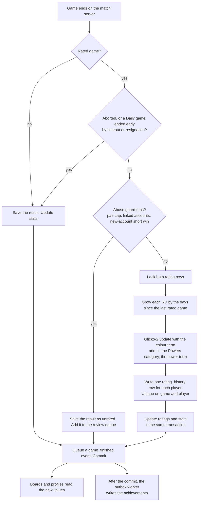
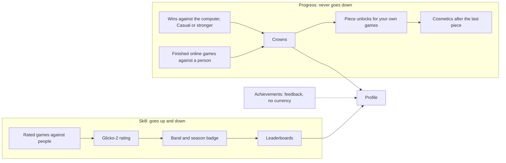

# 02 · Ranking, scoring, profiles and awards

Research report for King Down Chess, 2026-10-10. This is part 02 of the report in `docs/research/multiplayer-2026-10-10/`. Ticket: [01 — Deep research](../../specs/accounts-multiplayer/issues/01-deep-research.md). Area: ratings, ranks, leagues, seasons, leaderboards, profiles, achievements, badges, fair play, and the kings' powers in rated play.

## 1. Plain summary

King Down needs one skill number for each player, shared by the website and ChatGPT and written only by the game server. We recommend Glicko-2, the rating method of Lichess and most open-source chess and variant sites. Games against the computer stay unrated: they earn crowns, crowns unlock the King Down pieces, and that progress never goes down. Ratings, boards and profiles come in phase 3 of the build plan in part 03, and awards in phase 4. Rated games use no kings' powers until phase 5, but every game records each player's power. So each player can see their own record with each power, and later we can publish win rates for each power, adjusted for the players' ratings. Leaderboards stay short and kind (a top 10, your own row and your friends), and they show handles, never real names. Simple rules and your review handle the main fairness risks: players who leave or stall, friends who trade wins, and help from the game's computer. UK online-safety law covers online play between people, and it may already cover today's ChatGPT friend games. So the written safety assessments may be due now, and a report button must be ready before players beyond the testers meet online. Section 9 lists the decisions we need from you, each with our pick.

## Reading notes

- **Finding IDs.** An ID in square brackets points to a finding in an appendix in this folder:
  - `rk-ratings` (rating systems), `rk-ladders` (ranks, leagues, seasons, leaderboards), `rk-profiles` (profiles and awards) and `rk-integrity` (fair play) are in [appendix-b-ranking-findings.md](appendix-b-ranking-findings.md).
  - `gap1` (who can use a ChatGPT plugin), `gap3` (ratings in games with asymmetric factions) and `gap6` (UK and EU online-safety law) are in [appendix-d-gap-findings.md](appendix-d-gap-findings.md).
  - `ux-*` IDs are in [appendix-a-user-journey-findings.md](appendix-a-user-journey-findings.md) (from [part 01](01-user-journey.md)). `tc-*` IDs are in [appendix-c-technical-findings.md](appendix-c-technical-findings.md) (from [part 03](03-technical.md)).
  - Each appendix gives the claim, the source URL, the date read and the check result for each finding. Each subsection below also gives its key source URLs as links.
  - A fact that the gap checker added has no finding ID. The text cites it as [gap1 checker], [gap3 checker] or [gap6 checker], with a link to its source.
- **Labels.** Each recommendation has one label:
  - **common practice**: most products we checked do it;
  - **best practice**: a guideline, a standard, a law or research supports it;
  - **our inference**: we reason it from the findings and from King Down's facts.
- **Evidence limits.** The shared web-search budget ran out during the research. Some product facts are not verified. We say so where we use them. We use only findings that a checker confirmed, corrected or added, that a checker could not verify (marked unconfirmed), or that stay unchecked. Where a checker corrected a finding, we use the corrected form. A checker read the gap findings on 2026-10-10. Of the gap findings that this part uses, it corrected gap1:F13; gap3:F4, F6, F14, F16 and F18; and gap6:F3 and F11. It could not verify gap3:F10 (the digital Twilight Struggle part) or gap1:F10 (plugins in the EU, the UK and Switzerland), so the text marks claims that rest on them as unconfirmed. It confirmed the others. This part uses no refuted finding. The checker also added facts; we use one only where it changes a recommendation in this part, and we say so. Where a gap finding has medium or low confidence, the text says so. For this revision we read two sources again on 2026-10-10: the Lichess provisional rule ([scalachess model.scala](https://github.com/lichess-org/scalachess/blob/master/rating/src/main/scala/glicko/model.scala): `deviation >= provisionalDeviation`, with `provisionalDeviation = 110`) and the Chess.com Daily early-end rule ([Chess.com: rating did not change](https://support.chess.com/en/articles/8614310-the-game-ended-and-my-rating-didn-t-change-at-all-why)).
- **Terms.** This part uses one word for each meaning:
  - **handle**: the unique public name that a player picks (part 01 §5.3);
  - **Daily game**: an asynchronous game with a deadline for each move (part 01 §4); **live game**: a game with a running clock;
  - **the computer**: the King Down engine as an opponent;
  - **rating category**: one group of games that share one rating (the column `category` in part 03 §5.1); **piece pool**: the pieces that a random army draws from; **player base**: the players who are active;
  - **power**: one of the twelve kings' powers in `docs/RULES.md` §4. "No power" is the default.
- **Phases.** This part uses the phase names and numbers of part 03 §9.1: 0 Measure, 1 Friends and Daily, 2 Live, 3 Open play and ratings, 4 Awards and the public launch, 5 Later (behind flags). The "Phase" and "When" columns give these numbers; part 03 §9.1 maps each item to its phase. "At launch" for a feature means the phase in which that feature first ships. "The public launch" is the end of phase 4. Ratings start in phase 3, so "rated games at launch" means rated games from phase 3.
- **Spelling.** This part uses British spelling (colour, behaviour, licence), as parts 01 and 03 and most project documents do.

### What King Down has today

| Item | Today | Where |
|---|---|---|
| Rating | `profiles.rating int default 1200`. Nothing writes it. No deviation, volatility, game count or history. The browser cannot write it. | `supabase/migrations/0001_accounts.sql:13, 129-138` [rk-ratings:F27] |
| Names | `display_name` comes from the sign-in provider (often a real name). It is not unique. There is no handle. | `0001_accounts.sql:80-94` |
| Who sees profiles | Signed-in players see the name, picture and rating of every profile. Signed-out visitors see nothing. The privacy page promises that others do not see when an account was made. | `0001_accounts.sql:131-134` |
| Progress | Crowns and piece unlocks are a proposal (`docs/PROGRESSION.md`, 2026-09-27). Crowns come only from wins against the computer at Casual or stronger. Nothing writes `user_data.unlocks`. The proposal predates the return of the Paladin to the random piece pool (`docs/RULES.md` §6 decision 23, 2026-10-09). | `docs/PROGRESSION.md` |
| Awards | Six trick seals (Bite chain, Shot over a piece, Shove a guard, Far swap, A king takes a guard, A second life). The engine detects them from moves. They stay on the device. | `src/tricks.ts`, `src/trick-store.ts` |
| Colours | In the ChatGPT friend flow the creator is always White. | `src/match/service.ts` [rk-ratings:F16] |
| Kings' powers | Each player may pick one of twelve powers, or none. No power is the default, and either side may play without one. The balanced readings (`POWERS_BALANCED`) are the official rules since 2026-10-02. As printed in 2017, the powers spread from 21% to 80% against each other; the balanced readings bring all twelve within 42–57% in depth-3 engine round-robins. `?rules=2017`, `?rules=2021` and the lab still play the printed readings. No measurement gives a power against no power. | `docs/RULES.md` §4 |
| Model view | The plugin returns the whole match view as `structuredContent`, which the ChatGPT model sees. | `src/plugin/server.ts` [rk-integrity:F25] |
| ChatGPT access | The plugin is private. A second person can add it only by hand, as a custom MCP server on ChatGPT on the web, with a risk warning. Only a public listing opens from a direct link. King Down's private plugin passed friend play on desktop Chrome and the iPhone app on 2026-10-08. | [gap1:F1, F2, F5, F7] |

## 2. Rating system

### 2.1 The options compared

| System | Who uses it (checked) | New players | First-move term | Licence | JavaScript library | Fit for King Down |
|---|---|---|---|---|---|---|
| Elo with a K factor | FIDE, US Chess (a Glickman variant), Board Game Arena [rk-ratings:F1, F26] | A high K for the first games (FIDE K 40 until 30 games) [rk-ratings:F7] | None at FIDE, US Chess, BGA [rk-ratings:F15] | Public method | `elo-rank` (MIT, last release 2020-01-17), `@echecs/elo` (MIT, 2026-04-09) [rk-ratings:F23] | Weak. No measure of certainty, so no honest "?" mark. Suits periodic lists, not per-game online play [rk-ratings:F26]. |
| Glicko-1 | Chess.com, the largest chess site; Pokémon Showdown (beside Elo) [rk-ratings:F1] | Rating deviation (RD) starts high | None found | Public domain [rk-ratings:F2] | Few | Good, but Glicko-2 adds volatility at no extra cost. |
| **Glicko-2** | Lichess, PyChess, OGS (a Go site); also CS2, Dota 2 and others [rk-ratings:F1] | RD and volatility start high; "?" while RD ≥ 110 [rk-ratings:F4] | Lichess since 2025-11-11: 11.78 Elo in standard chess, 20.31 in Crazyhouse, 0 in all other variants [rk-ratings:F15], [gap3:F1] | Public domain [rk-ratings:F2] | `glicko2` (MIT, 2026-08-21), `glicko2-lite` (MIT, 2026-05-26), or a port of `scalachess` (MIT) [rk-ratings:F23, F24] | **Best.** The usual method on open-source chess and variant sites. OGS tests on about 5M games showed better prediction than Elo [rk-ratings:F1]. PyChess shows that it works for a small variant site, also for variants with asymmetric armies [rk-ratings:F25], [gap3:F3]. |
| TrueSkill | Xbox [rk-ratings:F1] | sigma starts high; about 12 games for 1v1 | None | Only Xbox Live games or non-commercial projects [rk-ratings:F21] | `ts-trueskill` (licence unclear on GitHub) | Do not use. Licence risk, and it targets teams. |
| OpenSkill (Weng-Lin) | Library, not a site | sigma starts high | None | MIT [rk-ratings:F22] | `openskill` v5.0.1 (2026-06-08) | Keep for later team or many-player modes. For 1v1 it adds nothing over Glicko-2 [rk-ratings:F22]. |

Key sources: [Glickman: Glicko systems](http://www.glicko.net/glicko.html) · [Glicko-2 example paper (PDF)](http://www.glicko.net/glicko/glicko2.pdf) · [lila Glicko.scala](https://github.com/lichess-org/lila/blob/master/modules/rating/src/main/Glicko.scala) · [PyChess glicko2.py](https://github.com/gbtami/pychess-variants/blob/master/server/glicko2/glicko2.py) · [OGS Glicko-2 announcement (2017)](https://forums.online-go.com/t/ogs-has-a-new-glicko-2-based-rating-system/13058) · [Chess.com: how ratings work](https://support.chess.com/en/articles/8566476-how-do-ratings-work-on-chess-com) · [FIDE Rating Regulations 2024](https://handbook.fide.com/chapter/B022024) · [BGA news 319 (2017)](https://en.boardgamearena.com/news?id=319) · [Pokémon Showdown ladder help](https://pokemonshowdown.com/pages/ladderhelp) · [trueskill.org licence note](https://trueskill.org/) · [openskill.js](https://github.com/philihp/openskill.js)

### 2.2 The recommendation: Glicko-2, updated after each game

- **Label:** common practice (Glicko family) and best practice (Glickman's published defaults).
- **Evidence:** [rk-ratings:F1, F2, F3, F5, F25].

| Setting | Value | Why | Evidence |
|---|---|---|---|
| Start rating | **1500** | The Glicko-2 default. Lichess, PyChess and OGS use it. The unused 1200 default goes. | [rk-ratings:F2, F6] |
| Start RD | **350** | Glickman's default; PyChess and OGS use it. Lichess uses 500, which moves new ratings faster but with more noise. | [rk-ratings:F2, F3, F25] |
| Start volatility | 0.06 | Glickman's default (Lichess 0.09). | [rk-ratings:F2, F3] |
| tau | 0.75 | Lichess and PyChess. Inside Glickman's range 0.3-1.2. | [rk-ratings:F2, F3, F25] |
| RD range | 45 to 350 | Lichess keeps RD at 45 or more. The top equals the start value. | [rk-ratings:F3] |
| Volatility cap | 0.1 | Lichess and PyChess. Stops one-game swings. | [rk-ratings:F3, F25] |
| When to update | After each rated game. RD grows with the days between games. | Players expect a change after each game. Plain one-game periods misbehaved at OGS; Lichess fixes this with per-game updates, a volatility cap and RD growth by time. | [rk-ratings:F5, V2] |
| RD growth | 0.21436 rating periods a day (RD goes from about 60 to 110 in a year) | Lichess calibration. PyChess uses the same 4.665-day period. | [rk-ratings:F3, F25] |
| Provisional mark | "?" while RD ≥ 110 (110 or more) | The Lichess source marks a rating provisional when `deviation >= 110`. PyChess uses the same limit. | [rk-ratings:F4], [gap3:F3] |
| Floor | 400 | Lichess. A low floor only; no floors that depend on a player's peak. | [rk-ratings:F13] |
| Largest change in one game | 700 | A Lichess safety cap. With RD ≤ 350 it almost never applies. | [rk-ratings:F3] |
| Colour term | **0 at launch**; fit it later from rated human games | See 2.6. | [rk-ratings:F15, V3], [gap3:F1] |
| Power term | **0**; not used before phase 5, because rated games have no powers until then (D4) | See 2.12. | [gap3:F1, F17] |

Glickman writes that Glicko-2 "works best" with an average of 10-15 games for each player in a rating period [rk-ratings:F2]. A small site does not reach that. The per-game model with RD growth by time is how Lichess and PyChess work around it [rk-ratings:F3, F5, F25].

Key sources: [Glicko-2 example paper (PDF)](http://www.glicko.net/glicko/glicko2.pdf) · [lila Glicko.scala](https://github.com/lichess-org/lila/blob/master/modules/rating/src/main/Glicko.scala) · [scalachess glicko model.scala](https://github.com/lichess-org/scalachess/blob/master/rating/src/main/scala/glicko/model.scala) · [lila Perf.scala](https://github.com/lichess-org/lila/blob/master/modules/rating/src/main/Perf.scala) · [PyChess glicko2.py](https://github.com/gbtami/pychess-variants/blob/master/server/glicko2/glicko2.py) · [OGS RatingsV6 notes](https://raw.githubusercontent.com/online-go/goratings/master/RatingsV6.md)

### 2.3 Rated and casual games

Each rule below is **common practice** at Lichess, Chess.com, BGA or OGS unless a label says otherwise.

1. **Only signed-in players play rated games.** Rated is the default for signed-in players in quick pairing [rk-ratings:F10]. Guests never play rated games (part 03 §8.4).
2. **Each game has a Rated / Casual choice** [rk-ratings:F10].
3. **Friend invitations are casual by default**, with an opt-in to rated that both players accept (part 01 §3.3). Colours follow decision D7. Lichess treats every friend challenge as a game between related players in its boosting check [rk-ratings:V1]. **Label:** our inference, from [rk-ratings:V1, F19] and [rk-integrity:F9, F10].
4. **Abort:** a game that ends before each side has made its first turn is aborted and has no result. Count turns, not plies. A Haste turn has two actions, and the match revision counts commands, not turns (`docs/match-foundation.md:53`). **Label:** common practice [rk-integrity:F12]; turn counting is our inference.
5. **Live rated games need a real clock.** Lichess rates variant games only with an estimated total time of 30 s or more [rk-ratings:V5].
6. **Daily rated games need a deadline for each move:** 1, 3 or 7 days, with 3 days as the default (part 01 §4.3). A game with no deadline is always casual [rk-ratings:F20, V5].
7. **Early endings in Daily games:** a Daily game that ends by timeout or resignation before each side has made 4 turns does not change ratings; checkmate does. This copies the Chess.com Daily rule. Chess.com says that a Daily game "is not considered started until four moves have been made", and that an early checkmate still changes ratings. The page does not say whether the four moves count both sides, so we read it as 4 turns for each side. Part 01 §4.4 uses the same rule, and part 03 keeps the number in `rating_config` [rk-ratings:F10], [ux-async:F22]. **Label:** common practice; the reading of "four moves" is our inference.
8. **A leaver or a timeout counts as a loss.** If one player abandons many Daily games at once, annul those games (OGS annuls 2 or more mass timeouts) [rk-ratings:F19].
9. **Abuse guards** (see section 6). Skip the rating update for very short wins between new or linked accounts. Cap rated games between the same two players, for example at 3 a day [rk-ratings:F19, V1]. **Label:** common practice for the guards; the cap of 3 is our inference.
10. **Rated games use only the current rules.** No powers in rated play before phase 5 (D4). `?rules=2017`, `?rules=2021`, lab readings, custom armies and `?fen=` starts stay casual. BGA lets a game developer mark an option "friendly mode only", which turns the rating off [gap3:F9]. **Label:** common practice (BGA); the list is our inference.

Key sources: [Chess.com: rating did not change](https://support.chess.com/en/articles/8614310-the-game-ended-and-my-rating-didn-t-change-at-all-why) · [Lichess FAQ](https://lichess.org/faq) · [lila PerfsUpdater.scala](https://github.com/lichess-org/lila/blob/master/modules/round/src/main/PerfsUpdater.scala) · [lila FarmBoostDetection.scala](https://github.com/lichess-org/lila/blob/master/modules/round/src/main/FarmBoostDetection.scala) · [BGA game options (gameoptions.json)](https://en.doc.boardgamearena.com/Options_and_preferences:_gameoptions.json,_gamepreferences.json)

### 2.4 Rating categories

- **What most products do:** a separate rating for each mode, speed or variant (6 of 6 multi-mode products) [rk-ratings:F8]. Asynchronous play has its own rating (3 of 3 chess sites with asynchronous play) [rk-ratings:F20]. Games with asymmetric sides or factions also mostly keep one rating for each mode or variant (about 9 of 14 products) [gap3:F16].
- **What a small player base needs:** each extra rating category divides an already small number of games. OGS documents weak, conflicting ratings across its 16 categories [rk-ratings:F9]. Lichess keeps one rating for each variant for all speeds [rk-ratings:F8], and it also computes one combined rating from its speed ratings [rk-ratings:V4]. Duolingo puts learners of all courses in one weekly league [rk-ladders:V4].

**Recommendation (our inference):**

1. At launch, keep **one "King Down" rating category** for live and Daily games together, on one rated ruleset with no powers (decision D4).
2. Record a category key on every game from day one: live or Daily, the clock or deadline, the ruleset, powers on or off, cards on or off [rk-ladders:F21]. Also record each seat's power, or "none" (2.12).
3. Give **card mode its own rating category from its first day**. Hidden hands make it a different game, and big sites rate each variant apart [rk-ratings:F8].
4. Give **rated powers games one separate "Powers" rating category** when they start (phase 5), not one category for each power (2.12, D4) [gap3:F2, F3, F6]. Seed each player's Powers rating from the King Down rating with a large RD, as StarCraft II seeds a new race rating from the player's main rating ([Blizzard: Patch 3.7](https://news.blizzard.com/en-us/article/20308080/patch-3-7-separate-mmr-per-race)) [gap3 checker]. Section 2.12 (P3) weighs this against one shared category with a recorded power field.
5. Split live from Daily later, when each part has enough players. A starting rule of thumb: about 100 players with a rated game in each part in the last month. Seed each new category from the parent rating with a raised RD, for example 250 [rk-ratings:F9].
6. Know the trade-off. This choice goes against common practice (separate asynchronous ratings, [rk-ratings:F20]). Daily games are also the hardest to police for computer help [rk-integrity:F19]. We accept that at launch because split categories give weak ratings to everyone [rk-ratings:F9], and because crossplay between the website and ChatGPT needs one shared rating.

Key sources: [Lichess FAQ](https://lichess.org/faq) · [OGS RatingsV6 notes](https://raw.githubusercontent.com/online-go/goratings/master/RatingsV6.md) · [Duolingo leagues](https://blog.duolingo.com/duolingo-leagues-leaderboards/) · [lila PerfType.scala](https://github.com/lichess-org/lila/blob/master/modules/rating/src/main/PerfType.scala) · [pychess-variants variants.py](https://github.com/gbtami/pychess-variants/blob/master/server/variants.py)

### 2.5 Games against the computer

- **Recommendation:** every game against the King Down computer is unrated, on both surfaces. This includes the plugin's computer, which runs on the server. Wins earn crowns only (see 5.4).
- **Label:** common practice. Chess.com and Lichess never rate games against their own computer (2 of 2) [rk-ratings:F11].
- **Why it matters here:** on the website the computer runs in the browser, so its results are reports from the client. Platform leaderboard tools warn that client-reported scores need extra protection [rk-ladders:V1, F29]. Lichess keeps unchecked scores (Puzzle Storm) personal and gives the reason: "Where there is a leaderboard, there is cheating." [rk-ladders:V2, F14].

Key sources: [Lichess Puzzle Storm](https://lichess.org/page/storm) · [Steamworks leaderboards](https://partner.steamgames.com/doc/features/leaderboards) · [Google Play Games leaderboards](https://developer.android.com/games/pgs/leaderboards)

### 2.6 Colour (White's edge)

- **The facts.** Few rating systems adjust for the first move. Lichess has done so since 2025-11-11: about 12 Elo in standard chess, 20 in Crazyhouse, and 0 for every other variant, Chess960 and Horde included [rk-ratings:F15], [gap3:F1]. Lichess fitted the term from human games: White scores 0.51695 in standard chess, and 400 × log10(0.51695 / 0.48305) = 11.78 Elo. The first player gets half the term and the second player loses half, in the expected score only [gap3:F1]. King Down engine self-play gives White about 0.53 (+24 ± 34 Elo in a 200-game run). Engine games show a larger White edge than human games, also in chess. Bayeselo fitted about 33 Elo on engine games, against about 12 Elo from Lichess human games. The King Down runs also come before later rule changes. So the engine number cannot set a human colour term [rk-ratings:F16, V3].
- **Recommendation:**
  1. In rated games, choose colours at random, and swap them in rated rematches. In casual friend games the creator may choose (decision D7). The plugin rule "the creator is always White" must change for rated play, or invite games stay casual [rk-ratings:F16]. **Label:** our inference; a colour choice in casual friend games is common practice [ux-live:F8].
  2. Build the colour term into the calculation now, but set it to **0**. Store each player's colour in the rating record. Fit the term from rated human games when there are a few thousand, then recompute [rk-ratings:F15, V3], [gap3:F1]. **Label:** best practice (Lichess fits its term from human games).
  3. Do not add a term for each king or power at launch. Rated games at launch have no powers (D4). Section 2.12 gives the corrected evidence. No product we checked adds a fitted term for each faction to one shared rating. But products correct for asymmetry in other ways [gap3:F16]. **Label:** our inference.

Key sources: [scalachess first-move tuning commit](https://github.com/lichess-org/scalachess/commit/54fe9252652fa7c1985d182e82176fe6d30ac55b) · [lila first-move commit](https://github.com/lichess-org/lila/commit/b73fe331c9) · [scalachess glicko model.scala](https://github.com/lichess-org/scalachess/blob/master/rating/src/main/scala/glicko/model.scala) · [scalachess results.scala](https://github.com/lichess-org/scalachess/blob/master/rating/src/main/scala/glicko/impl/results.scala) · [Bayesian Elo](https://www.remi-coulom.fr/Bayesian-Elo/)

### 2.7 Inactivity, floor and drift

1. **Inactivity changes only the RD.** RD grows with time, so a returning player's rating moves faster. Points never decay. Lichess, Chess.com, PyChess and OGS (v6) all do this [rk-ratings:F12]. **Label:** common practice.
2. **Inactive players leave the boards** through the board rules in 3.3. Their rating stays [rk-ladders:F20].
3. **Floor 400, no peak floors.** High or peak-based floors leave weaker players overrated [rk-ratings:F13]. **Label:** common practice for a low floor.
4. **Watch for drift.** Each month, log the mean rating of active players. Closed player bases drift, often downward. If the mean falls, add a small multiplier on gains only, like the Lichess regulator (1.005 to 1.02) [rk-ratings:F14]. The reason for the Lichess regulator is an inference; Lichess gives no public statement. **Label:** our inference, from [rk-ratings:F14].

Key sources: [lila RatingRegulator.scala](https://github.com/lichess-org/lila/blob/master/modules/rating/src/main/RatingRegulator.scala) · [Lichess FAQ](https://lichess.org/faq) · [Chess.com: how ratings work](https://support.chess.com/en/articles/8566476-how-do-ratings-work-on-chess-com)

### 2.8 How to show the rating

1. **Show the number** with "?" while it is provisional, on the profile and in the board header on the website and in the ChatGPT board. In ChatGPT tool text, write "provisional" in words. Chess players expect a number: 4 of 4 chess products show one [rk-ratings:F17]. **Label:** common practice.
2. **Show a named band next to it** after the "?" goes away (see 3.3). Casual games wrap ratings in named tiers: BGA uses seven levels, and League of Legends shows a rank over a hidden rating [rk-ratings:F17]. **Label:** common practice in casual games.
3. **After each rated game, show the change** (for example "+12") and the new place on the board [rk-ladders:F15]. **Label:** best practice (Google Play Games quality checklist).
4. **Do not hide the rating** in the way that League of Legends or Valorant do. Only three esports games hide it; BGA and Chess.com show it and add a ladder on top [rk-ladders:F16]. **Label:** common practice for board games.

Key sources: [Google Play Games quality checklist](https://developer.android.com/games/pgs/quality) · [Riot: MMR, rank and LP](https://support.riotgames.com/en-us/league-of-legends/gameplay/mmr-rank-and-lp) · [BGA news 319 (2017)](https://en.boardgamearena.com/news?id=319)

### 2.9 Matchmaking uses the rating

The user-journey part covers matchmaking screens (part 01 §3.4). The rating rules are:

- Pair by rating, and widen the allowed gap the longer a player waits. Lichess runs a pairing wave every 12-60 s. It limits the pair score (the rating gap minus bonuses) to about 100-130 points near 1500, and each missed wave adds a 12-point bonus [rk-ratings:F18]. For tens of players online, start near 150 and allow any opponent after about 60 s. **Label:** common practice; the numbers are our inference.
- Pair two provisional players with each other when possible (Lichess gives them a +30 bonus) [rk-ratings:F18].
- Rating limits never apply to friend challenges (Chess.com has an "Ignore Rating" option for them) [rk-ratings:F18].
- Offer an unrated game against the computer while a player waits. **Label:** our inference.

Key sources: [lila MatchMaking.scala](https://github.com/lichess-org/lila/blob/master/modules/pool/src/main/MatchMaking.scala) · [lila HookConfig.scala](https://github.com/lichess-org/lila/blob/master/modules/setup/src/main/HookConfig.scala) · [Chess.com: opponent rating range](https://support.chess.com/en/articles/8598433-how-do-i-choose-what-rating-my-opponents-are)

### 2.10 Library choice

| Option | Licence and state | Per-game DB update | RD growth by time | Colour term | Verdict |
|---|---|---|---|---|---|
| **`glicko2-lite`** | MIT, v6.0.0 (2026-05-26), about 2.9k downloads a month, stateless | Yes: a function returns the new rating, RD and volatility | Add it yourself (a few lines) | Add it: shift the two ratings by half the term each way before the call, as `scalachess` does | **Pick.** Smallest code that fits a database-backed update [rk-ratings:F23]. |
| Port of `scalachess` GlickoCalculator | MIT repository; the core is ported from `goochjs/glicko2` (BSD-2-Clause) | Yes (`computeGame`) | Has `previewDeviation`; the aging glue lives in AGPL `lila` and must be written again | Yes (`colorAdvantage`) | Good reference. Use its numbers to test our wrapper [rk-ratings:F24]. |
| `glicko2` (mmai) | MIT, v1.2.2 (2026-08-21), about 95k a month | Stateful objects; its README says not to update after each match | Only by periods | No | Second choice [rk-ratings:F23]. |
| `glicko2.ts` | GPL-3.0, last version 2022-01-25 | — | — | — | Do not use [rk-ratings:F23]. |
| Code from `lila` or `pychess-variants` | AGPL-3.0 repositories | — | — | — | Read the constants and ideas; do not copy the code into a closed server [rk-ratings:F24]. This is general licence knowledge, not legal advice. |

Put the rating module in the shared TypeScript code. Then the website API and the ChatGPT entry of the one game service use the same function (part 03 §4.2). The same half-and-half shift serves a later power term (2.12).

Key sources: [glicko2-lite](https://github.com/kenany/glicko2-lite) · [glicko2 on npm](https://www.npmjs.com/package/glicko2) · [scalachess GlickoCalculator.scala](https://github.com/lichess-org/scalachess/blob/master/rating/src/main/scala/glicko/GlickoCalculator.scala)

### 2.11 The update at the end of a rated game

Only the match authority writes ratings, in the same database transaction that records the result. It locks both players' rating rows in a fixed order, and a unique game id stops a retry from applying a result twice [rk-ratings:F27]. Part 03 §5.2 gives the finish transaction. Achievements are not in this transaction. The transaction updates the counters and queues a `game_finished` event. Just after the commit, the outbox worker writes the achievements, so a slow award rule never delays a result (part 03 §5.2 step 7 and §5.6). **Label:** common practice (server-side updates [rk-ratings:F3, F10]); the locking detail and the outbox for achievements are our inference.

Key sources: [lila PerfsUpdater.scala](https://github.com/lichess-org/lila/blob/master/modules/round/src/main/PerfsUpdater.scala) · [lila FarmBoostDetection.scala](https://github.com/lichess-org/lila/blob/master/modules/round/src/main/FarmBoostDetection.scala)

### 2.12 Kings' powers and rating fairness

**The size of the problem.** The balanced powers score 42–57% against each other in depth-3 engine games (`docs/RULES.md` §4). That is about −56 to +49 Elo: 400 × log10(0.57 / 0.43) = +49 and 400 × log10(0.42 / 0.58) = −56. This is about 4 times the Lichess colour term of 12 Elo. Engine games overstate human edges (2.6), so the human spread is probably smaller, but nobody has measured it. No number exists for a power against no power [gap3:F17].

**What 14 products do with asymmetric sides, factions or random setups** [gap3:F16]:

| Product | How players get a side or faction | Rating | Correction for the asymmetry | Evidence |
|---|---|---|---|---|
| Lichess, standard and Crazyhouse | Colour from the pairing | One Glicko-2 rating for each variant | A fitted colour term: 11.78 and 20.31 Elo, half to each side in the expected score | [gap3:F1] |
| Lichess, Chess960 and Horde | Random back rank (Chess960); very unequal sides (Horde: 36 white pawns against a normal army) | One rating for each variant | None | [gap3:F2] |
| pychess-variants (Orda, Khan's Chess, Synochess, Shinobi+, Empire) | Each variant gives the two sides different armies | One Glicko-2 rating for each variant | None in the code | [gap3:F3] |
| OGS (Go) | Handicap stones and komi | One rating | Handicap, komi and ruleset become an effective rank difference in the expected score. RatingsV6.md (May 2024) marks this item "implemented and landed", and the analysis script for the live v5 system uses it. The OGS server code is not public, so the live status of the komi part is not confirmed. A larger opponent deviation for big handicaps is only in a pull request (#70). | [gap3:F4] (corrected) |
| StarCraft II, 1v1 | The player picks a race | One MMR for each race, since Patch 3.7 (October 2016). A new race rating starts from the player's main rating with high uncertainty and needs 5 placement games; Random has its own rating. | A split by race; it follows skill with each race, not race strength | [gap3:F5] (a community tracker's code); the patch from [Blizzard: Patch 3.7](https://news.blizzard.com/en-us/article/20308080/patch-3-7-separate-mmr-per-race) [gap3 checker] |
| Gwent | The player picks a faction | One MMR for each faction (fMMR). The overall rating combines the peak fMMR of the 4 best factions: Wikipedia calls it an average, community guides a sum (the order is the same). A faction counts in full after 25 matches; 20 matches give 80%. | A split by faction | [gap3:F6] (corrected; an official CDPR post gives the 25-match rule, not how the factions combine) |
| Hearthstone, ranked | The player picks a class | One MMR for each format | None; class wins give only cosmetic rewards | [gap3:F7] |
| Hearthstone Battlegrounds | A random offer of 2 heroes (4 with the paid pass), then a pick | One MMR for each player | None | [gap3:F8] |
| Board Game Arena | Developers may label factions for statistics | One ELO for each game | None; an option can be "friendly mode only" | [gap3:F9] (no faction input in the developer API; the ELO FAQ did not load) |
| Twilight Struggle, digital | A bid for sides, paid in influence | Glicko-2 (players' reports; unconfirmed) | The bid; players report that the rating ignores the handicap (unconfirmed) | [gap3:F10] (unverifiable for the digital game: the bid for sides is in the GMT rulebook, but the digital rating and bid rules come only from community threads, 2016-2021) |
| Netrunner (Cobra, jinteki.net) | Players play both sides | No Elo on jinteki.net | Double-sided Swiss by default; single-sided Swiss balances each player's side bias | [gap3:F11] |
| Scythe, tournament guideline | Random faction and player-mat pairs | — | An auction for coins off the final score; 2 banned pairs | [gap3:F12] |
| The Battle of Polytopia | The player has a tribe | A ranked mode exists; no evidence of a tribe term | Rule changes, for example extra starting stars for some tribes | [gap3:F13] |
| Root, digital | Factions | No Elo and no ranked mode; a points leaderboard, not a skill rating. Since patch 2.1.0 (2025-12-02) it resets each month, counts only online games and gives points from each player's end-of-game score; a resign or an AI replacement gives 0 points. Before that, players reported placement points. | None | [gap3:F14] (corrected; official patch notes) |
| Dune: Imperium, digital | Leaders, from a leader draft with a draft order (patch notes); players report a draft from 6 random leaders, a pick of 1 from 2, or a random leader | Star tiers and 30-day seasons | No rating term. The draft limits the choice of leader. Since 2025-02-26 each player sees their own win rate with each leader. Since 2026-09-30 a Reputation system bars players who leave too often from Ranked | [gap3:F15, F18]; the personal win rates from the [Dune: Imperium Steam news](https://api.steampowered.com/ISteamNews/GetNewsForApp/v2/?appid=1689500&count=300&maxlength=0&format=json) [gap3 checker] |

**What the table shows** [gap3:F16]:

- No product we checked adds a fitted term for each faction to one shared rating when players choose their faction.
- Products correct for asymmetry in five other ways:
  - a rating for each faction (StarCraft II, Gwent);
  - a fitted colour or handicap term (Lichess, OGS);
  - bids (Twilight Struggle, Scythe);
  - play on both sides (Netrunner);
  - rule changes and bans (Polytopia, Scythe).
  - The groups overlap: Lichess, Twilight Struggle, Polytopia and Scythe are each in two.
- The most common pattern (about 9 of 14) is one rating for each mode or variant with no faction term. Root is still in this group: its leaderboard now uses end-of-game score, not a rating [gap3:F14].
- No product we checked publishes official win rates for each faction on a regular basis. Blizzard published skill-adjusted StarCraft II matchup win rates in 2010 (for example NA global PvT 59.8%), but the checker found no regular, current official publication. Blizzard explained that skill matchmaking keeps raw win rates near 50%, so it removed the matchmaker's effect. jinteki.net shows each player's own record for each side. Dune: Imperium Digital shows each player's own win rate with each leader (since 2025-02). Root players ask for win rates for each faction [gap3:F11, F14, F15, F16].
- When both players choose freely from the same list, a strong faction does not make the rating unfair to one player. It narrows the meta and lowers variety, and products fix it with balance changes. Hearthstone classes fit this pattern. Dune: Imperium Digital does not: it limits the choice with a leader draft. Hearthstone Battlegrounds and pychess give unequal options by a random offer or by colour. The fairness problem is real when one side cannot get the advantage: a fixed colour, a handicap, or a random deal of unequal factions [gap3:F18]. For King Down, the inference holds only if both players may pick any power, mirror picks included, neither player can counter-pick, and "no power" is not a rated choice (`docs/RULES.md` §4 allows it today). "A power against no power" is an unequal choice. This is an inference from the findings.

**Recommendations:**

| # | Recommendation | Phase | Label | Evidence |
|---|---|---|---|---|
| P1 | Record each seat's power (a power id, or "none"), the ruleset and how the power was chosen, in every rated and casual online game and in the rating record, next to the colour. | 1 (the first schema) | our inference | [gap3:F17], [gap3 platform notes] |
| P2 | First, show each player their own record with each power on the profile (4.2), as Dune: Imperium Digital shows each player's own win rate with each leader. Then publish human win rates for each power: by colour and by the opponent's power, labelled "human games", with the number of games behind each number. Adjust each rate for the two players' ratings (a fitted power term, or the mean of the score minus the expected score); do not divide raw wins by games. Matchmaking by rating pulls raw win rates toward 50%, so raw rates hide imbalance; for this reason Blizzard published adjusted StarCraft II race win rates. Show a number only after 50 human games for that power; before that, show "not enough games yet". Build it as a static page from a nightly SQL view, and give the same numbers in words in the ChatGPT tool text. | 4 or later, when online powers games exist | our inference (no product publishes official rates on a regular basis; players ask for them); the rating adjustment follows Blizzard's published method | [gap3:F11, F14, F15, F16]; [Blizzard: The Balancing Act (2010)](https://news.blizzard.com/en-us/article/1136961/starcraft-ii-the-balancing-act) and the [Dune: Imperium Steam news](https://api.steampowered.com/ISteamNews/GetNewsForApp/v2/?appid=1689500&count=300&maxlength=0&format=json) [gap3 checker] |
| P3 | No powers in rated play before phase 5 (D4). When rated powers games start, give them one separate "Powers" rating category, as Lichess and PyChess do for each variant. Seed each player's Powers rating from the King Down rating with a large RD, as StarCraft II seeds a new race rating from the main rating (with 5 placement games for each race). Do not make one rating for each power: 13 categories would split a small player base, and Gwent needs 25 games for each faction. Each extra rated pool also costs queue size and support work: Blizzard removed Hearthstone's Twist ranked format in Patch 35.4 (May 2026) because a long-term ranked format next to the core formats was "too demanding and time consuming". So, before phase 5, compare this category with the alternative: one shared category, with the power recorded on each game and a power term at 0. Our pick stays the separate category, because powers change the game as much as a variant does. | 5 | common practice (one rating for each variant); our inference (the comparison) | [gap3:F2, F3, F6, F16]; [Blizzard: Patch 3.7](https://news.blizzard.com/en-us/article/20308080/patch-3-7-separate-mmr-per-race) and [Hearthstone Patch 35.4](https://hearthstone.blizzard.com/news/24259073) [gap3 checker] |
| P4 | In the rated Powers category, keep the choice symmetric. Both players must take a power. Mirror picks are allowed. Both players choose at the same time, the server keeps each choice hidden, and it shows both choices together, so neither player can counter-pick. "A power against no power" stays casual. This needs a rules decision from you, because `docs/RULES.md` §4 lets either side play without a power. | 5, with the Powers category | our inference | [gap3:F18, F1, F4, F12] |
| P5 | Fix power strength with rule changes first, not with rating terms. Use the human win rates (P2) to tune the readings, as Polytopia gives some tribes extra starting stars. Build a power term into the calculation, but keep it at 0. Fit it only after thousands of rated Powers games: measure each power's average score p, convert it with 400 × log10(p / (1 − p)), and add half to each side in the expected score, as Lichess does for colour. With 12 powers, about 12 numbers need data, so the power term needs far more games than the colour term. | 5, could | best practice (the Lichess fitting method); our inference (timing) | [gap3:F1, F4, F13, F17] |
| P6 | Allow only the balanced readings (`POWERS_BALANCED`) in rated play. The 2017 printed readings, the lab powers and any `?rules=2017` table stay casual. | 5, with the Powers category | common practice (BGA "friendly mode only") | [gap3:F9, F17] |
| P7 | Offer a two-game "swap" match on the same back rank and kings: the players swap colours and powers in game 2. Count each game as a rated game. Use it in tournaments, and as an option for rated Daily games. It fits part 01 decision 10 (the first rematch repeats the setup with the colours swapped). | 5, could | common practice in Netrunner tournaments | [gap3:F11] |
| P8 | Do not build bids for sides or powers before phase 5. If you want a bid later, test one that is paid in a clear unit, for example clock time in live games, and make the rating aware of it. A bid that the rating ignores can give strong players a reason to avoid it. Players of digital Twilight Struggle report this, but the report is unconfirmed (community threads only). | 5, could | our inference | [gap3:F10] (unverifiable for the digital game), [gap3:F12] |

**The hidden pick on both surfaces.** For P4, the match authority keeps each player's choice until both have chosen. The choice must not reach the other seat's view, its `_meta`, or any tool text before the reveal. This is the same rule as hidden hands in card mode (part 03 §5.10) [gap3 platform notes]. **Label:** best practice (one view for each seat [rk-integrity:V5]).

Key sources: [scalachess glicko model.scala](https://github.com/lichess-org/scalachess/blob/master/rating/src/main/scala/glicko/model.scala) · [lila PerfsUpdater.scala](https://github.com/lichess-org/lila/blob/master/modules/round/src/main/PerfsUpdater.scala) · [lila PerfType.scala](https://github.com/lichess-org/lila/blob/master/modules/rating/src/main/PerfType.scala) · [scalachess Horde.scala](https://github.com/lichess-org/scalachess/blob/master/core/src/main/scala/variant/Horde.scala) · [pychess-variants variants.py](https://github.com/gbtami/pychess-variants/blob/master/server/variants.py) · [OGS RatingsV6 (GitHub)](https://github.com/online-go/goratings/blob/master/RatingsV6.md) · [OGS RatingMath.py](https://github.com/online-go/goratings/blob/master/analysis/util/RatingMath.py) · [OGS analyze_glicko2_one_game_at_a_time.py](https://github.com/online-go/goratings/blob/master/analysis/analyze_glicko2_one_game_at_a_time.py) · [SC2 Pulse StatsUtil.js](https://github.com/sc2-pulse/sc2-pulse/blob/master/src/main/webapp/static/script/StatsUtil.js) · [Blizzard: Patch 3.7, separate MMR for each race](https://news.blizzard.com/en-us/article/20308080/patch-3-7-separate-mmr-per-race) · [Blizzard: The Balancing Act (2010)](https://news.blizzard.com/en-us/article/1136961/starcraft-ii-the-balancing-act) · [Gwent (Wikipedia)](https://en.wikipedia.org/wiki/Gwent:_The_Witcher_Card_Game) · [GWENT Masters Season 2 (CDPR, 2020)](https://masters.playgwent.com/en/news/31534/gwent-masters-season-2) · [Hearthstone Battlegrounds (community wiki)](https://hearthstone.wiki.gg/wiki/Battlegrounds) · [Hearthstone Patch 35.4](https://hearthstone.blizzard.com/news/24259073) · [BGA Game.php](https://en.doc.boardgamearena.com/Main_game_logic:_Game.php) · [GMT Twilight Struggle Deluxe rules (PDF)](https://www.gmtgames.com/living_rules/TS_Rules_Deluxe.pdf) · [Cobra stage.rb](https://github.com/Null-Signal-Games/cobra/blob/master/app/models/stage.rb) · [Stonemaier: Scythe tournaments](https://stonemaiergames.com/games/scythe/tournaments-scythe/) · [Polytopia 2025 balance pass](https://polytopia.io/2025-balance-pass/) · [Root 2.1.0 patch notes (Steam)](https://steamstore-a.akamaihd.net/news/externalpost/steam_community_announcements/1817483467049242) · [Dune: Imperium ranked play (Steam announcement)](https://steamstore-a.akamaihd.net/news/externalpost/steam_community_announcements/6250522009528606284) · [Dune: Imperium Steam news (patch notes)](https://api.steampowered.com/ISteamNews/GetNewsForApp/v2/?appid=1689500&count=300&maxlength=0&format=json)

## 3. Ranks, leagues, seasons and leaderboards

### 3.1 What most products do

| Product | Visible progress | Skill rating shown? | Cycle | Protection from losses | Who appears on the board |
|---|---|---|---|---|---|
| Chess.com | Rating; weekly league trophies | Yes | Weekly leagues, 8 tiers, 50-player divisions | No demotion | 20 games, a game in 90 days, account 7 days old [rk-ladders:F1, F12] |
| Lichess | Rating only | Yes | None; scheduled arenas and shields | Not applicable | Top 10: 30 games, a game in the last week, RD < 75 (65 variants) [rk-ladders:F11] |
| Board Game Arena | Arena leagues; ELO as named levels | Yes | Quarterly seasons | No relegation after a promotion; points never below 0 | Arena ladder [rk-ladders:F9, F10] |
| Duolingo | Weekly XP league, 10 tiers | No skill rating | Weekly | Most of a Bronze cohort moves up (unofficial source) | Public profile only [rk-ladders:F2, F18] |
| Hearthstone | Stars and ranks, then Legend number | MMR not shown | Monthly reset with a Star Bonus | Floors every 5 ranks | Legend placement [rk-ladders:F4] |
| League of Legends | LP and rank | MMR is "a secret" | Yearly placements | 25-75 LP after a tier demotion | Decay at Diamond and above [rk-ladders:F5] |
| Valorant | RR and rank | Hidden MMR | Seasons with placements | Demotion only on a loss at 0 RR, then at least 70 RR | Top 500 per region, a game every 7 days [rk-ladders:F6] |
| Clash Royale | Trophies | One number | Partial seasonal reset above 10,000 | Trophy Road | Friends board above 15,000 [rk-ladders:F8] |
| Marvel Snap | Cube stakes and ranks | Not confirmed | Monthly: minus 30 ranks | Floor at rank 100 (fan site only) | Not confirmed [rk-ladders:F7] |

Five patterns repeat [rk-ladders:F16, F17, F18, F20, F29]:

1. Many products keep a skill rating apart from a visible progress ladder. Only three esports games hide the rating.
2. Most products run a cycle that resets the visible rank but keeps the skill rating. Riot says the MMR "remains at exactly the same spot" at a new season [rk-ladders:V3].
3. Most ladders protect players from losses with floors or no demotion.
4. Every public board admits only players with enough games and recent play.
5. All systems act against manipulation. But Steam and Google Play accept scores from clients unless the developer turns that off, so cross-platform games must compute ranks on their own server [rk-ladders:F29, V1].

The platform tools offer the same three standard views: global top, "around me" and friends. Google adds daily, weekly and all-time versions, and its checklist says to show a window around the player and to prefer the friends board when it has entries [rk-ladders:F15].

Key sources: [Chess.com Leagues](https://support.chess.com/article/2813-what-are-leagues-how-do-i-join-one) · [Chess.com leaderboards](https://support.chess.com/en/articles/8705280-what-are-leaderboards) · [Lichess leaderboards](https://lichess.org/player) · [lila RankingApi.scala](https://github.com/lichess-org/lila/blob/master/modules/user/src/main/RankingApi.scala) · [BGA Arena FAQ (2020)](https://forum.boardgamearena.com/viewtopic.php?p=55652) · [Duolingo leagues](https://blog.duolingo.com/duolingo-leagues-leaderboards/) · [Hearthstone Ranked (community wiki)](https://hearthstone.wiki.gg/wiki/Ranked) · [Riot: placements, demotions, decay](https://support.riotgames.com/en-us/league-of-legends/gameplay/placements-promotions-series-demotions-and-decay/) · [Valorant: Iron to Ascendant RR](https://support.riotgames.com/en-us/valorant/gameplay/rank-rating-rr-for-iron-through-ascendant-ranks) · [Valorant: Immortal and Radiant](https://support.riotgames.com/en-us/valorant/gameplay/rank-rating-rr-for-immortal-and-radiant-ranks) · [Clash Royale June 2025 update](https://supercell.com/en/games/clashroyale/blog/release-notes/june-update-2025/) · [Marvel Snap (Wikipedia)](https://en.wikipedia.org/wiki/Marvel_Snap) · [Steamworks ISteamUserStats](https://partner.steamgames.com/doc/api/ISteamUserStats) · [Google Play Games leaderboards](https://developer.android.com/games/pgs/leaderboards)

### 3.2 What research says about motivation

| Finding | Strength | Evidence |
|---|---|---|
| A leaderboard acts like a difficult goal. It helps people who commit to it; people with low commitment did worse than an "impossible goal" group. | One experiment; abstract and author summary read | [rk-ladders:F22] |
| The effect of rank is mixed. A high rank can make players chase easy points; low ranks gave more effort in one study. Results conflict across studies. | Experiment with 111 students and a review | [rk-ladders:F23] |
| Students prefer "around me" boards (less pressure) but want to see the top 5. Learning and motivation did not differ. | One course study | [rk-ladders:F25] |
| Gamification has small positive effects on average. Competition with collaboration works best for behaviour. | Meta-analysis (abstract only) | [rk-ladders:F26] |
| Three losses in a row almost double 7-day churn (5.1% against about 2.7%) in one EA game. | Large company data set | [rk-ladders:F27] |
| Leagues can make users chase points instead of the activity. Competitiveness is the most common reason. | Forum analysis and interviews | [rk-ladders:F28] |
| Duolingo's weekly leagues raised learning time by 17% and tripled highly engaged learners. | Company self-report, not peer-reviewed | [rk-ladders:F3] |
| Badges, leaderboards and progress graphs raise felt competence. "Gamification is not effective per se." | Randomized experiment | [rk-profiles:F30] |

What this means for King Down (our inference): a board helps the few players near the top and can hurt the many below. So keep the public list short, show each player a window around their own place, add friends, and protect players from long visible losing runs.

Key sources: [Landers et al. (leaderboards as goals)](https://neoacademic.com/2015/09/30/gamification-works-a-lot-like-goal-setting/) · [Na and Han 2023](https://www.emerald.com/insight/content/doi/10.1108/intr-12-2021-0897/full/html) · [Bai, Hew and Gonda 2021](https://repository.eduhk.hk/en/publications/examining-effects-of-different-leaderboards-on-students-learning-/) · [Sailer and Homner 2020](https://link.springer.com/article/10.1007/s10648-019-09498-w) · [Chen et al., EOMM (WWW 2017)](https://web.cs.ucla.edu/~yzsun/papers/WWW17Chen_EOMM.pdf) · [Hadi Mogavi et al. 2022](https://arxiv.org/abs/2203.16175) · [Lenny's Newsletter: Duolingo growth (2023)](https://www.lennysnewsletter.com/i/104096876/the-streak-vector) · [Sailer et al. 2017](https://epub.ub.uni-muenchen.de/53202)

### 3.3 Recommendation for a small player base

When boards open (phase 3) and after the public launch (end of phase 4), expect tens to a few hundred players online at the same time. Fixed-size cohorts fail at that size: Chess.com waits until a division has 50 players, and higher leagues "may take a while to fill" [rk-ladders:F21]. BGA sets the number of leagues by how popular a game is, and Duolingo builds cohorts by activity and time zone [rk-ladders:F21].

| # | Item | Phase | Label | Evidence |
|---|---|---|---|---|
| L1 | **One board for each rating category.** Top 10, then the viewer's own row with 3-5 players above and below. Show the top 5 above the "around me" window. Never publish the full list down to the bottom. | 3 | common practice (views); best practice (window) | [rk-ladders:F11, F12, F15, F25] |
| L2 | **Friends board.** Friends are mutual follows (part 01 §5.5). Prefer this board when it has entries; fall back to the public board when it is empty. It needs the Follow list at the same time. | 3 | best practice | [rk-ladders:F15], [rk-profiles:F23] |
| L3 | **Who appears:** RD < 110 (no "?"), at least 20 rated games, a rated game in the last 30 days, and an account at least 7 days old. Raise to 30 games and 14 days when more than about 100 players qualify. | 3 | common practice (gates); the numbers are our inference | [rk-ladders:F20], [rk-ratings:F4], [rk-profiles:V2] |
| L4 | **Eligibility progress.** A player who does not qualify sees "You join the board after 20 rated games: 12 of 20". | 3 | our inference | [rk-profiles:F12] (progress pop-ups) |
| L5 | **Named bands** from the rating, shown after the "?" goes away. Proposal: 200-point steps with King Down names, for example Pike, Steed, Cross, Rock, Thorn, Monarch (the card-game names of pawn, knight, bishop, rook and queen, then a top band). Move the limits after the first 1,000 rated games so that each band holds a sensible share. | 3 | common practice (BGA levels) | [rk-ladders:F10], [rk-ratings:F17] |
| L6 | **No separate star, LP or points ladder at launch.** No Legend numbers, no decay, no fixed-size top tiers. These assume thousands of players. | 3 | our inference | [rk-ladders:F4, F5, F6, F21] |
| L7 | **Quarterly seasons**, for badges only. At a season start, reset only the season badge. Never reset the rating. Keep each player's best band and best place of each season as a permanent badge. | 5 | common practice | [rk-ladders:F9, F17, F19, V3] |
| L8 | **Rank trophies** (Lichess style: "#1", "Top 10") only for players who pass the board gate. With tens of players, "Top 10" is almost free without the gate. | 5, with seasons | common practice | [rk-profiles:F4, V1] |
| L9 | **Weekly leagues later**, when about 50 or more players play a rated game each week. 4-5 tiers; cohorts of 10-30 that start at once and never wait to fill; group by last week's activity and by time zone; the top third moves up; no demotion from the lowest two tiers; results on Monday. | 5 | common practice (Chess.com, Duolingo); sizes are our inference | [rk-ladders:F1, F2, F3, F18, F21, F27] |
| L10 | **League and event points come only from rated games that the server records.** A Daily game counts when it ends inside the week or season. Use a cap for each pair of players. No points from games against the computer. | 5 | common practice | [rk-ladders:F9, F29, F30, V1, V2] |
| L11 | **Scheduled events** to bring a small community online together: a weekly "King Down Arena" at a fixed time, with Lichess arena scoring (win 2, draw 1, loss 0; double points after two wins in a row) and Lichess draw rules (a draw in the first 10 turns scores nothing; only the first of several draws in a row scores). A shield goes to the winner until the next event. Later, an arena only for players below a rating limit. | 5, could | common practice (Lichess) | [rk-ladders:F13, F32, V5] |
| L12 | **Visibility setting.** On the board by default, with a "hide me from leaderboards" option. A hidden player keeps a rating and a band. | 3 | common practice | [rk-ladders:F2, F15, F20] |
| L13 | **Record each board feature in the UK risk assessment.** Public boards, the friends board, leagues and events show handles to other players. Update the illegal content and children's risk assessments before each of these goes live (4.4). | 1 (the first records); update before each new board feature (3, 5) | best practice (UK law and Ofcom guidance) | [gap6:F5, F12] |

The draw rules in L11 matter because the owner avoids rules that raise the draw rate.

**The website.** Show the rating change and the new place right after each rated game. Add a link to the board from the main menu [rk-ladders:F15]. **Label:** best practice.

**ChatGPT.**

- Show the board as one inline card: your band and rating, the top 3-5, your "around me" row, and one primary action, "Open full board", that opens fullscreen. Put the friends and weekly views in fullscreen only. Give the MCP server one tool, for example `get_leaderboard(scope, window)`, that returns rows that the server already computed. **Label:** our inference from the Apps SDK guidelines. An inline card has at most two actions, no tabs, no drill-ins and no inner scrolling. A carousel has 3-8 items. Fullscreen is for browsing detailed content. The guidelines do not mention leaderboards [rk-ladders:F31], [rk-profiles:F35].
- Put other players' handles only in the tool result's `_meta`, which the card sees and the model does not. The model gets the player's own place, rating and band in words. Handles are text that other users write, so this closes a prompt-injection path (part 03 §4.5, §8.7). **Label:** best practice [tc-identity:F12, F35].
- Plugin UI often breaks in the ChatGPT mobile apps and in the new desktop client (community reports in 2026, medium confidence). In April 2026 a blank widget was reported on Android and iOS, and that thread is still open. Other threads report a blank fullscreen on Android (July to September 2026). In the new macOS app and in Work, widget calls to private tools failed from 2026-09-27 until a fix was live on 2026-10-06. So the tool text must carry the player's own result in words, and "Open in App" must open the same board on kingdown.dev [gap1:F12, F13]. **Label:** our inference.
- Until King Down has a public listing, only testers can use the plugin, so the early boards hold mostly website players [gap1:F1, F4, F5]. **Label:** our inference.

Key sources: [Google Play Games quality checklist](https://developer.android.com/games/pgs/quality) · [Lichess arena rules](https://lichess.org/tournament/help) · [OpenAI Apps SDK UI guidelines](https://developers.openai.com/apps-sdk/concepts/ui-guidelines) · [OpenAI plugin guidelines](https://developers.openai.com/plugins/plugin-guidelines) · [Android blank-widget report (community)](https://community.openai.com/t/chatgpt-android-skips-resources-read-for-mcp-widgets-text-renders-widget-stays-blank/1379702) · [New desktop app tool-call report (community)](https://community.openai.com/t/new-chatgpt-desktop-app-and-work-part-of-website-no-longer-making-tool-calls-makred-private-plugin-broken/1401394) · [Ofcom risk assessment guidance (PDF)](https://www.ofcom.org.uk/siteassets/resources/documents/online-safety/information-for-industry/illegal-harms/updates/risk-assessment-guidance-and-risk-profiles.pdf)

## 4. Profiles

### 4.1 What products show

| Product | Skill data | History and activity | Awards | Reliability |
|---|---|---|---|---|
| Chess.com | For each ruleset and speed: rating, RD, best rating with a link to the game, W/L/D, time per move, timeout % in 90 days, tournament results [rk-profiles:F2] | Game archive | Achievements, badges, cheers, medals, Passport, Books; a showcase that the player picks [rk-profiles:F1] | Timeout %, vacation days [rk-profiles:F9] |
| Lichess | A grid of ratings for each speed and variant, with game counts and "?" [rk-profiles:F3] | Activity feed, including correspondence moves played and correspondence games finished [rk-profiles:F3] | No badges or XP. Role marks, tournament trophies, rank trophies ("Champion!", Top 10/50/100) [rk-profiles:F4, V1] | Private play bans [rk-profiles:F9] |
| Board Game Arena | ELO for each game | Game history | XP that never goes down; achievements for each game and site-wide [rk-profiles:F6, F7] | Karma 0-100 (+1 for a finished game, −10 for leaving) [rk-profiles:F8] |
| OGS | Rank and rating graph; "?" for about the first 5 games (old page) [rk-profiles:F5] | Games, reviews | Not verified | Vacation days [rk-profiles:F9] |
| Duolingo | No skill rating | Personal records | Tiered badges and personal records, on a "trophy shelf"; players can share them [rk-profiles:F17, F19] | Not applicable |
| jinteki.net (Netrunner) | No rating | Games started, completed, won and lost | — | Separate Corp and Runner records, with win percentages [gap3:F11] |

Key sources: [Chess.com achievements](https://support.chess.com/en/articles/8618496-what-are-achievements) · [Chess.com showcase](https://support.chess.com/article/697-how-do-i-change-whats-in-my-showcase) · [Chess.com Published-Data API](https://www.chess.com/news/view/published-data-api) · [Lichess profile example](https://lichess.org/@/thibault) · [Lichess UserActivity schema](https://raw.githubusercontent.com/lichess-org/api/master/doc/specs/schemas/UserActivity.yaml) · [lila UserBits.scala (rank trophies)](https://raw.githubusercontent.com/lichess-org/lila/master/modules/user/src/main/ui/UserBits.scala) · [OGS ranks and rating](https://github.com/online-go/online-go.com/wiki/Ranks-and-rating) · [BGA XP and achievements FAQ (2020)](https://forum.boardgamearena.com/viewtopic.php?t=15001) · [BGA karma news (2016)](https://en.boardgamearena.com/news?id=304) · [Duolingo achievement badges](https://blog.duolingo.com/achievement-badges) · [jinteki.net stats.cljs](https://github.com/mtgred/netrunner/blob/master/src/cljs/nr/stats.cljs)

### 4.2 Profile fields, version 1

This is the one list of profile fields for parts 01, 02 and 03 (decision D18). **Label:** common practice for the mix, which follows Chess.com, Lichess and Duolingo [rk-profiles:F1, F2, F3, F17, F19]; the privacy limits are best practice (data minimization, UK law).

| Field | Shown to | Source | Notes |
|---|---|---|---|
| **Handle** (unique, chosen by the player) | Everyone who can see profiles and boards | New | Asked before the first online game. Boards, invites and game screens show the handle. Rules in part 01 §5.3: 3-20 characters, unique without regard to case, a block list, a rename every 90 days at most, old handles reserved. Under UK law a handle is user content, so the owner must be able to hide it or force a rename (I13) [gap6:F3]. |
| Display name | Nobody | Exists | Not shown. The sign-up trigger stops copying the provider's real name into `display_name` (part 03 §5.1). Add a separate display name later only if players ask for names in other scripts (part 01 §5.3). **Label:** our inference ([rk-profiles:F36] data minimization). |
| **Icon** | Others | New | A preset icon from the game's art, for example a king or piece portrait. Do not show the provider photo, and do not allow uploads. Lichess has no uploaded avatars, and a child's photo is personal information under COPPA [ux-accounts:F15, F19]. Preset icons are not user content, which keeps UK duties small [gap6:F3]. **Label:** common practice. |
| Member since (month) | Others | New | The privacy page now promises that others do not see this. Change the page first, or leave it out. |
| Rating card for each rating category | Others | New | Rating, "?", band, rated games, W/L/D, best rating with a link to that game [rk-profiles:F2]. |
| Season badges and rank trophies | Others | New | See 3.3 L7-L8. |
| Daily-game reliability | Others, after 10 finished Daily games | New | Finish rate, and timeouts in the last 90 days [rk-profiles:F2, F9]. |
| Crowns and pieces learned | Others | New | Personal progress, never ranked [rk-ladders:V2]. |
| Showcase | Others | New | Up to 6 achievements that the player picks from the fixed list [rk-profiles:F1, F17]. |
| Recent games | Others (online games); the player (computer games) | New | Last 20, each with a replay link. |
| Activity list | Others | New | Games finished, moves played in Daily games, achievements earned [rk-profiles:F3]. |
| Record with each king and power | The player; others optional | New | Games and score with each of the six kings and each of the twelve powers. This personal view comes before any public power table, as in Dune: Imperium Digital ([Dune: Imperium Steam news](https://api.steampowered.com/ISteamNews/GetNewsForApp/v2/?appid=1689500&count=300&maxlength=0&format=json)) [gap3 checker], and it also feeds the power statistics (2.12 P2). **Label:** our inference; no per-king or per-power boards. |
| Not at launch: country flag, age or birth date, school, real name, uploaded pictures, free-text bio, links | — | — | They add moderation work and personal data for little gain. A flag is a location. A profile that shows location or that can show that a user is a child raises grooming risk in Ofcom's guidance, and a self-declared age brings extra child-safety duties [gap6:F7, F12], [rk-profiles:F36]. Part 01 §5.3 also has no flag, and part 01 §5.7 asks for no birth date. A country flag can come later as decision D18 (b). **Label:** best practice. |

### 4.3 Reliability in Daily games

**Label:** common practice; all four turn-based sites that we checked track reliability [rk-profiles:F9].

- Show "% of games finished" and "timeouts in the last 90 days" on the profile and on every invite or lobby card [rk-profiles:F2, F8, F9].
- **Vacation: none at launch.** This is part 01 decision 11, and this part follows it. The 80% alert and the 3-day default cover most cases. Only some products have vacation (3 of 11 [ux-async:F11]; Chess.com and OGS among them [rk-profiles:F9]), and it causes friction between players [ux-async:F12]. **Label:** our inference.
- **Later: earned vacation** on the Chess.com model. It pauses all of a player's Daily games at once. Days build up over time to a cap, and each use costs at least one day [rk-profiles:F9], [ux-async:F10]. Keep it free on both surfaces, because the plugin must not sell features [ux-async:V5]. **Label:** common practice.
- Treat stalling and vacation abuse as unsportsmanlike [rk-profiles:F10].
- Repeated abandoning gets private limits that grow with each repeat, before any public mark [rk-profiles:F9], [rk-integrity:F11].
- Later, when the community grows, a challenge creator may set a minimum finish rate. BGA lets table creators do this with karma; players report that the filter sometimes fails [rk-profiles:F8].

Key sources: [Chess.com vacation](https://support.chess.com/en/articles/8583943-how-does-vacation-work-how-much-time-do-i-get) · [Chess.com stalling](https://support.chess.com/en/articles/8584203-what-is-stalling) · [OGS account guide (vacation)](https://github.com/online-go/online-go.com/wiki/Getting-Started-%7C-Creating-and-Adjusting-Your-Account) · [BGA karma news (2016)](https://en.boardgamearena.com/news?id=304)

### 4.4 Privacy and online-safety law

1. **Handles, not real names, on public surfaces.** The sign-in providers supply real names. A public board with real names exposes them. **Label:** our inference.
2. **Visibility settings:** "hide me from leaderboards" (default off) and "public page" (default off). A player who hides from boards still plays rated games. Duolingo leaves the leagues when a profile is private; Google Play lists only players who opt in [rk-ladders:F2, F15]. **Label:** common practice.
3. **Who can read profiles** (decision D18). Signed-in players can read profiles, as today. Signed-out visitors, for example people who open a shared link, see a profile page only when its player turns on "public page". Otherwise `kingdown.dev/@handle` shows "This profile is private. Sign in to see it." Signed-out visitors can see the top 10 of each public board (handle, band, rating). Profiles that other users can see are a risk factor in Ofcom's guidance, and services that children are likely to use need high-privacy defaults [gap6:F8, F12]. **Label:** best practice (high-privacy defaults); our inference (the split between boards and profiles).
4. **Account deletion must not delete the opponent's history.** Today a delete cascades to the plugin matches. With multiplayer, a deleted player's seat should become "deleted player", and the opponent's games and rating history stay (part 01 §5.8, part 03 §8.8). **Label:** common practice.
5. **Fair-play data** (hashed IP, device id) needs a privacy-policy entry and a retention limit. Lichess states a legal basis and keeps such data one year [rk-integrity:V4]. A CSEA report to the NCA holds the related user data for one year after the report, so the deletion job must skip held rows (item 7, 7.6) [gap6 checker]. **Label:** best practice.
6. **Teen audiences.** ChatGPT plugins must suit users aged 13-17, must not target children under 13, and must collect only the minimum data. ChatGPT has no age controls for plugins yet, so King Down cannot rely on ChatGPT for age checks [rk-profiles:F36], [gap1:F11], [gap6:F17]. This argues for no free-text chat at launch and for positive-only peer awards. **Label:** best practice (platform rule).
7. **The UK Online Safety Act applies to online play between people.** This part's features add to it. **Label:** best practice (the statute and Ofcom's guidance). A checker read the gap6 findings on 2026-10-10. It confirmed them, except F3 and F11, which it corrected, and it added four facts that change the work below. F3, F7, F12, F13 and F14 have medium confidence. A lawyer must confirm the details.
   - A service where one user's content can reach another user is a user-to-user service. Game moves and handles count as content. The share of user content does not matter, and no size exemption exists [gap6:F1, F2, F4].
   - Preset messages and handles do not take the service out of scope. Schedule 1 exempts email, SMS and MMS, one-to-one live voice, limited-functionality services, internal business services, public bodies, and education or childcare providers. None of these fits a public game with handles and preset messages [gap6:F3].
   - Presets do not by themselves keep the grooming risk low. Under Ofcom's Code definition, a preset that one player sends to one opponent can be a "direct message", so it can count as one-to-one contact in the grooming risk table ([Ofcom illegal content codes, 9 Sep 2026 (PDF)](https://www.ofcom.org.uk/siteassets/resources/documents/online-safety/information-for-industry/illegal-harms/detecting-intimate-image-abuse/illegal-content-codes-of-practice-for-user-to-user-services-9sep2026.pdf?v=425251)) [gap6 checker]. The risk assessment must give the reason for a "low" rating, for example that fixed phrases cannot carry contact details. If the rating is high and King Down knows users' ages, Ofcom's child safety defaults apply [gap6:F7]. The risk level decides how many code measures apply.
   - Treat the website and the ChatGPT plugin as one service with one set of records [gap6:F12].
   - Write an illegal content risk assessment (18 kinds of priority illegal content), a children's access assessment and a children's risk assessment now, not at the multiplayer launch. Today's ChatGPT friend play may already make King Down a user-to-user service [gap6:F1]. If King Down has links with the UK, the three-month windows for these first assessments started when the service came into scope ([Ofcom risk assessment guidance (PDF)](https://www.ofcom.org.uk/siteassets/resources/documents/online-safety/information-for-industry/illegal-harms/updates/risk-assessment-guidance-and-risk-profiles.pdf) para 2.19; [Ofcom children's access assessments](https://www.ofcom.org.uk/online-safety/illegal-and-harmful-content/childrens-access-assessment-duties-under-the-online-safety-act)) [gap6 checker]. Repeat them before each significant change ([section 9(4)](https://www.legislation.gov.uk/ukpga/2023/50/section/9)), for example handles, profiles, matchmaking, public boards, public pages, Follow, "online now", leagues, peer badges or free-text chat [gap6:F5, F8, F9].
   - Assume that children are likely to use King Down: gaming attracts children, and the ChatGPT audience includes ages 13-17. Without highly effective age checks, a service cannot say that children cannot use it. King Down needs no age checks if its terms ban the worst kinds of content and it can remove any handle or message [gap6:F8, F9].
   - Do not collect self-declared ages. A self-declared age can bring Ofcom's child-safety defaults into force [gap6:F7].
   - The code measures for all services include a named accountable person and a moderation function. They also include easy reporting and complaints with appeals, and terms written for the youngest permitted user [gap6:F6]. Section 6 (I13, I14) covers these for players and handles.
   - Reports of child sexual exploitation and abuse (CSEA) content to the National Crime Agency follow S.I. 2026/268, in force since 7 April 2026 [gap6:F10]. Register with the NCA reporting portal before the first report, and name a senior person as organisation administrator. Send Priority 1 reports at once. Keep the reported content and the related user data (two weeks of related user data included) for one year, and keep the report reference for five years. Ofcom advises in-scope services that do not report to NCMEC to register now, and the duty applies whatever the service's size or CSEA risk ([S.I. 2026/268](https://www.legislation.gov.uk/uksi/2026/268/made); [Ofcom: the duty to report CSEA content](https://www.ofcom.org.uk/online-safety/illegal-and-harmful-content/duty-to-report-child-sexual-exploitation-and-abuse-csea-content-know-the-rules-and-how-to-comply)) [gap6 checker]. So the design must let a legal hold keep account data, logs and preset-message history (7.6).
   - Since 29 June 2026, every regulated user-to-user service must give users an easy way to make an "intimate image content report", and it must take the content and matching copies down no later than 48 hours after the report. The terms must cover this duty ([section 20A](https://www.legislation.gov.uk/ukpga/2023/50/section/20A); [section 10](https://www.legislation.gov.uk/ukpga/2023/50/section/10)) [gap6 checker]. King Down has no image uploads, so the practical risk is low. But the report form and the terms still need this path (I13), and any picture upload would make the duty real.
8. **The EU Digital Services Act probably does not apply yet.** It covers a provider outside the EU only with a substantial connection. That means an EU establishment, many EU users compared with a country's population, or targeting of EU countries [gap6:F13] (medium confidence). If it applies, public profiles and boards may make King Down an "online platform". Micro and small firms do not have to follow Articles 19-28. But Articles 11-18 still apply: contact points, a notice form, and a statement of reasons for each restriction, such as a hidden handle or a removal from the boards [gap6:F14, F15, F16]. A lawyer must settle the scope. **Label:** best practice (the regulation's text).

Key sources: [OpenAI app submission guidelines](https://developers.openai.com/apps-sdk/app-submission-guidelines) · [OpenAI plugin guidelines](https://developers.openai.com/plugins/plugin-guidelines) · [Online Safety Act section 3](https://www.legislation.gov.uk/ukpga/2023/50/section/3) · [Online Safety Act Schedule 1](https://www.legislation.gov.uk/ukpga/2023/50/schedule/1) · [Ofcom: the Online Safety Act and gaming](https://www.ofcom.org.uk/online-safety/illegal-and-harmful-content/the-online-safety-act-and-gaming-know-the-risks-know-the-rules-know-how-to-comply) · [Ofcom risk assessment guidance (PDF)](https://www.ofcom.org.uk/siteassets/resources/documents/online-safety/information-for-industry/illegal-harms/updates/risk-assessment-guidance-and-risk-profiles.pdf) · [Ofcom children's access assessments](https://www.ofcom.org.uk/online-safety/illegal-and-harmful-content/childrens-access-assessment-duties-under-the-online-safety-act) · [Ofcom illegal content codes, 9 Sep 2026 (PDF)](https://www.ofcom.org.uk/siteassets/resources/documents/online-safety/information-for-industry/illegal-harms/detecting-intimate-image-abuse/illegal-content-codes-of-practice-for-user-to-user-services-9sep2026.pdf?v=425251) · [Online Safety Act section 9](https://www.legislation.gov.uk/ukpga/2023/50/section/9) · [section 10](https://www.legislation.gov.uk/ukpga/2023/50/section/10) · [section 20A](https://www.legislation.gov.uk/ukpga/2023/50/section/20A) · [S.I. 2026/268 (CSEA reports)](https://www.legislation.gov.uk/uksi/2026/268/made) · [Ofcom: the duty to report CSEA content](https://www.ofcom.org.uk/online-safety/illegal-and-harmful-content/duty-to-report-child-sexual-exploitation-and-abuse-csea-content-know-the-rules-and-how-to-comply) · [EU Digital Services Act (EUR-Lex)](https://eur-lex.europa.eu/legal-content/EN/TXT/HTML/?uri=CELEX:32022R2065) · [Lichess privacy](https://lichess.org/privacy)

### 4.5 The profile in ChatGPT

**Label:** best practice (platform guidelines) [rk-profiles:F35, F36].

- An inline "score card": your handle, rating or "?", band, crowns, and finish rate. Use at most two actions: "Play" and "Open profile" (fullscreen).
- Recent achievements as a carousel of 3-8 items.
- Full stats and the leaderboard in fullscreen.
- Other players' handles go only in `_meta`, never in `content` or `structuredContent` (3.3) [tc-identity:F12, F35].
- Write the player's own numbers in plain words in the tool text, so that a blank widget on mobile, or a failed widget call in the new desktop app, still gives the answer. "Open in App" opens the same profile on kingdown.dev [gap1:F12, F13]. **Label:** our inference.
- No upgrade prompts, no cosmetic sales and no ads in ChatGPT. A public plugin may sell only physical goods. It may not sell subscriptions, digital content, tokens or credits, freemium upsells included, and it must not serve ads. It may link to an information page about plans, but not to a checkout or upgrade page; a user may sign in to a paid account that already exists ([OpenAI plugin guidelines](https://developers.openai.com/plugins/plugin-guidelines)) [gap1 checker]. A public plugin also must not be a weaker version of the website. So the profile and boards in ChatGPT show the same data as on the website, with no sales, upgrade or ad space in the cards or in the join flow [rk-profiles:F36], [gap1:F15].
- Store only the profile fields that play needs.
- Before a public listing, give the reviewers' demo account sample games, a rating, achievements and a board place, so that they can see each card. Review needs a demo login without MFA that has sample data [gap1:F15]. **Label:** best practice (platform rule).

Key sources: [OpenAI Apps SDK design guidelines](https://developers.openai.com/apps-sdk/concepts/design-guidelines) · [OpenAI Apps SDK UI guidelines](https://developers.openai.com/apps-sdk/concepts/ui-guidelines) · [OpenAI plugin submission guidelines](https://developers.openai.com/apps-sdk/app-submission-guidelines) · [OpenAI app review requirements](https://developers.openai.com/plugins/deploy/app-review) · [OpenAI plugin guidelines](https://developers.openai.com/plugins/plugin-guidelines) · [Android blank-widget report (community)](https://community.openai.com/t/chatgpt-android-skips-resources-read-for-mcp-widgets-text-renders-widget-stays-blank/1379702) · [Android blank-fullscreen report (community)](https://community.openai.com/t/bug-android-fullscreen-is-blank-even-with-an-sdk-free-minimal-widget-web-works/1396512) · [New desktop app tool-call report (community)](https://community.openai.com/t/new-chatgpt-desktop-app-and-work-part-of-website-no-longer-making-tool-calls-makred-private-plugin-broken/1401394)

## 5. Awards, achievements and badges

### 5.1 Taxonomy

Four kinds of achievement appear across Chess.com, BGA, Hearthstone and Duolingo; 4 of 5 achievement products show at least three of them [rk-profiles:F16]. We add two kinds that King Down needs.

| Kind | What it rewards | Examples in other products | King Down use |
|---|---|---|---|
| Progress | Amount of play | Chess.com "play 10,000 Live games"; BGA games played [rk-profiles:F16] | Games finished, crowns |
| Discovery | Trying new things | Chess.com Books (openings tried), Chess960 achievements; BGA "3 games discovered" [rk-profiles:F1, F16] | Pieces, tricks, kings, powers. This is the core for a game with many new pieces. |
| Social | Playing with people | Chess.com badges and cheers; Duolingo friend badges [rk-profiles:F16, F18] | Online games, crossplay, rematches |
| Skill | Results | BGA Top ELO; a Hearthstone challenge [rk-profiles:F16] | Only a few |
| Reliability (added) | Finishing what you start | BGA karma; Chess.com timeout % [rk-profiles:F8, F9] | Daily games finished without timeout |
| Season and rank (added) | Placement in a season | Hearthstone season rewards; Valorant Act badges; Lichess rank trophies [rk-ladders:F19], [rk-profiles:V1] | Season badges, rank trophies (3.3 L7-L8) |

Key sources: [Chess.com achievements](https://support.chess.com/en/articles/8618496-what-are-achievements) · [Chess.com badges and cheers](https://support.chess.com/en/articles/8614005-what-are-badges-and-cheers-how-do-i-give-them) · [BGA XP and achievements FAQ (2020)](https://forum.boardgamearena.com/viewtopic.php?t=15001) · [Duolingo achievement badges](https://blog.duolingo.com/achievement-badges)

### 5.2 Design rules

| # | Rule | Label | Evidence |
|---|---|---|---|
| A1 | Start (phase 4) with a small set, well under 100. Xbox needs at least 10; Steam limits a new game to 100. | best practice | [rk-profiles:F11, F12] |
| A2 | One achievement in the first 10 minutes. About half reachable by normal play; about half off the main path. Very hard ones stay rare. | best practice (practitioner advice) | [rk-profiles:F15] |
| A3 | Every achievement is earnable and unlocks exactly when its description is met. Each description names the mode it needs. | best practice | [rk-profiles:F11] |
| A4 | Show a progress bar for any goal that counts ("7 of 10"). | best practice | [rk-profiles:F12, F15] |
| A5 | Hide only 1-3 easter eggs. Players look up hidden ones anyway. | best practice | [rk-profiles:F14] |
| A6 | Show rarity ("12% of players") only after about 100 players have finished a game. | common practice (rarity); the threshold is our inference | [rk-profiles:F13] |
| A7 | Word unlocks as information, not as a bribe: "You mastered the Archer's shot." Expected rewards for engagement or results lower intrinsic motivation; positive feedback raises it. | best practice | [rk-profiles:F31, F30] |
| A8 | Achievements give no currency, no crowns and no power. They are feedback. | our inference | [rk-profiles:F31] |
| A9 | The server grants achievements from online games, once for each player and achievement. The outbox worker writes them just after the result commits (2.11). Achievements from games against the computer on the website are reports from the device: the player keeps them, and they never feed a ranking. | common practice (server results); our inference (device rule) | [rk-profiles:F7, F11], [rk-ladders:V1, V2] |
| A10 | No achievement needs a login every day, a streak or a one-day event. | best practice | [rk-profiles:F33, F21] |
| A11 | Names and icons suit all ages. | best practice | [rk-profiles:F12, F36] |
| A12 | Let the player choose up to 6 for the showcase, and share one with a button. | common practice | [rk-profiles:F17, F19] |

Key sources: [Xbox XR-055](https://devdocs.xbox.com/publishing/certification/xr/xr-055.md) · [Steamworks achievements](https://partner.steamgames.com/doc/features/achievements) · [PlayStation trophies](https://manuals.playstation.net/document/en/ps4/game/trophy.html) · [Xbox Wire: HyperDot achievements (2020)](https://news.xbox.com/en-us/2020/01/31/how-community-influenced-hyperdot-achievement-design/) · [Game Developer: ID@Xbox achievement tips (2018)](https://gamedeveloper.com/design/id-xbox-chief-shares-tips-on-what-makes-a-good-achievement) · [Deci, Koestner and Ryan 1999](https://depts.washington.edu/techdocs/papers/deciExtrinsicRewardsAndIntrinsicMotivation99.pdf) · [Ryan, Rigby and Przybylski 2006](https://selfdeterminationtheory.org/SDT/documents/2006_RyanRigbyPrzybylski_MandE.pdf)

### 5.3 A first list of King Down achievements (proposals)

All names and rules below are **proposals** for the owner. "Any game" means the website, ChatGPT, the computer or a person. Achievements 7-12 are the six trick seals that exist today; their names and checks come from `src/tricks.ts`, so the server can run the same check.

| # | Name (proposal) | Kind | How to earn | Counts in | Ties to |
|---|---|---|---|---|---|
| 1 | Pull Up a Chair | Progress | Finish your first game, any mode, any result. | Any game | The first unlock in the first 10 minutes (A2) |
| 2 | First Crown | Progress | Win your first crown (beat the computer at Casual or stronger). | Computer | Crowns |
| 3 | Ten Tables | Progress | Finish 10 games, any mode. Progress bar. | Any game | — |
| 4 | A Hundred Tables | Progress | Finish 100 games, any mode. Progress bar. | Any game | — |
| 5 | Scholar | Discovery | Finish the six piece lessons (Archer, Beast, Maester, Ogre, Guard, Paladin). Progress bar. | Lessons | Lessons |
| 6 | Full Court | Progress | Unlock every King Down piece with crowns. | Computer, online | The end of the unlock ladder |
| 7 | Bite Chain | Discovery | Your Beast bites twice in one turn. | Any game | Existing seal |
| 8 | Shot Over a Piece | Discovery | Your Archer shoots over a piece. | Any game | Existing seal |
| 9 | Shove a Guard | Discovery | Your Ogre shoves a Guard. | Any game | Existing seal |
| 10 | Far Swap | Discovery | Your Maester and your king swap from a distance. | Any game | Existing seal |
| 11 | A King Takes a Guard | Discovery | Your king takes a Guard. | Any game | Existing seal |
| 12 | A Second Life | Discovery | Your pawn brings back a fallen friend (Stratus: Sacrifice). | Any game, powers on | Existing seal |
| 13 | Last Charge | Discovery | Your Paladin takes a piece that is not a pawn and leaves the board. | Any game | Paladin |
| 14 | Feast (hidden) | Discovery | Your Beast takes three pieces in one turn. | Any game | Beast |
| 15 | Archer's Mate | Skill | Checkmate in which your Archer's shot gives the check. | Any game | Archer |
| 16 | The Six Kings | Discovery | Finish a game with each of the six kings: Frost, Flame, Stratus, Mud, Spirit, Shadow. Progress bar. | Any game, powers on | Kings |
| 17 | Twelve Powers | Discovery (off the main path) | Finish a game with each of the twelve powers. Progress bar. | Any game, powers on | Kings |
| 18 | Two Moves, One Turn | Discovery | Use Haste: one piece moves twice in one turn. | Any game, powers on | Flame |
| 19 | Long Reach | Discovery | Your Shadow king's Death Touch takes a piece two squares away. | Any game, powers on | Shadow |
| 20 | Well Met | Social | Finish an online game against a person. | Online | Multiplayer |
| 21 | Across the Table | Social | Finish an online game in which one player is on the website and the other in ChatGPT. Add it when the plugin has a public listing (A3): before that, few players can reach a ChatGPT opponent [gap1:F1, F5]. | Online | Crossplay |
| 22 | Patient Hand | Social | Finish a Daily game. | Online, Daily | Daily games |
| 23 | Again! | Social | Finish a rematch: two games in a row against the same person. | Online | Rematch |
| 24 | Today's Army | Discovery | Finish a game with Today's army. Once only, never a streak. | Any game | Today's army |
| 25 | Seen It Through | Reliability | Finish 10 Daily games with no timeout. Progress bar. | Online, Daily | Reliability (4.3) |
| 26 | Established | Skill | Your rating loses its "?". | Rated | Rating |
| 27 | Upset | Skill | Win a rated game against a player whose established rating is 200 or more above yours. Both ratings must be established, and the game must pass the abuse guards. | Rated | Rating |
| 28 | Card Sharp | Discovery | Finish a card-mode game. Add it when card mode ships. | Any game, cards | Card mode |

Checks on this list:

- Achievements 1, 2, 3, 5, 7-11, 16, 20, 22, 24 and 26 come with normal play, which is about half (A2).
- Feast is the only hidden one (A5).
- Only 15, 26 and 27 reward results (skill stays a small share).
- Achievements in the "Any game" rows can come from the device (website computer games) or the server (online and plugin games); see A9.
- Today the six seals stay on the device (`src/trick-store.ts:3`). Sync them to the account as a new `user_data` section, merged as a union like lessons.
- Achievement names, icons and the showcase come from a fixed list, so they are not user content under UK law [gap6:F3]. **Label:** our inference.

### 5.4 How awards fit crowns, piece unlocks, XP and levels

Products keep two systems apart: a skill rating that goes up and down, and a progress track that only goes up. All 5 non-chess or hybrid products that we checked do this [rk-profiles:F28]. King Down's proposal already says that losses never take progress away (`docs/PROGRESSION.md`). **Label:** common practice.

Recommendations:

1. **Rated games use one fixed piece pool**: the current full random piece pool (`docs/RULES.md` §2). The unlock-based piece pool, and the union pool for friend games in `docs/PROGRESSION.md`, stay for games against the computer and for casual friend games. If the piece pool depends on two players' unlocks, games under one rating use different rules, and the ratings stop being comparable. Show the piece pool on every invite. **Label:** our inference from common practice (one rating for each ruleset [rk-profiles:F2, F3], [rk-ratings:F8]).
2. **Before a player's first rated game, offer the lessons** for any piece the player has not learned. Make it an offer they can skip. **Label:** our inference.
3. **Crowns from more than one activity** (decision D13, the same decision as part 01 decision 9). Keep "a win against the computer at Casual or stronger". Add "finish an online game against a person, any result". Hearthstone gives XP for play in any mode [rk-profiles:F24], and expected rewards for results lower intrinsic motivation [rk-profiles:F31]. A player who plays mostly with friends then still unlocks pieces for casual games. Count only online games that pass the abort and early-end rules (2.3), and give at most 3 online crowns a day, so that friends cannot trade quick games for crowns. **Label:** best practice (motivation research); our inference (the guards and the cap).
4. **Tell the next unlock as information**: "Next piece: the Maester. Learn its move." No countdowns and no "only 2 more wins" pressure [rk-profiles:F31, F33]. **Label:** best practice.
5. **Measure the time to each unlock after launch, and make it faster if players stall.** Players rejected Hearthstone's slow first reward track. Blizzard cut the required XP by nearly 20% within a month [rk-profiles:F25]. **Label:** best practice (lesson from practice).
6. **Add the Paladin to the unlock ladder** (decision D17). The proposal has Archer and Beast at the start, then Maester, Ogre and Guard at 2, 5 and 9 crowns. It left the Paladin out because the Paladin was out of the random piece pool then. The Paladin is back in the piece pool since 2026-10-09. Our proposal: the Paladin comes last, after the Guard (for example at 14 crowns). **Label:** our inference.
7. **No XP and no levels at launch.** Crowns are the progress track. Chess sites mostly work without XP levels (an absence that the checker did not verify for every site) [rk-profiles:F28]; Lichess works with ratings, history and tournaments alone [rk-profiles:F4]. **Label:** our inference.
8. **After the last piece, crowns open cosmetics** (decision D17): painted boards, piece sets, king portraits and profile frames. They never affect play and are the same on both surfaces. Cosmetics are a common reward [rk-profiles:F29]. Do not gate the kings' powers behind crowns: a powers game is a mode that two players choose together, and a gate brings back the union-pool problem. **Label:** common practice (cosmetics); our inference (no power gate).
9. **Crowns from website computer games are device reports.** They affect only the player's own unlocks, so the browser may write them. The current schema blocks browser writes to `unlocks` ("a server will set them later"); this decision changes that (part 03 decision T13). Crowns never appear in a ranking [rk-ladders:V1, V2]. **Label:** our inference.
10. **Peer recognition, later and positive only.** After a finished game, a player may send one "good game" badge to the opponent. No public thumbs-down while the community is small; use private block lists instead. Chess.com sends badges only from a finished game [rk-profiles:F18]. Record the badge in the UK risk assessment before it ships [gap6:F5]. **Label:** common practice (positive badges); our inference (no negative votes).

Key sources: [Hearthstone Rewards Track (2020)](https://hearthstone.blizzard.com/en-gb/news/23534414) · [Hearthstone track changes (Dec 2020)](https://hearthstone.blizzard.com/en-us/blog/23585675) · [BlizzardWatch: Marvel Snap collection level](https://blizzardwatch.com/2022/10/13/marvel-snap-level-currency/) · [Chess.com badges and cheers](https://support.chess.com/en/articles/8614005-what-are-badges-and-cheers-how-do-i-give-them) · [Chess.com membership levels](https://support.chess.com/en/articles/8562418-what-does-each-level-of-premium-membership-get-me) · [Kim and Castelli 2021](https://pmc.ncbi.nlm.nih.gov/articles/PMC8037535) · [Deci, Koestner and Ryan 1999](https://depts.washington.edu/techdocs/papers/deciExtrinsicRewardsAndIntrinsicMotivation99.pdf)

## 6. Fair play and rating integrity at small scale

**What big sites do.** They work in two steps: cheap signals choose games, then engine statistics and people decide. Lichess sends a game to engine analysis after an upset, very even move times, many tab switches, or a win by a new player; then moderators decide [rk-integrity:F1, F2, F3]. Chess.com closes about 105k to 164k accounts a month, mostly by automatic rules, and new accounts are the main risk [rk-integrity:F6, F7]. Both sites give rating points back to victims [rk-integrity:F8]. Leaving and stalling are a separate problem with automatic rules [rk-integrity:F11, F12, F13].

**What is special about King Down.** Today the website loads any position with `?fen=` and runs the only King Down engine in the browser. So the site's own computer can serve as a helper. In ChatGPT the model sees the board in `structuredContent`. The server already refuses the computer tool outside solo games [rk-integrity:F25, F26]. Daily games cannot be policed well anywhere [rk-integrity:F19].

**Our reading of the risk** (our inference, not a measured fact). At our size, the likely problems are leaving and stalling, and win trading between friends. A few players with computer help can also take over a small leaderboard. Chess.com puts cheaters at under 1% of monthly users [rk-integrity:F6]. At our size the owner can read every flagged game.

| # | Risk | Countermeasure | When | Label | Evidence |
|---|---|---|---|---|---|
| I1 | Thin evidence puts new accounts at the top | Rated play only for signed-in players; high start RD; "?"; board gates (3.3 L3); keep each rating change so that refunds are possible | Phase 3 | common practice | [rk-integrity:F18, F7, F8] |
| I2 | Abort, no-start, leave, stall in live games | Abort only before each side's first turn; a first-move timer, about 1.5 times longer for a random back rank (Lichess does this for Chess960); auto-abort when it runs out; the remaining player claims a win or a draw after a wait that grows with the time control; record each outcome; automatic timeouts that start near 10 minutes, are longer for new accounts and stop at about 3 days; not shown on the profile | Phase 2 | common practice | [rk-integrity:F11, F12, F13] |
| I3 | The same in **friend games** | Apply I2 to friend games too. Lichess applies no play-ban checks to friend games, but friend games are King Down's main way to play | Phase 2 | our inference | [rk-integrity:V2, F20] |
| I4 | Leave or stall in Daily games | A deadline for each move; claim a win after it; the 80% "time almost up" alert; public finish rate (4.3); annul mass timeouts. Vacation comes later (part 01 decision 11) | Phase 1; the public finish rate in phase 3 | common practice | [rk-profiles:F9], [rk-ratings:F19, F20], [ux-async:F9] |
| I5 | Win trading and boosting | Friend games casual by default; a rated opt-in with a pair cap and random colours (D6, D7); no rated games between accounts that share a device or IP link; a "one person, one account" rule (an approved second account never plays the first) | Phase 3 (all games are casual before it) | common practice | [rk-integrity:F9, F16, F20], [rk-ratings:V1] |
| I6 | Sandbagging (losing on purpose) and same-opponent boosts | A counter like Lichess SandbagWatch: count rated losses in very short games and repeated wins against one opponent; a warning on the 3rd case, a review report on the 4th. Count turns, not plies | Phase 3 | common practice | [rk-integrity:F10] |
| I7 | The site's own engine as a helper (website) | While a rated live game is open, other tabs of the same browser turn off the computer and `?fen=` loading (a heartbeat in `localStorage` or `BroadcastChannel`, as PyChess does since April 2026). If another tab evaluates the live position, store a report; do not forfeit at first. Another device defeats this, so it stops only casual misuse | Phase 3 | common practice (closest variant site) | [rk-integrity:F21, F25] |
| I8 | The ChatGPT model as a helper | In games between people, send the full position to the board widget in `_meta`, and give the model only a short summary. The model sees `structuredContent` and `content`, not `_meta`. Keep the computer tool refused outside solo games | Phase 1 | best practice (platform reference) | [rk-integrity:F26, F25] |
| I9 | Hidden cards | Each seat receives only its own hand, on both surfaces. `_meta` reaches the player's browser, so it hides data from the model, not from the player. The match service already builds a view for each player (`view(row, actor)`) | Phase 5, with card mode | best practice | [rk-integrity:V5] |
| I10 | Computer help in general | Store, for every rated move: server receive time, clock left, and on the website a "left the window" (blur) flag. Store a hashed IP and device id for each session (see 4.4 privacy) | Phase 1 (receive time and clock left); phase 3 (blur flag and sessions) | common practice | [rk-integrity:F2, F3, F4, F16] |
| I11 | Computer help, detection | Offline review: cheap triage first (upsets, even move times, many blurs, wins by new accounts, reports), then analysis with the King Down engine (in a Node worker, or batch runs on the M1 or Kaggle). Compare top-move match rate and average loss with a baseline from clean human games. Report only; add automatic marks only after the baseline is proven | Phase 5 | common practice (Lichess design) | [rk-integrity:F2, F3, F5, F24] |
| I12 | One cheater fills a small board | Review every game of the top-10 players, friend games included. Lichess always analyses games of titled players, whatever the source | Phase 3 | our inference | [rk-integrity:V1] |
| I13 | Reports | One report flow on both surfaces. A player reports a player, a handle or a preset message, with a reason (computer help, rating manipulation, leaving or stalling, harassment, offensive handle, child safety or illegal content, other; "child safety or illegal content" has a sub-choice for intimate images shared without consent, with take-down within 48 hours [gap6 checker]), from the board and from the profile. In ChatGPT, use a report tool or a link to the kingdown.dev form. Reports go to a review queue for the owner. The owner can rename, hide or suspend fast. The affected player gets a short statement of reasons and a way to appeal. A written path sends child sexual abuse content to the UK National Crime Agency and threats to life to the police. Register with the NCA reporting portal before the first report, and keep the reported content and related user data for one year (S.I. 2026/268). The report form also needs an intimate-image path, with take-down within 48 hours (section 20A). Publish the rules; keep the thresholds private | Phase 1 | common practice (reports); best practice (UK code measures and statute; EU DSA Articles 16-18) | [rk-integrity:F27, F28], [gap6:F6, F9, F10, F16], [gap6 checker] (4.4) |
| I14 | Penalties | A ladder: warning, short timeout, rated-play ban and removal from boards, quarantine pairing (flagged accounts meet only flagged accounts), account closure. Each restriction comes with a statement of reasons and an appeal path | Phase 5 (statements of reasons and appeals from phase 1) | common practice; best practice (statement of reasons) | [rk-integrity:F29, F17], [gap6:F16] |
| I15 | Victims of a cheater | Automatic refunds: recent games only (Lichess: 40 games in 5 days), established victims only, capped (Lichess: 150 points). Tell the victims | Phase 5 | common practice | [rk-integrity:F8] |
| I16 | Rules nobody can find | A short fair-play page: the computer, hints and analysis are allowed only against the computer; opening notes are allowed in Daily games; no engines in rated games. Link it from the terms and the "Safety and reporting" page | Phase 1 | common practice | [rk-integrity:F9, F19], [gap6:F6] |
| I17 | New-account pools | Do not make new accounts play only new accounts. Chess.com named longer waits as the cost; with tens of players online, the lobby empties | — | our inference | [rk-integrity:F7] |
| I18 | A counter-pick in the rated Powers category | Both players choose a power at the same time. The server keeps each choice hidden until both have chosen, and never sends it early to the other seat's view, `_meta` or tool text (2.12 P4) | Phase 5, with the Powers category | our inference; best practice (one view for each seat) | [gap3:F18], [rk-integrity:V5] |

Do not try to police computer help in Daily games beyond reports and the top-10 review (I12). Lichess skips correspondence games in automatic triage except special cases, Chess.com allows books in Daily games, and ICCF allows engines [rk-integrity:F19, V3]. **Label:** common practice.

Key sources: [Lichess half-year update 2022 (Irwin, Kaladin)](https://lichess.org/@/lichess/blog/lichess-half-year-update--new-feature-sneak-preview/YulPhhAA) · [lila AssessApi.scala](https://github.com/lichess-org/lila/blob/master/modules/mod/src/main/AssessApi.scala) · [lila SandbagWatch.scala](https://github.com/lichess-org/lila/blob/master/modules/mod/src/main/SandbagWatch.scala) · [lila PlaybanApi.scala](https://github.com/lichess-org/lila/blob/master/modules/playban/src/main/PlaybanApi.scala) · [Chess.com cheating page](https://www.chess.com/cheating) · [Chess.com: when someone is caught cheating](https://support.chess.com/en/articles/8588324-what-happens-when-someone-is-caught-cheating) · [PyChess anti-cheat PR #2137](https://github.com/gbtami/pychess-variants/pull/2137) · [OpenAI Apps SDK reference](https://developers.openai.com/apps-sdk/reference) · [Online Safety Act section 66](https://www.legislation.gov.uk/ukpga/2023/50/section/66) · [Online Safety Act section 20A](https://www.legislation.gov.uk/ukpga/2023/50/section/20A) · [S.I. 2026/268 (CSEA reports)](https://www.legislation.gov.uk/uksi/2026/268/made) · [EU Digital Services Act (EUR-Lex)](https://eur-lex.europa.eu/legal-content/EN/TXT/HTML/?uri=CELEX:32022R2065)

## 7. The data each feature needs

This section lists the data, the writer and the readers. Part 03 §5.1 holds the one schema for the report and uses the table names below. The rule for every row below: the browser never writes a public rank, rating or result [rk-ladders:F29, V1].

### 7.1 Changes to existing tables

| Table | Change | Reason |
|---|---|---|
| `profiles` | Add `handle` (unique, compared without case), `handle_changed_at`, `icon` (a preset key), `flag` (empty, and used only if you pick D18 (b)), `on_leaderboards` (default true), `public_page` (default false), `showcase` (up to 6 achievement ids). Stop copying the provider name into `display_name` and the provider photo into the profile. `rating` stays unused, and a later migration drops it (part 03 §5.1). | 4.2, 4.4, 3.3 L12 |
| `profiles` read grant | Other players read only the public columns: handle, icon, showcase and the rating cards; not `display_name` or the provider picture. `created_at` becomes readable only after the privacy page changes. Signed-out visitors read a profile only through the API, and only when `public_page` is true (part 03 §5.5). | 4.2, 4.4 |
| `user_data` | Add a `seals` section (union merge). Hold crowns and unlocked pieces in `unlocks`; allow browser writes for crowns from website computer games (decisions D12 and T13). | 5.3, 5.4 |
| Delete behaviour | A deleted player's seat becomes "deleted player"; the opponent's games and rating history stay. | 4.4 |
| `games` (from `plugin_matches`) and `game_players` | Add the fields in 7.2. | 2.3, 2.6, 2.12, 6 |

### 7.2 For each game and each move

| Data | Writer | Used by |
|---|---|---|
| `rated`, the category key (live or Daily; ruleset; powers on or off; cards on or off), clock or move deadline | Match authority | 2.3, 2.4 |
| White and Black ids, how colours were chosen (random, chosen, alternate), the surface of each seat (website or ChatGPT) | Match authority | 2.6, D7, achievement 21 |
| Setup: army, piece pool id, the king of each seat | Match authority | 5.3, 5.4 |
| **Each seat's power** (a power id, or "none"), the readings in use (`POWERS_BALANCED` or another), how the power was chosen (free, hidden pick, swap game) and when each pick arrived | Match authority; a hidden pick stays on the server until both picks arrive | 2.12 P1-P4, I18 |
| Result (1-0, 0-1, ½-½) and how it ended (checkmate, resignation, timeout, claim, abort, draw kind, annulled) | Match authority | 2.3, 6 |
| Turns played by each side, start and end time, engine fingerprint | Match authority | 2.3 (abort and early-end rules), I6 |
| For each move: server receive time, clock left after the move, blur flag (website) | Match authority (the blur flag comes from the client) | I10, I11 |

### 7.3 Ratings

| Table | Columns | Writer |
|---|---|---|
| `player_ratings` | player, category, rating, RD, volatility, rated games, wins, losses, draws, last rated time, best rating, best time, best game. Key: player and category. "?" is derived: RD ≥ 110 after aging. | Match authority, in the result transaction |
| `rating_history` | One row for each rated game and player: game, player, category, colour, **own power and opponent's power**, opponent, opponent rating before, result, rating before and after, RD before and after, volatility after, colour term used, **power term used**, gain multiplier used, config version, refunded flag, time. Unique on game and player. The rating chart reads the last row of each day. | Match authority |
| `rating_config` | Version and constants (2.2), the early-end turn count and the pair cap. Each history row names its version, so a recompute is possible. | Owner |

`game_players` also keeps a copy of the rating before, the RD before and the rating change for each seat, for the end screen (part 03 §5.1).

### 7.4 Boards, seasons, leagues and statistics

| Table or view | Contents | Writer and timing |
|---|---|---|
| Top lists | An indexed top-N query on `player_ratings` (category, rating) over eligible rows that allow listing; band and place are computed on read; cached 60 s at the CDN (part 03 §5.5). Add a snapshot table that a job writes only if this query gets slow. | On read |
| "Around me" | A count and a window query on the same index | On read |
| Friends board | Mutual follows in `relations` (part 01 §5.5, part 03 §5.1) | On read |
| `seasons` (phase 5) | id, name, start, end | Owner |
| `season_results` (phase 5) | season, player, category, peak rating, peak band, final place, rank trophy | Job at season end |
| Leagues (phase 5) | league weeks; cohorts (week, tier, size); members (points, final place, moved up) | Match authority adds points; a job closes the week |
| Rarity | For each achievement: share of players with at least one finished game | Nightly job; shown after about 100 players |
| Power statistics | Human games by power, by colour and by the opponent's power: games, score, draws, and the expected score from the two players' ratings, so that the page can show rating-adjusted rates; a game count for each number | Nightly SQL view, read by a static stats page and by the ChatGPT tool (2.12 P2) |

### 7.5 Achievements and progress

| Table | Contents | Writer |
|---|---|---|
| Achievement catalogue | In shared code: id, kind, hidden flag, mode, target count, version added | Code |
| `player_achievements` | player, achievement, earned time, game (if any), source (server or device). Key: player and achievement; insert once, ignore repeats. | For online games, the outbox worker, just after the finish transaction commits (2.11, part 03 §5.6); the browser for device achievements (A9) |
| `player_counters` | Counters for progress bars: games finished, Daily games without timeout, kings played (6 bits), powers played (12 bits), online crowns | Server for online games, in the finish transaction (part 03 §5.2); device counters stay in `user_data` |
| Crowns | Crown count, unlocked pieces, crown events with source (website computer, plugin computer, online game) | Browser for website computer games; server for the rest |

### 7.6 Conduct, moderation and signals

| Table | Contents | Writer |
|---|---|---|
| `conduct_events` | player, game, outcome (abort, no start, leave, sit, quick resignation, timeout), time | Match authority |
| `player_conduct` | finished Daily games, Daily timeouts (90 days, derived), play-ban end, bans this week. Vacation days left and vacation end come later (4.3) | Match authority |
| Abuse counter | Recent short-game and same-opponent results; can be derived from `rating_history` | Match authority |
| `reports` | source (player or automatic flag), reporter, reported player, target (player, handle, preset message), game, category, note, status, time, outcome. Automatic flags (shared IP, shared device, shared ChatGPT subject) go in the same table, so that the owner reads one list | Browser or ChatGPT tool (insert own reports only); server for flags; owner |
| `mod_actions` | player, action (warning, rename, hide handle, timeout, rated-play ban, removal from boards, suspension, closure), statement of reasons sent to the player, appeal status, by, time, end time; private marks (computer help, booster) | Owner |
| `refunds` | game, player, points, time | Job after a mark |
| `sessions` | player, hashed IP, device id, first and last seen; kept at most one year, unless a legal hold keeps a row | Server |
| Legal holds | For each CSEA report to the NCA: the reported content and the related user data (two weeks of it included), held for one year after the report; the NCA report reference, held for five years (S.I. 2026/268, 4.4) [gap6 checker] | Owner; the cleanup job skips held rows |

## 8. Anti-patterns and ethics

| Do not | Why | Evidence | Label |
|---|---|---|---|
| Rewards for a login every day, "play by appointment" timers, rewards you can earn on one day only | Dark-pattern lists name them. Chess.com gave a flair that players could earn only on one day (2026-07-20). | [rk-profiles:F33, F21] | best practice |
| Strict streaks, paid streak repair, loss-framed messages ("Don't lose your streak!") | Duolingo's own data: slack (freezes, grace days) helps, and a too-strict streak lowers motivation. Duolingo openly uses loss aversion; do not copy that. | [rk-profiles:F20] | best practice |
| A streak at launch | Not needed. If one comes later: hide-able, any activity counts (one move in a Daily game included), a grace period, free freezes, nothing else depends on it. Chess.com streaks work this way. | [rk-profiles:F20, F21] | best practice |
| "Complete the collection" pressure, endowed progress, random rewards, loot boxes, a premium currency | Named dark patterns; regulators target them. The EU Digital Fairness Act proposal is expected near the end of 2026 (secondary source, January 2026). | [rk-profiles:F33, F34] | best practice |
| Sales, upgrade prompts or ads in ChatGPT | Plugins may not sell digital goods or promote upgrades. A public plugin may sell only physical goods, must not serve ads, and may link only to an information page about plans, not to a checkout or upgrade page (4.5). | [rk-profiles:F36], [gap1:F15], [gap1 checker] ([OpenAI plugin guidelines](https://developers.openai.com/plugins/plugin-guidelines)) | best practice (platform rule) |
| Public bottom ranks and full lists | Low ranks can hurt motivation; students prefer relative boards. | [rk-ladders:F23, F25] | best practice |
| Public negative votes or "bad player" marks | In a small community they hurt. Lichess keeps play bans private. | [rk-integrity:F11], [rk-profiles:F18] | our inference |
| Long visible losing runs with no protection | Three losses in a row almost double churn. Use bands with season badges that keep the peak. | [rk-ladders:F27, F19] | best practice |
| Rewards for farming the weakest computer | Point-chasing is real. Crowns need Casual or stronger; computer games give no board or league points. | [rk-ladders:F28], [rk-ratings:F11] | common practice |
| Secret matchmaking tuned for engagement instead of fair games | Players trust ratings only when pairing is fair. The churn data above come from a paper on engagement-tuned matchmaking (EOMM). | [rk-ladders:F27] | our inference |
| Real names on public boards; fair-play data with no stated retention | Data minimization; Lichess keeps such data one year with a stated basis. | [rk-profiles:F36], [rk-integrity:V4] | best practice |
| Achievements that need collusion or many accounts | They invite abuse; Lichess and Chess.com treat alternate accounts as rating manipulation. | [rk-integrity:F9] | our inference |
| Showing ranks or bands with colour only | Colour-blind players miss them; always add the name. | — | our inference |
| One rating for each power, or a power term fitted from engine games | 13 categories split a small player base; Gwent needs 25 games for each faction. Engine games overstate human edges. | [gap3:F6, F17], [rk-ratings:V3] | common practice (one rating for each mode); our inference |
| Bids or handicaps that the rating ignores | Players report this in digital Twilight Struggle; strong players then avoid the bid. The report is unconfirmed: only community threads describe the digital game. | [gap3:F10] (unverifiable for the digital game; community threads) | our inference |
| Rated play with the printed or lab readings | The printed powers spread from 21% to 80%. BGA keeps such variants "friendly mode only". | [gap3:F9, F17] | common practice |
| "18+ only" in the terms instead of child-safety work, or a self-declared age field | Without highly effective age checks, an age line does not remove the children's duties. A self-declared age can bring extra child-safety defaults into force. | [gap6:F7, F8] | best practice (UK law) |

Key sources: [Zagal, Björk and Lewis 2013](https://research.chalmers.se/en/publication/177148) · [Dark patterns in mobile games (MUM 2024)](https://arxiv.org/html/2412.05039v1) · [Duolingo: improving the streak](https://blog.duolingo.com/improving-the-streak) · [Duolingo streak research](https://blog.duolingo.com/duolingo-streak-research/) · [Chess.com streaks](https://support.chess.com/en/articles/9714718-what-are-streaks) · [Lewis Silkin on the Digital Fairness Act (2026)](https://www.lewissilkin.com/insights/2026/01/14/european-commission-issues-responses-to-digital-fairness-consultation-102m1s7) · [Ofcom children's access assessments guidance (PDF)](https://www.ofcom.org.uk/siteassets/resources/documents/consultations/category-1-10-weeks/statement-protecting-children-from-harms-online/main-document/childrens-access-assessments-guidance.pdf?v=396655)

## 9. Decisions for the owner

Each decision has options and our pick. We list them so that you can answer them together. Where a decision is shared with part 01 or part 03, the row says so; answer it once. Phase numbers follow part 03 §9.1.

This part also follows three decisions in part 01:

- decision 5: ChatGPT games count for rating;
- decision 10: the first rematch repeats the setup with the colours swapped;
- decision 11: no vacation at launch.

| # | Question | Options | Our pick | Why |
|---|---|---|---|---|
| D1 | How do players see skill? | (a) Number only. (b) Named bands only. (c) Both. | **(c)** The number with "?" while provisional, and a band name after placement. You choose the band names; our proposal is Pike, Steed, Cross, Rock, Thorn, Monarch. | Chess players expect a number; casual players read names [rk-ratings:F17], [rk-ladders:F10]. |
| D2 | Start value | (a) 1500, RD 350. (b) Keep 1200. (c) A level the player picks. | **(a)** | The Glicko-2 default used by Lichess, PyChess and OGS. OGS dropped self-picked levels as confusing and open to abuse [rk-ratings:F2, F6]. |
| D3 | Rating categories at launch (phase 3) | (a) One category for live and Daily games. (b) Separate live and Daily categories. (c) Many categories. | **(a)**, plus a separate card-mode category when card mode ships, and a separate Powers category when rated powers games start (D4; both phase 5). Record a category key on every game; split later. | A small player base gives weak ratings when they are split [rk-ratings:F9]; crossplay needs one rating. Common practice is (b) [rk-ratings:F20]; we revisit it when each part has enough players. |
| D4 | Kings' powers in rated games | (a) No powers in rated play before phase 5. Record each seat's power in every game (phase 1), show each player their own record with each power, and publish human win rates adjusted for the players' ratings. In phase 5, one separate Powers category, seeded from the King Down rating with a large RD, with a hidden, symmetric pick (both players take a power; mirror picks allowed), balanced readings only, and a power term at 0 until human data exist. (b) Rated games always use powers, in one category. (c) Powers on and off in one rating. (d) One rating for each power. | **(a)** | No product we checked adds a fitted term for each faction to one shared rating. Products correct in other ways: a rating for each faction (StarCraft II, Gwent), a fitted colour or handicap term (Lichess, OGS), bids (Twilight Struggle, Scythe), play on both sides (Netrunner), or rule changes and bans (Polytopia, Scythe). The most common pattern is one rating for each mode with no faction term [gap3:F16]. The balanced powers spread 42-57% in engine games, about −56 to +49 Elo [gap3:F17]. "Both players take a power" is a rules change, because today either side may play without one. Each extra rated pool has a cost ([Hearthstone dropped its Twist ranked format in 2026](https://hearthstone.blizzard.com/news/24259073)), so before phase 5 compare the Powers category with one shared category that records the power (2.12 P3) [gap3 checker]. Pick (b) if you see the powers as the core of rated play. |
| D5 | Piece pool in rated games | (a) The full current random piece pool, Paladin included. (b) The union of both players' unlocks. (c) A fixed named pool. | **(a)** | Ratings stay comparable only on one ruleset [rk-ratings:F8], [rk-profiles:F2]. The union pool stays for computer and casual games. |
| D6 | Friend-invite games | (a) Casual by default, opt-in rated with a cap of 3 rated games a day for each pair; colours follow D7. (b) Always casual. (c) Rated by default. | **(a)** | Friend games are the main boosting path [rk-ratings:V1], [rk-integrity:F9, F10]. |
| D7 | Colours in online games (one decision for parts 01, 02 and 03) | (a) Random in quick pairing and open challenges. In casual friend games the creator chooses White, Random or Black (part 01 §3.3, §6.3). In rated friend games, random: the colour choice locks to Random when "Rated" is on. Colours swap in rematches. (b) The creator chooses in rated friend games too. (c) The creator is always White (today's plugin). | **(a)**, with a colour term of 0 until rated human data exist. | A colour choice in casual friend games is common practice [ux-live:F8]. A chosen colour in a rated game is an easy path for boosting [rk-integrity:F9]. Engine numbers cannot set a human term [rk-ratings:F16, V3]. |
| D8 | Who appears on the leaderboard | (a) No "?", 20+ rated games, a rated game in 30 days, account 7+ days. (b) Lichess: 30 games, 7 days, RD < 75. (c) 10 games. | **(a)**, raise it when more than about 100 players qualify. | (b) leaves a small board almost empty [rk-ratings:F4], [rk-profiles:V2]; (a) follows Chess.com [rk-ladders:F12, F20]. |
| D9 | Board visibility and names | (a) Listed by handle by default, with "hide me". (b) Opt-in only. (c) Friends only. | **(a)** The provider's real name never shows. | Common practice [rk-ladders:F2, F15]; data minimization [rk-profiles:F36]. |
| D10 | Seasons | (a) Quarterly, badges only, in phase 5. (b) Monthly. (c) None. | **(a)** The rating never resets. | A small player base suits the BGA rhythm; no product resets the skill rating [rk-ladders:F9, F17, F19]. |
| D11 | Weekly leagues | (a) Later (phase 5), when about 50+ players play a rated game each week. (b) At launch (phase 3). (c) Never. | **(a)** | Fixed cohorts wait to fill [rk-ladders:F1, F21]. |
| D12 | Games against the computer | (a) Unrated, never on boards or in leagues; crowns only; the browser may write crowns from website computer games. (b) Capped league points for crowns. | **(a)** | Common practice [rk-ratings:F11]; client results stay off rankings [rk-ladders:V1, V2]. Part 03 decision T13 covers who writes the crowns. |
| D13 | Which games give crowns (one decision with part 01 decision 9; part 03 decision T13 covers only who writes them) | (a) Wins against the computer at Casual or stronger, and finished online games against a person. An online game counts only when it passes the abort and early-end rules, with at most 3 online crowns a day. (b) Only wins against the computer, as in `docs/PROGRESSION.md`. | **(a)**. Part 01 decision 9 picks the same. | Varied sources and informational unlocks support motivation [rk-profiles:F24, F31]. A player who plays mostly with friends still unlocks pieces for casual games. The rules and the cap stop friends from trading quick games for crowns (our inference). |
| D14 | XP, levels and streaks | (a) None at launch. (b) XP and levels. (c) An opt-out streak. | **(a)** | Crowns are enough; strict streaks and rewards for a login every day are dark-pattern risks [rk-profiles:F20, F28, F33]. |
| D15 | Daily-game finish rate | (a) Public after 10 finished Daily games. (b) Public from the first game. (c) Private. | **(a)** | All turn-based sites track reliability [rk-profiles:F9]; a few early timeouts should not mark a new player. |
| D16 | Automatic penalties | (a) Automatic timeouts for abort, leave and stall; computer-help cases go to your review only. (b) Everything manual. (c) Automatic marks for computer help too. | **(a)** | Leaving rules are simple and proven [rk-integrity:F11, F13]; Lichess starts its machine thresholds switched off [rk-integrity:F5]. |
| D17 | The end of the unlock ladder | (a) The Paladin is the last unlock (for example at 14 crowns); after the last piece, crowns open cosmetics; no power gate. (b) The kings' powers become the next unlock tier (`docs/PROGRESSION.md`). (c) The Paladin stays out of the ladder. | **(a)** | The Paladin is back in the random piece pool since 2026-10-09 (`docs/RULES.md` §6 decision 23). A power gate brings back the union-pool problem. Cosmetics are a common reward [rk-profiles:F29]. |
| D18 | Profile fields and who sees a profile (one list for parts 01, 02 and 03) | (a) The fields in 4.2: one handle, a preset icon, no country flag at launch, no provider name or photo. Signed-in players see profiles. Signed-out visitors see a profile page only when its player turns on "public page" (default off). (b) The same, plus an optional country flag from a fixed list, empty by default. (c) A public page for signed-out visitors by default. (d) Show the provider name and photo, as today. | **(a)**. Part 01 §5.3 has the same fields, and part 03 §5.5 has the same page rule. | High-privacy defaults suit a service that children are likely to use, and visible profiles and location are risk factors in Ofcom's guidance [gap6:F7, F8, F12]. Data minimization [rk-profiles:F36]; the provider photo is personal data [ux-accounts:F15]. Pick (b) if players ask for flags; most chess sites show them. |
| D19 | Statistics for each power | (a) First, each player sees their own record with each power. Then publish human win rates for each power (by colour and by the opponent's power), adjusted for the players' ratings, on a public stats page and in the ChatGPT tool text, with the game count, after 50 human games for each power (phase 4 or later). (b) Keep them private, for balance work only. | **(a)** | No product we checked publishes official faction win rates on a regular basis, but players ask for them. In 2010 Blizzard published StarCraft II race win rates adjusted for skill, because matchmaking by skill keeps raw win rates near 50% and hides imbalance; so raw wins divided by games would mislead ([Blizzard: The Balancing Act (2010)](https://news.blizzard.com/en-us/article/1136961/starcraft-ii-the-balancing-act)). Dune: Imperium Digital shows each player their own win rate with each leader ([Dune: Imperium Steam news](https://api.steampowered.com/ISteamNews/GetNewsForApp/v2/?appid=1689500&count=300&maxlength=0&format=json)) [gap3 checker]. Publishing is cheap and builds trust [gap3:F11, F14, F15, F16]. |
| D20 | UK online-safety work before online play (one decision with part 01 decision 14) | (a) Treat King Down as in scope now: today's ChatGPT friend play may already count. Start the risk assessments now (phase 0) and finish them in phase 1. Publish the terms and the safety page, register with the NCA reporting portal, and ship the report flow (4.4, I13) before players beyond the testers can play each other. Update the assessments before each significant change. A lawyer settles the EU DSA scope. (b) Block UK players. (c) Launch first and write the records later. | **(a)**, with a lawyer's check. Part 01 decision 14 picks the same option; cross-section note 9 asks it to start the work now too. We changed this pick on 2026-10-10: the work starts now, not at the multiplayer launch. | The law has no size exemption. Ofcom fined 4chan for not answering a request for its risk assessment, and later for a missing risk assessment, weak terms and missing age assurance. Some small UK forums and one browser game say that they closed or blocked the UK because of the law (a community list only) [gap6:F4, F5, F11]. If King Down has links with the UK, the three-month window for the first assessments started when today's friend play came into scope, not at the multiplayer launch ([Ofcom risk assessment guidance (PDF)](https://www.ofcom.org.uk/siteassets/resources/documents/online-safety/information-for-industry/illegal-harms/updates/risk-assessment-guidance-and-risk-profiles.pdf) para 2.19) [gap6:F1], [gap6 checker]. Part 01 decision 7 covers chat and the minimum age. |

## Evidence gaps

- **Not verified** (the shared web-search budget ran out): the Chess.com rating floor; the current BGA FAQ (ELO levels, floor, reputation filters); the full US Chess 2025 specification; the official Duolingo cohort size and promotion counts; Marvel Snap's Infinite rules and lower floors; OGS awards; how Xbox shows rarity; Clash Royale King Level; the primary texts of the EU Digital Fairness Act consultation and the FTC report. The open questions of each research group list these.
- **Not readable:** MTG Arena ranked pages and Apple Game Center leaderboard documents. We make no claims about them.
- **Asymmetric games** [gap3]. The checker answered three open questions on 2026-10-10. StarCraft II split 1v1 MMR by race in Patch 3.7 (October 2016). Root Digital has no Elo or ranked mode (official patch notes). An official CDPR post gives Gwent's 25-match rule, but not how the factions combine. Still not verified: the digital Twilight Struggle rating and bid rules (community threads only; playdek.com shows a domain-for-sale page) [gap3:F10]; the live status of the OGS komi adjustment (the server code is not public) [gap3:F4]; how Polytopia ranked games pick tribes; whether Dune: Imperium Ranked always uses the leader draft (a ranked player says that "you dont always get your favourite leader") [gap3:F18]. Ratings by character or role in fighting games, Overwatch and Riot games were not checked.
- **UK and EU law** [gap6]: the checker found no Ofcom text on preset or quick-chat messages; F3 is an inference from the statute. But Ofcom's Code definition of a "direct message" can cover a preset to one opponent (4.4). Ofcom gives no number for a "significant number" of UK users. Whether the website and the ChatGPT plugin count as one service is an inference. The CSEA reporting rules (S.I. 2026/268) are now read; 4.4 gives what they need.
- **ChatGPT access** [gap1]: plugin availability in the EU/EEA, the UK and Switzerland is still unconfirmed [gap1:F10]. The checker could not read the Help Center either (403). Search snippets of the Help Center say that some apps or capabilities may not be available in those regions, which points to limits for each app, not a ban on all plugins. A third-party blog (2026-10-02) says that apps are blocked there, but its quote may be stale ([Plugins in ChatGPT (Help Center)](https://help.openai.com/en/articles/20001256-plugins-in-chatgpt); [DoxyChat blog](https://www.doxychat.com/en/blog/2026-10-02-chatgpt-apps-sdk-eu-business-chatbot/)). Before boards or awards depend on ChatGPT players in those regions, test the plugin from one of them. Whether parental controls can turn off plugins for teen accounts is not known.
- **Needs King Down data:** the size of White's edge in human games; the human win rate of each power, and of a power against no power, adjusted for rating; how many rated Powers games are needed to fit 12 power terms; the strength of the King Down engine against the best human players, which sets the payoff of cheating [rk-ratings:V3], [gap3:F17].
- **Needs owner input:** whether the website will sell cosmetics later (the ChatGPT plugin cannot sell them, show ads or link to a checkout); the target age group; the privacy notice for hashed IPs and device ids; where the provider is established, which decides the EU DSA scope and the UK reporting scope [gap6:F10, F13]; whether King Down has links with the UK today, which decides whether the UK assessments are already due (D20).

## 10. Sources

Key sources only. The appendices list every source for each finding.

**Rating systems**

- [Lichess FAQ](https://lichess.org/faq) · [lila Glicko.scala](https://github.com/lichess-org/lila/blob/master/modules/rating/src/main/Glicko.scala) · [lila PerfsUpdater.scala](https://github.com/lichess-org/lila/blob/master/modules/round/src/main/PerfsUpdater.scala) · [lila Perf.scala](https://github.com/lichess-org/lila/blob/master/modules/rating/src/main/Perf.scala) · [lila RatingRegulator.scala](https://github.com/lichess-org/lila/blob/master/modules/rating/src/main/RatingRegulator.scala) · [lila FarmBoostDetection.scala](https://github.com/lichess-org/lila/blob/master/modules/round/src/main/FarmBoostDetection.scala) · [lila HookConfig.scala](https://github.com/lichess-org/lila/blob/master/modules/setup/src/main/HookConfig.scala) · [lila MatchMaking.scala](https://github.com/lichess-org/lila/blob/master/modules/pool/src/main/MatchMaking.scala)
- [scalachess glicko model.scala](https://github.com/lichess-org/scalachess/blob/master/rating/src/main/scala/glicko/model.scala) · [scalachess GlickoCalculator.scala](https://github.com/lichess-org/scalachess/blob/master/rating/src/main/scala/glicko/GlickoCalculator.scala) · [scalachess first-move tuning commit](https://github.com/lichess-org/scalachess/commit/54fe9252652fa7c1985d182e82176fe6d30ac55b) · [lila first-move commit](https://github.com/lichess-org/lila/commit/b73fe331c9) · [lila first-move commit (full id)](https://github.com/lichess-org/lila/commit/b73fe331c9a5a560adde7133862867479c6f4b0f) · [scalachess results.scala](https://github.com/lichess-org/scalachess/blob/master/rating/src/main/scala/glicko/impl/results.scala)
- [Glickman: Glicko systems](http://www.glicko.net/glicko.html) · [Glicko-2 example paper (PDF)](http://www.glicko.net/glicko/glicko2.pdf) · [US Chess rating system (Glickman and Doan, PDF)](http://www.glicko.net/ratings/rating.system.pdf)
- [PyChess glicko2.py](https://github.com/gbtami/pychess-variants/blob/master/server/glicko2/glicko2.py) · [OGS Glicko-2 announcement (2017)](https://forums.online-go.com/t/ogs-has-a-new-glicko-2-based-rating-system/13058) · [OGS RatingsV6 notes](https://raw.githubusercontent.com/online-go/goratings/master/RatingsV6.md)
- [Chess.com: how ratings work](https://support.chess.com/en/articles/8566476-how-do-ratings-work-on-chess-com) · [Chess.com: rating did not change](https://support.chess.com/en/articles/8614310-the-game-ended-and-my-rating-didn-t-change-at-all-why) · [Chess.com: opponent rating range](https://support.chess.com/en/articles/8598433-how-do-i-choose-what-rating-my-opponents-are) · [Chess.com: create an account](https://support.chess.com/en/articles/8584217-how-do-i-create-an-account)
- [FIDE Rating Regulations 2024](https://handbook.fide.com/chapter/B022024) · [FIDE QC 2024 changes](https://qc.fide.com/?p=640) · [BGA news 319 (2017)](https://en.boardgamearena.com/news?id=319) · [Pokémon Showdown ladder help](https://pokemonshowdown.com/pages/ladderhelp) · [Riot: MMR, rank and LP](https://support.riotgames.com/en-us/league-of-legends/gameplay/mmr-rank-and-lp)
- [Microsoft TrueSkill](https://www.microsoft.com/en-us/research/project/trueskill-ranking-system/) · [trueskill.org licence note](https://trueskill.org/) · [openskill.js](https://github.com/philihp/openskill.js) · [glicko2 on npm](https://www.npmjs.com/package/glicko2) · [glicko2-lite](https://github.com/kenany/glicko2-lite) · [Bayesian Elo](https://www.remi-coulom.fr/Bayesian-Elo/)

**Asymmetric sides, factions and random setups** [gap3]

- Lichess and variant sites: [lila PerfType.scala](https://github.com/lichess-org/lila/blob/master/modules/rating/src/main/PerfType.scala) · [scalachess Horde.scala](https://github.com/lichess-org/scalachess/blob/master/core/src/main/scala/variant/Horde.scala) · [pychess-variants variants.py](https://github.com/gbtami/pychess-variants/blob/master/server/variants.py) · [OGS RatingsV6 (GitHub)](https://github.com/online-go/goratings/blob/master/RatingsV6.md) · [OGS RatingMath.py](https://github.com/online-go/goratings/blob/master/analysis/util/RatingMath.py) · [OGS goratings README](https://github.com/online-go/goratings/blob/master/README.md) · [OGS analyze_glicko2_one_game_at_a_time.py](https://github.com/online-go/goratings/blob/master/analysis/analyze_glicko2_one_game_at_a_time.py)
- Video and card games: [SC2 Pulse StatsUtil.js](https://github.com/sc2-pulse/sc2-pulse/blob/master/src/main/webapp/static/script/StatsUtil.js) · [Blizzard: Patch 3.7, separate MMR for each race](https://news.blizzard.com/en-us/article/20308080/patch-3-7-separate-mmr-per-race) · [Gamereactor: StarCraft II patch 3.7.0](https://www.gamereactor.eu/tons-of-improvements-in-starcraft-ii-patch-370/) · [Blizzard: The Balancing Act (2010)](https://news.blizzard.com/en-us/article/1136961/starcraft-ii-the-balancing-act) · [Gwent (Wikipedia)](https://en.wikipedia.org/wiki/Gwent:_The_Witcher_Card_Game) · [GWENT Masters Season 2 (CDPR, 2020)](https://masters.playgwent.com/en/news/31534/gwent-masters-season-2) · [Gwent overall MMR (community article)](https://cyber.sports.ru/games/blogs/2790557.html) · [Hearthstone Battlegrounds (community wiki)](https://hearthstone.wiki.gg/wiki/Battlegrounds) · [Hearthstone Ranked (community wiki)](https://hearthstone.wiki.gg/wiki/Ranked) · [Hearthstone Patch 35.4](https://hearthstone.blizzard.com/news/24259073)
- Board Game Arena: [Game.php](https://en.doc.boardgamearena.com/Main_game_logic:_Game.php) · [stats.json](https://en.doc.boardgamearena.com/Game_statistics:_stats.json) · [gameoptions.json](https://en.doc.boardgamearena.com/Options_and_preferences:_gameoptions.json,_gamepreferences.json)
- Twilight Struggle: [GMT Deluxe rules (PDF)](https://www.gmtgames.com/living_rules/TS_Rules_Deluxe.pdf) · Steam community threads: [bids](https://steamcommunity.com/app/406290/discussions/7/135507855749687672/), [sides](https://steamcommunity.com/app/406290/discussions/0/2592234299549186588/), [balance](https://steamcommunity.com/app/406290/discussions/5/1480982338960607059/), [rating](https://steamcommunity.com/app/406290/discussions/0/2260188150859136807/), [handicap](https://steamcommunity.com/app/406290/discussions/0/3006682619653418837/)
- Netrunner: [Cobra stage.rb](https://github.com/Null-Signal-Games/cobra/blob/master/app/models/stage.rb) · [Cobra player.rb](https://github.com/Null-Signal-Games/cobra/blob/master/app/models/player.rb) · [Cobra single_sided_swiss.rb](https://github.com/Null-Signal-Games/cobra/blob/master/app/services/pairing_strategies/single_sided_swiss.rb) · [jinteki.net stats.clj](https://github.com/mtgred/netrunner/blob/master/src/clj/web/stats.clj) · [jinteki.net stats.cljs](https://github.com/mtgred/netrunner/blob/master/src/cljs/nr/stats.cljs)
- Other board games: [Stonemaier: Scythe tournaments](https://stonemaiergames.com/games/scythe/tournaments-scythe/) · [Polytopia support](https://polytopia.io/support/) · [Polytopia 2025 balance pass](https://polytopia.io/2025-balance-pass/) · [Polytopia World Championship](https://championship.polytopia.io/) · [Polytopia: Hoodrick representative](https://polytopia.io/willibomb-will-represent-the-hoodrick-tribe-in-world-championship-face-offs/) · [The Battle of Polytopia (Wikipedia)](https://en.wikipedia.org/wiki/The_Battle_of_Polytopia)
- Root and Dune: Imperium: [Root 2.1.0 patch notes (Steam)](https://steamstore-a.akamaihd.net/news/externalpost/steam_community_announcements/1817483467049242) · [Root Steam news API](https://api.steampowered.com/ISteamNews/GetNewsForApp/v2/?appid=965580&count=300&maxlength=0&format=json) · [Root Steam thread (2020)](https://steamcommunity.com/app/965580/discussions/0/2923353981929265477/) · [Root Steam thread (2021)](https://steamcommunity.com/app/965580/discussions/0/550107357479210593/) · [Root on Steam](https://store.steampowered.com/app/965580/Root/) · [Root (Wikipedia)](https://en.wikipedia.org/wiki/Root_(board_game)) · [Dune: Imperium ranked play (Steam announcement)](https://steamstore-a.akamaihd.net/news/externalpost/steam_community_announcements/6250522009528606284) · [Dune: Imperium Steam news API (patch notes)](https://api.steampowered.com/ISteamNews/GetNewsForApp/v2/?appid=1689500&count=300&maxlength=0&format=json) · [Dune leader thread](https://steamcommunity.com/app/1689500/discussions/0/4854406759564285305/) · [Dune leader balance thread](https://steamcommunity.com/app/1689500/discussions/0/4514380548231216277/) · [Dune ranked leader thread](https://steamcommunity.com/app/1689500/discussions/0/7007113145226808442)

**Ranks, leagues, seasons and leaderboards**

- [Chess.com Leagues](https://support.chess.com/article/2813-what-are-leagues-how-do-i-join-one) · [Chess.com leaderboards](https://support.chess.com/en/articles/8705280-what-are-leaderboards) · [Lichess leaderboards](https://lichess.org/player) · [Lichess arena rules](https://lichess.org/tournament/help) · [Lichess Puzzle Storm](https://lichess.org/page/storm) · [lila RankingApi.scala](https://github.com/lichess-org/lila/blob/master/modules/user/src/main/RankingApi.scala)
- [Duolingo leagues](https://blog.duolingo.com/duolingo-leagues-leaderboards/) · [Lenny's Newsletter: Duolingo growth (2023)](https://www.lennysnewsletter.com/i/104096876/the-streak-vector) · [Hearthstone Ranked (community wiki)](https://hearthstone.wiki.gg/wiki/Ranked) · [Riot: placements, demotions, decay](https://support.riotgames.com/en-us/league-of-legends/gameplay/placements-promotions-series-demotions-and-decay/) · [Valorant: Iron to Ascendant RR](https://support.riotgames.com/en-us/valorant/gameplay/rank-rating-rr-for-iron-through-ascendant-ranks) · [Valorant: Immortal and Radiant](https://support.riotgames.com/en-us/valorant/gameplay/rank-rating-rr-for-immortal-and-radiant-ranks)
- [Clash Royale June 2025 update](https://supercell.com/en/games/clashroyale/blog/release-notes/june-update-2025/) · [Marvel Snap (Wikipedia)](https://en.wikipedia.org/wiki/Marvel_Snap) · [BGA Arena FAQ (2020)](https://forum.boardgamearena.com/viewtopic.php?p=55652)
- [Steamworks ISteamUserStats](https://partner.steamgames.com/doc/api/ISteamUserStats) · [Steamworks leaderboards](https://partner.steamgames.com/doc/features/leaderboards) · [Google Play Games leaderboards](https://developer.android.com/games/pgs/leaderboards) · [Google Play Games quality checklist](https://developer.android.com/games/pgs/quality) · [OpenAI Apps SDK UI guidelines](https://developers.openai.com/apps-sdk/concepts/ui-guidelines)
- Research: [Landers et al. (leaderboards as goals)](https://neoacademic.com/2015/09/30/gamification-works-a-lot-like-goal-setting/) · [Na and Han 2023](https://www.emerald.com/insight/content/doi/10.1108/intr-12-2021-0897/full/html) · [Bai, Hew and Gonda 2021](https://repository.eduhk.hk/en/publications/examining-effects-of-different-leaderboards-on-students-learning-/) · [Sailer and Homner 2020](https://link.springer.com/article/10.1007/s10648-019-09498-w) · [Chen et al., EOMM (WWW 2017)](https://web.cs.ucla.edu/~yzsun/papers/WWW17Chen_EOMM.pdf) · [Hadi Mogavi et al. 2022](https://arxiv.org/abs/2203.16175)

**Profiles, achievements and progression**

- [Chess.com achievements](https://support.chess.com/en/articles/8618496-what-are-achievements) · [Chess.com showcase](https://support.chess.com/article/697-how-do-i-change-whats-in-my-showcase) · [Chess.com badges and cheers](https://support.chess.com/en/articles/8614005-what-are-badges-and-cheers-how-do-i-give-them) · [Chess.com Published-Data API](https://www.chess.com/news/view/published-data-api) · [Chess.com vacation](https://support.chess.com/en/articles/8583943-how-does-vacation-work-how-much-time-do-i-get) · [Chess.com stalling](https://support.chess.com/en/articles/8584203-what-is-stalling) · [Chess.com streaks](https://support.chess.com/en/articles/9714718-what-are-streaks) · [Chess.com membership levels](https://support.chess.com/en/articles/8562418-what-does-each-level-of-premium-membership-get-me)
- [Lichess profile example](https://lichess.org/@/thibault) · [Lichess UserActivity schema](https://raw.githubusercontent.com/lichess-org/api/master/doc/specs/schemas/UserActivity.yaml) · [lila UserBits.scala (rank trophies)](https://raw.githubusercontent.com/lichess-org/lila/master/modules/user/src/main/ui/UserBits.scala) · [OGS ranks and rating](https://github.com/online-go/online-go.com/wiki/Ranks-and-rating) · [OGS account guide (vacation)](https://github.com/online-go/online-go.com/wiki/Getting-Started-%7C-Creating-and-Adjusting-Your-Account)
- [BGA XP and achievements FAQ (2020)](https://forum.boardgamearena.com/viewtopic.php?t=15001) · [BGA karma news (2016)](https://en.boardgamearena.com/news?id=304)
- [Xbox XR-055](https://devdocs.xbox.com/publishing/certification/xr/xr-055.md) · [Steamworks achievements](https://partner.steamgames.com/doc/features/achievements) · [PlayStation trophies](https://manuals.playstation.net/document/en/ps4/game/trophy.html) · [Xbox Wire: HyperDot achievements (2020)](https://news.xbox.com/en-us/2020/01/31/how-community-influenced-hyperdot-achievement-design/) · [Game Developer: ID@Xbox achievement tips (2018)](https://gamedeveloper.com/design/id-xbox-chief-shares-tips-on-what-makes-a-good-achievement)
- [Hearthstone Rewards Track (2020)](https://hearthstone.blizzard.com/en-gb/news/23534414) · [Hearthstone track changes (Dec 2020)](https://hearthstone.blizzard.com/en-us/blog/23585675) · [Duolingo achievement badges](https://blog.duolingo.com/achievement-badges) · [Duolingo: improving the streak](https://blog.duolingo.com/improving-the-streak) · [Duolingo streak research](https://blog.duolingo.com/duolingo-streak-research/) · [BlizzardWatch: Marvel Snap collection level](https://blizzardwatch.com/2022/10/13/marvel-snap-level-currency/)
- Research and policy: [Ryan, Rigby and Przybylski 2006](https://selfdeterminationtheory.org/SDT/documents/2006_RyanRigbyPrzybylski_MandE.pdf) · [Sailer et al. 2017](https://epub.ub.uni-muenchen.de/53202) · [Deci, Koestner and Ryan 1999](https://depts.washington.edu/techdocs/papers/deciExtrinsicRewardsAndIntrinsicMotivation99.pdf) · [Kim and Castelli 2021](https://pmc.ncbi.nlm.nih.gov/articles/PMC8037535) · [Zagal, Björk and Lewis 2013](https://research.chalmers.se/en/publication/177148) · [Dark patterns in mobile games (MUM 2024)](https://arxiv.org/html/2412.05039v1) · [Lewis Silkin on the Digital Fairness Act (2026)](https://www.lewissilkin.com/insights/2026/01/14/european-commission-issues-responses-to-digital-fairness-consultation-102m1s7) · [OpenAI Apps SDK design guidelines](https://developers.openai.com/apps-sdk/concepts/design-guidelines) · [OpenAI plugin submission guidelines](https://developers.openai.com/apps-sdk/app-submission-guidelines)

**ChatGPT plugin access and review** [gap1]

- [OpenAI app review requirements](https://developers.openai.com/plugins/deploy/app-review) · [OpenAI plugin submission](https://developers.openai.com/plugins/deploy/submission) · [OpenAI plugin guidelines](https://developers.openai.com/plugins/plugin-guidelines) · [OpenAI: add a custom MCP server](https://developers.openai.com/api/docs/guides/custom-mcp-server) · [OpenAI: connect to ChatGPT](https://developers.openai.com/plugins/deploy/connect-chatgpt) · [OpenAI: build plugins](https://developers.openai.com/plugins/build/plugins) · [ChatGPT plugins help](https://learn.chatgpt.com/docs/plugins.md) · [Sign in with ChatGPT quickstart](https://developers.openai.com/siwc/quickstart)
- [Plugins in ChatGPT (Help Center; read only through search snippets, the page returned 403)](https://help.openai.com/en/articles/20001256-plugins-in-chatgpt) · [DoxyChat blog on apps in the EU (third party, 2026-10-02)](https://www.doxychat.com/en/blog/2026-10-02-chatgpt-apps-sdk-eu-business-chatbot/)
- Community reports: [Android blank widget](https://community.openai.com/t/chatgpt-android-skips-resources-read-for-mcp-widgets-text-renders-widget-stays-blank/1379702) · [Android blank fullscreen](https://community.openai.com/t/bug-android-fullscreen-is-blank-even-with-an-sdk-free-minimal-widget-web-works/1396512) · [new desktop app and Work tool calls](https://community.openai.com/t/new-chatgpt-desktop-app-and-work-part-of-website-no-longer-making-tool-calls-makred-private-plugin-broken/1401394) · [age limits in app submission](https://community.openai.com/t/age-limitation-in-chatgpt-app-submission-13-ok-but-can-we-restrict-more-in-our-policy/1385572) · [review timelines](https://community.openai.com/t/app-review-process-timelines-for-chatgpt-app-store/1378947)

**UK and EU online-safety law** [gap6]

- UK statute: [Online Safety Act section 3](https://www.legislation.gov.uk/ukpga/2023/50/section/3) · [section 4](https://www.legislation.gov.uk/ukpga/2023/50/section/4) · [section 9](https://www.legislation.gov.uk/ukpga/2023/50/section/9) · [section 10](https://www.legislation.gov.uk/ukpga/2023/50/section/10) · [section 20A](https://www.legislation.gov.uk/ukpga/2023/50/section/20A) · [section 55](https://www.legislation.gov.uk/ukpga/2023/50/section/55) · [section 66](https://www.legislation.gov.uk/ukpga/2023/50/section/66) · [section 236](https://www.legislation.gov.uk/ukpga/2023/50/section/236) · [Schedule 1](https://www.legislation.gov.uk/ukpga/2023/50/schedule/1) · [Schedule 13](https://www.legislation.gov.uk/ukpga/2023/50/schedule/13) · [S.I. 2026/262](https://www.legislation.gov.uk/uksi/2026/262/made) · [S.I. 2026/268 (CSEA reports)](https://www.legislation.gov.uk/uksi/2026/268/made)
- Ofcom: [Overview of regulated services (PDF)](https://www.ofcom.org.uk/siteassets/resources/documents/online-safety/information-for-industry/illegal-harms/overview-of-regulated-services.pdf) · [The Online Safety Act and gaming](https://www.ofcom.org.uk/online-safety/illegal-and-harmful-content/the-online-safety-act-and-gaming-know-the-risks-know-the-rules-know-how-to-comply) · [Guide for services](https://www.ofcom.org.uk/online-safety/illegal-and-harmful-content/guide-for-services) · [Risk assessment guidance (PDF)](https://www.ofcom.org.uk/siteassets/resources/documents/online-safety/information-for-industry/illegal-harms/updates/risk-assessment-guidance-and-risk-profiles.pdf) · [Illegal content duties](https://www.ofcom.org.uk/online-safety/illegal-and-harmful-content/illegal-content-duties-under-the-online-safety-act) · [Illegal content codes, 9 Sep 2026 (PDF)](https://www.ofcom.org.uk/siteassets/resources/documents/online-safety/information-for-industry/illegal-harms/detecting-intimate-image-abuse/illegal-content-codes-of-practice-for-user-to-user-services-9sep2026.pdf?v=425251) · [Protection of children duties](https://www.ofcom.org.uk/online-safety/protecting-children/protection-of-children-duties-under-the-online-safety-act) · [Children's access assessments](https://www.ofcom.org.uk/online-safety/illegal-and-harmful-content/childrens-access-assessment-duties-under-the-online-safety-act) · [Children's access assessments guidance (PDF)](https://www.ofcom.org.uk/siteassets/resources/documents/consultations/category-1-10-weeks/statement-protecting-children-from-harms-online/main-document/childrens-access-assessments-guidance.pdf?v=396655) · [Protection of Children Code (PDF)](https://www.ofcom.org.uk/siteassets/resources/documents/consultations/category-1-10-weeks/statement-protecting-children-from-harms-online/main-document/protection-of-children-code-of-practice-for-user-to-user-services.pdf?v=403579) · [Investigation into 4chan](https://www.ofcom.org.uk/online-safety/illegal-and-harmful-content/investigation-into-4chan-and-its-compliance-with-duties-to-protect-its-users-from-illegal-content) · [Ofcom investigates Telegram and teen chat sites](https://www.ofcom.org.uk/online-safety/illegal-and-harmful-content/ofcom-investigates-telegram-and-teen-chat-sites) · [Duty to report CSEA content](https://www.ofcom.org.uk/online-safety/illegal-and-harmful-content/duty-to-report-child-sexual-exploitation-and-abuse-csea-content-know-the-rules-and-how-to-comply) · [Fees and penalties](https://www.ofcom.org.uk/online-safety/illegal-and-harmful-content/online-safety-fees-and-penalties) · [onlinesafetyact.co.uk In Memoriam (community)](https://onlinesafetyact.co.uk/in_memoriam/)
- EU: [Digital Services Act (EUR-Lex)](https://eur-lex.europa.eu/legal-content/EN/TXT/HTML/?uri=CELEX:32022R2065) · [Directive 2015/1535](https://eur-lex.europa.eu/legal-content/EN/TXT/?uri=CELEX:32015L1535) · [Recommendation 2003/361 (SME limits)](https://eur-lex.europa.eu/legal-content/EN/TXT/?uri=CELEX:32003H0361) · [Commission guidelines on the protection of minors](https://digital-strategy.ec.europa.eu/en/library/commission-publishes-guidelines-protection-minors)

**Fair play**

- [Lichess half-year update 2022 (Irwin, Kaladin)](https://lichess.org/@/lichess/blog/lichess-half-year-update--new-feature-sneak-preview/YulPhhAA) · [lila AssessApi.scala](https://github.com/lichess-org/lila/blob/master/modules/mod/src/main/AssessApi.scala) · [lila PlayerAssessment.scala](https://github.com/lichess-org/lila/blob/master/modules/evaluation/src/main/PlayerAssessment.scala) · [lila blur.ts](https://github.com/lichess-org/lila/blob/master/ui/round/src/blur.ts) · [lila SandbagWatch.scala](https://github.com/lichess-org/lila/blob/master/modules/mod/src/main/SandbagWatch.scala) · [lila PlaybanApi.scala](https://github.com/lichess-org/lila/blob/master/modules/playban/src/main/PlaybanApi.scala) · [lila RoundSocket.scala](https://github.com/lichess-org/lila/blob/master/modules/round/src/main/RoundSocket.scala) · [lila UserLogins.scala](https://github.com/lichess-org/lila/blob/master/modules/security/src/main/UserLogins.scala) · [Lichess Terms of Service](https://lichess.org/terms-of-service) · [Lichess privacy](https://lichess.org/privacy)
- [Chess.com cheating page](https://www.chess.com/cheating) · [Chess.com Fair Play blog](https://www.chess.com/blog/FairPlay) · [Chess.com: when someone is caught cheating](https://support.chess.com/en/articles/8588324-what-happens-when-someone-is-caught-cheating) · [Chess.com multiple accounts](https://support.chess.com/en/articles/8568381-can-i-have-multiple-accounts) · [Chess.com sportsmanship policy](https://support.chess.com/en/articles/8598007-what-is-chess-com-s-sportsmanship-policy) · [Chess.com fair-play policy](https://www.chess.com/legal/fair-play)
- [OGS moderation](https://github.com/online-go/online-go.com/wiki/Moderation-at-OGS) · [OGS escaping guideline](https://github.com/online-go/online-go.com/wiki/CM-Guidelines---Stopped-Playing-(aka-Escaping)) · [BGA game clock](https://en.doc.boardgamearena.com/Game_clock) · [PyChess anti-cheat PR #2137](https://github.com/gbtami/pychess-variants/pull/2137) · [Valorant smurf detection (2022)](https://playvalorant.com/en-us/news/dev/valorant-systems-health-series-smurf-detection/) · [Regan: FIDELITY](https://cse.buffalo.edu/~regan/chess/fidelity/) · [OpenAI Apps SDK reference](https://developers.openai.com/apps-sdk/reference)

**King Down repository** (read at commit 19a366d6; `docs/RULES.md` §4 and `docs/PROGRESSION.md` read again on 2026-10-10)

- `supabase/migrations/0001_accounts.sql`, `supabase/migrations/0002_matches.sql`, `src/match/service.ts`, `src/plugin/server.ts`, `src/main.ts`, `src/tricks.ts`, `src/trick-store.ts`, `src/lessons.ts`, `docs/PROGRESSION.md`, `docs/RULES.md`, `sim/out/white-d5.report.md`.

## Cross-section notes

These notes record how the three parts line up after the last revision on 2026-10-10.

- **One plan.** All three parts use the phases of [part 03, section 9](03-technical.md#9-phased-build-plan): 0 Measure, 1 Friends and Daily, 2 Live, 3 Open play and ratings, 4 Awards and the public launch, 5 Later. Each "MVP" item in part 01 and each "Launch" item in part 02 names its phase.
- **Shared values.** The parts use the same values for the first-move timer (45 s), the computer offer (after 25 s), away and claim times, how turns travel (a Daily website turn goes as one End-turn command), invite lifetimes, early endings, online crowns (at most 3 a day), no vacation at launch, profile fields (a handle and a preset icon, no provider photo, no flag), Follow, the seven report reasons with the intimate-image sub-choice, the ChatGPT listing timing and read-only tool-call polling in ChatGPT.
- **Settled differences.** Ratings stay in the finish transaction, and achievements go just after the commit through the outbox ([part 03, section 5.6](03-technical.md#5-data-model-and-data-processing)). UK safety work starts now (phase 0). All parts write "Daily game" and "handle".
- **Still open.** Whether a custom MCP server that an admin publishes to a workspace reaches the ChatGPT iOS and Android apps (part 03, section 11, question 26); the phase-0 soak test checks it. The judge's cost at 10,000 players a day ($450–800) is lower than part 03's estimate ($750–1,450), because part 03 adds the Vercel CDN lines; use part 03's figure.
- **Appendices.** Appendices A to D list every finding with its id and the checker's verdict. A checker read the gap findings of appendix D on 2026-10-10.
