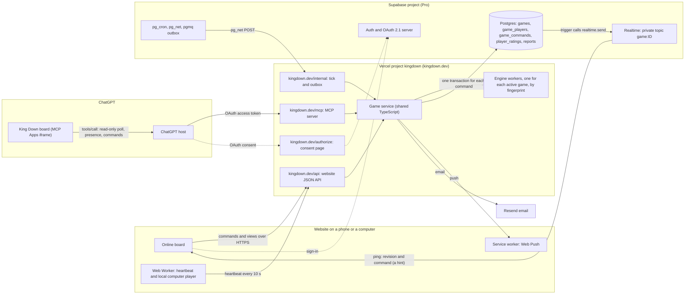
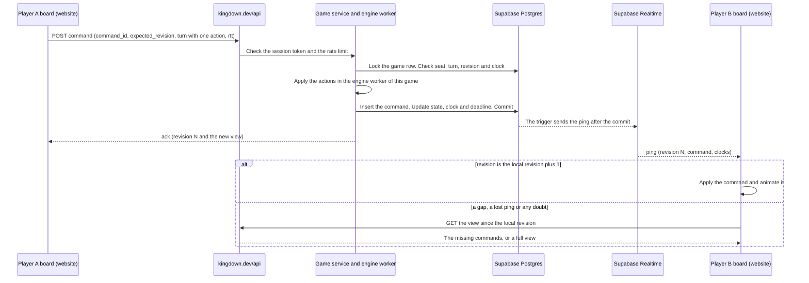
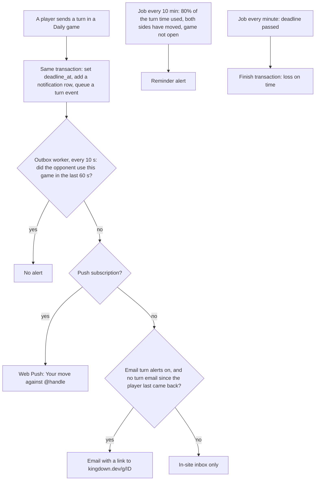
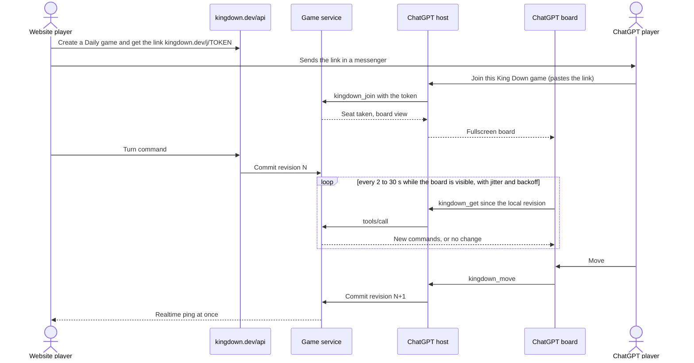

# 03 · Technical implementation: website and ChatGPT plugin

Research report for King Down Chess, 2026-10-10. This is part 03 of the report in `docs/research/multiplayer-2026-10-10/`. This version adds the gap findings of the same day and the fixes from the report review. Ticket: [01 — Deep research](../../specs/accounts-multiplayer/issues/01-deep-research.md). Area: hosting, databases, data processing, connections, devices, identity, security and online-safety duties for accounts and multiplayer on both surfaces.

## 1. Plain summary

King Down can add accounts and online play with its two current services: Vercel for the website, and Supabase for accounts and games. One game server checks every move, so website players and ChatGPT players can play each other with one account. The website board shows a move at once, the ChatGPT board checks every few seconds, and email tells players when it is their turn. We build in named phases: Daily games with friends first, then live games, then open play with ratings, then awards and the public launch. Until OpenAI lists the plugin publicly, most invited friends must play in the browser, and the listing review can take one to four months. The cost is about $45 a month at 100 players a day and about $750–1,450 at 10,000, but nobody has measured the usage yet. Before the first online game, we must fix account deletion and game versions, and add a Report button. The first UK online-safety records can already be due now: today's ChatGPT friend games can bring King Down into scope if it has UK players. Section 12 lists the decisions for you, with our pick for each.

## Reading notes

- **Labels.** Each recommendation has one label:
  - **Common practice**: most products we checked do it.
  - **Best practice**: an official guideline, a standard or published research supports it.
  - **Our inference**: we reason it from the findings and from King Down's facts; no product or guideline proves it.
- **Finding IDs.** An ID in square brackets, for example [tc-realtime:F3], points to a finding in [appendix-c-technical-findings.md](appendix-c-technical-findings.md). The five groups are:
  - `tc-realtime`: connection methods, browsers and devices;
  - `tc-backends`: game backends, frameworks and open-source references;
  - `tc-data`: databases and data processing;
  - `tc-chatgpt`: the ChatGPT plugin platform;
  - `tc-identity`: identity, authentication and security.

  User-journey findings are in [appendix A](appendix-a-user-journey-findings.md) ([part 01](01-user-journey.md)), ranking findings in [appendix B](appendix-b-ranking-findings.md) ([part 02](02-ranking-and-profiles.md)), and gap findings in [appendix D](appendix-d-gap-findings.md). This part uses four gap groups:
  - `gap1`: who can install and use a ChatGPT plugin, and how a second person adds a private one;
  - `gap2`: limits, timeouts and delays for tool calls from the ChatGPT board, and sockets in the board;
  - `gap4`: the speed and reliability of Supabase Realtime;
  - `gap6`: the UK Online Safety Act and the EU Digital Services Act for a small game.

  A checker read the gap findings on 2026-10-10. Where the checker corrected a finding, this part uses the corrected claim. Where the checker could not verify a finding (gap1:F9 and gap1:F10 in this part), the text marks it "unconfirmed". The checker also found facts that the researchers missed. This part adds a missed fact only where it changes a recommendation, and it gives the source link next to the fact. Where a gap finding has low confidence, the text says so.
- **Terms.** This part uses one term for each meaning:
  - **Daily game**: an asynchronous game with a deadline for each move, counted in days. Part 01 uses the same name.
  - **Live game**: both players are online, with a clock or with no clock.
  - **Handle**: the unique public name of a player. Parts 01 and 02 use the same term.
  - **The computer**: King Down's computer player. "Play the computer" is the button.
  - **Players a day**: the number of different players who play on one day. This part does not use "daily" for this meaning.
- **Proposals and judge.** Three architecture proposals (P1, P2, P3) and one independent judge scored the options (section 3.3). A few proposal facts, mostly prices, are not in a checked finding. We mark them "not checked".
- **Evidence limits.** The shared web-search budget ran out in each research thread, also in the gap threads. After that, researchers fetched known primary pages and source code directly. `help.openai.com`, `openai.com` and the ChatGPT directory returned 403. Where a finding is low confidence or unverifiable, the text says so. This part uses no refuted finding. Where a checker corrected a finding, we use the corrected form.
- **New price reads.** For this version, we read the Vercel and Supabase pricing pages again on 2026-10-10 (section 10). These reads have no finding ID; the text gives the URL.
- **Code references** point to the repository on 2026-10-10.

### What King Down has today

| Item | Today | Where |
|---|---|---|
| Accounts | Supabase Auth with Google and GitHub (Facebook only with `?facebook=1`), PKCE, publishable key only. `profiles` (display name copied from the provider, often a real name; `rating` 1200, unused) and `user_data` (settings, lessons, saved game, unlocks). No guests. | `supabase/migrations/0001_accounts.sql`, `src/account/` |
| ChatGPT plugin | MCP Apps server on the separate Vercel project `kingdown-plugin`. Tools `kingdown_open`, `_create`, `_resume`, `_get`, `_move`, `_computer`, `_invite`, `_join`. A friend board polls every 3 s while it waits and is visible. `connectDomains: []`. Friends add it by hand as a custom MCP server; it is not in the public directory. | `src/plugin/server.ts`, `src/plugin/app.ts` [tc-realtime:F29], [gap1:F1, F2] |
| ChatGPT sign-in | Supabase OAuth 2.1 server, one pre-registered public PKCE client, an audience hook, and a consent page on `kingdown-plugin.vercel.app` with Google and GitHub only. | `plugin-deploy/oauth-audience-hook.sql`, `src/plugin/auth.ts` [tc-identity:F8, F36] |
| Match authority | `plugin_matches` (revision ≤ 1000; `save` and `snapshot` up to 8 MB each), `plugin_match_commands` (idempotent receipts), `plugin_match_invites` (SHA-256 token hash, 24 h), `plugin_boards`. | `0002`–`0004`, `src/match/store.ts` |
| Move path | Each move starts a new worker thread, replays the whole save, applies the move, then commits the command and rewrites the whole `save` and `snapshot` under a row lock. | `src/match/service.ts`, `src/match/index.ts` |
| Engine version | The worker hashes the engine source (or the built `worker.mjs`) when it starts. A save from another engine fails with `MATCH_INCOMPATIBLE`, and the player sees "Start a new game". | `src/match/worker.ts:13-29` [tc-data:V3] |
| One worker, one game | A worker accepts `create` or `load` once. It sets the global `RULES` only then. | `src/match/worker.ts` (message handler) |
| Website friend play | The whole game travels in a link. No server checks it. The turn button says "Send your turn" in a link game. | `src/screen/links.ts`, `docs/specs/web-redesign/spec.md` §4.1 |
| Turn rule in the plugin | The plugin server commits each action at once and has no Undo (web-redesign decision D14). | `docs/specs/web-redesign/spec.md` D14 |
| Account deletion | Both seats, the command actor and the invite user cascade on delete, and `deleteForActor` deletes every match of the player, so the opponent loses the game too. | `0002_matches.sql`, `store.ts:50` [tc-identity:F28], [tc-data:F26] |
| Indexes | No index on `white_id` or `black_id`. `latest()` filters on both and sorts. | [tc-data:F13] |
| Missing | Game list, resign, draw offer, abort, clocks, presence, push, email, ratings, leaderboards, matchmaking, guests, a website game server, reports and moderation, UK online-safety records. | — |

## 2. Requirements

| # | Requirement | Website | ChatGPT | Notes |
|---|---|---|---|---|
| R1 | One account and one player ID on both surfaces | Yes | Yes | The Supabase user UUID already appears in both kinds of token [tc-identity:F8]. |
| R2 | Crossplay: a website player and a ChatGPT player in one game | Yes | Yes | One game row, two clients. Normal invitees reach the ChatGPT side only after a public listing [gap1:F1, F5]. |
| R3 | Daily games: a deadline for each move, timeouts, reminders, a "your turn" list, alerts outside the app | Yes | Yes (alerts come from email or web push) | ChatGPT cannot alert a player in normal chats [tc-chatgpt:F11]. Part 01, section 4. |
| R4 | Live games: server clocks, fair lag handling, presence, disconnect rules, abort, reconnection | Yes | Slow clocks only | Part 01, sections 3 and 6.5. |
| R5 | Ways to start: friend link or code, challenge by handle, open challenges, quick match, the computer while a player waits | Yes | Yes | Part 01, sections 3.2–3.4. |
| R6 | Server authority: the shared engine checks each action on the server; retries are safe; Haste and other multi-action turns work | Yes | Yes | [tc-identity:F24], [tc-backends:F30] |
| R7 | Ratings: Glicko-2 after each rated game, history, a provisional mark | Yes | Yes | Part 02, section 2. |
| R8 | Leaderboards, public profiles, game history, achievements, crowns | Yes | Yes (cards and tools) | Part 02, sections 3–5. |
| R9 | Notifications: email, web push, an in-site inbox | Yes | Through the same account | Part 01, section 4.6. |
| R10 | A deploy never ends a game in progress | Yes | Yes | Daily games last days [tc-data:V3]. |
| R11 | Privacy: public handles, no real names by default, deletion that keeps the opponent's games, data export | Yes | Yes | [tc-identity:F25, F28], [tc-data:F26] |
| R12 | Abuse control: rate limits, guests, self-play, prompt injection through opponent text | Yes | Yes | [tc-identity:F23, F35], [tc-chatgpt:V4] |
| R13 | Later: card mode with hidden hands (a private view for each seat), spectators | Later | Later | [tc-backends:F10] |
| R14 | Scale: tens to a few hundred players online at launch; a plan for 10,000 players a day | Yes | Yes | — |
| R15 | Operations: one owner with AI agents, few moving parts, the existing deploy and review gates | Yes | Yes | `AGENTS.md`, `docs/HOSTING.md` |
| R16 | Online-safety law: a report flow, moderation with reasons and appeals, terms, and written UK risk records. Today's ChatGPT friend play can already be in scope, so the first records can be due before multiplayer ships (section 8.10) | Yes | Yes (one service with the website) | The UK Online Safety Act has no size exemption [gap6:F1, F4, F5, F6, F12]. A new or changed service that comes into scope has three months for its risk assessment ([Ofcom risk assessment guidance, para 2.19](https://www.ofcom.org.uk/siteassets/resources/documents/online-safety/information-for-industry/illegal-harms/updates/risk-assessment-guidance-and-risk-profiles.pdf)). |
| R17 | Distribution: a friend who uses ChatGPT can join only through a public directory listing, or through a manual custom-server setup on the web | — | Yes | [gap1:F1, F2, F4, F5] |

Not at launch: free-text chat, spectators, tournaments, native apps.

## 3. Options compared

### 3.1 Connection methods

How does a client learn that the opponent moved? The table compares the methods. Prices and limits were read on 2026-10-10 unless the row gives a page date.

| Method | How it works | Verified limits and prices | In the ChatGPT board | Fit for King Down | Evidence |
|---|---|---|---|---|---|
| **Tool-call polling** | The board calls an app-only tool through the ChatGPT host, with no model turn. | OpenAI publishes no timeout, no rate limit and no latency figure for these calls. It says calls over "a few hundred milliseconds" feel slow, and it tells developers to rate-limit their own traffic [gap2:F1]. The MCP Apps spec also sets no limit; it lets the host block calls or ask the user [gap2:F2]. No public report shows 429 errors from a polling board; developers poll every 5 s [gap2:F3]. Community numbers put the host overhead near 1 s since late 2025 (low confidence) [gap2:F4]. Each call passes the iframe and the ChatGPT host, and it reaches the server from OpenAI's shared connector egress IPs [gap2:F5]. Only community console logs show a chatgpt.com backend hop (`/backend-api/ecosystem/call_mcp`), and the reporter found no link between it and board calls [gap2:F5]. | Works today on desktop Chrome and the iPhone app (King Down tests, 2026-10-08). No Android test yet. Client bugs have stopped board calls on single ChatGPT clients for days: on the macOS app and Work on the web for about 9 days in September and October 2026 [gap2:F7]. | **ChatGPT baseline.** Make it adaptive, read-only and cheap (section 4.5). | [tc-chatgpt:F9, F16, F17, F18], [gap2:F1, F2, F3, F4, F5, F7] |
| **HTTP polling, fetch on open** | The page asks the server for the current revision. | Vercel: polling "is sufficient when updates are infrequent and a few seconds of staleness is acceptable" (guide updated 2026-09-10). | A fetch to a declared https origin is documented. Published apps have had `connect_domains` failures, and one developer moved to tool calls instead [gap2:F14]. | **Website fallback; Daily games.** | [tc-realtime:F2], [gap2:F14] |
| Server-Sent Events from a Vercel function | One-way stream; resume with an event ID. | The stream ends at the function's maximum duration: 300 s by default, 800 s at most on Pro (limits page, 2026-08-24). 6 connections per domain on HTTP/1.1. Resumable SSE on Vercel needs Redis. | OpenAI's Cards Against AI example streams SSE to a declared origin, with no client test list [gap2:F12]. One published app reported that EventSource to its own backend failed [gap2:F14]. | Possible fallback; not needed. | [tc-realtime:F1, F27], [tc-chatgpt:F3, F27], [gap2:F12, F14] |
| WebSocket on Vercel Functions | One function instance holds the socket. | Public beta since 2026-06-22. The socket closes at the maximum duration (an independent test saw drops at about 310 s with code 1006). One socket stays on one instance, so fan-out needs Redis. Memory is billed while the socket is open ($0.0106 per GB-hour in iad1). 1,024 file descriptors per instance. | Not tested. | **No.** Beta, forced reconnects, and a second store. | [tc-realtime:F1, F2, V5], [tc-backends:F27, V3] |
| **Supabase Realtime, Broadcast from Database** | A database trigger calls `realtime.send` on a private topic. RLS on `realtime.messages` decides who receives. | Pro: 500 concurrent connections (10,000 with no spend cap), 500 messages/s, 5 M messages a month included; $10 per 1,000 extra peak connections. Above 5 M messages: with the spend cap off, $2.50 for each started package of 1 M messages; with the spend cap on, Supabase refuses the extra messages until the next billing cycle, so pings stop [gap4:F13] ([cost control](https://supabase.com/docs/guides/platform/cost-control)). Replay: private topics only, database messages only, at most 25 per request, kept 72 h to 4 days. WebSocket only, no long-polling fallback. Supabase's benchmark (about March 2025, load generators inside AWS, so no last mile; full load with no warm-up): median 46 ms, p95 132 ms, p99 159 ms [gap4:F1, F2]. Supabase does not publish how it measured these figures: its published k6 script measures client-to-client Broadcast, and no script exists for the Broadcast from Database test [gap4:F2]. No uptime SLA on Pro, and no delivery guarantee on any plan [gap4:F5]. Status page: 99.93% uptime in 2025 and 99.92% in 2026 up to 2026-10-10, with incidents of 2 to 5 hours. The figure can undercount: some Realtime incidents have no component marked, so they are not in it [gap4:F6] ([2026-06-24 incident](https://statuspage.incident.io/supabase/incidents/cwbxr7b3lz7y)). | The MCP Apps spec allows `wss://` in `connectDomains`; OpenAI's docs mention only fetch [gap2:F11]. An `https://` entry does not allow `wss://` [gap2:F15]. Community reports conflict, and none names a client or a published build: two developers reported in late 2025 that ChatGPT rewrote `wss://` entries to `https://wss://`, one of them later wrote that WebSockets work in the board, and a third wrote that they do not (low confidence) [gap2:F13]. The board has no user token, and a private topic for the anon role needs an RLS policy that Supabase does not document. | **Website push: our pick, as a hint only.** ChatGPT: test later. | [tc-realtime:F3, F4, F5, F7, F8, V4], [tc-chatgpt:V5], [gap4:F1, F2, F5, F6], [gap2:F11, F13, F15] |
| Supabase Postgres Changes | Clients listen to table changes. | One processing thread and one RLS check for each event and each subscriber. Supabase recommends Broadcast above about 3,000 subscribers. The benchmark gives p95 from 184 ms to 4,951 ms [gap4:F3]. | As above. | No. Broadcast is the better path. | [tc-realtime:F6], [tc-data:F5], [gap4:F3] |
| Ably | Managed publish and subscribe. | Free: 6 M messages a month, 200 connections. Standard: $29 a month, 10,000 connections. Resumes within about 2 minutes with no loss. | Not tested. | No. A second vendor and a second token system for no gain at this size. | [tc-realtime:F11] |
| Pusher Channels | Managed publish and subscribe. | Sandbox: 100 connections, 200,000 messages a day. Startup: $49 for 500 connections. 10 KB per message. No replay found. | Not tested. | No. | [tc-realtime:F12] |
| Firebase Realtime Database, Firestore | Managed database with listeners. | Realtime Database: 100 connections on Spark, 200,000 on Blaze. Firestore bills a full re-query after 30 minutes offline. Both need Firebase Auth beside Supabase. | Not tested. | No. | [tc-realtime:F13, F14] |
| Cloudflare Durable Objects with hibernation | One stateful object for each game holds the sockets. | Workers Paid: $5 a month minimum. 20 incoming socket messages bill as 1 request; outgoing messages are free; no duration charge while the object hibernates. Every deploy disconnects every socket (pages 2026-06 to 2026-09). | Cloudflare's chess tutorial (updated 2026-06-03) uses a WebSocket, but with the legacy resource type and no CSP, and it requires developer mode [gap2:F13]. | **Escape path** if Supabase Realtime falls short. | [tc-realtime:F15], [tc-backends:F29], [tc-chatgpt:F3] |
| Hosted PartyKit, PartyServer | Rooms on Durable Objects. | Hosted PartyKit stops deploys on 16 October and shuts down on 2026-10-23. PartyServer is "a Work in Progress". | — | No. | [tc-realtime:F16] |
| Liveblocks, Convex | Collaboration rooms; a reactive backend. | Liveblocks Free: 10 connections per room. Convex Free: 1,000 sessions; it replaces Supabase. | — | No. | [tc-realtime:F17, F18] |
| WebRTC data channels | Peer to peer. | Needs signaling, STUN and TURN ($0.05 per GB on Cloudflare). A peer cannot be the referee. | — | No. | [tc-realtime:F28] |
| Self-hosted Socket.IO | A Node socket server. | At most once by default. Its recovery "will not always be successful". Needs a long-running host. | — | No. | [tc-realtime:F19] |
| Host-mediated push (MCP Apps subscriptions) | The host sends resource updates to the board. | Only a proposal (ext-apps #659). No host offers it today. MCP Events in ChatGPT is webhook-only and does not stream to the board [gap2:F16]. | Not available. | Watch it; replace polling when ChatGPT offers it. | [gap2:F16] |

What the comparison shows:

- Every design checked keeps a sequence number for catch-up and falls back to a full reload when catch-up fails (6 of 6) [tc-realtime:F35]. So the push channel is only a hint, and the database revision is the truth. *Common practice.*
- Supabase Realtime is fast in its own benchmark, but it promises no delivery, and its source code shows ways to lose a message silently [gap4:F1, F5, F7, F8]. This confirms the rule above. *Our inference.*
- Managed services bill each delivered copy of a message. With two seats per game, the cost is small on all of them [tc-realtime:F34]. *Common practice.*
- Free and entry tiers allow 100 to 1,000 connections, which covers a niche launch [tc-realtime:F36].

### 3.2 Game backends and frameworks

| Product | What it gives | Engine fit | Operations | Price and status (checked 2026-10-10) | Verdict | Evidence |
|---|---|---|---|---|---|---|
| Nakama 3.41.0 (Apache-2.0) | Auth, friends, chat, notifications, storage, leaderboards, tournaments, matchmaker, authoritative matches | Weak. The TypeScript runtime is goja (ES5), with no Node modules and no global state, so the engine needs a port. | A Go server and CockroachDB. The install docs support PostgreSQL "for development environments only". Nakama keeps its own user table. | Self-hosting is free. Heroic Cloud prices are by quote only. Hiro (achievements) is a paid annual licence. | Not for the first release. | [tc-backends:F1, F2, F3, F4, F5, F6] |
| Colyseus 0.18 (MIT) | Rooms, state sync, seat reservation, reconnection, Zod message checks | Excellent: plain Node and TypeScript. | A long-running process (PM2 fork mode). It cannot run as Vercel Functions. Rooms do not persist, so a database is still needed. | Self-hosting free; Colyseus Cloud from $15 a month. | Runner-up, only if a live-room layer becomes necessary. | [tc-backends:F7, F8, F9] |
| boardgame.io (MIT) | Turn orders, phases, secret state through `playerView`, a lobby | Medium: games use its own moves model. | One Koa server. | No npm release since 0.50.2 (2022-11-10); commits in 2026. | Design reference for hidden hands. | [tc-backends:F10] |
| PlayFab | LiveOps backend: auth, statistics, leaderboards, CloudScript, matchmaking | Poor: built for engine-based real-time games. | Proprietary. | Pricing page returned 403. | No. | [tc-backends:F12] |
| Photon | Relay priced by concurrent users | It cannot run the TypeScript engine as the referee on its public cloud. | — | Free for 20 CCU; $95 a month for 500 CCU. | No. | [tc-backends:F11] |
| Unity Gaming Services | Lobby, Relay, Matchmaker, Cloud Code | Built around the Unity engine. | — | Leaderboards are "free for a limited time". | No. | [tc-backends:F13] |
| Rivet | Stateful actors | A good model (one actor per match). | — | Changed its focus to "agentic workloads". | Reference only. | [tc-backends:F14] |
| Hathora | Game server hosting | — | — | Shutting down within 90 days of 2026-10-07. | No. | [tc-backends:F15, V5] |
| Edgegap | A container server for each session | — | Free tier: 60 minutes per deployment. | $0.00115 per vCPU-minute. | No: Daily games last days. | [tc-backends:F16] |
| Amazon GameLift | Server fleets | — | High. | c6a.large $0.099 an hour; its own 1v1 example costs $3,237 a month. | No. | [tc-backends:F17] |

Reference designs that King Down can learn from:

| Reference | What to borrow | Licence | Evidence |
|---|---|---|---|
| Lichess (`lila`, `lila-ws`) | Versioned events with catch-up and a full reload on a gap; legal moves sent by the server; a socket layer apart from the game authority; Glicko-2; a lag quota; disconnect timeouts scaled by speed; client flag claims that the server checks; a correspondence alarm at 80% of the time; deletion that anonymizes games | AGPL-3.0 (`lila`, `lila-ws`), GPL-3.0 (`chessground`), MIT (`scalachess`) | [tc-backends:F18, F19, F20, F22, F23], [tc-realtime:F21, F22, F23, F24], [tc-data:F10, F14, F20, F22] |
| OGS (`goban`) | A tested set of game-control messages: `timed_out` with a server grace period, early unrated cancel, anti-stalling, delayed resign, conditional moves, latency | `goban` Apache-2.0; web client AGPL-3.0; backend not public | [tc-backends:F25] |
| PyChess | One async server and one database run a fairy-piece variant site with live and correspondence play; the same engine runs on the server and in the browser | AGPL-3.0 | [tc-backends:F24] |
| Woogles (`liwords`) | Seeks in a Postgres table; a `game_players` table indexed by player and date; a `player_on_turn` column; per-turn rows that are deleted when the game ends (2026) | Not checked; we use the design only | [tc-data:F11, V4] |
| Chess.com | Its scaling problems came at about 16,000 moves a second (2023), far above King Down's needs | — | [tc-backends:F26] |

What the comparison shows:

- Every open-source chess or board-game server whose code the researchers could read checks each move on the server with a rules engine. King Down's plugin already does this [tc-backends:F30]. *Common practice.*
- No backend checked computes chess-style ratings [tc-backends:F6, F22]. King Down writes its own rating code in any design.
- Do not adopt a game backend for the first release. Keep Supabase Postgres as the match authority [tc-backends:F28, F31, F32]. *Our inference*, which the backend research recommends.
- Borrow designs and protocols, not code, from AGPL and GPL projects. Code under MIT or Apache-2.0 (`scalachess`, `goban`) is safe to study and adapt with attribution [tc-backends:F23]. This is general licence knowledge, not legal advice.

### 3.3 The three architecture proposals

| | **P1 Reuse and simplest** | P2 Real-time first | P3 Game backend |
|---|---|---|---|
| Core idea | Supabase Postgres stays the only match authority. The existing Node match service serves both surfaces. | One Cloudflare Durable Object room for each game holds the sockets, the clock and the engine. Postgres keeps the durable record. | Self-hosted Nakama on a VM does matchmaking, leaderboards, presence and the website sockets. Supabase and the Node engine stay the move authority. |
| Website push | Supabase Realtime ping from a database trigger | WebSocket to the room | Nakama WebSocket relay |
| ChatGPT updates | Adaptive tool polling; Realtime ping later, behind a flag | Socket, then SSE, then polling, with a seat ticket in `_meta` | Polling; a Nakama watch token later, behind a flag |
| Clocks and timers | The server charges time when it accepts a command; lazy checks; client claims; a pg_cron sweep | Durable Object alarms | The Nakama match loop, with a pg_cron backstop |
| New vendors | Resend and Turnstile (settings only) | Cloudflare (Workers, Durable Objects, Hyperdrive), a DNS move, Resend, Turnstile | A DigitalOcean VM, Nakama, a second Postgres, Resend, Turnstile |
| Estimated cost a month, 100 / 10,000 players a day | ~$45 / ~$450–800 as proposed; ~$45 / ~$750–1,450 after this revision adds the Vercel CDN lines (section 10) | ~$30–35 / ~$75–180 (leaves out the Vercel side) | ~$37 / ~$190–300 |
| Main risks | Realtime latency is not measured; high Vercel CPU without warm workers | A third platform; every deploy drops every socket; two stores can drift; rooms share module globals with the engine's `RULES` | A VM to run; a second user table; ChatGPT gets weaker quick play |

The judge scored each proposal from 1 to 5 on ten criteria:

| Criterion | P1 | P2 | P3 |
|---|---|---|---|
| 1. Simplicity and operations effort | **5** | 2 | 2 |
| 2. Reliability | **4** | **4** | 3 |
| 3. Latency for live play | 3 | **5** | 3 |
| 4. Async play and notifications | **5** | 4 | 4 |
| 5. Compatibility with the ChatGPT plugin | **5** | 3 | 3 |
| 6. Fit with the current code | **5** | 2 | 3 |
| 7. Cost at small scale | **5** | 4 | 4 |
| 8. Path to scale | 3 | **5** | 3 |
| 9. Lock-in and portability | **4** | 3 | **4** |
| 10. Security and server authority | **5** | 4 | 3 |
| **Total (of 50)** | **44** | 36 | 32 |

**Verdict: P1 wins.** It scores highest on the criteria that matter most for one owner with AI agents: simplicity, fit with the current code, security, async play and ChatGPT compatibility. All three proposals agree on the rest. Examples are one Supabase identity, server authority, polling as the ChatGPT baseline, email and web push outside ChatGPT, the deletion fix and the move of the consent page. So the real choice is only the live transport and the social layer. The cost correction in section 10 does not change the verdict at small scale. At 10,000 players a day, it makes the move to P2 in section 11.3 come earlier. *Our inference.*

Claims that the judge flagged, which this part corrects:

- "Realtime sends only after commit" is an inference from logical replication. Supabase does not state it [tc-data:F5]. The gap research adds that Realtime reads the WAL through a replication slot, and that `realtime.send` turns its own errors into warnings, so a move can commit with no broadcast [gap4:F4, F7].
- P1 understates its "warm workers". Today one worker serves one game and sets the rules only on create or load. Section 4.2 gives the fix (graft G1).
- The P1 cost at 10,000 players a day comes from a model that nobody has measured. It also left out Vercel CDN requests and data transfer. Section 10 adds them.
- One rating pool for live and Daily games goes against common practice. Part 02 accepts this on purpose (part 02, decision D3).
- P1 writes the Lichess lag formula with a unit error. The source works in centiseconds: gain = min(100 cs, estimated total seconds × 2/5 + 15) cs [tc-realtime:F22]. Section 6.5 uses the source form.
- P2's two Cloudflare example bills ($142.95 and $20.65) come from different workloads, and its Cloudflare chess demo is weak evidence for WebSocket in ChatGPT [tc-realtime:F15], [tc-chatgpt:F3], [gap2:F13].
- P3's Nakama-on-Postgres is officially for development only [tc-backends:F4]. A server replay does not make computer-game crowns trustworthy: it proves that the moves are legal, not that the computer chose them.

## 4. The recommended architecture

The design is P1 with ten grafts from the judge. Each graft has an ID (G1–G10) so later tickets can name it. The gap findings add no new graft; they change the ChatGPT poll (section 4.5), presence (section 6.6), distribution (section 4.7) and safety (section 8.10).

| Graft | What it adds | Where |
|---|---|---|
| G1 | Engine workers that serve more than one request must not mix the rules of two games | 4.2, 5.9 |
| G2 | The engine fingerprint comes from the build, and a deploy that drops a fingerprint in use fails | 5.9 |
| G3 | In modes with no hidden information, the Realtime ping carries the accepted command, so the opponent needs no second fetch | 4.3, 6.1 |
| G4 | The live heartbeat runs in a dedicated Web Worker; a hidden tab alone does not mark a player away | 6.6 |
| G5 | When the website channel is not subscribed, the website polls on the same schedule as ChatGPT | 6.3 |
| G6 | One typed message set on both surfaces, independent of the transport | 4.3 |
| G7 | One pure function computes the next deadline for clocks, presence, aborts and reminders | 6.5 |
| G8 | A short spike measures latency and tests sockets in ChatGPT before the build | 9 (phase 0) |
| G9 | A `notifications` table for challenges and awards, not only an inbox query | 5.1, 5.8 |
| G10 | Show the surface in presence; label the computer openly; reserve `tournament_id`; plan weekly boards as materialized views | 5.1, 6.6, 6.7 |

### 4.1 Overview

### 4.2 Components

| Component | Choice | Label | Evidence |
|---|---|---|---|
| Hosting | One Vercel project, `kingdown`: the static site plus function entries `/api/*` (website), `/mcp` (ChatGPT), `/authorize` (consent page) and `/internal/*` (jobs). Retire `kingdown-plugin` after one week of parallel running. One deploy ships the client, the server and the engine together. | Our inference | [tc-chatgpt:F5, V3], [tc-identity:F36] |
| Match authority | Supabase Postgres on Pro, Micro compute at launch. The `plugin_*` tables become shared `games`, `game_players`, `game_commands`, `game_invites`. | Common practice | [tc-backends:F31, V2], [tc-data:F1, F2, F12] |
| Game service | `src/match/service.ts` stays the only write path for games. Two thin adapters call it: a JSON API for website sessions and the MCP server for ChatGPT tokens. | Best practice (server authority) | [tc-identity:F24], [tc-data:F19] |
| Engine on the server | Node worker threads, as today. Supabase Edge Functions are too small (2 s of CPU per request). Two changes: (1) an engine archive, so each game runs on the engine version it started with (G2); (2) warm workers: each instance keeps a small cache (for example 16) of open workers, **one worker for each active game**, reused when the cached revision equals the database revision (G1). One worker per game avoids the shared `RULES` problem with no engine change. Drop a cached worker after any failed commit. | Our inference | [tc-data:F6, V3] |
| Website push | Supabase Realtime Broadcast from Database. An `AFTER INSERT` trigger on `game_commands` calls `realtime.send` once for each accepted command, on the private topic `game:<id>` (with no `realtime:` prefix). An RLS policy on `realtime.messages` admits only seat holders. Turn off "Allow public access". The ping is a hint; the database stays the truth. | Best practice (Supabase's own guidance) | [tc-realtime:F5, F6, F7], [tc-data:F5], [tc-identity:F18], [gap4:F3, F5, F7] |
| ChatGPT updates | Adaptive tool-call polling of an app-only, strictly read-only `kingdown_get` (section 4.5). A Realtime ping for the ChatGPT board stays behind a flag until live tests pass. | Common practice (the only path proven in ChatGPT today) | [tc-chatgpt:F8, F9], [tc-realtime:F29, F30], [gap2:F1, F3, F9] |
| Presence | `last_seen_at` on `game_players`. Website: every request from a seat writes it, and a heartbeat comes every 10 s in live games. ChatGPT: a separate app-only `kingdown_presence` tool writes it every 25 s in live games and live seeks. The read-only poll does not write. Supabase Presence is not used at launch. | Our inference | [tc-realtime:F10, F23], [gap2:F8, F9] |
| Clocks and timeouts | The server owns the clocks. It charges time when it accepts a command and checks flags lazily on every read and command. A client may claim a flag, and the server checks the claim. A pg_cron sweep ends games where nobody acts. One pure `nextDeadline()` function serves all three paths (G7). | Common practice (Lichess) | [tc-realtime:F22, F24], [tc-data:F7] |
| Jobs and side effects | pg_cron starts work; pg_net calls `/internal/*` with a secret header; a pgmq queue `events` is the outbox for alerts and awards. | Best practice | [tc-data:F7, F8] |
| Ratings | Glicko-2 with `glicko2-lite` (MIT) in shared TypeScript, inside the transaction that ends a rated game. Tables `player_ratings` and `rating_history`, as part 02 names them. | Common practice | [tc-backends:F22], [tc-data:F14, F20]; part 02, 2.10 |
| Leaderboards and profiles | Plain SQL over an indexed `player_ratings` table, cached 60 s at the Vercel CDN. Profiles for signed-in players; a public page at `kingdown.dev/@handle` only when the player turns it on (part 02, 4.4). | Common practice (cache the ranks) | [tc-data:F16, F17, F18] |
| Matchmaking | A `seeks` table for live seeks. A new seek pairs with the oldest compatible seek in one transaction, under a transaction-level advisory lock for each pool. One live seek for each player. An open Daily challenge is a `games` row (kind `open`) that waits 24 h; each player can have at most 3 (part 01, 4.1). | Our inference, scaled down from Lichess and Woogles | [tc-data:F9, F10, F11] |
| Notifications | `notifications` rows (G9), an inbox, Web Push (VAPID) from a service worker, and email through Resend. | Common practice | [tc-data:F22, F23, F24] |
| Identity | Supabase Auth is the only identity provider. The consent page moves to `kingdown.dev/authorize`. Unique handles. Guests only on the website, with Turnstile. Sign in with ChatGPT is a limited partner trial, so it is not an option [gap1:F17]. | Best practice | [tc-identity:F7, F8, F36, F1, F4, F5], [gap1:F17] |
| Abuse control | `@vercel/firewall` rate limits keyed by the verified user ID; one WAF IP rule on `/api` only, never on `/mcp`; database quotas. | Best practice | [tc-identity:F6, F23], [gap2:F5, F10] |
| Reports and moderation | One report flow on both surfaces, an owner queue, short statements of reasons, appeals, and written escalation paths. The terms, the safety page and the report form live on kingdown.dev. | Best practice (UK Ofcom codes; EU DSA articles 16–18) | [gap6:F6, F10, F16] |
| Not used | Vercel Functions WebSockets, Redis or Upstash, Ably, Pusher, Firebase, Convex, Liveblocks, Colyseus, Nakama, PartyKit, WebRTC, Supabase Edge Functions for the engine, Vercel Cron for clocks, Sign in with ChatGPT. | Our inference | Section 3, [gap1:F17] |

### 4.3 One protocol for both surfaces

The website API and the MCP tools use the same message shapes (G6). The protocol does not depend on the transport, so a Durable Object room can replace the Realtime ping later with no client rewrite. *Our inference*, from the Lichess and OGS protocols [tc-backends:F19, F25].

- **Command** (client to server): `{ command_id, expected_revision, action, rtt_ms? }`.
  - `command_id` is a UUID that the client makes. A retry sends the same ID.
  - `action` is one of: `turn {actions: [lan, …]}`, `pass`, `resign`, `abort`, `draw {offer | accept | decline}`, `claim {flag | abandon}`, `say {preset}`, `computer`.
  - `turn` holds one or more actions of the mover. The server applies the list in order in one transaction. If one action fails, it rejects the whole command.
  - Who sends what (decision T5): in live games, both boards send each action at once, as a `turn` with one action. In Daily games, the website board stages the turn, and End turn sends all its actions as one `turn`. The ChatGPT board always sends one action at a time, as the plugin does today (web-redesign decision D14).
  - `say` sends a preset message. Each preset can go once in each game, with a rate limit (part 01, section 8.2).
  - Every action goes through the same command log, so the revision covers all of them.
- **Reply**: `ack { command_id, revision, view }`, or `reject { command_id, code }`. The codes extend those in `service.ts` today: `STALE_REVISION`, `INVALID_MOVE`, `WRONG_TURN`, `MATCH_TERMINAL`, `COMMAND_CONFLICT`, plus `FLAGGED` and `RATE_LIMITED`.
- **Ping** (server to website): `{ revision, turn, status, clocks, command? }`. The `command` field exists only in modes with no hidden information (G3). A card-mode ping carries the revision only.
- **View** (`GET` on the website, `kingdown_get` in ChatGPT): `{ revision, seat, status, turn, clocks, server_now, legal, last_commands, opponent { handle, surface, last_seen_ms }, result?, rating_diff? }`.
  - `legal` is the server's list of legal moves for your seat, as Lichess sends "dests" [tc-backends:F20]. Both boards draw only this list, so an older client engine still shows correct moves.
  - Keep a move view under about 3 KB. Today's snapshot holds the full rules object and move objects. Small views keep data transfer low (section 10).
- **Rules for every client:**
  - Apply a ping only when its revision is exactly the local revision plus 1 [gap4:F9].
  - Drop a ping or view whose revision is not above the local one.
  - Refetch the view on a gap, a duplicate, `CHANNEL_ERROR`, a new `SUBSCRIBED` after a reconnect, or a return to the page [gap4:F7, F8, F12].
  - Fill a gap of 1–50 revisions with `GET ?since=<rev>`; reload the full view for a larger gap [tc-realtime:F21, F35].

### 4.4 Website flows

**Start a friend game.** Play → Play a friend → Live or Daily, time, colour (White, Black or random) → `POST /api/games`. The reply holds an invite link `kingdown.dev/j/<token>` and a short code. The share sheet opens. A live invite lasts 1 day. In a Daily game, the inviter makes the first move when they play White, and the invite lasts 14 days (part 01, section 4.2). The friend opens the link, signs in (or plays as a guest in a live casual game, section 8.4), and `POST /api/invites/redeem` gives them the seat. Part 01, section 3.3, gives the screens.

**A live turn.**

**A Daily game.**

**Rules for the website board:**

- **Home** shows "Your turn (N)" above Continue. It comes from `GET /api/me/games`, which reads a partial index on active games: your turn first, then the nearest deadline [tc-data:F13]. *Common practice* (part 01, section 4.5).
- **How turns travel** (decision T5; part 01, section 3.6):
  - *Live games:* each action goes to the server at once, and the board shows no End turn button. So the opponent sees each action with no delay. The ChatGPT board does the same today (web-redesign decision D14). *Our inference.*
  - *Daily games on the website:* the player stages the actions of a turn and can undo them. **End turn** is the move confirmation that Daily games need [ux-async:F5]. It sends the whole turn as one `turn` command, so a network failure can never leave half a turn on the server. *Common practice* for the confirmation; one command is *our inference*.
  - *ChatGPT:* each action commits at once in all games (D14).
- **The opponent's alert** goes out only when the turn passes, so a Haste turn makes one alert.
- **The board trusts the server.** It draws the server snapshot and highlights only the server's legal moves, as `src/plugin/app.ts` does. *Best practice* [tc-identity:F24].
- **Old link games** keep opening and playing. New friend games use server invites (part 01, decision 8).
- **`kingdown.dev/g/<id>`** opens any online game. Email, push and ChatGPT's "Open in App" all use it.

### 4.5 ChatGPT flow

The plugin keeps its shape: one MCP Apps board resource, app-only tools for board actions, Supabase OAuth 2.1 and the shared match service. It changes in the places below.

**Tools.** Give every tool explicit `readOnlyHint`, `destructiveHint` and `openWorldHint` booleans; review requires them [tc-chatgpt:F19]. OpenAI's review rules set `readOnlyHint` to true only when the tool cannot change state; writing a log counts as a change [gap2:F9]. Keep the board resource on the render tool (`kingdown_open`) only, because a widget template on every tool makes ChatGPT re-render the iframe too often (part 01, section 6.2) [ux-embedded:F24].

| Tool | Visible to | Change | Hints |
|---|---|---|---|
| `kingdown_open` | Model and board | Accepts a game ID or `next` (the most urgent game). Carries the board resource. | Not read-only |
| `kingdown_create` | Model | Adds mode (friend, open challenge, quick match), speed (Daily by default), time, colour and setup preset. | Not destructive |
| `kingdown_invite` | Model and board | Returns the `kingdown.dev/j/<token>` link and the short code. | Not destructive |
| `kingdown_join` | Model | Accepts a raw token, a full link or a short code. | Not destructive |
| `kingdown_games` (new) | Model | The "your turn" inbox, your turn first. A player can ask "Is it my turn in King Down?" | Read-only |
| `kingdown_get` | Board only | Takes `since_revision`. Writes nothing: no heartbeat, no log row. | Read-only (strict) |
| `kingdown_presence` (new) | Board only | Writes `last_seen_at` for the seat, and keeps a live seek open. The board calls it every 25 s, only in live games and live seeks. | Not read-only, not destructive, not open-world |
| `kingdown_move`, `kingdown_computer` | Board only | One command each, as today. | Not destructive |
| `kingdown_say` (new) | Board only | Sends one preset message. | Not destructive |
| `kingdown_draw` (new) | Board only | Offer, accept or decline. Accept ends the game. | Destructive |
| `kingdown_resign`, `kingdown_abort` (new) | Model and board | ChatGPT asks for confirmation. | Destructive |
| `kingdown_claim` (new) | Board only | Claim a win or a draw when the opponent is gone, or claim a flag. | Destructive |
| `kingdown_report` (new) | Model and board | Reports a player, a handle or a message, with a reason. It can also return the kingdown.dev report-form link. | Not read-only, not destructive |
| `kingdown_profile` (new) | Model | Marked `_meta['openai/profile']: true`. Returns `id` = the Supabase UUID and `name` = the handle, never the email. | Read-only |
| `kingdown_stats` (new, phase 3) | Model | The score card: handle, rating or "?", band, crowns, finish rate, recent achievements (part 02, 4.5). | Read-only |
| `kingdown_leaderboard` (new, phase 3) | Model | Rows that the server already computed: top, around me, friends (part 02 calls it `get_leaderboard`). | Read-only |

*Best practice* for the profile tool and the hints [tc-identity:F11], [tc-chatgpt:F19, V4], [gap2:F9]. The tool names are *our inference*.

**Why the poll is strictly read-only.** A tool that is not read-only can make ChatGPT ask the user for approval. One developer report shows a permission dialog on every 5 s poll [gap2:F8]. So `kingdown_get` writes nothing, and presence moves to `kingdown_presence`, which runs at most every 25 s. `kingdown_move` is also a write tool, and the live tests of 2026-10-08 recorded no prompt problem. *Inference:* the presence tool probably behaves the same. Test it on all four ChatGPT clients in phase 0. If it shows prompts, drop it: then presence comes from commands only, and no early claim is possible against a ChatGPT seat; the clock decides. *Our inference* [gap2:F8, F9].

Two facts that the checker added support this test:

- OpenAI's own Cards Against AI example sets `readOnlyHint: true` on every tool, also on the tools that change the game. Its code comment says that this "tells ChatGPT the tool is safe to call without asking the user first" ([server.ts](https://github.com/openai/openai-apps-sdk-examples/blob/main/cards_against_ai_server_node/src/server.ts), [DESIGN.md](https://github.com/openai/openai-apps-sdk-examples/blob/main/src/cards-against-ai/DESIGN.md)). So the hint controls the prompts. But the example breaks the review rule [gap2:F9] ([app review](https://developers.openai.com/plugins/deploy/app-review)), so King Down must not copy it. A write tool such as `kingdown_presence` stays open to prompts.
- Users and workspace admins choose when ChatGPT asks: "Always ask" (it asks before it reads app information), "Allow read actions", "Allow low-risk actions" (the default when no policy overrides it) and "Allow all actions" (for one app or one account only). So prompts can come from a setting, not only from the hints, and with "Always ask" even the read-only poll can prompt. This can explain why only some testers in one report saw a dialog on every poll. The text comes from search snippets of the Help Center, because the pages returned 403 ([managing app permissions](https://help.openai.com/en/articles/20001495-managing-app-permissions-in-chatgpt), [apps in ChatGPT](https://help.openai.com/en/articles/11487775-apps-in-chatgpt), [examples #163](https://github.com/openai/openai-apps-sdk-examples/issues/163)). The board must find a stalled poll and show a clear way out (poll rule 4 below).

**What the model sees.** In games between people, the position, the legal moves and the opponent's handle go only in tool-result `_meta`, which the board sees and the model does not. `structuredContent` gets a short summary with no opponent text, for example "Your move, move 14". This closes a prompt-injection path through handles and keeps the model from acting as a free engine helper. *Best practice* [tc-identity:F12, F35]; part 01, section 6.6.

**Board refresh schedule.** *Our inference*, from [tc-realtime:F30], [tc-chatgpt:F7, F16], [gap2:F1, F3, F7].

| Board state | Base interval for `kingdown_get` |
|---|---|
| Live game, opponent's turn, board visible | 2 s |
| Live game, your turn, board visible | 15 s (draw offers, claims, presence) |
| Daily game, board visible | 30 s |
| Waiting for a friend to join, or in a live seek | 5 s for 2 minutes, then 15 s |
| Board hidden (`visibilitychange`) | No polling |
| `ui/resource-teardown` | Stop |
| Board becomes visible again, or mounts | Fetch at once |

**Poll rules that protect the player and the host.** *Our inference*, from [gap2:F1, F3, F7, F8].

1. Keep one call in flight at a time. The board already has a busy flag.
2. Add ±20% jitter to each interval.
3. After an error, or a call slower than 2 s, double the interval, up to 15 s. Return to the base interval after 3 good calls.
4. After 3 failed calls in a row, show: "Connection to ChatGPT is slow; your opponent sees your moves when you play." A call with no answer after 10 s counts as failed. It can wait on an approval prompt, so show the message at once and add: "If ChatGPT asks for permission, choose Allow, or continue on kingdown.dev."
5. Log the latency of each call (`performance.now` before and after) and any error text. Send a sample of these numbers to the server with the next command, for the monitoring in section 6.10.

**Make an unchanged poll cheap.** With `since_revision`, `kingdown_get` reads one indexed row and returns a small "unchanged" result. It does not start an engine worker. Target under 100 ms of server time. Return the full view only for a changed revision. Each poll can cost more than one HTTP request, because ChatGPT can send a new `initialize` (and in one report a token refresh) before each `tools/call` [gap2:F6]. Server time adds directly to the host overhead [gap2:F4]. *Our inference.*

**Mount rules.** Treat every mount as a cold start. Read the game through `kingdown_get` and ignore the stale tool result that the host replays. Keep only the board ID in widget state. *Best practice* [tc-chatgpt:F7]; King Down ticket 05 showed the replay on 2026-10-08. On iOS, the board sometimes gets no tool input or tool result after `initialize`; the fetch at mount covers this ([issue #239](https://github.com/openai/openai-apps-sdk-examples/issues/239), in the gap 2 product notes) [gap2:F7].

**Live games in ChatGPT.** Offer them only while both boards are open, and only at slow settings: 15 + 10 or slower, or "live, no clock" between friends. Warn the player that the clock runs while ChatGPT is in the background. Give ChatGPT seats a longer minimum disconnect grace (60 s). Design for inline and fullscreen only, and do not depend on picture-in-picture: OpenAI's newest extensions spec (2026-10-10) says ChatGPT does not support it, although another OpenAI page still lists it. Do not design for Voice: whether Voice runs plugins is not clear. A community post (2026-08-26) says that it does not, and copies of the Help Center voice page (seen only in search snippets) disagree with each other [gap1:F13]. *Our inference* [tc-chatgpt:F6, F7, F11], [gap2:F4, F7]; part 01, section 6.5.

**Async alerts.** ChatGPT has no consumer push for plugins. MCP Events works only in Work chats (web, and desktop with Cloud selected) and in dots, and an event starts a ChatGPT task; it does not update the board [tc-chatgpt:F11], [gap2:F16]. So the same account gets email or website push, which links to `kingdown.dev/g/<id>`. The board says where the alert goes ("We email you when it is your turn"). *Our inference*.

**Open in App.** `setOpenInAppUrl` points to `kingdown.dev/g/<id>`, so a player can continue the same game on the website [tc-chatgpt:F10, F20]. Build it in phase 1, not later. Board bugs on single ChatGPT clients are frequent in 2026, and this link is the way out of a blank or broken board [gap1:F13], [gap2:F7]. *Our inference.*

**Optional push upgrade, behind a flag.** *Best practice* (test before you depend on it).

1. Test whether a private Realtime topic can admit the anon role (the publishable key) through an RLS policy on a topic such as `ping:<128-bit secret>`. Supabase does not document this [tc-chatgpt:V5].
2. If it works, the trigger sends a second `{revision}` ping to that topic. The topic reaches the board only in `_meta`.
3. Declare both `wss://<ref>.supabase.co` and `https://<ref>.supabase.co` in `_meta.ui.csp.connectDomains`, and also in the legacy `openai/widgetCSP.connect_domains` because of the June 2026 CSP report [tc-chatgpt:F4]. An `https://` entry alone does not allow `wss://` [gap2:F15].
4. On each client, read the iframe's real CSP header. Confirm that the `wss://` entry is present and not rewritten to `https://wss://` [gap2:F13, F14].
5. On a ping, the board calls `kingdown_get`. If the channel is not subscribed within 5 s, the board polls.
6. Never give the board the user's OAuth token, and do not import a signing key to mint board tokens: a breach of that key could forge any player's token [tc-identity:F13, F15].
7. Ship it only after it passes on ChatGPT web, the desktop apps, iOS and Android, in a published or workspace-published build, not only in developer mode [tc-realtime:F29], [tc-chatgpt:F3], [gap2:F14].
8. Later, when ChatGPT offers host-mediated resource subscriptions to boards, replace both the poll and this ping with that path [gap2:F16].

**Soak test before you depend on 2 s polling.** *Best practice* (test before you depend on it) [gap2:F1, F2, F3, F4, F6, F7].

- Where: ChatGPT web, the macOS app, iOS and Android, in a workspace-published build, not only in developer mode. Publish it to the workspace as a custom MCP server. Do not import it from a marketplace or by GitHub sync: an imported plugin that declares MCP servers, remote HTTPS servers included, is "Desktop only" and does not run on phones ([plugin management](https://learn.chatgpt.com/docs/enterprise/plugin-management.md)). That page does not say whether a workspace-published custom server reaches the mobile apps. If it does not show on iOS or Android, run the mobile part with the custom server that the tester added on the web.
- How: two live boards poll `kingdown_get` every 2 s for 30 minutes, about 900 calls each, all in one conversation. Run it once with the default approval level and once with "Always ask". One forum thread (December 2025 to July 2026) reports that the next `tools/call` failed with "Resource not found" after 10 to 20 calls in one conversation and never reached the server. Those were model calls in developer mode, and OpenAI Support said on 2026-07-19 that a fix was deployed ([forum thread](https://community.openai.com/t/mcp-connector-resource-not-found-tools-call-never-reaches-server/1370632)).
- Log on the board: call latency, errors and their text, the call number in the conversation when errors start, and any permission dialog.
- Log on the server: HTTP requests for each poll (`initialize` and `tools/call`) and Vercel invocations. In the Supabase Auth logs, count the refresh-token grants.
- Pass: p95 latency under 1.5 s, under 1% failed calls, no rise in failures late in the conversation, no 429, no prompts at the default approval level, and at most one token refresh for each access-token lifetime. With "Always ask", the board shows the message of poll rule 4 and does not hang.

**Before a public listing.** *Best practice* (OpenAI's review rules) [tc-chatgpt:F19, F21, V2, V3], [tc-identity:F13], [gap1:F12, F15].

- Fix the MCP origin first: it cannot change after review.
- Keep every published board resource URI working until the new tool definition passes automated review.
- Finish individual or business verification, and domain verification at `/.well-known/openai-apps-challenge`.
- Give reviewers a demo login without MFA, with sample games (section 8.9).
- Test the board on the iOS and Android apps and on the macOS and Windows desktop apps. Review needs it to work on desktop and mobile, UI included.
- Set `publication.countries` to `[]` (no country limits) [gap1:F5].
- Do not offer crowns or unlocks for sale in ChatGPT, offer no trial or demo version, and keep feature parity with the website.
- Show no ads and no upsell in the board or in the join flow inside ChatGPT. A public plugin "may conduct commerce only for physical goods". It cannot sell subscriptions, digital content, tokens or credits, freemium upsells included. A player can sign in to a paid account that they already have, and the plugin can link to a page that only describes the plans, but not to a checkout or upgrade page. "Plugins must not serve advertisements." A future King Down premium tier must follow these rules, or the review rejects the plugin ([plugin guidelines](https://developers.openai.com/plugins/plugin-guidelines)).

### 4.6 Crossplay

A seat belongs to a user UUID, not to a surface. Both surfaces write the same `games` row and read the same revision.

| Pairing | How each side learns of a move | Delay (target, not measured) |
|---|---|---|
| Website and website | Realtime ping, both ways | The spike measures it (target p95 under 500 ms, commit to receipt) |
| Website and ChatGPT | Website to ChatGPT: the next poll. ChatGPT to website: the ping, at once | Up to one poll interval (2 s in a live game) plus about 1–3 s of host overhead (community numbers, low confidence) [gap2:F4] |
| ChatGPT and ChatGPT | Polling, both ways | Up to one poll interval on each side, plus the host overhead |
| One player on both surfaces | Several boards can show one seat. The revision and `command_id` stop double moves. | — |

**Fair clocks for a ChatGPT seat.** *Our inference* [gap2:F4, F7].

- The ChatGPT board sends its measured call round trip as `rtt_ms`. The lag quota caps it, as for any seat (section 6.5).
- The server also gives a ChatGPT seat a fixed delay credit for each turn, equal to the poll interval (2 s). The poll wait is then not charged to the player.
- The opponent sees "ChatGPT seat: updates every few seconds".
- Set the final credit after the soak test measures the real delay.

**Who sees "Play in ChatGPT".** Before a public listing, a friend can reach the private plugin only through a manual setup on ChatGPT on the web (section 4.7). So the join page shows only "Play in the browser" to normal invitees. After the listing goes live, the join page shows "Play in ChatGPT" as a direct link to the directory listing, with "Play in the browser instead" next to it. *Our inference* [gap1:F1, F2, F4, F5, F14].

### 4.7 Who can open the ChatGPT plugin

This decides how friends join from ChatGPT. *Evidence:* a checker read the gap1 findings on 2026-10-10. It corrected F13 and F14, and it could not verify F9 and F10, so the text marks those two "unconfirmed".

| Path | Who can use it | Steps for a second person | Fit for King Down | Evidence |
|---|---|---|---|---|
| Private custom MCP server (today) | Each person who adds it by hand, on ChatGPT on the web only. Then it shows on that account's other clients. | chatgpt.com/plugins → + → "Add custom MCP server" → paste the `/mcp` URL → choose OAuth → accept the "elevated risk" warning → "Create as a plugin" → Install. Some accounts, Free included, still need the Developer mode toggle in Settings → Security and login. Work and school accounts need an admin. | Closed beta and testers only. | [gap1:F1, F2, F3, F8, F12] |
| Share to another personal account | Not documented. The docs mention a "Shared with me" section and "Plugin sharing" for Plus and Pro, but document only workspace sharing. | Unknown. One owner test can settle it (section 11.2). | Not a plan. | [gap1:F4] |
| Workspace publish (Business, Enterprise, Edu) | Members of that workspace only. The docs do not say whether a custom MCP server that an admin publishes reaches the mobile apps (section 11.2, question 26). | An admin publishes it. | Not for consumers. | [gap1:F4, F8] |
| Local or repo marketplace | Developers on the desktop app or OpenAI's command-line tool. A workspace can also import a marketplace by GitHub sync, but an imported plugin that declares MCP servers, remote HTTPS servers included, is "Desktop only" and does not run on phones. | Edit `marketplace.json`, restart the app. | Not for players, and not for testers on phones. | [gap1:F16], [plugin management](https://learn.chatgpt.com/docs/enterprise/plugin-management.md) |
| **Public directory listing** | Anyone with a direct link to the listing, or who searches its exact name. | Open the link, connect, sign in. | **The only path for ordinary friends.** Review takes 1 to 4 months in community reports. | [gap1:F5, F15] |

Limits of a custom-server plugin, also for testers [gap1:F14]:

- Users see an "Elevated risk" label and a risk warning that they must accept.
- In June and July 2026, OpenAI's safety checks blocked some custom-server tool calls before they reached the server. A Business team reduced the blocks when it changed its tool descriptions [gap1:F14], [gap2:F8].
- No longer a limit: from June to September 2026, a call to a custom server stopped other apps in the same chat ("This conversation is restricted to developer MCPs"). OpenAI Support wrote on 2026-10-01 that it removed this server-side restriction in late September, and a user reported on 2026-09-29 that the error no longer occurs. So a friend who adds King Down by hand can still use built-in apps in the same chat ([forum thread](https://community.openai.com/t/openai-s-own-developer-mode-documentation-says-multiple-apps-can-be-combined-but-actual-custom-mcp-openai-apps-behavior-does-not-match/1383485)).

What this means:

- **Release order.** Ship website online play and website-to-website invites first. Submit the plugin for listing at the end of phase 1, so that the long review runs during phases 2 to 4. Show "Play in ChatGPT" to normal invitees only after the listing is published (decision T16). *Our inference* [gap1:F1, F5, F15].
- **Closed beta.** Write a one-page guide for testers with the custom-server steps above, and give every tester the browser link as a fallback [gap1:F2, F3, F8].
- **Help text.** Say that the board works on Free, Go, Plus and Pro. Say that a work or school account may need its admin to allow plugins [gap1:F6, F7, F8]. Go support is only implied by the docs. When the board does not appear, tell players to try another model. Reports say that plugins do not run with Pro models, but this is **unconfirmed**: the reports are community posts only, a checker could not read the Help Center page, a current Help Center snippet says only that Intelligent UI is not available at Pro effort, and the model line-up changed after June 2026 [gap1:F9]. Also say that the "Always ask" approval setting can make ChatGPT ask before a board refresh, and suggest "Allow read actions" or higher for King Down (section 4.5).
- **Regions.** Mark the EU/EEA, the UK and Switzerland as "not yet confirmed" until a tester there opens and plays the published listing. Until then, the join page shows only the browser path in those countries. It reads the country header that Vercel adds to each request and does not store it. *Our inference.* The evidence is **unconfirmed** and conflicts [gap1:F10]. A third-party marketing blog (2026-10-02) says that apps are blocked in the EU, the UK and Switzerland, but its quote matches OpenAI's October 2025 launch text, so it can be stale. Help Center snippets (the page returned 403) point to limits for each app, not a ban on all plugins: "Installing or using an individual plugin depends on your plan, workspace, role, region, and its included capabilities", and "Some apps or capabilities may not be available in certain regions (including the EEA, GB, or Switzerland)". The plugin docs and the changelog list no regional exclusion for plugins. So before King Down depends on players in the EU or the UK, the owner must check from one of those regions ([Plugins in ChatGPT](https://help.openai.com/en/articles/20001256-plugins-in-chatgpt), [DoxyChat blog](https://www.doxychat.com/en/blog/2026-10-02-chatgpt-apps-sdk-eu-business-chatbot/), [changelog](https://learn.chatgpt.com/docs/changelog)).
- **Teens.** OpenAI expects plugin users aged 13 to 17, and ChatGPT has no age controls for apps yet. Keep everything that ChatGPT can show suitable for ages 13 and up (section 8.3) [gap1:F11].

### 4.8 Why this is the simplest reliable choice

- **No new runtime.** It keeps the two vendors that King Down already has. Resend and Turnstile need only keys and settings. There is no server, VM, container, Redis or socket host to patch. *Our inference* [tc-backends:F28], [tc-data:F30].
- **The database is the truth.** A lost ping loses no move, because every client reads the revision from the database on open, on return and on a gap [tc-realtime:V4], [tc-backends:V4]. This matters, because Realtime has silent-loss paths and no delivery guarantee [gap4:F5, F7, F8].
- **Deploys drop nothing.** Realtime sockets connect to Supabase, not to Vercel, so a Vercel deploy closes no live connection [tc-backends:V3]. Games pin their engine version, so a deploy never ends a game (section 5.9).
- **Crossplay and one account come free.** Both surfaces call one service, and both tokens carry the same user ID [tc-identity:F8].
- **It reuses tested code.** The revision checks, the idempotent receipts and the hashed invites already pass live tests on desktop and on the iPhone app [tc-data:F19], [tc-chatgpt:F9].
- **It has a clear escape path.** If live play needs more, one Durable Object for each game can replace the ping behind the same protocol (section 11.3).

## 5. Data model and data processing

### 5.1 Schema outline: the one schema for parts 02 and 03

This is the one schema for the report. Part 02, section 7, lists the data that ratings, profiles, awards and fair play need; this table stores all of it, with part 02's table names. The outline extends migrations `0001`–`0004`. All tables are in `public` with RLS on. Only the server role writes game data, as the plugin's runtime role does today [tc-data:F27]. New policies keep the `0001` style: `(select auth.uid())`, `to authenticated`, indexed policy columns, and `in (select ...)` instead of joins. *Best practice* [tc-data:F27].

**Accounts and settings**

| Table | Status | Key columns | Indexes and constraints | Evidence |
|---|---|---|---|---|
| `profiles` | Exists (0001) | Add `handle citext unique` (3–20 characters: a–z, 0–9, `_`, `-`; starts with a letter; ends with a letter or a digit; a blocklist for slurs, staff words and title patterns), `handle_changed_at` (one rename in 90 days), `icon` (a preset key), `flag` (nullable and not shown at launch; parts 01 and 02 show no flag, and part 02's D18 (b) is the later choice to use it), `on_leaderboards` (default true), `public_page` (default false), `showcase` (up to 6 achievement IDs), `challenge_from` (nobody, follows, signed-in, everyone; default signed-in), `online_visible_to` (everyone, mutual follows, nobody; default mutual follows), `quiet_mode` (default off), `accepting_games` (default on). The sign-up trigger stops copying the provider's full name into `display_name` and the provider photo into the profile. `rating` stays unused; a later migration drops it. | Unique handle (case-insensitive). Column grants: other players read only the public columns. | [tc-identity:F28]; part 01, 5.3 and 5.6; part 02, 4.2, 4.4 and 7.1 |
| `reserved_handles` | New | `handle`, `reason` (old name, deleted player, blocked word), `user_id` (null after deletion), `created_at` | Primary key `handle`. A new handle must not be in this table, so old and deleted handles are never reused. | Part 01, 5.3 |
| `user_data` | Exists (0001) | Add a `seals` section (union merge, as lessons). A browser write grant on `unlocks` only if you choose it (decision T13). Device progress (seals, crowns from website computer games) stays here. | — | Part 02, 5.3 and 7.1 |
| `relations` | New | `user_id`, `other_id`, `kind` (follow, block), `created_at` | Primary key (`user_id`, `other_id`, `kind`); index on (`other_id`, `kind`) for followers and mutual follows | [tc-data:F21]; part 01, 5.5; part 02, L2 |
| `sessions` | New | `user_id`, `ip_hash`, `device_id`, `first_seen_at`, `last_seen_at` | Index on `ip_hash` and on `device_id`. Delete rows older than one year. Needs a privacy-notice entry. | Part 02, 4.4 and 7.6; [rk-integrity:V4] |
| `account_deletions` | New | `user_id`, `requested_at`, `run_after` (7 days later), `cancelled_at`, `done_at` | A sign-in in the grace period sets `cancelled_at` | [tc-data:F26]; part 01, 5.8 |

**Games**

| Table | Status | Key columns | Indexes and constraints | Evidence |
|---|---|---|---|---|
| `games` | Renamed from `plugin_matches` | `id`, `kind` (solo, friend, open, seek), `speed` (live, daily), `clock_ms`, `increment_ms`, `days_per_move`, `rated`, `category` (the category key: speed, clock or deadline, powers on or off, cards on or off), `pool`, `powers`, `readings` (the power readings in use, for example `POWERS_BALANCED`), `cards`, `colour_rule` (random, chosen, alternate), `engine_fingerprint`, `setup`, `rules` (public part), `status` (waiting, confirming, playing, finished, aborted, annulled), `result`, `end_reason` (checkmate, resignation, timeout, claim, abort, no start, draw kind, annulled), `turn` (from the engine), `revision`, `state` (the save; later a compact state), `snapshot` (small), `clock` (jsonb: remaining ms per seat, `turn_started_at`, lag quota per seat), `deadline_at`, `deadline_kind` (move, first action, first turn, confirmation, open-challenge expiry), `moves` (LAN list, written at the end), `rematch_of`, `tournament_id` (reserved, G10), `created_at`, `started_at`, `finished_at`, `updated_at` | Partial index on `deadline_at` where `status in ('confirming', 'playing')`; partial index for open challenges where `kind = 'open'` and `status = 'waiting'` | [tc-data:F11, F12, F31]; part 02, 7.2 |
| `game_players` | New; replaces `white_id`, `black_id` | `game_id`, `seat` (0 White, 1 Black), `user_id` (`on delete set null`), `handle_at_start`, `is_guest`, `is_live` (a copy of the game's speed), `last_seen_at`, `last_surface` (web, chatgpt), `surfaces` (every surface this seat used), `action` (waiting, ready, done: the "action required" state that every list, badge and alert reads; part 01, 4.5), `turns_played`, `power` (a power ID or none), `power_pick` (free, hidden pick, swap game), `power_picked_at`, `rating_before`, `rd_before`, `rating_diff`, `provisional`, `score`, `active`, `ended_at` | Primary key (`game_id`, `seat`); **unique (`game_id`, `user_id`)**, which blocks self-play in the database; **partial unique (`user_id`) where `active and is_live`**, which allows one live game at a time (part 01, 3.4); index on (`user_id`) where `active`; index on (`user_id`, `ended_at desc`) | [tc-data:F13, F14]; part 02, 7.2 and I18 |
| `game_commands` | From `plugin_match_commands` | `game_id`, `seq` (= revision after), `seat`, `actor_id` (`on delete set null`), `command_id`, `kind`, `payload` (the action list), `turn_after`, `status_after`, `clocks_after` (clock left after the command), `received_at` (server receive time), `blur` (the website's "left the window" flag, rated games only), `surface`, `created_at` | Primary key (`game_id`, `seq`); unique (`game_id`, `seat`, `command_id`). The receipt keys on the seat, so a deletion does not break it. `AFTER INSERT` trigger sends the ping. | [tc-data:F19]; part 02, 7.2 and I10 |
| `game_invites` | From `plugin_match_invites` | `token_hash`, `code_hash`, `game_id`, `seat`, `for_user` (optional), `created_by`, `expires_at` (24 h live, 14 days Daily), `used_by` (`on delete set null`), `used_at` | Primary key `token_hash`; unique `code_hash` | [tc-identity:F32]; part 01, 3.3 and 4.2 |
| `plugin_boards` | Exists (0003, 0004) | Board → owner and selected game. Points to `games`. | — | — |
| `seeks` | New | Live seeks only: `id`, `user_id`, `pool`, `clock`, `rated`, `rating`, `rd`, `window` (the current rating window), `surface`, `created_at`, `last_seen_at` | **Unique (`user_id`)**: one live seek for each player. Index on (`pool`, `created_at`) for pairing. A Daily seek is not here: it is an open challenge, a `games` row with kind `open` that waits 24 h. The service allows at most 3 open Daily challenges for each player (part 01, 4.1). | [tc-data:F11]; part 01, 3.4 and 4.1 |
| `game_hidden` | Later (card mode) | `game_id`, `seat`, `state` | Readable only by the service | [tc-backends:F10] |

**Ratings, progress and awards**

| Table | Status | Key columns | Indexes and constraints | Evidence |
|---|---|---|---|---|
| `player_ratings` | New | `user_id`, `category`, `rating`, `rd`, `volatility`, `rated_games`, `wins`, `losses`, `draws`, `last_rated_at`, `best_rating`, `best_at`, `best_game_id`. "?" is derived: RD 110 or more after aging. | Primary key (`user_id`, `category`); index on (`category`, `rating desc`) for eligible rows | [tc-data:F14, F16]; part 02, 7.3 |
| `rating_history` | New | One row for each rated game and player: `game_id`, `user_id`, `category`, `colour`, `power`, `opponent_power`, `opponent_id`, `opponent_rating_before`, `result`, `rating_before`, `rating_after`, `rd_before`, `rd_after`, `volatility_after`, `colour_term`, `power_term`, `gain_multiplier`, `config_version`, `refunded`, `created_at` | Unique (`game_id`, `user_id`); index on (`user_id`, `category`, `created_at`). The rating graph reads the last row of each day. | [tc-data:F14]; part 02, 7.3 |
| `rating_config` | New | `version` and the constants of part 02, 2.2, plus the early-end turn count and the pair cap | Owner writes; each history row names its version, so a recompute is possible | Part 02, 7.3 |
| `player_counters` | New | `user_id`, `key`, `value` (games finished, Daily games with no timeout, kings played, powers played, online crowns) | Primary key (`user_id`, `key`). Server writes only; device counters stay in `user_data`. | [tc-data:F29]; part 02, 7.5 |
| `player_achievements` | New | `user_id`, `achievement_key`, `earned_at`, `game_id`, `source` (server, device) | Primary key (`user_id`, `achievement_key`); insert once, ignore repeats. The browser can add only `source = 'device'` rows, through one RPC. | [tc-data:F29]; part 02, A9 and 7.5 |
| `seasons`, `season_results`, league tables | Later (phase 5) | As part 02, 7.4 | — | Part 02, L7–L10 |

**Alerts**

| Table | Status | Key columns | Indexes and constraints | Evidence |
|---|---|---|---|---|
| `notifications` | New (G9) | `id`, `user_id`, `kind`, `payload`, `created_at`, `read_at`, `expires_at` | Index on (`user_id`, `created_at desc`) | [tc-data:F22] |
| `notification_prefs` | New | `user_id`, `kind`, `push`, `email` | Primary key (`user_id`, `kind`) | [tc-data:F22] |
| `alert_state` | New | `user_id`, `turn_email_sent_at`, `returned_at` | Primary key `user_id`. One turn email, then no more until the player returns (part 01, 4.6). | Part 01, 4.6 |
| `push_subscriptions` | New | `id`, `user_id`, `endpoint`, `p256dh`, `auth`, `created_at`, `last_ok_at`, `fail_count` | Unique `endpoint` | — |
| Queue `events` | New (pgmq) | Turn, game-finished, challenge, reminder and report events | — | [tc-data:F8] |

**Conduct, reports and moderation**

| Table | Status | Key columns | Indexes and constraints | Evidence |
|---|---|---|---|---|
| `conduct_events` | New | `user_id`, `game_id`, `outcome` (abort, no start, leave, sit, quick resignation, timeout), `created_at` | Index on (`user_id`, `created_at`) | Part 02, 7.6 and I2 |
| `player_conduct` | New | `user_id`, `daily_finished`, `daily_timeouts_90d` (derived), `play_ban_until`, `bans_this_week`, `vacation_days_left`, `vacation_until` (vacation is phase 5) | Primary key `user_id` | Part 02, 4.3 and 7.6 |
| `reports` | New; replaces the earlier `review_queue` | `id`, `source` (player, automatic), `reporter_id` (null for automatic flags), `reported_id`, `game_id`, `target` (player, handle, message), `category` (computer help, rating manipulation, leaving or stalling, harassment, offensive handle, child safety or illegal content, other; the last but one goes to the top of the queue, and it has an "intimate image" choice for the UK intimate-image duty, section 8.10), `note`, `status`, `created_at`, `reviewed_at`, `outcome`, `nca_reference`, `hold_until` | Index on (`status`, `created_at`). The browser inserts only its own reports. Automatic flags: shared IP, shared device, shared ChatGPT subject, the sandbag counter, the pair cap. After a report to the National Crime Agency, `hold_until` keeps the reported content and the related user data for one year, and the report reference for five years; the deletion and cleanup jobs skip held data ([S.I. 2026/268](https://www.legislation.gov.uk/uksi/2026/268/made)). | Part 02, I5, I6, I13 and 7.6; [gap6:F6, F10, F16] |
| `mod_actions` | New | `user_id`, `action` (warning, rename, hide, timeout, rated-play ban, board removal, suspension, closure), `statement` (the reasons sent to the player: facts, the rule, how to appeal), `by`, `created_at`, `ends_at`, `private_mark`, `report_id`, `appeal_status`, `appeal_note` | Index on (`user_id`, `created_at`) | Part 02, I14 and 7.6; [gap6:F6, F16] |
| `refunds` | New (after launch) | `game_id`, `user_id`, `points`, `created_at` | — | Part 02, I15 and 7.6 |

Notes:

- **Achievement definitions** live in a shared TypeScript module, not in a table, so no admin screen is needed. *Our inference* [tc-data:F29].
- **The revision cap** (1,000) and the worker's 1,000-command limit stay. Draw offers, presets and claims count as commands, so cap offers and presets for each game in the service. A whole website turn is one command, so a game uses fewer revisions than before.
- **Old plugin rows.** Backfill `game_players` from `white_id` and `black_id`, and `seq` from the order in each save. The plugin is private and holds only test games, so ending them is an acceptable fallback. *Our inference.*
- **The Realtime policy** needs seat membership. Put the check in a `security definer` helper in a private schema, never in an exposed schema [tc-identity:F20]. Do not run `alter table realtime.messages enable row level security` in a migration; it fails with error 42501 [tc-identity:F18].
- **Leaderboard snapshot.** Part 02, 7.4, describes a snapshot table that a job writes. At launch, a cached live query is enough (section 5.5). Add the snapshot table only if that query gets slow. *Our inference.*

### 5.2 What runs in one transaction

**Each command** (the write path):

1. Lock the `games` row.
2. Check the dedupe receipt. A known `command_id` with the same input returns the stored result; with other input, `COMMAND_CONFLICT` [tc-data:F19].
3. Check the seat, the turn (from the engine, not the move count, because of Haste), the revision and the status.
4. Check the clock lazily. If the mover's time is gone, end the game on time instead.
5. Apply the actions in the engine worker of the game's fingerprint (the engine call runs before the transaction and the commit re-checks the revision, as `store.ts` does today).
6. Insert the `game_commands` row with `received_at`. Update `state`, `turn`, `revision`, `clock`, `deadline_at`, `turns_played` and each seat's `action` state.
7. For Daily games: insert a `notifications` row and a pgmq `turn` event, when the turn passes.
8. Commit. The trigger's ping goes out after the commit. This is an inference from logical replication; Supabase does not state it [tc-data:F5], [gap4:F4]. If `realtime.send` fails, it raises only a warning and the move still commits [gap4:F7].

**The end of a game** (the finish transaction). It follows the flow in part 02, section 2.11. Ratings stay in this transaction; achievements go just after the commit, through the outbox (section 5.6):

1. `update games set status = 'finished', ... where id = $1 and status in ('confirming', 'playing') returning *`. If no row comes back, return the stored result. This makes the step safe to retry [tc-data:F19].
2. Skip to step 6 if the game is casual or aborted. Also skip if it is a Daily game that ended by timeout or resignation early. Early means before each side made the turn count in `rating_config` (part 02 uses 4 turns) [rk-ratings:F10].
3. Check the abuse guards of part 02, section 2.3, rule 9:
   - the cap of rated games for each pair;
   - accounts that share an IP, a device or a ChatGPT subject;
   - short wins by new accounts.

   If a guard trips, save the game as unrated, add an automatic `reports` row, and skip to step 6.
4. Lock both `player_ratings` rows in `user_id` order. A fixed order prevents deadlocks [tc-data:F9].
5. Grow each RD by the idle days, run Glicko-2 with the colour term (0 at launch), write `game_players.rating_diff`, insert one `rating_history` row for each player, and update `player_ratings`.
6. Update `player_counters`, `conduct_events` and `player_conduct`.
7. Queue a pgmq `game_finished` event. The outbox worker writes achievements after the commit (section 5.6).
8. Commit.

Aborted games and self-play stay unrated; Lichess skips the rating update for both [tc-data:F20]. *Common practice.*

### 5.3 What runs in a job

| Job | Schedule | What it does | Evidence |
|---|---|---|---|
| `tick-live` | Every 5 s | If a live game is past its deadline (flag, first action, disconnect claim, match confirmation), or both players are gone, pg_net calls `/internal/tick`. The function ends those games through the finish transaction. | [tc-data:F7, F8] |
| `tick-daily` | Every minute | The same for Daily games, plus the 3-day first-turn cancel and the end of open Daily challenges after 24 h. | [tc-data:F7]; part 01, 4.1 and 4.4 |
| `outbox-drain` | Every 10 s, only when the queue has messages | Calls `/internal/outbox`. The worker reads pgmq, sends push and email, and writes achievements. The service also drains one batch right after it commits. | [tc-data:F8] |
| `reminders` | Every 10 minutes | Queues a reminder at 80% of the turn time used, after both sides have moved, unless the player has the game open (Lichess CorresAlarm). | [tc-data:F22]; part 01, 4.6 |
| `cleanup` | Once a day, at a fixed UTC hour | Deletes expired invites and seeks, anonymous users older than 30 days with no active game, old `cron.job_run_details` rows, `sessions` rows older than one year, and per-move rows of games finished more than 30 days ago. It skips data under a report hold (`reports.hold_until`). | [tc-data:F7, V4], [tc-identity:F1] |
| `deletions` | Every hour | Runs the account deletions whose 7-day grace has ended (section 8.8). It keeps data under a report hold until the hold ends. | Part 01, 5.8; [S.I. 2026/268](https://www.legislation.gov.uk/uksi/2026/268/made) |
| `digest` (later) | Every hour | Sends the opt-in "your turn" digest to players whose local time is morning. | Part 01, 4.6 |
| `boards` (later) | Every 10 minutes | Refreshes weekly and monthly materialized views with `CONCURRENTLY`. | [tc-data:F18] |
| `achievements` (later) | Nightly | Re-checks achievement rules, so a new achievement also reaches old players. | [tc-data:F29] |
| `stats` (later) | Nightly | Refreshes achievement rarity (shown after about 100 players) and the power statistics view (human games by power, colour and the opponent's power). The view gives a rating-adjusted score for each power: the actual score minus the expected score from both players' ratings at the start of the game, not raw wins divided by games. Raw win rates hide imbalance when matchmaking pairs players by skill, so Blizzard published "adjusted win percentages" for StarCraft II races ([The Balancing Act, 2010](https://news.blizzard.com/en-us/article/1136961/starcraft-ii-the-balancing-act)). So `game_players.rating_before` is stored in every online game, casual games included. | Part 02, 7.4 and D19 |

Facts that shape the jobs:

- pg_cron runs schedules of 1–59 seconds only on Postgres 15.1.1.61 or later. Check the project version first. The fallback is a 1-minute sweep; client claims and lazy checks still end live games at once [tc-data:F7, V5].
- pg_cron runs one instance of each job at a time. Supabase recommends at most 8 jobs at the same time and runs of at most 10 minutes. `cron.job_run_details` is not cleaned automatically [tc-data:F7].
- pg_net starts a request only after the transaction commits, has a 2,000 ms default timeout and does not retry. So each job is idempotent and the next run repeats a lost request [tc-data:F8].
- A pgmq message that is not deleted before its visibility timeout becomes visible again. This gives retries [tc-data:F8].
- Vercel Cron runs at most once a minute on Pro, so it is too slow for live clocks [tc-data:F7].
- Supabase Edge Functions cannot run the engine (2 s of CPU) and cannot open ports 25 or 587 [tc-data:F6]. The jobs call Vercel instead.
- Protect `/internal/*` with a secret header and refuse every other caller.

### 5.4 Ratings

- **Glicko-2 after each game**, with fractional rating periods, as Lichess does [tc-data:F14], [tc-backends:F22]. *Common practice.*
- **Start values** 1500, RD 350, volatility 0.06 (the Glicko-2 defaults) [tc-data:F15]. A "?" shows while RD is 110 or more [tc-backends:F22]. Part 02, decision D2. The constants live in `rating_config`.
- **One pool at launch** for live and Daily games. Record a category key (speed, clock, powers, cards) on every game from day one, so the pools can split later. Card mode gets its own pool when it ships. Part 02, decision D3, explains why this goes against common practice.
- **Library:** `glicko2-lite` (MIT) in shared TypeScript; test it against `scalachess` numbers. Part 02, section 2.10.
- **Who writes:** only the finish transaction. The browser has no write grant on ratings, as `0001` already does for `rating`.
- **Colour term:** build it in, set it to 0 until rated human games exist (part 02, decision D7). Each `rating_history` row stores the colour, so the term can be fitted later.

### 5.5 Leaderboards and profiles

- **Top lists** are an indexed top-N query on `player_ratings (category, rating desc)` over eligible rows. "My rank" is a count over the same index. Cache the response for 60 s at the Vercel CDN (`s-maxage=60`). All three systems checked cache or precompute ranks; Lichess refreshes its rank cache every 10 minutes [tc-data:F16]. *Common practice* (caching); the 60 s value is *our inference*.
- **The views of part 02, section 3.3** are all phase 3 (section 9.1):
  - top 10, then the viewer's own row with 3–5 players around it (L1);
  - a friends board from the follows in `relations` (L2);
  - the eligibility gate (L3, decision D8) with a progress line (L4);
  - named bands (L5) and "hide me" (L12).
- **No Redis.** A Postgres B-tree answers these queries in milliseconds below about 100,000 rated players. Redis sorted sets would add a second store to keep in sync [tc-data:F17]. *Our inference.*
- **Weekly or monthly boards** (later) are materialized views refreshed with `CONCURRENTLY`. That needs a unique index on plain columns and allows one refresh at a time [tc-data:F18].
- **Profiles** and the game history read `game_players` by (`user_id`, `ended_at desc`). Signed-in players read profiles, as today. A page for signed-out visitors at `kingdown.dev/@handle` exists only when the player turns on `public_page` (part 02, 4.4). Signed-out visitors read it through `/api` with a CDN cache, not through new grants to the `anon` role. *Our inference.*

### 5.6 Achievements and crowns

- The outbox worker reads `game_finished` and other events, updates `player_counters` and inserts `player_achievements` with `on conflict do nothing`. A nightly job re-checks the rules. All four systems checked keep definitions apart from awards, and Steam and PlayFab show that trusted awards come from the server [tc-data:F29]. *Common practice.* This is the one design for the report: ratings stay in the finish transaction, and achievements go just after the commit, through the outbox, so a slow award rule never delays a result. Part 02, section 2.11, uses the same design. *Our inference.*
- **Crowns from website computer games** are reports from the browser. A server replay cannot prove that the computer chose the opponent's moves, so these crowns stay "device reports". They unlock pieces only for the player's own computer and casual games and never touch a ranking. *Our inference*, from the judge's review.
- **Crowns from online games.** Parts 01 (decision 9) and 02 (decision D13) now both pick crowns from finished online games too. A game counts only when it passes the abort and early-end rules, with at most 3 online crowns a day. The finish transaction counts them in `player_counters`, so the cap check and the crown are one step. Decision T13 covers only who writes the crowns.

### 5.7 Timeouts and abandonment

- **Live games:** the server charges time at each command (section 6.5). The flag is checked lazily on every read and command, on a client claim, and by `tick-live`.
- **First turn in a live game:** each side has 45 s for its first action. If the time runs out, the game is aborted with no result, and the server counts repeat cases in `conduct_events`. Abort stays open, and the main clocks wait, until each side has completed its first turn. Count turns, not actions, because of Haste. *Common practice*; 45 s is part 01's pick (section 3.5): Lichess gives about 45 s for a rapid Chess960 game, and King Down also has a random back rank [tc-backends:F25].
- **Daily games:** each turn sets `deadline_at = now + days per move`. `tick-daily` ends games past the deadline. A Daily game where a side makes no first turn within 3 days is cancelled (part 01, 4.4). An unrated cancel is possible only before both players move [tc-backends:F25]. *Common practice* (OGS, Lichess, Chess.com).
- **Both players gone in a live game:** the game ends as a draw with no rating change (part 01, 3.7). *Common practice* (Chess.com).
- **Abandoned games with no clock:** Lichess allows 30 days [tc-realtime:F23]. *Common practice.*

### 5.8 Notifications

- **Rows and preferences.** Each event writes a `notifications` row. `notification_prefs` holds a push and an email choice for each event kind. The defaults follow part 01, section 4.6: Daily "your turn" email on, push after an opt-in, digest off. *Common practice* (Lichess defaults) [tc-data:F22].
- **Sending.** The outbox worker sends Web Push with VAPID keys (the `web-push` npm library) and email through Resend's HTTP API.
  - Skip the alert if the recipient used that game in the last 60 s.
  - Send one "your turn" email, then no more until the player returns (`alert_state`).
  - Send at most one push for each game every 10 minutes.
  - Never put hidden card-mode information in an alert.
  - *Our inference*, from part 01, section 4.6.
- **Email provider.** Supabase's built-in email sends 2 messages an hour, only to team members, and is "not meant for production use". Resend Free gives 3,000 a month (100 a day); Pro is $20 for 50,000. Postmark Free gives 100 a month; Basic is $15 for 10,000 (prices read 2026-10-10) [tc-data:F24].
- **iPhone.** Web Push works only for a site added to the Home Screen (iOS 16.4 and later), and the permission request must come from a tap. Declarative Web Push (iOS 18.4) needs no service worker; WebKit does not say whether it still needs the Home Screen [tc-realtime:F33], [tc-data:F23].
- **ChatGPT-only players** get email, or website push if they install the site [tc-chatgpt:F11].

### 5.9 Engine versions and storage size

**Engine archive (G1, G2).** *Our inference* [tc-data:V3].

1. Compute the fingerprint at build time (an esbuild `define`) from the self-contained worker bundle, instead of hashing the source tree with `node:fs` when the worker starts.
2. Keep each released bundle as `engines/<fingerprint>.mjs` in every deployment.
3. A game stores its fingerprint and always runs on that bundle. New games use the current engine.
4. A CI test reloads one saved game for each archived fingerprint.
5. `tools/deploy.sh` refuses a deploy that drops a fingerprint that an unfinished game still uses.
6. A quarterly task deletes bundles that no unfinished game uses.

Each worker keeps one game, as today. So the shared `RULES` object never mixes two games, and the engine needs no change for G1. A later version may share one worker between games. Then it must set the rules on every call, with no `await` in between. A CI test must then run two games with different rules in one worker.

**Storage size.** *Our inference* [tc-data:F31, V4].

- Today each move rewrites the whole `save` and `snapshot`. Postgres rewrites a changed large value in full (TOAST), so each move writes tens of kilobytes plus WAL.
- At launch this is acceptable. Before scale (phase 2), store one small command row for each command plus a compact current state, and rebuild the full save from the command rows when a worker is cold.
- At game end, write `games.moves` (about 600 bytes) and delete the per-move rows after 30 days. Woogles adopted the same pattern in 2026 [tc-data:V4]. Keep `received_at` and `blur` for rated games only as long as fair-play review needs them (part 02, I10 and I11).

### 5.10 Hidden information (card mode, later)

- Hands live in `game_hidden`, which only the service reads.
- Each view is built for one seat, in the style of boardgame.io's `playerView` [tc-backends:F10]. *Best practice.*
- Pings carry no state in card games, so no broadcast can leak a hand. RLS on a shared channel cannot hide fields inside a message [tc-backends:F28].
- Today the computer search reads all of `RULES`, so it sees hidden cards. On the server, the computer must get only its own seat's knowledge before card mode goes online.

## 6. Connections and reliability

### 6.1 How a client learns about a new move

| Surface and state | How the client learns | Fallback |
|---|---|---|
| Website, live game, page visible | The Realtime ping on `game:<id>`. With the command in the ping, the board applies it at once (G3). | The heartbeat every 10 s returns the revision. If the channel is not subscribed within 5 s, or it reports `CHANNEL_ERROR`, the board polls every 2 s on the opponent's turn (G5). |
| Website, Daily game, page visible | The board fetches the view on open and subscribes while visible. | Heartbeat or poll every 30 s. |
| Website, page hidden or closed | Nothing live. Daily games: web push or email. | On return, the board fetches the view first. |
| ChatGPT, board open | Adaptive polling of the read-only `kingdown_get` with `since_revision` (section 4.5). | Backoff on errors; "Open in App" continues the game on kingdown.dev. |
| ChatGPT, board closed or app in the background | Email or website push from the account. "Is it my turn?" calls `kingdown_games`. | Reopening the board reads the game. |

### 6.2 Revisions, retries and resync

- Every accepted command adds 1 to `games.revision` and adds one row to `game_commands`.
- Every client request carries its last revision and a `command_id`.
- A client applies a ping only when its revision is exactly the local revision plus 1, and drops any ping or view at or below its revision. A gap of 1–50 is filled with `GET ?since=`; a larger gap gets a full view. Lichess keeps 20 events for each game and reloads the page when a client falls behind them [tc-backends:F19], [tc-realtime:F21]. Supabase documents no ordering guarantee for live Broadcast, so the revision check is the order [gap4:F9].
- A command that fails on the network is sent again with the same `command_id`. The server returns the stored result, so a Haste turn or a resignation never applies twice. Lichess resends unacknowledged messages in the same way [tc-realtime:F21], [tc-data:F19]. ChatGPT itself can retry a slow tool call [gap2:F17] (low confidence); the receipts cover this too.
- Do not use Supabase Broadcast Replay or the REST broadcast endpoint for correctness. The command log is the replay. *Best practice* [tc-realtime:F5, V4], [gap4:F7, F9, F10, F11]:
  - Replay returns at most 25 messages and works only for private database messages.
  - Replay had two order and loss bugs until 2026-10-09 (reverse order inside one transaction; wrong results with a database time zone other than UTC). We could not confirm when the hosted service got the fixes.
  - `realtime.messages` has daily partitions, and only a connecting client creates them (for yesterday through today + 3). If no client connects for about 3 days, `realtime.send` fails with only a warning.
  - The REST broadcast endpoint can answer 202 and still drop private messages under load (open issue #2339, seen on a self-hosted server).

*Common practice* (6 of 6 designs checked) [tc-realtime:F35].

### 6.3 Website connection rules

*Best practice*, from Supabase, Chrome and web.dev guidance [tc-realtime:F8, F25, F26], [gap4:F12].

1. Create the Supabase client with `realtime: { worker: true, heartbeatCallback }`. The callback calls `connect()` on `disconnected`. This keeps the socket heartbeat out of throttled page timers. The default socket heartbeat is every 25 s, and reconnects back off 1, 2, 5 and 10 s.
2. Never trust `readyState` after the page comes back. On `visibilitychange` (visible), `pageshow` (persisted), `online` and `resume`, fetch the view first, then let the socket reconnect. Chrome 149+ and Safari can restore a page with a dead socket from the back/forward cache.
3. On `CHANNEL_ERROR`, refresh the session, call `realtime.setAuth` with the new token, and subscribe again. An open supabase-js bug (#2613, August 2026) rejoins private channels with an expired token after a hidden tab becomes visible again.
4. Close the channel on `pagehide` and `freeze`.
5. While the local revision is behind the server, show a "Reconnecting…" banner and lock move input. The server clock does not stop for this banner.
6. In live games, send the heartbeat `GET /api/games/:id/rev` every 10 s from a dedicated Web Worker (G4). It catches a socket that iOS suspended without a close event, it catches a lost ping, and it feeds presence. Hidden-page timers in Chrome run once a second, and once a minute after 5 minutes.
7. If the channel does not reach `SUBSCRIBED` within 5 s, or Realtime reports errors, poll on the ChatGPT schedule until it does (G5). Do the same when the heartbeat finds, twice in a row, a revision that no ping delivered. This covers a channel that stays subscribed but gets no messages, for example after the monthly message quota runs out with the spend cap on [gap4:F13]. *Our inference.*
8. Use supabase-js 2.74.0 or later, pin the exact version, and watch issue #2613 for a fix.

### 6.4 ChatGPT connection rules

- Each poll is a full revision check, so the board has no socket to lose.
- On every mount and on every return to visible, the board reads `kingdown_get`.
- Polls pause while the board is hidden and stop on `ui/resource-teardown`. The host can tear the board down at any time [tc-chatgpt:F7], [tc-realtime:F30], [gap2:F2].
- Polls follow the rules in section 4.5: one call in flight, jitter, backoff up to 15 s, and a message after 3 failures [gap2:F1, F3, F7, F8].
- The docs give no lifetime for a board in the background of the mobile apps. Test it [tc-realtime:F31] (a low-confidence finding).
- Key every limit on `/mcp` to the user, never to the IP address (section 8.6) [gap2:F5, F10].
- A ChatGPT client can break board calls for days. Board calls to private tools failed on the macOS app and Work on the web from 2026-09-27 until a fix on 2026-10-06, about 9 days, and a `callTool` crash lasted from 2026-02-12 to 2026-02-14. The Android failures of January and May 2026 are about calls that the model starts, not board calls, and the 502 errors of April 2026 came from an OpenAI outage [gap2:F7]. Plan for it: the monitoring in section 6.10 detects it, and "Open in App" moves the game to kingdown.dev.

### 6.5 Clocks and lag

**The server is the only clock.** *Common practice* (Lichess) [tc-realtime:F22, F24].

- `games.clock` holds the remaining milliseconds for each seat, the increment, `turn_started_at` and a lag quota for each seat.
- When the server accepts a command, it charges the mover: elapsed time minus a lag compensation.
- **Lag quota (Lichess `LagTracker`).** gain = min(100 cs, estimated total seconds × 2/5 + 15) centiseconds, where estimated total seconds = initial time + 40 × increment. The quota starts at 3 × gain and stops at 7 × gain. For each move, compensation = min(measured lag, quota), and quota = min(quota + gain − compensation, 7 × gain). For 10 + 5 and every slower clock, the gain is the 1 s cap. The client sends its measured round-trip time with each command, and the quota caps what it can claim.
- **ChatGPT seats** also get the fixed delay credit of section 4.6, because the poll wait and the host overhead are not in the measured round trip [gap2:F4]. *Our inference.*
- **First turns.** The main clocks start after each side has completed its first turn; before that, the 45 s first-action timer runs (section 5.7).
- **Haste and other multi-action turns.** The engine's `turn` field, not the move count, says who acts. The mover's clock runs until the turn passes, however many commands the turn uses. The increment comes once for each turn. This is decision T6 and part 01, decision 3.
- **Display.** Each view returns the remaining time and `server_now`. The client counts down locally and corrects for the offset. It never sends its own clock as the truth.
- **Flags, three paths:**
  - a lazy check on every read and command;
  - a client claim when the opponent's display reaches zero, which the server checks with a small grace period;
  - `tick-live` every 5 s for games where nobody acts.

  The Lichess 5 s tick runs only the disconnect countdown. Lichess checks flags on moves and on client claims [tc-realtime:F24].
- **When the push channel fails,** the clock does not depend on it. The server times every turn from commits, the board shows "Reconnecting…" and refetches, and the disconnect grace protects the player who is away (section 6.6). Realtime incidents of 2 to 5 hours happened in October 2025, November 2025 and April 2026 [gap4:F6]. *Best practice.*
- **One function (G7).** A pure `nextDeadline(game, now)` returns the next due time and its kind: flag plus grace, presence, first-action abort, match confirmation, Daily deadline, 3-day first-turn cancel, 80% reminder. The sweep, the lazy checks and the claim check all call it. Test it with a fake clock. *Our inference.*
- **Daily games** use no lag quota. Lichess correspondence clocks do not use the lag tracker (third-party summary, not checked) [tc-realtime:F22].

### 6.6 Presence and disconnects

The rules follow part 01, section 3.7, and the Lichess rule. *Common practice* (Lichess); the detection times are *our inference*, and you can tune them (decision T7).

- Every write request from a seat updates `game_players.last_seen_at` and `last_surface`. The website heartbeat reply carries the opponent's `last_seen_ms` and surface, so presence costs no extra messages. The ChatGPT board writes presence through `kingdown_presence` every 25 s, not through the read-only poll [gap2:F9].
- The opponent sees "Online", or "Online (ChatGPT)" (G10), as the privacy setting `online_visible_to` allows.
- **Away.** A website seat is away after 25 s with no request (two missed heartbeats). A ChatGPT seat is away after 60 s with no presence call. A hidden desktop tab keeps its Web Worker heartbeat, so it does not show as away (G4). A suspended iPhone page stops, so it does.
- **Claim timer.** When a seat is away on its own turn, the opponent sees "@handle is away. You can claim the win in 1:35." The timer runs only on the absent player's turn, from that player's last request. Its length is 30 s times the Lichess speed factor: 1 for bullet, 2 for blitz, 4 for rapid, 10 for classical. A 10 + 5 game is rapid, so 2 minutes. A ChatGPT seat never gets less than 60 s [ux-live:F16], [tc-realtime:F23]. Chess.com uses 10% of (base + 40 × increment), from 30 s to 3 minutes; for 10 + 5 that gives 80 s, near the Lichess value. Part 01 also uses the Lichess rule.
- **When the timer runs out,** the present player chooses: Claim the win, Call it a draw, or Wait. The server checks `last_seen_at` before it accepts the claim.
- **If the presence tool shows prompts** in phase 0, a ChatGPT seat has no early claim; the clock decides (section 4.5).
- Daily games have no presence rule; only the deadline counts.
- Supabase Presence is not used at launch. It suits slow-changing client state, the server cannot read it, and it does not reach ChatGPT [tc-realtime:F10].

### 6.7 The wait and the computer fallback

**One wait timeline for both surfaces.** It follows part 01, section 3.4. *Common practice* (Yomi, Hearthstone, 81Dojo); the numbers are *our inference*.

| Time | What the player sees | What the server does |
|---|---|---|
| 0 s | "Looking for an opponent · 0:00" on the board, with Cancel | Live: opens a live seek. Daily: accepts a matching open challenge, or stores a new one. "Either" does both. Starts with a narrow rating window. |
| Each wait cycle | — | Widens the window. Drops the limit after about 60 s while most ratings are provisional (part 02, 2.9). |
| 25 s | "Play the computer while you wait" | The seek stays open. A computer game starts only if the player taps. It is unrated and labelled "Computer". |
| A match during a computer game | "Opponent found: @handle. Switch now?" with a short answer time (for example 20 s) | Creates the game with status `confirming`. If the player does not confirm, it cancels the game and puts the other player's seek back. The computer game ends with no result. |
| A match after more than 2 minutes | "Opponent found. Play now?" with the same answer time | The same `confirming` step, as on 81Dojo. |
| The page or the board goes away | — | A live seek ends 30 s after the last website heartbeat, or 60 s after the last ChatGPT presence call. |
| Cancel | — | Ends the seek at once. |

- **"Either"** keeps one live seek and one open Daily challenge at the same time. The pairing transaction ends the player's other one.
- **Open Daily challenges** wait 24 h or until Cancel. A player can have at most 3. *Common practice* for the 24 h limit (Lichess keeps open challenges 24 h by default and 2 weeks at most [tc-identity:F31]); the cap of 3 is part 01's pick (4.1).
- **Where the computer runs.** On the website it runs in the existing Web Worker. In ChatGPT it runs on the server (250 ms, depth 6). Part 01, decision 6: always label bots.
- **During an outage**, website games against the computer keep working, because they need no server.
- **No bot takes over a seat** when a player leaves. The disconnect rules end the game instead. *Our inference.*

### 6.8 Failure modes

| Failure | What players see | Recovery |
|---|---|---|
| Supabase Realtime is down or a ping is lost | Moves arrive through the heartbeat (≤ 10 s) or the 2 s fallback poll | Automatic; nothing is lost [tc-realtime:V4] |
| A Realtime incident of hours (2 to 5 hours in October 2025, November 2025 and April 2026) | Website live games feel slower; the fallback poll carries them | Automatic. No SLA on Pro [gap4:F5, F6] |
| `realtime.send` fails (for example, no partition after about 3 days with no client) | A missed ping | The move is committed; the heartbeat or a refetch shows it. Alert on `WarnSendingBroadcastMessage` (section 6.10) [gap4:F7] |
| Realtime's replication restarts, or the idle project wakes up (about 10 minutes with no user; start up to about 30 s) | The first ping after a quiet time can be missing or late | The heartbeat and the revision gap rule cover it. Slow connects after idle periods, from 70 s to 9 min 42 s (a Tokyo project and a Pro project in Seoul, March and April 2026), got a fix on 2026-04-20 [gap4:F8, F11] |
| A hidden tab comes back with an expired token (supabase-js #2613) | `CHANNEL_ERROR`; no pings | Refresh the session, `setAuth`, subscribe again (section 6.3) [gap4:F12] |
| A Vercel deploy | Nothing: sockets connect to Supabase, and games keep their engine | — [tc-backends:V3] |
| A stale website tab after a deploy | It still gets the legal moves from the server | It reloads when the protocol version changes |
| pg_cron stops | Live games still end through claims and lazy checks; Daily timeouts wait | Jobs catch up on the next run |
| A pg_net request is lost | A short delay | The next run repeats it [tc-data:F8] |
| The outbox worker fails | Alerts and awards come late; games and ratings are not affected | The message returns after its visibility timeout |
| An engine worker hangs | The command fails | The 15 s watchdog stops the worker; the client retries with the same `command_id` |
| Supabase is down | Online play stops on both surfaces; website computer games keep working | The database is the authority, so nothing can be lost; play resumes |
| The ChatGPT host tears down the board | The board disappears | A remount reads the game |
| One ChatGPT client stops board calls (a client bug) | Polls fail; the board shows the "slow connection" message | Backoff; "Open in App" continues on kingdown.dev; the monitoring alert starts a check of the OpenAI forum [gap2:F7] |
| OpenAI's safety check blocks a tool call | One call fails; one report says the whole chat window then stays blocked | Retry once; then "Open in App". Keep tool descriptions plain. OpenAI Support said on 2026-08-05 that it found wrong blocks on read-only actions and rolled out improvements, and on 2026-08-16 that some requests can still be blocked [gap2:F8], [gap1:F14] |
| A poll waits on an approval prompt (for example, the player chose "Always ask") | The board stops updating | After 10 s with no answer, the board counts the call as failed and shows the message of poll rule 4 (section 4.5) |
| iOS suspends the page | The player shows as away; the socket dies | Resync on return [tc-realtime:F25] |
| Realtime plan limits | Join or connect errors | Watch for `too_many_connections`, `too_many_joins`, `too_many_channels` and `tenant_events` in the Realtime logs. Too many messages a second makes Realtime disconnect the clients [tc-realtime:F3], [gap4:F13] |
| The monthly Realtime message quota (5 M) runs out with the spend cap on | No pings until the next billing cycle | The heartbeat and the fallback poll carry live games (section 6.3, rule 7). Set an alert at about 4 M messages, and decide then whether to turn off the cap (decision T2) [gap4:F13] ([cost control](https://supabase.com/docs/guides/platform/cost-control)) |

### 6.9 Database connections and load limits

- Connect from Vercel through Supavisor in transaction mode (port 6543) with prepared statements off [tc-data:F3].
- Use one `node-postgres` pool in module scope with an idle timeout of about 5 s, a minimum of 1, and `attachDatabasePool` from `@vercel/functions`. A pool of 1 harms concurrency on Fluid compute, which Vercel's guide (updated 2026-07-23) says; this corrects older Supabase advice [tc-data:F3, V1]. *Best practice.*
- Micro compute allows 60 direct connections and 200 pooler clients; Small allows 90 and 400; Medium allows 120 and 600 [tc-data:F1].
- Only transaction-level advisory locks work through the transaction pooler [tc-data:F9].
- The Data API stops queries after 8 s for signed-in users [tc-data:F27].
- The plugin entry allows 4 active requests per instance and a 128 KB body. The website API gets its own function entry and its own limit.
- Keep each tool and API call under about 1 s, and an unchanged poll under 100 ms of server time. OpenAI publishes no timeout, but it says calls over a few hundred milliseconds feel slow [tc-chatgpt:F16], [gap2:F1]. A forum account that spoke for OpenAI gave a hard limit of 1 minute for any tool call (low confidence) [gap2:F17]. Vercel Pro functions allow up to 4 GB, 2 vCPU and 800 s, far more than a move needs [tc-data:F6].
- The MCP server already checks tokens locally with JWKS and keeps no session. Keep it that way: ChatGPT can send a new `initialize` before each call, and the iOS and macOS apps do not send `Mcp-Session-Id` [gap2:F6].

### 6.10 Monitoring

*Our inference*, from [gap2:F7, F8] and [gap4:F4, F7, F11].

| Signal | Where | Alert |
|---|---|---|
| ChatGPT poll error rate and p95 latency, by client (best effort, from the user agent) | Board samples sent with commands; server logs | Errors above 5% for 10 minutes. Then check the OpenAI forum and status page for a client bug, and tell players to continue on kingdown.dev with "Open in App". |
| `WarnSendingBroadcastMessage` | Postgres logs | Any warning. A ping failed silently. |
| Revision gaps that force a refetch | A client metric on the website | A rise above the normal rate. |
| Broadcast from Database replication lag (median, server part only) | The Supabase Pro Realtime reports chart | Read it beside the phase-0 numbers. It shows the median only, and only the server part [gap4:F4]. The code measures the time until the commit reaches the Realtime replication process, before the fan-out to clients, so it does not show delivery to players ([replication_connection.ex](https://github.com/supabase/realtime/blob/HEAD/lib/realtime/tenants/replication_connection.ex)). |
| Realtime limit errors | Realtime logs | `too_many_connections`, `too_many_joins`, `tenant_events` |
| Realtime messages this month | The Supabase usage page | About 4 M of the 5 M quota (see section 6.8). |
| Supabase uptime | King Down's own revision-gap and fallback-poll metrics, not the status page figure | The status page uptime leaves out incidents with no component marked, so it is not a full reliability figure [gap4:F6] ([2026-06-24 incident](https://statuspage.incident.io/supabase/incidents/cwbxr7b3lz7y)). |
| Stuck games | A "stuck games" SQL view, checked each week | Any game past its deadline for more than 10 minutes |

## 7. Platform support matrix

| Platform | Live updates | Hidden or in the background | Turn alerts when closed | Notes | Test status |
|---|---|---|---|---|---|
| Chrome and Edge, desktop | Realtime ping, 10 s heartbeat | Page timers slow to 1 s, then 1 a minute after 5 min; the Web Worker heartbeat continues; resync on `pageshow` | Web Push, no install | Chrome 149+ keeps pages with open sockets in the back/forward cache [tc-realtime:F26] | Phase 2 |
| Firefox, desktop | Same | Same lifecycle rules | Web Push | — | Phase 2 |
| Safari, macOS | Same | Safari keeps pages with open sockets in the back/forward cache | Web Push (not checked here); Declarative Web Push from macOS 15.5 | [tc-realtime:F26, F33] | Phase 2 |
| Safari, iOS | Same while visible | The page is suspended soon after it leaves the screen; sockets die without notice; resync on `visibilitychange`, `pageshow` and `online` | Only after Add to Home Screen; otherwise email | Safari 15.6–16.x missed `onclose` after a network loss, seen fixed in 17.3 [tc-realtime:F25, F33]. A tab that returns with an expired token gets `CHANNEL_ERROR`; refresh and subscribe again (section 6.3) [gap4:F12] | Phase 2 |
| In-app web views (links from WhatsApp, Messages) | Same as iOS Safari | Same | Email | Behaviour is an inference from Safari [tc-realtime:F25] | Phase 1 |
| Chrome, Android | Same as desktop | Chrome freezes and discards hidden tabs; close on `freeze`, resync on `resume` | Web Push without install (general knowledge, not checked) | [tc-realtime:F26] | Phase 2 |
| Installed web app (PWA), iOS 16.4+ | Same as Safari | Same as Safari | Web Push and the Badging API | Ask from a tap, at a calm moment, for example after the first Daily game starts [tc-realtime:F33], [tc-data:F23] | Phase 2 |
| Installed web app, Android and desktop | Same as the browser | Same | Web Push and badges | — | Phase 2 |
| ChatGPT web | Tool polling | Polls pause while hidden; the board can be torn down | Email or website push | The only client where a person can add a custom MCP server [gap1:F2, F12]. Plugin extensions and deep links exclude classic Chat on the web [tc-chatgpt:F12] | Passes today (desktop Chrome); a soak-test client |
| ChatGPT desktop apps (macOS, Windows) | Tool polling | Not documented | Email or website push | Plugins work in Chat and Work. Board calls to private tools failed in the new macOS app and in Work from 2026-09-27; a fix began to roll out on 2026-09-30 and was live on 2026-10-06 [gap2:F7], [gap1:F13]. The macOS app did not send `Mcp-Session-Id` back in April 2026 [gap2:F6]. CSP and network behaviour not documented | Not tested; a soak-test client |
| ChatGPT iOS app | Tool polling | Background lifetime not documented | Email or website push | Friend play passed on 2026-10-08. On mobile, `ui/message` can send only to the active chat [tc-chatgpt:F10, F18]. The board sometimes gets no tool input or tool result after `initialize`; the fetch at mount covers this. iOS does not send `Mcp-Session-Id` back [gap2:F6, F7]. Since April 2026, a blank board (the app skips `resources/read`) is reported on iOS and Android; the thread is still open, and OpenAI Support asked for details on 2026-10-09 [gap1:F13] | Passes today; a soak-test client |
| ChatGPT Android app | Tool polling | Not documented | Email or website push | Deep links do not work on Android [tc-chatgpt:F12, F18]. Android has reports of a blank board with no `resources/read` (since April 2026, still open) and of blank fullscreen boards (July to September 2026) [gap1:F13] ([blank fullscreen report](https://community.openai.com/t/bug-android-fullscreen-is-blank-even-with-an-sdk-free-minimal-widget-web-works/1396512)). Android reports of `tools/call` that never reaches the server (January and May 2026) are about calls that the model starts, not board calls [gap2:F7] | **No test on record**; a required soak-test client |
| Other MCP Apps hosts (for example VS Code and Goose) | Same board and tools where MCP Apps is supported | — | — | A possible future surface [tc-chatgpt:F1] | Not tested |
| Native apps (not planned) | The same `/api` and Realtime | — | Native push | Apple then requires Sign in with Apple, in-app deletion, and report and block tools [tc-identity:F29, F30] | — |

Plugins must work on desktop and mobile to pass review, UI included [tc-chatgpt:F18], [tc-realtime:V2], [gap1:F12]. Whether Voice runs plugins is not clear: a community post (2026-08-26) says no, and copies of the Help Center voice page disagree ([ChatGPT Voice](https://help.openai.com/en/articles/20001274-chatgpt-voice), search snippets only) [gap1:F13]; do not plan on it. Whether plugins work in ChatGPT group chats is **unverifiable** today [tc-chatgpt:F28]; do not plan on it.

### 7.1 ChatGPT plans, regions and teens

*Evidence:* a checker read the gap1 findings on 2026-10-10. F9 (Pro models) and F10 (regions) stay unconfirmed. Section 4.7 gives the effect on the join page and the help text.

| Group | Published plugin | Private plugin (custom MCP server, added on the web) | Evidence |
|---|---|---|---|
| Free | Yes | Yes, but some accounts still need the Developer mode toggle (reports up to 2026-10-07) | [gap1:F3, F6] |
| Go | Implied by the docs only (medium confidence) | Not known | [gap1:F6] |
| Plus, Pro | Yes | Yes | [gap1:F7] |
| Pro models | **Unconfirmed.** Community posts say that plugins do not run with Pro models. A checker could not verify it, a current Help Center snippet says only that Intelligent UI is not available at Pro effort, and the model line-up changed after June 2026 | The same | [gap1:F9] |
| Business workspaces | On by default; admins decide | Needs the "Create custom MCP servers" role permission. A plugin published to a workspace never leaves it | [gap1:F8] |
| Enterprise, Edu | Off by default; admins decide | As for Business | [gap1:F8] |
| Teens aged 13 to 17 | Part of the expected audience. ChatGPT has no age controls for apps yet | Not known whether parental controls turn plugins off | [gap1:F11] |
| EU/EEA, the UK, Switzerland | **Unconfirmed**, and the evidence conflicts. The plugin docs and the changelog list no regional exclusion. Help Center snippets point to limits for each app in these regions, not a ban on all plugins. A third-party blog (2026-10-02) says that apps are blocked, but it can quote OpenAI's 2025 launch text | Not confirmed | [gap1:F10], [Plugins in ChatGPT](https://help.openai.com/en/articles/20001256-plugins-in-chatgpt) |

## 8. Identity, security and online safety

### 8.1 One account for both surfaces

| Caller | Token | `aud` | `client_id` | Accepted by |
|---|---|---|---|---|
| Website | Supabase session JWT (1 h) | `authenticated` | none | `/api` only |
| ChatGPT | Supabase OAuth 2.1 access token | The `/mcp` resource, set by the audience hook | An allowlisted ChatGPT client | `/mcp` only |
| pg_cron jobs | A secret header | — | — | `/internal` only |

- Both tokens carry the same `sub`, the Supabase user UUID. That UUID is the player ID in profiles, games, ratings and awards. Crossplay needs no ID mapping [tc-identity:F8]. *Best practice.*
- Each endpoint accepts only its own audience. The MCP spec forbids a server to accept or pass on tokens issued for another resource [tc-identity:F9]. Add a restrictive RLS policy so that tokens with a `client_id` cannot use the Data API [tc-identity:F8].
- Keep the pre-registered public PKCE client. Supabase's OAuth server accepts only UUID client IDs (so ChatGPT's URL-form CIMD client IDs cannot work) and returns no `iss`, so ChatGPT uses the redirect `https://chatgpt.com/connector/oauth/{callback_id}` [tc-chatgpt:F14, V1], [tc-identity:V3]. A new ChatGPT connection, for example after the origin move, gets a new callback ID; add it to the redirect allowlist.
- Keep the audience hook a single indexed lookup. Postgres hooks have 2 seconds, and a slow hook blocks sign-in and refresh on both surfaces [tc-identity:F16, V4].
- Keep 1-hour access tokens. Do not turn on "single session per user": it would probably sign players out of the website when they connect ChatGPT (an untested inference) [tc-identity:F17].
- ChatGPT can send a new `initialize`, and in one report a token refresh, before each tool call (low confidence) [gap2:F6]. The open-source Supabase Auth router sets no rate limit on the OAuth token route; the hosted limit is not documented. The soak test counts refresh grants (section 4.5).
- Sign in with ChatGPT is a limited trial for selected commercial partners. Do not plan around it; the Supabase account stays the only identity [gap1:F17]. *Best practice.*

### 8.2 The consent page and sign-in methods

- Serve the consent page at `https://kingdown.dev/authorize`, the Site URL origin. It then reuses the website session and shows "Signed in as @handle · Switch account". Today the separate consent origin forces a second sign-in, which is the most likely cause of duplicate accounts [tc-identity:F36, F3]. *Best practice.*
- Offer the same sign-in choices on the website and on the consent page, in part 01's order (section 5.2):
  1. Continue with Google.
  2. Email me a sign-in code: one email carries a link and a 6-digit code. The code works when the email opens on another device, where a PKCE link fails [ux-accounts:F26].
  3. More options: GitHub, and Facebook when it leaves the `?facebook=1` flag.
- Show players no password form. *Best practice* for the code; the mix is part 01's pick.
- Add Settings → "Sign-in methods" (`linkIdentity` and `unlinkIdentity`; turn manual linking on) and Settings → "Connected apps" (`supabase.auth.oauth.listGrants()` and `revokeGrant({ clientId })` — the SDK names differ from the guide). Revoking deletes that client's sessions and refresh tokens; issued access tokens stay valid until they expire [tc-identity:F3, F7].

### 8.3 Handles and personal data

- **Handle.** Each player picks a unique handle before the first online game. The provider's real name is never the default public name. Email never appears in a public table [tc-identity:F28]. *Best practice* (data minimization) [tc-identity:F13].
- **Handle rules** (part 01, 5.3): 3–20 characters (letters, digits, `_` and `-`). A letter first, a letter or a digit last. Unique without regard to case. A blocklist for slurs, staff words and title patterns. One rename in 90 days. Old and deleted handles go to `reserved_handles` and are never reused. *Common practice* (Lichess, Chess.com).
- **Icon, not picture.** A preset icon from the game's art. No provider photo, no uploads, and no flag, age, school or location at launch (part 01, 5.3; part 02, D18). Profiles that show who is likely a child raise grooming risk in Ofcom's guidance [gap6:F7, F12]. *Best practice.*
- **Messages.** No free-text chat and no private messages at launch; preset messages only. Block and report from day one [tc-identity:F29], [tc-chatgpt:F19]; part 01, decision 7. Presets do not take King Down out of the UK Online Safety Act [gap6:F3, F7]. They also do not make the grooming risk low by themselves. Under Ofcom's Code definition, a preset that one player sends to one opponent can be a "direct message", one "that can only be immediately viewed or read on that specific recipient user account". So presets can count as direct messaging (risk factor 5b) and can meet the condition "communicate one-to-one with child users" in the grooming risk table. The risk assessment must give a reason for a "low" rating, for example: fixed phrases cannot carry contact details, so grooming through them is very unlikely. If the rating is high and the service has self-declared ages, the ICU F1 child-safety defaults apply; under F1.4, a child account must confirm before a message from an account that it is not connected to is visible, or it gets a notice before "time critical" in-game messaging ([Illegal Content Codes, 9 September 2026](https://www.ofcom.org.uk/siteassets/resources/documents/online-safety/information-for-industry/illegal-harms/detecting-intimate-image-abuse/illegal-content-codes-of-practice-for-user-to-user-services-9sep2026.pdf?v=425251), [risk assessment guidance](https://www.ofcom.org.uk/siteassets/resources/documents/online-safety/information-for-industry/illegal-harms/updates/risk-assessment-guidance-and-risk-profiles.pdf)). King Down collects no self-declared age (below).
- **Minimum age.** The terms state 13. OpenAI requires plugins to suit ages 13–17 and not to target children under 13 [gap6:F17], [gap1:F11]. Lichess states 15 [tc-identity:F13, F31]. Do not choose "18+ in the terms" to avoid the children's duties: without highly effective age checks, it does not work [gap6:F8]. A lawyer confirms the number (part 01, decision 7).
- **No age checks.** Ask no age and collect no self-declared age, because a self-declared age can bring Ofcom's child-safety defaults into force [gap6:F7]. King Down needs no age checks if its terms ban pornography and suicide, self-harm and eating-disorder content, and if it can remove any handle or preset message [gap6:F9]. *Best practice* (Ofcom codes).
- **Plain terms.** Write the terms, the safety page and the complaint steps at a 13-year-old's reading level, usable with a keyboard and a screen reader (Ofcom measure ICU G3) [gap6:F6].
- **Laws to cite:** COPPA, the ICO Children's Code and GDPR, as before, and the UK Online Safety Act (section 8.10). This is not legal advice.

### 8.4 Guests

*Best practice* (Supabase's own guidance) for the guards; the scope is part 01, decision 1.

- **Where:** only on the website, and only through an invite link to a live casual friend game. The audience hook already refuses anonymous users in ChatGPT [tc-identity:F8].
- **How:** Supabase anonymous sign-in with Cloudflare Turnstile in Supabase's CAPTCHA settings. Turnstile is free and invisible. Supabase's CAPTCHA check covers anonymous sign-up but not the social-login redirects or the OAuth token endpoint, so Google, GitHub and ChatGPT sign-in keep working [tc-identity:F4, F5].
- **Limits:** Supabase allows 30 anonymous sign-ins an hour from one IP; raise it only if schools hit it [tc-identity:F6]. The Before User Created hook can refuse IP ranges, also for anonymous sign-ups [tc-identity:F21, V5].
- **Keep guests out of rated play.** Anonymous users have the `authenticated` role, so they pass every policy written `to authenticated`. Add restrictive RLS on `is_anonymous` and the same check in the service: no rated games, no seeks in rated pools, no leaderboards, no awards [tc-identity:F1, F20].
- **No public profile.** A guest shows as "Guest" and has no profile page. Record these limits in the UK risk assessment as mitigations, because users without accounts are an Ofcom risk factor [gap6:F12, F7].
- **Upgrade:** after the game, offer "Keep this game: sign in with Google, GitHub or Facebook" through `linkIdentity`, so the UUID stays the same. If linking fails with `identity_already_exists` or `email_exists`, the player signs in to the existing account, and a server merge function moves the guest's seats. It accepts only a single-use merge ticket that the guest session got before it switched. Supabase never merges accounts [tc-identity:F2, V1].
- **Cleanup:** the `cleanup` job deletes anonymous users older than 30 days with no active game; Supabase has no automatic cleanup [tc-identity:F1]. Anonymous users probably count as monthly active users (an inference) [tc-identity:F34].

### 8.5 Server authority

- The server checks every request, denies by default and checks access to each object (game, invite, board) [tc-identity:F24]. *Best practice* (OWASP; "don't trust the player").
- The engine checks the seat, the turn (including Haste), legality, the revision and the clock. Clients send actions, not positions.
- `game_players` has a unique (`game_id`, `user_id`), so one account can never hold both seats.
- **Invite links** [tc-identity:F32] (*best practice*):
  - 32 random bytes (as today), stored only as a hash;
  - single use, bound to one game and one seat;
  - 24 h for live games and 14 days for Daily games;
  - redemption rate-limited;
  - `Referrer-Policy: no-referrer` on the join page, and links built from a fixed host.

  Lichess open challenges expire after 24 h by default and 2 weeks at most [tc-identity:F31].
- **Short codes** (part 01 uses them for ChatGPT): 6 characters from a 31-letter alphabet (about 30 bits). Stored as a hash, with the same expiry. At most 10 wrong tries for each user an hour. The code is a convenience for casual friend games; the link stays the strong token. *Our inference.*
- Link-encoded games stay offline and casual. No server checks them.

### 8.6 Rate limits and abuse

Layers, each with a different job. *Best practice* [tc-identity:F6, F23, F12], [gap2:F5, F10].

1. Supabase Auth defaults for sign-in (per IP).
2. One Vercel WAF IP rule on `/api` only. Pro allows 40 rules a project, a fixed window of 10 s to 10 min, and counters for each region. Add no IP rule and no IP allowlist to `/mcp`.
3. `@vercel/firewall` `checkRateLimit` keyed by the verified user ID on move, create, invite, join and seek, in both entries. On `/mcp`, give each user a budget of about 120 calls a minute across all boards, well above the poll rate. **Never key by IP on `/mcp`:** ChatGPT traffic comes from OpenAI's shared connector egress IPs, so an IP bucket would block real players. OpenAI publishes them in `chatgpt-connectors.json` (283 IPv4 ranges, about 36,400 addresses, file dated 2026-10-06). Its IP page says that the ranges can change, that you must fetch the file regularly, and that an allowlist identifies an OpenAI network, not a user [gap2:F5] ([IP addresses](https://developers.openai.com/api/docs/guides/ip-addresses)). Use the user ID or `openai/subject` [gap2:F10]. If King Down must identify ChatGPT itself, use OpenAI-managed mTLS, which OpenAI's IP page recommends for plugins [gap2:F5].
4. Database quotas: open games for each player, open Daily challenges (3), invites an hour, guest games for each IP a day, draw offers and presets for each game.

Abuse rules:

- One account per person in the terms; Lichess and Chess.com ban multiple accounts [tc-identity:F26, F31].
- ChatGPT lets one user connect several accounts, and the model picks one for each tool call. So flag rated games between accounts that share an IP, a device or an `openai/subject`, and add an automatic row to `reports` [tc-chatgpt:V4], [tc-identity:F11].
- Ban with `ban_duration`; the Supabase Auth source shows that `none` lifts a ban [tc-identity:F22]. Each ban also writes a `mod_actions` row with a statement of reasons (section 8.10).

### 8.7 ChatGPT-specific safety

- Opponent handles and any preset lines go only in tool-result `_meta`, never in `content` or `structuredContent` [tc-identity:F12, F35]. *Best practice.*
- Resign, abort, accept-draw and claim tools carry `destructiveHint`, so ChatGPT asks for approval. The server still checks every action [tc-identity:F12].
- Set `readOnlyHint` to true only on tools that change nothing; a log write counts as a change. So the poll writes nothing, and presence has its own tool (section 4.5) [gap2:F9]. *Best practice* (OpenAI's review rules).
- The board never holds the OAuth token or a Supabase JWT [tc-identity:F13, F14].
- Call `ui/message` only when the player asks, for example "Ask ChatGPT about this position" in a computer or casual game. Never use it to announce moves [tc-chatgpt:F10]; part 01, section 6.6.
- Test a move with the user setting "always ask for permission" (added 2026-06-12); the docs do not say whether moves from the board trigger a prompt (low confidence) [tc-chatgpt:F22]. Help Center snippets list four approval levels; "Always ask" asks even before ChatGPT reads app information, so test moves, polls and presence with it ([managing app permissions](https://help.openai.com/en/articles/20001495-managing-app-permissions-in-chatgpt); section 4.5).
- OpenAI's safety checks sometimes block a tool call before it reaches the server [gap2:F8]. OpenAI Support said on 2026-08-05 that it found wrong blocks on read-only actions and rolled out improvements, and on 2026-08-16 that some requests can still be blocked. One user reports fewer blocks after setting the app's approvals to "Allow all actions". Keep tool names and descriptions plain, retry a blocked call once, then offer "Open in App".
- Testers on a custom server see an "Elevated risk" label and must accept a risk warning [gap1:F14]. The tester guide says so. Built-in apps keep working in the same chat: OpenAI removed the "restricted to developer MCPs" block in late September 2026 ([forum thread](https://community.openai.com/t/openai-s-own-developer-mode-documentation-says-multiple-apps-can-be-combined-but-actual-custom-mcp-openai-apps-behavior-does-not-match/1383485)).
- A report path in ChatGPT: `kingdown_report`, or a link to the kingdown.dev report form [gap6:F6, F16].

### 8.8 Account deletion and export

*Common practice* (Lichess, Chess.com) [tc-identity:F25, F26], [tc-data:F26].

1. Every foreign key to `auth.users` on shared game tables becomes `on delete set null`. `game_players.handle_at_start` keeps the name that the opponent saw, shown as "Deleted player" after deletion.
2. `delete_my_account()` writes a row in `account_deletions` with `run_after` 7 days later. A sign-in in the grace period cancels the deletion (part 01, 5.8; Chess.com uses 10 days). When the grace ends, the `deletions` job:
   - resigns the player's active games;
   - deletes their seeks, invites, relations, push subscriptions, notifications, stats, achievements and solo games;
   - revokes their OAuth grants;
   - keeps the anonymized rated games for the opponents;
   - keeps data under a National Crime Agency report hold until the hold ends (section 8.10);
   - moves the handle to `reserved_handles`, so it is never reused.
3. An export RPC returns the player's rows as JSON. Answer erasure and export requests within one month (GDPR Art. 12(3)).
4. Truly anonymous data is outside GDPR (Recital 26). A stable hash that can be traced back is pseudonymous, not anonymous. This is not legal advice [tc-identity:F27].
5. A Realtime subscriber keeps receiving pings until its JWT expires (at most 1 hour) [tc-realtime:F7]. Pings carry no secrets, so this is acceptable.
6. A public kingdown.dev page explains deletion. In ChatGPT, answer a deletion request with a link to it. Give Meta a data-deletion instructions URL, because King Down uses Facebook sign-in (part 01, 5.8).

### 8.9 Keys, secrets and review

- Write a signing-key rotation runbook: publish the standby ES256 key at least 30 minutes before rotation, because JWKS caches can hold keys for about 20 minutes [tc-identity:F15].
- Keep the VAPID keys, the `/internal` secret and the Resend key in Vercel environment variables; rotate them each quarter.
- **The listing package** [tc-identity:F13], [gap1:F15]:
  - Individual or business verification, and domain verification at `/.well-known/openai-apps-challenge`.
  - A demo login without MFA, with sample games, a rating, achievements and a board place, so reviewers see every card (part 02, 4.5).
  - King Down has no password sign-in for players. So an admin creates one review-only password account; it needs no open sign-up path. If email-code sign-in ships, check in phase 0 that the email setting does not also open password sign-up. *Our inference*, from part 01, 5.2. The Before User Created hook can refuse other sign-ups if needed [tc-identity:F21].
  - Or ask OpenAI whether social sign-in is acceptable.
- Projects with EU data residency cannot submit [tc-chatgpt:F21].

### 8.10 Online-safety law: the UK and the EU

*Best practice* (the statute and Ofcom's codes) for the UK duties; *our inference* for how they apply to King Down. *Evidence:* a checker read the gap6 findings on 2026-10-10. It corrected F3 and F11; this section uses the corrected forms. F7, F12, F13 and F14 have medium confidence. This is not legal advice; a lawyer must confirm the details.

**UK Online Safety Act (OSA).** The OSA almost certainly applies once players can play each other and see handles. The condition: King Down has a significant number of UK users, or targets the UK [gap6:F1, F2, F4]. The duties can apply **today**, not only after the multiplayer launch: the friend-invite play in the ChatGPT plugin already meets the user-to-user definition [gap6:F1]. If King Down has UK links, the three-month windows for the first illegal content risk assessment and the children's access assessment started when the service came into scope. Ofcom: "If you start a new service or change an existing service so that it falls within scope of the Act, you must complete your risk assessment within three months of doing so", and for the children's access assessment, "you have three months to complete your assessment from the first day your service became available to users in the UK". Handles, profiles and matchmaking are then a significant change that needs a further assessment before launch (s.9(4)) ([risk assessment guidance, para 2.19](https://www.ofcom.org.uk/siteassets/resources/documents/online-safety/information-for-industry/illegal-harms/updates/risk-assessment-guidance-and-risk-profiles.pdf), [children's access assessment duties](https://www.ofcom.org.uk/online-safety/illegal-and-harmful-content/childrens-access-assessment-duties-under-the-online-safety-act), [section 9](https://www.legislation.gov.uk/ukpga/2023/50/section/9)). Points that decide the scope:

- A user-to-user service is any service where one user's content can reach another user. Content includes "data of any description", so moves count, and the share of user content does not matter [gap6:F1].
- Ofcom names matchmaking, player profiles and objects that players move as in-scope game features [gap6:F2].
- Handles are "identifying content", and no exemption in Schedule 1 fits a public game with handles and presets. Schedule 1 has more than four kinds of exemption (email, SMS and MMS, one-to-one live voice, limited-functionality services, combinations of these, internal business services, public bodies, and education or childcare providers), but none fits King Down. Preset messages do not take the service out of scope [gap6:F3].
- The OSA has no size exemption, and a provider outside the UK is covered too. Ofcom gives no number for "significant" and asks providers to explain their judgement [gap6:F4].
- Treat the website and the ChatGPT plugin as one service with one set of records [gap6:F12].
- OpenAI's rules do not remove these duties [gap6:F17].

| Duty | What King Down writes or builds | Phase | Evidence |
|---|---|---|---|
| Illegal content risk assessment: all 18 kinds of priority illegal content, in writing; new services have 3 months; repeat before each significant change; review yearly | Use Ofcom's template. First, assess today's ChatGPT friend play. Repeat it before the multiplayer launch and before matchmaking with strangers, Follow, "online now", guest play, public boards, leagues or free text | Phase 0 if King Down has UK links (the window can already run); repeat in phase 1 before players beyond the testers; update in phases 2, 3 and 4 | [gap6:F1, F5, F12]; [risk assessment guidance, para 2.19](https://www.ofcom.org.uk/siteassets/resources/documents/online-safety/information-for-industry/illegal-harms/updates/risk-assessment-guidance-and-risk-profiles.pdf) |
| Children's access assessment | Record that children are likely to use King Down: gaming attracts children, and the ChatGPT audience includes ages 13–17 | Phase 0 if King Down has UK links (three months from the first day UK users could use the service) | [gap6:F8, F17]; [children's access assessment duties](https://www.ofcom.org.uk/online-safety/illegal-and-harmful-content/childrens-access-assessment-duties-under-the-online-safety-act) |
| Children's risk assessment and the core measures of the Protection of Children Code | A written assessment; the core measures below | Phase 1 | [gap6:F9] |
| Accountable person (ICU A2, PCU A2) | Name the owner in the record of measures | Phase 1 | [gap6:F6, F9] |
| Moderation and swift take-down (ICU C1, C2) | The owner queue on `reports`; rename, hide or suspend fast | Phase 1 | [gap6:F6] |
| Complaints and appeals (ICU D1, D2, D7, D9–D13) | One Report flow on both surfaces; `mod_actions` with a statement of reasons and an appeal path | Phase 1 | [gap6:F6] |
| Terms (ICU G1, G3) | Terms of service and a "Safety and reporting" page, at a 13-year-old's reading level | Phase 1 | [gap6:F6] |
| Accounts of proscribed organisations (ICU H1) | A terms rule and a removal action | Phase 1 | [gap6:F6] |
| No age checks needed | Ban the primary priority content; keep the means to remove any handle or message | Phase 1 | [gap6:F9] |
| Keep grooming risk low | Presets only, no private messages, no shown age, a narrow "who can challenge me" default, no self-declared age, "online now" for mutual follows only. A preset to one opponent can count as a direct message, so the assessment gives a reason for a "low" rating, for example that fixed phrases cannot carry contact details (section 8.3) | Every phase | [gap6:F7, F12]; [Illegal Content Codes](https://www.ofcom.org.uk/siteassets/resources/documents/online-safety/information-for-industry/illegal-harms/detecting-intimate-image-abuse/illegal-content-codes-of-practice-for-user-to-user-services-9sep2026.pdf?v=425251) |
| Reports of child sexual abuse material to the National Crime Agency (S.I. 2026/268, in force since 2026-04-07) | A written escalation path. A UK provider reports all detected content; a provider outside the UK reports UK-linked content. Register with the NCA reporting portal before the first report, and name a senior person as organisation administrator; Ofcom advises in-scope services that do not report to NCMEC to register now, "regardless of service size or assessed CSEA risk". Priority 1 reports go "immediately". Keep the reported content and the related user data (two weeks of it included) for one year, and the report reference for five years: `reports.hold_until` stops the deletion and cleanup jobs (sections 5.1 and 5.3) | Registration in phase 0 if King Down has UK links; the rest in phase 1 | [gap6:F10]; [S.I. 2026/268](https://www.legislation.gov.uk/uksi/2026/268/made), [Ofcom CSEA reporting guide](https://www.ofcom.org.uk/online-safety/illegal-and-harmful-content/duty-to-report-child-sexual-exploitation-and-abuse-csea-content-know-the-rules-and-how-to-comply) |
| Intimate image content reports (s.20A, since 2026-06-29) | An easy report path for intimate images: the "intimate image" choice under "child safety or illegal content" on both surfaces. Take down the reported content, and matching copies, "no later than 48 hours" after the report (s.10(3A)). The terms cover this duty. The risk is low with no image uploads, but a profile picture upload makes the duty real | Phase 1 | [section 20A](https://www.legislation.gov.uk/ukpga/2023/50/section/20A), [section 10](https://www.legislation.gov.uk/ukpga/2023/50/section/10) |
| Answer Ofcom information notices by the deadline | A contact page with an email address that someone reads | Phase 1 | [gap6:F11] |

Enforcement is real, and Ofcom gives no size figures for the services that it investigates. Ofcom fined 4chan £20,000 plus £100 a day for up to 60 days for an unanswered information notice (2025-10-13). It then fined 4chan £50,000 for a missing risk assessment, £20,000 for its terms and £450,000 for missing age assurance, each with daily penalties (2026-03-19). On 2026-04-21 it opened investigations into two teen-focused chat services, Teen-Chat and Chat-Avenue; it expanded them on 2026-08-20 and has published no findings yet. A community list says that some small UK forums and one browser game closed or blocked the UK because of the OSA. The maximum fine is £18M or 10% of qualifying worldwide revenue (Schedule 13, para 4) [gap6:F11] ([Schedule 13](https://www.legislation.gov.uk/ukpga/2023/50/schedule/13)).

**EU Digital Services Act (DSA).** *Our inference* from [gap6:F13, F14, F15, F16]:

- The DSA covers a provider outside the EU only with a substantial connection. That is an EU establishment, many EU users compared with a country's population, or targeting of EU countries. A website that people in the EU can simply open is not enough. A free hobby service may not even be an "information society service" (low confidence) [gap6:F13].
- If it applies, King Down is a hosting service. Public profiles and boards could make it an online platform; presets to one opponent do not [gap6:F14].
- Micro and small firms do not have to follow Articles 19–28 (Article 28 on minors included) or publish transparency reports [gap6:F15].
- Articles 11–18 still apply to a micro hosting provider [gap6:F16]:
  - contact points (11, 12);
  - a legal representative in the EU if the provider has no EU establishment (13; no size exemption);
  - terms content (14), a notice form (16) and statements of reasons (17);
  - alerts to the police about threats to life (18).
- The same Report flow, `mod_actions` statements and contact page serve both laws.
- Until a lawyer settles the scope (decision T19), avoid EU targeting: no EU languages, euro prices or EU marketing.

## 9. Phased build plan

Each phase ends only when its checks pass. Code reaches `main` by pull request; visual work waits for your yes on a rendered sample; every public deploy waits for your word (`AGENTS.md`).

### 9.1 Phase names and what each phase holds

| Phase | Name | Goal |
|---|---|---|
| 0 | Measure | Collect decisions; measure Realtime and the ChatGPT poll; write the first UK records for today's ChatGPT friend play and start the other legal documents. No player-facing change. |
| 1 | Friends and Daily (early access) | One account on both surfaces; Daily friend games; the UK records and the Report flow; submit the plugin for listing. |
| 2 | Live | Live friend games with clocks and presence; guests; web push. |
| 3 | Open play and ratings | Find an opponent; open challenges; ratings, boards and profiles. |
| 4 | Awards and the public launch | Achievements and crowns; then the public launch, when parts 01 (MVP) and 02 (Launch) are complete. |
| 5 | Later | Behind flags, as demand shows. |

All three parts use these phase names and numbers. Parts 01 and 02 mark items "MVP" and "Launch"; the table maps each one to a phase, so that the three parts show one plan. Weekly leagues and league points (part 02, L9, L10, section 7.4) are in phase 5: later, behind flags, at about 50 or more players who play a rated game each week. *Our inference.*

| Item | Source | Phase |
|---|---|---|
| Play sheet: play the computer and play a friend | 01, 3.9 | 1 |
| Daily in the Play sheet; 1, 3 or 7 days a move; Daily by default for friends | 01, 4.9 and decision 15 | 1 |
| Daily invites (the inviter moves first; 14 days); friend link, QR code, short code, share sheet | 01, 3.9 and 4.9 | 1 |
| Resign, draw, abort, preset messages, Report | 01, 3.9 | 1 |
| End panel, rematch (the setup repeats once), review | 01, 3.9 | 1 |
| "Your games" from the per-seat action state; your-turn badge; replay since the last visit; Next game | 01, 4.5 and 4.9 | 1 |
| The sweeper: loss on time, 80% alert, early-end rule (4 turns), 3-day first-turn cancel | 01, 4.4; 02, 2.3 | 1 |
| Email turn alerts with the presence check | 01, 4.6 | 1 |
| End turn as the Daily move confirmation | 01, 3.6 and 4.5 | 1 |
| Caps and "Not accepting new games" | 01, 4.7 | 1 |
| Handle, preset icon, profile in the Menu, account chip | 01, 5.9; 02, 4.2 and D18 | 1 |
| Merge local progress at sign-in | 01, 5.9 | 1 |
| Email-code sign-in; "Signed in as" on the consent page; sign-in methods | 01, 5.9 | 1 |
| Follow and block; privacy settings | 01, 5.5, 5.6 and 5.9 | 1 |
| Report flow, owner queue, statement of reasons, appeal | 01, 5.9; 02, I13 | 1 |
| Terms, Safety and reporting page, Contact page; fair-play page | 01, 5.9; 02, I16 | 1 |
| UK risk assessments and the record of measures | 01, 5.9; 02, L13 and D20 | 0 (the illegal content risk assessment and the children's access assessment for today's ChatGPT friend play, if King Down has UK links); 1; updated in 2–4 |
| Record each seat's power, the ruleset and how the power was chosen, in every online game | 02, P1 | 1 (the schema in migration `0006`) |
| Ask for invites at good moments; one account and one pool for both surfaces | 01, section 7 | 1 |
| Deletion that keeps games; deletion page | 01, 5.8 | 1 |
| The model gets no position in games between people | 02, I8 | 1 |
| Server receive time and clock left for each move | 02, I10 | 1 |
| ChatGPT: `kingdown_games`, Next game, invite and join, presets, Report, Open in App | 01, 6.3 | 1 |
| Submit the plugin for listing | 01, decision 13 | End of 1 |
| Live friend games; first-move timer (45 s); abort window | 01, 3.9 | 2 |
| Away after 25 s; claim the win or a draw | 01, 3.7 | 2 |
| Screen Wake Lock, leave warning | 01, 3.6 | 2 |
| A guest joins a friend's live casual game | 01, decision 1 | 2 |
| Web push with a priming card | 01, 4.6 | 2 |
| Abort, no-start, leave and stall rules, also in friend games; short, private cooldowns for leavers | 02, I2 and I3; 01, section 7 | 2 |
| A live link turns into a Daily game when the inviter is away | 01, 3.3 and section 7 | 2 |
| One live preset (10 + 5) and "Either"; the wait on the board; the computer while waiting | 01, 3.4 and 3.9 | 3 |
| Open-challenge list; open Daily challenges (24 h, at most 3) | 01, 4.1 and 4.9 | 3 |
| Ratings: Glicko-2, "?", rated and casual rules, colours | 02, section 2, D2–D7 | 3 |
| Leaderboards L1–L6 and L12; eligibility gate (D8) | 02, 3.3 | 3 |
| Profile rating cards, finish rate (D15), recent games, public page opt-in | 02, 4.2–4.4 | 3 |
| Recent opponents; friends board | 01, 5.5; 02, L2 | 3 |
| Fair play: I1, I5, I6, I7, I12; blur flag; sessions (hashed IP, device ID) | 02, section 6 and 7.6 | 3 |
| Deadlines, claims and the 80% alert in Daily games (I4) | 02, I4 | 1; the public finish rate in 3 |
| Protect new players (provisional pairing, lessons first); new kings, card mode and custom setups stay casual; open challenges and recent games, the online count only at 10 or more | 01, section 7 | 3 |
| Achievements (a small set), showcase | 02, section 5 | 4 |
| Crowns from finished online games (at most 3 a day) | 01, decision 9; 02, D13 | 4 |
| Power statistics, after 50 human games for each power, rating-adjusted (section 5.3) | 02, D19 | 4 or later |
| Penalty ladder (I14) and refunds (I15) | 02, section 6 | 5 (statements of reasons in phase 1) |
| Vacation, seasons, rank trophies, leagues, events | 01, 4.7; 02, L7–L11 | 5 |

### Phase 0 — Measure (about one week, no player-facing change)

**Build:**

- Collect your decisions (section 12) and record them in `docs/specs/accounts-multiplayer/`.
- Confirm the Supabase plan; move to Pro with the spend cap on, and set an alert at about 4 M Realtime messages a month (decision T2). Read the Postgres version (sub-minute pg_cron needs 15.1.1.61 or later).
- Spike on a throwaway branch (G8):
  - Measure the time from a move on one board to the opponent's board through the trigger and Realtime. Record commit to receipt as a separate segment. Collect p50 and p95 on home Wi-Fi and on a mobile network, from two regions [gap4:F1, F2, F15].
  - Run three special Realtime tests: the first move after more than 10 minutes with no connected user; a return to a hidden tab after the JWT expires; a forced network drop. If possible, stop the replication connection during a move [gap4:F8, F11, F12].
  - Read the Pro "Broadcast from Database Replication Lag" chart beside these numbers [gap4:F4].
  - Run the ChatGPT soak test of section 4.5, with the presence tool, on web, macOS, iOS and Android, in a workspace-published build [gap2:F1, F3, F6, F7].
  - Test the presence tool for prompts on all four clients [gap2:F8, F9].
  - Test `wss://` and SSE from the ChatGPT board, and read the real CSP header [gap2:F13, F14, F15].
  - Test an anon-role RLS policy on a private Realtime topic.
  - Measure the memory of one engine worker thread and the replay time of an 80-command game.
- The owner's sharing test: share the custom plugin from a personal Plus or Pro account. Then see whether a second personal account gets it under "Shared with me", on web, iOS and Android [gap1:F4].
- Start the legal work (decisions T18, T19):
  - if King Down has UK links, finish the illegal content risk assessment and the children's access assessment for today's ChatGPT friend play now, because their three-month windows can already run (section 8.10);
  - register with the NCA reporting portal and name a senior person as organisation administrator (section 8.10);
  - drafts of the other UK records, the terms, the Safety and reporting page and the contact page;
  - a question to a lawyer about DSA scope and the place of establishment.

**Checks:** the numbers are in the spec; each ChatGPT client has a pass or fail for the soak test, the presence tool and `wss://`; your answers are recorded; the first two UK records exist, or the record says why King Down has no UK links yet.

### Phase 1 — Friends and Daily (early access)

**Build:**

1. Migration `0005`: the deletion fix (`on delete set null`, `account_deletions` with the 7-day grace, the job), the new `profiles` columns and grants, `reserved_handles`, and no real-name default.
2. Engine archive (G1, G2): build-time fingerprint, `engines/<fp>.mjs`, pinned games, CI reload test, deploy check.
3. Migration `0006`: `games`, `game_players`, `game_commands` (with `received_at`), `game_invites`, `relations`, `reports`, `mod_actions`, `notifications`, the indexes, the backfill, `store.ts`, and the new pool settings.
4. Service actions:
   - `turn` with one or more actions, resign, abort, draw offer, accept and decline, claim, preset messages;
   - colour choice; invite seat, expiry and short code;
   - the inbox query on the action state; Daily deadlines with lazy checks;
   - the self-play block; small views.
5. One Vercel project: `/api`, `/mcp`, `/authorize`, `/internal`. The consent page reuses the website session and offers the same choices, email code included. Recreate the private ChatGPT connection. Fold the plugin build into `tools/deploy.sh`. Run `kingdown-plugin` in parallel for one week, then retire it.
6. Website online mode, after your yes on a rendered sample:
   - Play → Play a friend (Daily by default);
   - the join page `kingdown.dev/j/<token>`, with "Play in the browser" first;
   - the server-driven board, with End turn in Daily games;
   - the game page `kingdown.dev/g/<id>`;
   - "Your games" and "Your turn (N)" on Home, Next game, and the replay since the last visit.
7. Accounts: the handle screen at first sign-in, preset icons, email-code sign-in, sign-in methods and connected apps, privacy settings, Follow and block, the deletion page, and the merge of local progress.
8. ChatGPT:
   - `kingdown_games`, `kingdown_open` with `next`, resign, abort, draw, claim, `kingdown_say`, `kingdown_report` and the profile tool;
   - join by link or code;
   - the strictly read-only `kingdown_get`, with adaptive polling and the cheap unchanged poll;
   - `_meta` for handles and positions, `setOpenInAppUrl` and explicit hints;
   - the board resource on `kingdown_open` only.
9. Alerts for Daily games:
   - the pgmq outbox and its drain job;
   - the `notifications` table and inbox, `notification_prefs` and `alert_state`;
   - Resend email for "your turn" (on by default), the 80% reminder, and the 1-minute sweep.

   Games are casual in this phase; ratings come in phase 3.
10. Safety:
    - the Report flow on both surfaces, the owner queue, statements of reasons and appeals;
    - the "intimate image" report choice and the 48-hour take-down target;
    - the NCA escalation path and the report hold (`reports.hold_until`) that the deletion and cleanup jobs respect;
    - publish the terms, the Safety and reporting page, the fair-play page and the contact page;
    - finish the four UK records, with a further assessment for the multiplayer launch (a significant change, s.9(4)).
11. At the end of the phase: the listing package (section 8.9), `publication.countries` set to `[]`, the submission, and the one-page tester guide (section 4.7).

**Checks:**

- When player A deletes the account and the 7-day grace ends, player B's game stays, with "Deleted player" (database test). A sign-in during the grace cancels the deletion.
- A game started before an engine deploy accepts moves after it (CI test and one live test).
- A website player and a ChatGPT player finish a Daily game, with ChatGPT on desktop, the iPhone app and the Android app.
- A command retried with the same `command_id` applies once (database test, as in `service.db.test.ts`).
- A Daily turn with two actions applies as one command. If the second action fails, nothing changes (database test).
- After each command, every seat's action state matches the engine's turn, Haste included (unit test).
- `kingdown_get` writes nothing (database test), and an unchanged poll takes under 100 ms of server time.
- A missed deadline ends the game within 2 minutes; the turn email and the 80% reminder arrive; a second turn email waits until the player returns.
- The consent page shows the website account with no second sign-in.
- A report from the website and one from ChatGPT reach the owner queue; a rename sends a statement of reasons.
- The four UK records exist, updated for the multiplayer launch, before the first player outside the testers.
- A deleted account keeps its data under a report hold until the hold ends (database test).
- p95 of move and view calls stays under 1 s with 50 games played at the same time (load test).

### Phase 2 — Live

**Build:**

1. The Realtime trigger on topic `game:<id>` (no `realtime:` prefix) and the RLS policy; the website subscribes; pings carry the command in modes with no hidden information (G3).
2. The heartbeat from a Web Worker (G4), `last_seen_at`, opponent presence in the heartbeat reply, "Online (ChatGPT)" (G10), and `kingdown_presence` for ChatGPT seats (or the fallback of section 4.5).
3. Clocks:
   - the clock columns, the lag quota and the ChatGPT delay credit;
   - `nextDeadline()` with fake-clock tests (G7);
   - the client flag claim and `tick-live` every 5 s;
   - the 45 s first-action timer, the abort window, the away countdown and the claim.
4. Warm workers, one for each active game, and the compact state with command rows in place of the full save rewrite.
5. Website reconnect rules, the banner and the polling fallback (G5); `CHANNEL_ERROR` handling; a pinned supabase-js version.
6. ChatGPT live games: only with both boards open, 15 + 10 or slower, a warning, and 60 s minimum grace.
7. The PWA manifest, the service worker, Web Push (VAPID) with a priming card, and the Add to Home Screen prompt on iPhone; Screen Wake Lock and the leave warning.
8. Guests for live casual friend games: anonymous sign-in with Turnstile, the `linkIdentity` upgrade, the merge ticket, the cleanup job.
9. The monitoring of section 6.10.
10. Update the UK risk assessment for guest play and "online now".

**Checks:**

- p95 from commit to receipt on the website stays under 500 ms from two regions. If not, section 11.3 applies.
- Airplane mode for 30 s, or an iPhone in the background for 2 minutes: the board resyncs with no lost or doubled move.
- A hidden tab that returns after its token expired subscribes again with a new token.
- A flag ends the game within 1 s of a client claim, and within 6 s when both players are gone.
- Haste: the clock runs across both actions, and the increment comes once (unit tests).
- A Vercel deploy in the middle of a live game drops no connection and no move.
- A guest sign-in without a Turnstile token fails; a guest cannot create a rated game (RLS test).

### Phase 3 — Open play and ratings

**Build:**

- The `seeks` table. Pairing on arrival under an advisory lock for each pool, with a rating window that widens with the wait.
- "Either"; open Daily challenges (24 h, at most 3); the open-challenge list.
- The wait timeline of section 6.7: the computer after 25 s, "Switch now?", and the late-match confirmation.
- `player_ratings`, `rating_history` and `rating_config`; `glicko2-lite` in the finish transaction, with the abuse guards; the provisional mark; the rated-or-casual rules (part 02, decision D6).
- Leaderboards (L1–L6, L12) with a 60 s cache, eligibility and "my rank".
- Profiles with rating cards and the finish rate; the public page opt-in at `kingdown.dev/@handle`; game history.
- Recent opponents and the friends board.
- Fair play: the blur flag, `sessions`, the automatic flags into `reports`, and the review of top-10 games.
- ChatGPT: `kingdown_stats` and `kingdown_leaderboard`.
- Update the UK risk assessment for matchmaking with strangers and public boards.

**Checks:**

- Twenty seeks at the same time give no double pairing (concurrency test).
- A retried finish returns the stored result; two games that end at the same time for one player do not deadlock.
- Rating numbers match a reference (`scalachess` values, part 02, section 2.10).
- Aborted games, self-play and games that trip an abuse guard stay unrated; a tripped guard adds a `reports` row.
- The leaderboard query takes under 50 ms on 100,000 synthetic rating rows.

### Phase 4 — Awards and the public launch

**Build:**

- The achievements module, the outbox handler and the nightly re-check; the showcase.
- Crowns from website computer games and from finished online games, as decision T13 sets.
- `games.moves` at the end, and deletion of per-move rows after 30 days.
- A "stuck games" SQL view for the weekly check.
- The power statistics, rating-adjusted (section 5.3), when enough games exist.
- When the listing is live, the join page adds "Play in ChatGPT".
- The public launch follows your word.

**Checks:**

- Each award is given once; the nightly re-check reaches old players.
- The online-crown cap holds (at most 3 a day).
- A finished game uses about 1 KB after archiving.
- The ChatGPT review checklist passes (section 4.5).

### Phase 5 — Later, behind flags

- The ChatGPT Realtime ping (section 4.5), and host-mediated subscriptions when ChatGPT offers them [gap2:F16].
- Spectators of public games.
- Card mode with `game_hidden` and a view for each seat.
- Split rating pools and a Powers category.
- Vacation days, seasons, leagues and events.
- The penalty ladder and refunds.
- Tournaments (`tournament_id`).
- The Durable Object escape path, only if section 11.3 triggers it.

Conditional moves are not planned (part 01, 4.5).

## 10. Costs

All figures are monthly, in US dollars, and estimated. They come from the P1 proposal's model, with the judge's caveats and the price reads of 2026-10-10. Prices come from the cited findings or pages unless marked "not checked".

**Usage model (not measured):** each player plays 3 online games a day (half live, half Daily) of 80 commands each, so 1.5 games and 120 commands for each player a day. About 500 requests for each player a day: moves, views, heartbeats, ChatGPT polls, inbox and profile reads. So about 150 M Vercel requests a month at 10,000 players a day, and about 1.5 M at 100. Peak concurrency is about 10% of the players a day. 80% of players use the website, and each website move costs about 3 Realtime messages (1 sent, 2 received) [tc-realtime:F4].

**Price pages read on 2026-10-10:**

- Vercel Pro: $20 a month includes 1 deploying seat and a $20 usage credit; each extra deploying seat (Owner or Member) costs $20 a month; Viewer seats are free ([Pro plan](https://vercel.com/docs/plans/pro-plan), updated 2026-09-15).
- Vercel invocations: $0.60 per million from the first one, paid first from the credit ([Functions usage and pricing](https://vercel.com/docs/functions/usage-and-pricing), updated 2026-06-16).
- Vercel in iad1: Active CPU $0.128 an hour; memory $0.0106 per GB-hour; Fast Data Transfer $0.15 per GB; Fast Origin Transfer $0.06 per GB (no Pro allowance); CDN requests $2.00 per million; Firewall rate limiting $0.50 per million allowed requests ([iad1 pricing](https://vercel.com/docs/pricing/regional-pricing/iad1), updated 2026-09-14).
- Vercel CDN: "Static assets and functions all incur CDN Requests" ([Manage CDN usage](https://vercel.com/docs/manage-cdn-usage)). Pro includes 1 M CDN requests and 1 TB of data transfer. Flat Rate CDN tiers: $20 for 10 M requests and 50 TB; $100 for 50 M; $300 for 150 M. A cycle above the tier moves the team to the next tier at the next cycle. The tier covers CDN requests and Fast Data Transfer, not Fast Origin Transfer. The page does not say whether the flat rate is on by default; the Billing page turns it on ([Flat Rate CDN](https://vercel.com/docs/pricing/flat-rate-cdn), updated 2026-09-14).
- The [WAF usage and pricing](https://vercel.com/docs/vercel-firewall/vercel-waf/usage-and-pricing) page does not say whether the rate-limit price applies to the SDK's `checkRateLimit`.
- Supabase Pro: from $25 a month with a $10 compute credit (Micro); 250 GB egress, then $0.09 per GB; 250 GB cached egress, then $0.03 per GB; Realtime 5 M messages, then $2.50 per million, and 500 peak connections, then $10 per 1,000; 100,000 monthly active users, then $0.00325 each; "unlimited API requests" ([Supabase pricing](https://supabase.com/pricing)).

| Item | 100 players a day | 10,000 players a day | Evidence |
|---|---|---|---|
| Vercel Pro platform fee | $20 (already paid) | $20, plus $20 for each extra deploying seat | Pro plan page |
| Vercel invocations | About $1 (1.5 M), inside the credit | About $90 (150 M at $0.60 per million) | Functions usage and pricing |
| Vercel Active CPU and memory | About $3, inside the credit | Move CPU about $190 with today's cold workers (about 150 ms a move) or about $26 with warm workers (about 20 ms); reads and heartbeats about $41; memory $60–125 | [tc-realtime:F2]; iad1 page |
| Vercel CDN requests | About $1 (0.5 M above the 1 M included), inside the credit; $20 if Flat Rate CDN is on and the team moves to the next tier | About $300: 150 M at $2.00 per million, or the $300 Flat Rate tier | Manage CDN usage; iad1 page; Flat Rate CDN |
| Vercel Fast Data Transfer | $0 | $0: about 220 GB is inside the 1 TB that Pro includes (about $33 at $0.15 per GB if that allowance does not apply) | iad1 page; Flat Rate CDN |
| Vercel Fast Origin Transfer | Trivial | About $15 (about 250 GB at $0.06 per GB) | iad1 page |
| Vercel rate-limit checks | Trivial | About $20 (checks on commands only, about 36 M) to $75 (checks on every request) | iad1 page; WAF usage and pricing |
| Supabase Pro | $25; Micro compute paid by the $10 credit | $25 plus Medium compute (about $60, $50 after the credit) | [tc-data:F1, F2] |
| Supabase API requests | $0 | $0 ("unlimited API requests") | Supabase pricing |
| Realtime messages | About 0.9 M, inside the 5 M included | About 86 M: about $205; about $100 if only live games get pings. Needs the spend cap off: with the cap on, Supabase refuses messages above 5 M until the next billing cycle. Overage is billed in whole packages of 1 M: 20 live games that run all the time at 6 moves a minute make about 15.5 M messages in a 30-day month, which costs about $27.50 (11 packages). The billing page does not say how it counts database-triggered broadcasts | $2.50 for each started 1 M [tc-realtime:F4], [gap4:F13]; [cost control](https://supabase.com/docs/guides/platform/cost-control) |
| Realtime peak connections | Under 20 | About 1,000: needs Pro with no spend cap; about $10 | 500 included with the cap on; $10 per 1,000 [tc-realtime:F3, F4], [gap4:F13] |
| Supabase egress (database reads by functions, and Realtime to browsers) | Trivial | $0 if move views stay under 3 KB and heartbeat replies under 0.2 KB (about 220 GB, inside the 250 GB); about $160 if every read returns a 30 KB snapshot | $0.09 per GB [tc-data:F2]; 250 GB included (Supabase pricing) |
| Monthly active users | Trivial | 30,000–40,000, inside the 100,000 included | [tc-data:F2] |
| Email (Resend) | Free (3,000 a month, 100 a day) | Pro $20 (50,000 a month) | [tc-data:F24] |
| Turnstile | Free | Free | [tc-identity:F5] |
| Point-in-time recovery (optional) | — | About $100 (7 days; needs Small compute or larger) | [tc-data:F25] |
| **Total** | **About $45** (new spend about $25, or $0 if the project is already on Pro); about $65 if Flat Rate CDN moves the team to the $20 tier | **About $750–1,350**; about $1,450 with point-in-time recovery | — |

Comparison with the other proposals (the judge notes that the models are not like for like):

| Proposal | 100 players a day | 10,000 players a day | Notes |
|---|---|---|---|
| P1 (recommended) | ~$45 | ~$750–1,450 (the proposal said ~$450–800 before the Vercel CDN lines) | 80 commands a game |
| P2 Durable Objects | ~$30–35 | ~$75–180 | Leaves out the Vercel MCP proxy, the notifier and the website; 60 commands a game |
| P3 Nakama | ~$37 | ~$190–300 | Adds a VM and operations work |

No proposal counted Vercel CDN requests; this revision adds them to P1 only.

**The biggest savings at scale:** *our inference*.

1. Warm engine workers and a compact state (Vercel CPU from about $190 to about $26).
2. Website heartbeats and revision reads through a Supabase RPC instead of `/api`. Supabase charges no fee for each request, so these reads leave the Vercel bill for CDN requests, invocations and CPU. The RPC is a `security definer` function that checks the seat and writes `last_seen_at`. The size of the saving depends on the share of these reads, which nobody has measured.
3. Realtime pings for live games only; Daily games use push and fetch on open (messages from about $205 to about $100).
4. Small views and heartbeat replies (avoids about $160 of egress).

**Guards:** set Vercel spend alerts, and check on the Billing page whether Flat Rate CDN is on. Keep the Supabase spend cap on until peak connections approach 400 or Realtime messages approach 4 M a month; then remove it and set budget alerts. With the cap on, Supabase refuses Realtime messages above the 5 M quota until the next billing cycle, with no charge, so pings stop and the fallback poll carries live games for the rest of the month [gap4:F13] ([cost control](https://supabase.com/docs/guides/platform/cost-control)). Supabase does not upgrade compute automatically, and an upgrade causes a short downtime [tc-data:F1].

## 11. Risks, open questions, and when to choose another option

### 11.1 Risks

| Risk | Effect | Mitigation | Evidence |
|---|---|---|---|
| Realtime in the ChatGPT board is unproven | ChatGPT stays on polling, with host hops | Ship on adaptive polling; keep the ping behind a flag until it passes on all four ChatGPT clients | [tc-realtime:F29], [tc-chatgpt:F3, V5], [gap2:F11, F13, F14] |
| ChatGPT cannot alert a player whose board is closed | Daily games in ChatGPT depend on email or website push | Daily by default, `kingdown_games` for "is it my turn", the email opt-in at the first Daily game | [tc-chatgpt:F11], [gap2:F16] |
| Live games in ChatGPT on mobile lose on time in the background | Unfair losses | Slow clocks only, a warning, 60 s minimum grace, the delay credit, abort rules | [tc-chatgpt:F7], [tc-realtime:F31] (low confidence), [gap2:F4] |
| A ChatGPT client regression stops board calls for days | Polls and moves fail on one client | Backoff, the "slow connection" message, Open in App, the monitoring alert | [gap2:F7], [gap1:F13] |
| OpenAI's safety filter blocks a tool call | A failed command; one report says the whole chat stays blocked | Plain tool text; retry once; Open in App | [gap2:F8] |
| The presence tool shows prompts, or a player's "Always ask" setting makes the poll prompt | No early claim against a ChatGPT seat; a board that stops updating | The fallback of section 4.5; the clock decides; a stalled poll counts as failed after 10 s and shows the way out; the help text suggests "Allow read actions" | [gap2:F8, F9]; [managing app permissions](https://help.openai.com/en/articles/20001495-managing-app-permissions-in-chatgpt) |
| A private plugin is hard to add | Few friends play in ChatGPT before the listing | Browser-first join page; tester guide; submit at the end of phase 1 | [gap1:F1, F2, F3, F14] |
| The listing review takes 1–4 months, or rejects the plugin | ChatGPT crossplay invites wait | Submit early; keep the browser path | [gap1:F15] |
| Plugins may not reach the EU/EEA, the UK or Switzerland (unconfirmed; Help Center snippets point to limits for each app, not a ban on all plugins) | Players there cannot use ChatGPT | The browser path by default there; a test from one of those regions before King Down depends on players there | [gap1:F10] |
| Supabase gives no uptime SLA on Pro, and Realtime had incidents of 2 to 5 hours | Website live games fall back to the poll | The fallback poll; server clocks from commits; the disconnect grace | [gap4:F5, F6] |
| The Realtime message quota runs out with the spend cap on | No pings for the rest of the billing month | The heartbeat and the fallback poll (section 6.3, rule 7); an alert at about 4 M messages; decision T2 | [gap4:F13] |
| Silent broadcast loss: `realtime.send` warnings, missing partitions, replication restarts, an idle tenant | A missed ping | The revision gap rule, the heartbeat, refetch; the alert on `WarnSendingBroadcastMessage` | [gap4:F7, F8, F11] |
| The engine archive fails for a bundle that is not self-contained | Old games do not replay | CI reloads a saved game for each archived fingerprint; delete a bundle only when no unfinished game uses it | [tc-data:V3] |
| Moving `/mcp` and the consent page needs a new ChatGPT connection and couples plugin releases to website deploys | One-time reconnect; slower plugin fixes | Do it now, while the plugin is private; keep the board resource hash so an unchanged board needs no Refresh | [tc-chatgpt:V1, V3] |
| The Supabase OAuth server is in beta, and its SDK names differ from the guide | Breaks in sign-in or revocation | Pin the supabase-js version; test sign-in and revocation in CI | [tc-identity:F7] |
| Postgres older than 15.1.1.61 | No sub-minute pg_cron | Check in phase 0; fall back to a 1-minute sweep plus claims and lazy checks | [tc-data:V5] |
| The 10,000-player cost depends on four choices | The bill can about double | Warm workers, Supabase RPC heartbeats, live-only pings, small views; spend alerts | Section 10 |
| Vercel CDN requests at scale | About $300 a month at 10,000 players a day | Move heartbeats and revision reads to a Supabase RPC; check the Flat Rate tier | Section 10 |
| Pairing on arrival is less even than Lichess waves when many players seek at once | Wider rating gaps | Enough for tens of seekers; add a wave job only when pools grow | [tc-data:F10] |
| One rating pool for live and Daily games | Against common practice; Daily games are easier to cheat in | Record the category key; split later; flags and reports | Part 02, decision D3 |
| Crowns from website computer games can be faked | Free unlocks | They unlock only the player's own pieces and never touch a ranking | Section 5.6 |
| Abuse: one ChatGPT user with two accounts, guests behind one IP, prompt injection through a handle | Rating manipulation, model misuse | Self-play block, shared-subject and IP flags, Turnstile, limits by user, handles only in `_meta` | [tc-chatgpt:V4], [tc-identity:F23, F35] |
| UK OSA enforcement; the duties can already apply to today's ChatGPT friend play | Fines, or a forced UK block | The first two records and the NCA registration in phase 0 if King Down has UK links; the four records, the Report flow and the terms before players beyond the testers; answer notices on time | [gap6:F1, F5, F6, F10, F11] |
| The project is still on the Supabase Free plan | It pauses after one inactive week, has no backups, and allows 200 Realtime connections | Move to Pro before any online play | [tc-data:F2] |
| A Realtime broadcast on a day with no WebSocket client fails | A lost ping | The database is the truth; clients read on open | [tc-realtime:V4], [gap4:F7] |
| A heartbeat only while the page is visible could open a false claim | A player who switches tabs for a moment can lose | The Web Worker heartbeat (G4); claims check `last_seen_at`; grace times scale with speed | Judge, criterion 2 |
| Owner decisions block parts of the build | Delay | Phase 0 collects them first | Section 12 |

### 11.2 Open questions

1. Does ChatGPT allow `wss://` (and SSE) to a domain declared in `connectDomains`, in a published build, on web, the desktop apps, iOS and Android? OpenAI's docs mention only fetch, and community reports conflict [tc-realtime:F29], [tc-chatgpt:F3], [gap2:F11, F13, F14].
2. Can a private Supabase Realtime topic admit the anon role through an RLS policy? This decides the ChatGPT ping design [tc-chatgpt:V5].
3. Which Supabase plan does the project use, is the spend cap on, and which Postgres version runs [tc-data:F2, V5]?
4. What is the real time from a committed move to the opponent's screen through Supabase Realtime, from the players' regions? No independent measurement exists [gap4:F15].
5. What are ChatGPT's real timeouts and rate limits for tool calls from the board [tc-chatgpt:F16]? How long does a board live when the mobile app is in the background [tc-realtime:F31] (low confidence)? OpenAI publishes no limit; only the soak test or OpenAI can answer [gap2:F1, F3]. One forum account that spoke for OpenAI gave 1 minute as the hard limit for any tool call (low confidence) [gap2:F17].
6. Does the "always ask" permission setting show a prompt for moves sent from the board [tc-chatgpt:F22]? Does the presence tool show one [gap2:F8, F9]? Help Center snippets say that "Always ask" asks even before ChatGPT reads app information, so the poll can prompt too; the phase-0 test checks it on each client.
7. Which ChatGPT plans can use a private plugin today? Gap 1 answers most of this (section 7.1) [gap1:F1, F2, F3, F6, F7, F8]. What remains: can a personal Plus or Pro account share a custom plugin to another personal account? Only the owner's test in phase 0 can answer [gap1:F4].
8. Does OpenAI review accept a social-only sign-in, and must one reviewer finish every multiplayer flow alone, with the computer as the opponent [tc-identity:F13]?
9. Does Declarative Web Push on iOS 18.4+ still need a Home Screen install [tc-data:F23]?
10. Is `POST /oauth/token` rate-limited for each IP, and could shared OpenAI egress IPs reach the limit as the player base grows? The open-source router sets no limit; the hosted limit is not documented [gap2:F6].
11. How much memory does one engine worker thread use, and how many fit in one Vercel instance (phase 0 spike)?
12. Do plugins work in ChatGPT group chats? This is unverifiable today [tc-chatgpt:F28].
13. Which Supabase region holds the data, and do you need EU residency? Realtime is one global cluster. A player far from the database region pays one hop from that region to the nearest node, plus the last mile [gap4:F14].
14. Are plugins available in the EU/EEA, the UK and Switzerland [gap1:F10]? A checker could not verify it. Help Center snippets point to limits for each app; only a test from those regions can answer.
15. Can parental controls turn off plugins for teen accounts [gap1:F11]?
16. Does a Go account run a published plugin [gap1:F6]?
17. Does the Android app run a custom-server board that a second account added on the web [gap1:F12]?
18. Do board calls pass the same safety filter and approval flow as model calls [gap2:F8]?
19. How does Supabase count a database-triggered broadcast for billing [gap4:F13]?
20. Do rows inserted while Realtime restarts its replication slot never stream live? The spike can test it [gap4:F8].
21. When does the hosted Realtime service get main-branch fixes, such as the replay fixes of 2026-10-09 [gap4:F9]?
22. Where is the provider established (the UK, the EU or elsewhere)? It decides the NCA reporting scope, the DSA Article 13 representative and any GDPR representative [gap6:F10, F13, F16].
23. How many UK users make a "significant number"? Ofcom gives no number [gap6:F4].
24. Do preset messages count as user content? This is an inference from the statute; a lawyer or Ofcom can confirm it [gap6:F3]. Under Ofcom's Code definition, a preset to one opponent can also count as a direct message; can the risk assessment rate grooming risk "low" because fixed phrases cannot carry contact details (section 8.3)?
25. Is Flat Rate CDN on for the team, and does the rate-limit price apply to `checkRateLimit`? The Vercel Billing page and support can answer.
26. Does a custom MCP server that an admin publishes to a workspace reach the iOS and Android apps? OpenAI documents "Desktop only" only for imported plugins; the phase-0 soak test checks it ([plugin management](https://learn.chatgpt.com/docs/enterprise/plugin-management.md)).
27. Does King Down have UK links today, through the ChatGPT friend play? If yes, the first UK records are already due (section 8.10) [gap6:F1, F4].

### 11.3 When to choose another option

- **Before any move for cost**, take the cheaper step: heartbeats and revision reads through a Supabase RPC (section 10).
- **Move to one Cloudflare Durable Object for each game (P2)**, behind the same protocol, when any of these happens:
  - p95 time from commit to receipt goes above about 500 ms, or players lose on time because of lag;
  - peak sockets come near 400, or Realtime overage goes above about $100 a month;
  - clocked live games become most rated games;
  - card mode needs frequent pushes for each seat, or many people watch live games;
  - past about 10,000 players a day or 500 peak sockets, when Realtime, Vercel requests and CPU, and egress pass about $300 a month. This also needs your yes to a third platform and a DNS move.
- **Do not buy Team or Enterprise for an SLA.** Pro has no uptime SLA, and even Enterprise's SLA excludes message delivery. So a higher plan buys little reliability for this use [gap4:F5].
- **Add Nakama (P3)** only if a rich social layer becomes a launch goal (friends, scheduled arenas, a notification bell, chat). This also needs one of two things: you accept a VM to run, or a Heroic Cloud quote removes the VM work at an acceptable price. A native game client that needs a ready-made matchmaker SDK could also justify it (general knowledge, not checked).
- **Stay on P1** while the player base is tens to a few hundred players online and friend games and Daily games come first.

## 12. Decisions for the owner

Each decision has options and our pick. Several repeat a decision in part 01 or part 02; the reference is given so you answer it once.

| # | Question | Options | Our pick | Why |
|---|---|---|---|---|
| T1 | Which architecture? | (a) P1: Supabase Postgres authority, one Node game service, Realtime pings on the website, polling in ChatGPT. (b) P2: Durable Object rooms. (c) P3: Nakama. | **(a)**, with grafts G1–G10 | Highest score (44 of 50); fewest moving parts; reuses tested code (section 3.3). |
| T2 | Supabase plan | (a) Pro with the spend cap on. (b) Pro with no cap. (c) Stay on Free. | **(a)** now, with an alert at about 4 M Realtime messages a month; remove the cap when peak connections near 400 or messages near 4 M a month | Free pauses after a week and has no backups; Pro with the cap allows 500 Realtime connections [tc-data:F2], [tc-realtime:F3]. With the cap on, Supabase refuses Realtime messages above the 5 M quota until the next billing cycle, so pings stop and the fallback poll carries live games; 100 players a day use about 0.9 M [gap4:F13]. No plan below Enterprise has an uptime SLA, and none guarantees delivery [gap4:F5]. |
| T3 | Address of the ChatGPT server before any public listing | (a) `kingdown.dev/mcp` in the website project. (b) `mcp.kingdown.dev`. (c) Keep `kingdown-plugin.vercel.app`. | **(a)** | The origin cannot change after review; one deploy ships client, server and engine; the consent page reuses the session. Trade-off: plugin fixes need a website deploy [tc-chatgpt:V3, F5]. |
| T4 | Release order | (a) The phases of section 9: Friends and Daily, Live, Open play and ratings, Awards and the public launch. (b) Live quick play first. (c) All at once. | **(a)** | Few players are online at once, and ChatGPT suits slow games. Part 01, decision 2. |
| T5 | How online turns travel | (a) Live games: each action commits at once on both surfaces. Daily games on the website: stage the turn; End turn sends it as one command. ChatGPT: each action at once in all games. (b) Each action commits at once everywhere, with no End turn. (c) The website stages every turn, live games included. | **(a)** | The opponent sees each live action with no delay. Daily games need a move confirmation [ux-async:F5]. One command makes a Daily turn all or nothing. ChatGPT keeps web-redesign decision D14. Part 01, section 3.6. |
| T6 | Haste and the clock | (a) Time per turn: the clock runs until the turn passes; the increment comes once. (b) Time per action. | **(a)** | Simple to explain. A rules decision. Part 01, decision 3. |
| T7 | Disconnect and abort rules | (a) Lichess baseline: away after 25 s (website) or 60 s with no presence call (ChatGPT); claim after 30 s times the speed factor, at least 60 s for a ChatGPT seat; a 45 s first-action timer; abort until each side's first turn; both gone = a draw with no rating change. (b) Stricter. (c) Looser. | **(a)** | Tested at scale [tc-realtime:F23], [tc-backends:F25]; the same numbers as part 01, sections 3.5 and 3.7. You can tune them later. |
| T8 | Live games in ChatGPT | (a) Only with both boards open, at 15 + 10 or slower, or no clock, with a 2 s delay credit for each turn. (b) All time controls. (c) None. | **(a)** | ChatGPT gives no signal when the board is closed [tc-chatgpt:F11], and the host adds about 1–3 s (low confidence) [gap2:F4]. Part 01, section 6.5. |
| T9 | Faster updates in ChatGPT | (a) Adaptive, read-only polling now; a Realtime ping later behind a flag; host subscriptions when ChatGPT offers them. (b) Build a socket path now. | **(a)** | Polling works on desktop and iPhone today; no report shows `wss://` working in a published build [tc-realtime:F29], [tc-chatgpt:V5], [gap2:F11, F13, F16]. |
| T10 | Guests | (a) Website only, through an invite link, live casual friend games, no public profile. (b) No guests. (c) Guests also in Daily games. | **(a)** | Common practice, with Turnstile and cleanup. Part 01, decision 1 [tc-identity:F1, F4], [gap6:F12]. |
| T11 | Email provider | (a) Resend. (b) Postmark. (c) No email. | **(a)** | Free tier covers early access (3,000 a month); Pro $20 for 50,000; HTTP API [tc-data:F24]. Part 01, decision 12. |
| T12 | Serverless link games | (a) Old links keep opening; new friend games use server invites. (b) Keep both kinds of new friend link. | **(a)** | Part 01, decision 8. |
| T13 | Who writes crowns and unlocks | (a) The browser writes crowns from its own computer games to `user_data.unlocks` (a grant change in `0001`); the server writes crowns from finished online games. (b) Server only, which needs computer games on the server. (c) No unlocks online. | **(a)** | Unlocks never touch rankings, so a browser report is harmless. Parts 01 (decision 9) and 02 (D13) both give crowns for finished online games, at most 3 a day. |
| T14 | Backups | (a) Pro daily backups (7 days) at first; point-in-time recovery when you move to Small compute and rated play matters. (b) Point-in-time recovery now. | **(a)** | It costs about $100 a month and needs Small compute [tc-data:F25]. |
| T15 | Spectators at launch | (a) No; later. (b) Yes. | **(a)** | They change the Realtime policies and the message counts; the realtime research leaves spectators open. |
| T16 | When to submit the plugin and show "Play in ChatGPT" | (a) Submit at the end of phase 1; the join page shows "Play in the browser" only until the listing is live. (b) Show "Play in ChatGPT" now, with a setup guide. (c) Submit after the public launch. | **(a)** | A private plugin needs a manual setup on the web; only a public listing opens from a link; review takes 1–4 months [gap1:F1, F2, F4, F5, F14, F15]. Part 01, decision 13. |
| T17 | Presence for a ChatGPT seat | (a) A separate `kingdown_presence` tool every 25 s in live games and live seeks; if it shows prompts, presence from commands only. (b) Presence from commands only. (c) A heartbeat inside `kingdown_get`. | **(a)** | (c) breaks the `readOnlyHint` rule and risks a prompt on every poll [gap2:F8, F9]. (a) keeps the claim rule fair, and its fallback is (b). |
| T18 | UK online-safety posture | (a) Treat King Down as in scope: if it has UK links, the illegal content risk assessment, the children's access assessment and the NCA registration now, for today's ChatGPT friend play; the four UK records (updated for the multiplayer launch), the terms and pages, and the Report flow before players beyond the testers; minimum age 13; no age checks. (b) Block UK players. (c) Wait for a request from Ofcom. | **(a)**, with a lawyer's check | No size exemption; Ofcom fines and investigates, and it gives no size figures for the services; the work is mostly documents and one Report flow [gap6:F4, F5, F6, F8, F9, F11]. Today's ChatGPT friend play can already be in scope, so the three-month windows can already run [gap6:F1] ([risk assessment guidance, para 2.19](https://www.ofcom.org.uk/siteassets/resources/documents/online-safety/information-for-industry/illegal-harms/updates/risk-assessment-guidance-and-risk-profiles.pdf)). Part 01, decision 14; part 02, D20. |
| T19 | EU Digital Services Act | (a) Ask a lawyer now about establishment, targeting and revenue; plan only for Articles 11–18 if it applies; no EU targeting until then. (b) Assume that it applies and name an EU legal representative now. (c) Ignore it. | **(a)** | Being reachable from the EU is not enough; micro firms skip Articles 19–28, but Article 13 has no size exemption [gap6:F13, F14, F15, F16]. |

## 13. Sources

Key sources only. [Appendix C](appendix-c-technical-findings.md) lists every source for each finding, with the checker's result, and [appendix D](appendix-d-gap-findings.md) lists the gap findings.

**Supabase**

- Realtime: [Broadcast](https://supabase.com/docs/guides/realtime/broadcast), [Authorization](https://supabase.com/docs/guides/realtime/authorization), [Limits](https://supabase.com/docs/guides/realtime/limits), [Pricing](https://supabase.com/docs/guides/realtime/pricing), [Messages usage](https://supabase.com/docs/guides/platform/manage-your-usage/realtime-messages), [Postgres Changes](https://supabase.com/docs/guides/realtime/postgres-changes), [Settings](https://supabase.com/docs/guides/realtime/settings), [Silent disconnections](https://supabase.com/docs/guides/troubleshooting/realtime-handling-silent-disconnections-in-backgrounded-applications-592794), [Protocol](https://supabase.com/docs/guides/realtime/protocol)
- Database and jobs: [Pricing](https://supabase.com/pricing), [Compute and disk](https://supabase.com/docs/guides/platform/compute-and-disk), [Connecting](https://supabase.com/docs/guides/database/connecting-to-postgres), [Cron](https://supabase.com/docs/guides/cron), [Cron quickstart](https://supabase.com/docs/guides/cron/quickstart), [Queues](https://supabase.com/docs/guides/queues), [pg_net](https://supabase.com/docs/guides/database/extensions/pg_net), [Edge Function limits](https://supabase.com/docs/guides/functions/limits), [RLS performance](https://supabase.com/docs/guides/database/postgres/row-level-security-performance), [Backups](https://supabase.com/docs/guides/platform/backups), [Custom SMTP](https://supabase.com/docs/guides/auth/auth-smtp)
- Auth: [Anonymous sign-in](https://supabase.com/docs/guides/auth/auth-anonymous), [Identity linking](https://supabase.com/docs/guides/auth/auth-identity-linking), [CAPTCHA](https://supabase.com/docs/guides/auth/auth-captcha), [Rate limits](https://supabase.com/docs/guides/auth/rate-limits), [Signing keys](https://supabase.com/docs/guides/auth/signing-keys), [Sessions](https://supabase.com/docs/guides/auth/sessions), [Auth hooks](https://supabase.com/docs/guides/auth/auth-hooks), [OAuth 2.1 server](https://supabase.com/docs/guides/auth/oauth-server/getting-started), [OAuth token security](https://supabase.com/docs/guides/auth/oauth-server/token-security), [MCP authentication](https://supabase.com/docs/guides/auth/oauth-server/mcp-authentication), [Supabase Auth source: authorize.go](https://github.com/supabase/auth/blob/master/internal/api/oauthserver/authorize.go), [identity.go](https://github.com/supabase/auth/blob/master/internal/api/identity.go)
- Realtime reliability (gap 4): [Benchmarks](https://supabase.com/docs/guides/realtime/benchmarks), [benchmark commit](https://github.com/supabase/supabase/commit/b2d3ce4e9b), [k6 script](https://github.com/supabase/benchmarks/blob/HEAD/examples/realtime/broadcast/k6/subs.js), [Subscribing to database changes](https://supabase.com/docs/guides/realtime/subscribing-to-database-changes), [Broadcast from Database blog](https://supabase.com/blog/realtime-broadcast-from-database), [Realtime reports](https://supabase.com/docs/guides/realtime/reports), [Architecture](https://supabase.com/docs/guides/realtime/architecture), [Heartbeat messages](https://supabase.com/docs/guides/troubleshooting/realtime-heartbeat-messages), [SLA](https://supabase.com/sla), [Status history](https://status.supabase.com/history), [Status JSON](https://status.supabase.com/proxy/status.supabase.com/component_impacts?start_at=2025-01-01T00:00:00Z&end_at=2026-10-10T00:00:00Z), incidents [76fdtmxrvhh5](https://statuspage.incident.io/supabase/incidents/76fdtmxrvhh5), [k229n8qw2dcc](https://statuspage.incident.io/supabase/incidents/k229n8qw2dcc), [mztf78w6tdlt](https://statuspage.incident.io/supabase/incidents/mztf78w6tdlt), [spr2q5wwdpmk](https://statuspage.incident.io/supabase/incidents/spr2q5wwdpmk), [5vpcx7dvrpkb](https://statuspage.incident.io/supabase/incidents/5vpcx7dvrpkb), [kj2hm399j9cw](https://statuspage.incident.io/supabase/incidents/kj2hm399j9cw), [cwbxr7b3lz7y](https://statuspage.incident.io/supabase/incidents/cwbxr7b3lz7y), [Status RSS](https://status.supabase.com/history.rss), [benchmark scripts](https://github.com/supabase/benchmarks/tree/HEAD/examples/realtime), [Cost control (Spend Cap)](https://supabase.com/docs/guides/platform/cost-control)
- Realtime source and issues (gap 4): [send.sql](https://github.com/supabase/realtime/blob/HEAD/priv/repo/tenant_schema/realtime/functions/send.sql), [tenants.ex](https://github.com/supabase/realtime/blob/HEAD/lib/realtime/tenants.ex), [connect.ex](https://github.com/supabase/realtime/blob/HEAD/lib/realtime/tenants/connect.ex), [replication_connection.ex](https://github.com/supabase/realtime/blob/HEAD/lib/realtime/tenants/replication_connection.ex), issues [#2366](https://github.com/supabase/realtime/issues/2366), [#2250](https://github.com/supabase/realtime/issues/2250), [#2201](https://github.com/supabase/realtime/issues/2201), [#2364](https://github.com/supabase/realtime/issues/2364), [#1747](https://github.com/supabase/realtime/issues/1747), [#2341](https://github.com/supabase/realtime/issues/2341), [#2339](https://github.com/supabase/realtime/issues/2339), [all Realtime issues](https://github.com/supabase/realtime/issues), [supabase-js #2613](https://github.com/supabase/supabase-js/issues/2613), [all supabase-js issues](https://github.com/supabase/supabase-js/issues), [OAuth flows](https://supabase.com/docs/guides/auth/oauth-server/oauth-flows), [Auth router api.go](https://github.com/supabase/auth/blob/master/internal/api/api.go), [Erlang process signals](https://www.erlang.org/doc/system/ref_man_processes.html), [Ably vs Supabase (competitor page)](https://ably.com/compare/ably-vs-supabase)

**Vercel**

- [WebSockets (beta)](https://vercel.com/docs/functions/websockets), [Function limits](https://vercel.com/docs/functions/limitations), [Fluid pricing](https://vercel.com/docs/functions/usage-and-pricing), [Publish and subscribe guide](https://vercel.com/kb/guide/publish-and-subscribe-to-realtime-data-on-vercel), [Connection pooling with functions](https://vercel.com/kb/guide/connection-pooling-with-functions), [Cron usage and pricing](https://vercel.com/docs/cron-jobs/usage-and-pricing), [WAF rate limiting](https://vercel.com/docs/vercel-firewall/vercel-waf/rate-limiting), [Rate limiting SDK](https://vercel.com/docs/vercel-firewall/vercel-waf/rate-limiting-sdk), [Classmethod WebSocket test (2026-08-14)](https://dev.classmethod.jp/en/articles/vercel-functions-websocket-public-beta-verification/)
- Prices read on 2026-10-10: [Pro plan](https://vercel.com/docs/plans/pro-plan), [iad1 regional pricing](https://vercel.com/docs/pricing/regional-pricing/iad1), [Flat Rate CDN](https://vercel.com/docs/pricing/flat-rate-cdn), [Manage CDN usage](https://vercel.com/docs/manage-cdn-usage), [WAF usage and pricing](https://vercel.com/docs/vercel-firewall/vercel-waf/usage-and-pricing)

**ChatGPT and MCP**

- [Apps SDK reference](https://developers.openai.com/apps-sdk/reference), [Auth](https://developers.openai.com/plugins/build/auth.md), [Security and privacy](https://developers.openai.com/apps-sdk/guides/security-privacy), [State management](https://developers.openai.com/apps-sdk/build/state-management), [UI guidelines](https://developers.openai.com/apps-sdk/concepts/ui-guidelines), [Plugin guidelines](https://developers.openai.com/plugins/plugin-guidelines.md), [App review](https://developers.openai.com/plugins/deploy/app-review.md), [MCP Events](https://developers.openai.com/plugins/build/mcp-events.md), [Extensions](https://developers.openai.com/plugins/build/extensions.md), [Changelog](https://developers.openai.com/plugins/changelog), [OpenAI mcp-extensions spec](https://raw.githubusercontent.com/openai/mcp-extensions/main/docs/spec.md), [Cards Against AI example](https://raw.githubusercontent.com/openai/openai-apps-sdk-examples/main/cards_against_ai_server_node/src/server.ts), [CSP community report](https://community.openai.com/t/view-csps-not-sourced-anymore-for-apps-published-in-store/1385052)
- [MCP Apps spec 2026-01-26](https://raw.githubusercontent.com/modelcontextprotocol/ext-apps/main/specification/2026-01-26/apps.mdx), [MCP 2026-07-28 changelog](https://modelcontextprotocol.io/specification/2026-07-28/changelog), [MCP authorization 2026-07-28](https://modelcontextprotocol.io/specification/2026-07-28/basic/authorization)
- Who can use a plugin (gap 1): [App review](https://developers.openai.com/plugins/deploy/app-review), [Plugins llms-full.txt](https://developers.openai.com/plugins/llms-full.txt), [Custom MCP server guide](https://developers.openai.com/api/docs/guides/custom-mcp-server), [Connect to ChatGPT](https://developers.openai.com/plugins/deploy/connect-chatgpt), [Build plugins](https://developers.openai.com/plugins/build/plugins), [Submission](https://developers.openai.com/plugins/deploy/submission), [Extensions](https://developers.openai.com/plugins/build/extensions), [MCP Events](https://developers.openai.com/plugins/build/mcp-events), [Plugin guidelines](https://developers.openai.com/plugins/plugin-guidelines), [Auth](https://developers.openai.com/plugins/build/auth), [Sign in with ChatGPT quickstart](https://developers.openai.com/siwc/quickstart), [learn.chatgpt.com plugins](https://learn.chatgpt.com/docs/plugins.md), [Build plugins (learn)](https://learn.chatgpt.com/docs/build-plugins.md), [Pricing (learn)](https://learn.chatgpt.com/docs/pricing.md), [What's new, 2026-09-28 to 10-02](https://learn.chatgpt.com/docs/whats-new/september-28-october-2-2026), [learn llms-full.txt](https://learn.chatgpt.com/llms-full.txt), [ChatGPT Work overview](https://learn.chatgpt.com/docs/enterprise/chatgpt-work-overview.md), [Work local security](https://learn.chatgpt.com/docs/enterprise/chatgpt-work-local-security.md), [Apps and connectors (enterprise)](https://learn.chatgpt.com/docs/enterprise/apps-and-connectors.md), [Plugin management (enterprise)](https://learn.chatgpt.com/docs/enterprise/plugin-management.md), [VentureBeat on developer mode](https://venturebeat.com/dev/openai-adds-powerful-but-dangerous-support-for-mcp-in-chatgpt-dev-mode), [Wikipedia: ChatGPT](https://en.wikipedia.org/wiki/ChatGPT), [learn.chatgpt.com changelog](https://learn.chatgpt.com/docs/changelog); Help Center pages, read only through search snippets because they returned 403: [Plugins in ChatGPT](https://help.openai.com/en/articles/20001256-plugins-in-chatgpt), [models in ChatGPT](https://help.openai.com/en/articles/20001354), [ChatGPT Voice](https://help.openai.com/en/articles/20001274-chatgpt-voice); [DoxyChat blog on the EU (third party, 2026-10-02)](https://www.doxychat.com/en/blog/2026-10-02-chatgpt-apps-sdk-eu-business-chatbot/)
- Community reports (gap 1): [developer mode missing (Pro)](https://community.openai.com/t/developer-mode-missing-from-security-login-on-chatgpt-pro/1402157), [developer mode missing across accounts](https://community.openai.com/t/developer-mode-missing-and-mcp-app-creation-unavailable-across-multiple-chatgpt-accounts/1402294), [Create MCP App missing](https://community.openai.com/t/create-mcp-app-missing-from-plugins-menu-on-personal-chatgpt-accounts/1401436), [app under connectors](https://community.openai.com/t/why-is-my-chatgpt-app-built-with-apps-sdk-is-showing-up-under-connectors-instead-of-apps/1361671), [Free accounts cannot invoke apps](https://community.openai.com/t/regression-free-chatgpt-accounts-unable-to-invoke-apps/1380904), [Free accounts inconsistent](https://community.openai.com/t/free-chatgpt-accounts-inconsistent-when-invoking-apps/1383309), [Pro account without developer mode](https://community.openai.com/t/pro-account-does-not-show-developer-mode-custom-app-creation-for-remote-mcp-app-testing/1379127), [advanced settings missing](https://community.openai.com/t/apps-advanced-settings-missing/1376086), [admin-published connectors hidden](https://community.openai.com/t/custom-connectors-published-by-an-admin-do-not-show-in-the-apps-directory-in-business-workspace-so-members-cannot-find-and-use-them/1370290), [enabling developer mode UI](https://community.openai.com/t/when-or-how-to-enable-the-chatgpt-developer-mode-ui-components-for-apps-sdk/1362828), [custom MCP behaviour vs docs](https://community.openai.com/t/openai-s-own-developer-mode-documentation-says-multiple-apps-can-be-combined-but-actual-custom-mcp-openai-apps-behavior-does-not-match/1383485), [rejected after a month](https://community.openai.com/t/app-rejected-after-a-month-with-no-explanation-where-can-i-find-the-reason/1386788), [age limitation](https://community.openai.com/t/age-limitation-in-chatgpt-app-submission-13-ok-but-can-we-restrict-more-in-our-policy/1385572), [Android blank widget](https://community.openai.com/t/chatgpt-android-skips-resources-read-for-mcp-widgets-text-renders-widget-stays-blank/1379702), [desktop app and Work tool calls broken](https://community.openai.com/t/new-chatgpt-desktop-app-and-work-part-of-website-no-longer-making-tool-calls-makred-private-plugin-broken/1401394), [write actions blocked (Business)](https://community.openai.com/t/write-actions-blocked-on-custom-mcp-server-business-plan-workspace-developer-mode-unavailable-at-workspace-level/1384381), [review timelines](https://community.openai.com/t/app-review-process-timelines-for-chatgpt-app-store/1378947), [DevDay 2026](https://community.openai.com/t/devday-2026-announcements-and-developer-resources/1402006), [Pro model cannot see the app](https://community.openai.com/t/1382714), [Android fullscreen blank](https://community.openai.com/t/bug-android-fullscreen-is-blank-even-with-an-sdk-free-minimal-widget-web-works/1396512), [external beta testing (SkillPilot)](https://community.openai.com/t/claude-made-external-beta-testing-possible-for-skillpilot/1392768)
- Tool-call limits and sockets (gap 2): [Troubleshooting](https://developers.openai.com/plugins/deploy/troubleshooting), [ChatGPT UI](https://developers.openai.com/plugins/build/chatgpt-ui), [MCP server](https://developers.openai.com/plugins/build/mcp-server), [Reference](https://developers.openai.com/plugins/reference), [Security and privacy (plugins)](https://developers.openai.com/plugins/guides/security-privacy), [MCP Apps draft spec](https://raw.githubusercontent.com/modelcontextprotocol/ext-apps/main/specification/draft/apps.mdx), [ext-apps #659](https://github.com/modelcontextprotocol/ext-apps/issues/659), [ext-apps #647](https://github.com/modelcontextprotocol/ext-apps/issues/647), examples issues [#163](https://github.com/openai/openai-apps-sdk-examples/issues/163), [#85](https://github.com/openai/openai-apps-sdk-examples/issues/85), [#29](https://github.com/openai/openai-apps-sdk-examples/issues/29), [#216](https://github.com/openai/openai-apps-sdk-examples/issues/216), [#171](https://github.com/openai/openai-apps-sdk-examples/issues/171), [#192](https://github.com/openai/openai-apps-sdk-examples/issues/192), [Apps SDK forum](https://community.openai.com/c/chatgpt-apps-sdk/42), [OpenAI egress IP list](https://openai.com/chatgpt-connectors.json), [OpenAI IP addresses](https://developers.openai.com/api/docs/guides/ip-addresses), [casey-chow GitHub profile](https://github.com/casey-chow), Help Center (search snippets only): [managing app permissions](https://help.openai.com/en/articles/20001495-managing-app-permissions-in-chatgpt), [apps in ChatGPT](https://help.openai.com/en/articles/11487775-apps-in-chatgpt), [Cards Against AI server](https://github.com/openai/openai-apps-sdk-examples/blob/main/cards_against_ai_server_node/src/server.ts), [Cards Against AI App.tsx](https://github.com/openai/openai-apps-sdk-examples/blob/main/src/cards-against-ai/App.tsx), [Cards Against AI design](https://github.com/openai/openai-apps-sdk-examples/blob/main/src/cards-against-ai/DESIGN.md), [Chromium CSP source matching](https://chromium.googlesource.com/chromium/src/+/refs/heads/main/services/network/public/cpp/content_security_policy/csp_source.cc), [W3C CSP](https://w3c.github.io/webappsec-csp/)
- Community reports (gap 2): [high latency](https://community.openai.com/t/high-latency-when-calling-mcp/1363314), [slow tool calls](https://community.openai.com/t/super-slow-tool-calls-and-long-model-internal-deliberation-times-between-tool-calls/1373894), [unpublished IP addresses](https://community.openai.com/t/bug-unpublished-ip-addresses/1385835), [token refresh on every call](https://community.openai.com/t/chatgpt-mcp-connector-refreshes-token-on-every-tool-call-and-doesnt-persist-sessions/1377210), [Android tools/call failure](https://community.openai.com/t/chatgpt-android-mcp-tools-call-failure-bug-report/1370786), [Android error around tools/call](https://community.openai.com/t/android-chatgpt-app-error-after-before-tools-call/1380993), [Android blocks a destructive tool](https://community.openai.com/t/android-chatgpt-blocks-apps-sdk-widget-app-destructive-tool-before-mcp-while-web-ios-show-confirmation-modal-and-work/1380943), [502 before the server](https://community.openai.com/t/tool-call-connectorclientservererror-502-server-returned-502-upstream-or-external-service-errors-tools-call-never-reaches-server-intermittently/1379396), [blocked by safety checks](https://community.openai.com/t/chatgpt-app-mcp-tool-calls-blocked-by-openai-safety-checks-before-reaching-mcp-server/1386059), [403 invocation blocked](https://community.openai.com/t/openai-apps-call-tool-403-invocation-is-blocked-on-safety/1368205), [prompts for read-only calls](https://community.openai.com/t/custom-internal-app-mcp-server-started-requesting-permission-to-run-all-read-only-tool-calls/1372934), [WebSocket in widgetCSP](https://community.openai.com/t/white-listing-websocket-endpoints-in-openai-widgetcsp/1362449), [lessons from ChatGPT apps](https://community.openai.com/t/lessons-learnt-from-speedrunning-chatgpt-apps/1366805), [own streaming frontend](https://community.openai.com/t/is-it-valid-in-a-chatgpt-app-mcp-setup-to-build-my-own-streaming-react-frontend-with-a-python-backend-looking-for-architectural-guidance/1368151), [assets blocked when published](https://community.openai.com/t/assets-blocked-when-using-a-chatgpt-app-published-through-organization-vs-developer-mode/1368633), [CSP after redeploy](https://community.openai.com/t/published-apps-sdk-widget-updates-csp-behavior-inconsistent-after-redeploy-anyone-else-seeing-this/1381690), [long tool-call times](https://community.openai.com/t/how-to-configure-long-mcp-tool-call-times-for-chatgpt-app/1379834), ["Resource not found" after many calls](https://community.openai.com/t/mcp-connector-resource-not-found-tools-call-never-reaches-server/1370632)

**Other realtime services and backends**

- [Cloudflare Durable Objects WebSockets](https://developers.cloudflare.com/durable-objects/best-practices/websockets/), [Durable Objects pricing](https://developers.cloudflare.com/durable-objects/platform/pricing/), [Cloudflare ChatGPT chess tutorial](https://developers.cloudflare.com/workers/demos/chatgpt-app/), [PartyKit](https://docs.partykit.io/), [Ably pricing](https://ably.com/docs/platform/pricing), [Ably connection states](https://ably.com/docs/connect/states), [Pusher pricing](https://pusher.com/channels/pricing/), [Firebase limits](https://firebase.google.com/docs/database/usage/limits), [Socket.IO delivery guarantees](https://socket.io/docs/v4/delivery-guarantees)
- [Nakama TypeScript runtime](https://heroiclabs.com/docs/nakama/server-framework/typescript-runtime/llm.md), [Nakama install (Linux)](https://heroiclabs.com/docs/nakama/getting-started/install/linux/llm.md), [Heroic Labs pricing](https://heroiclabs.com/pricing), [Colyseus FAQ](https://docs.colyseus.io/faq), [Colyseus deployment](https://docs.colyseus.io/deployment), [boardgame.io on npm](https://registry.npmjs.org/boardgame.io/latest), [Hathora transition](https://gamefabric.com/hathora), [Edgegap pricing](https://edgegap.com/pricing), [GameLift pricing](https://aws.amazon.com/gamelift/pricing/)

**Reference designs**

- Lichess: [socket.ts](https://raw.githubusercontent.com/lichess-org/lila/master/ui/lib/src/socket.ts), [LagTracker.scala](https://raw.githubusercontent.com/lichess-org/scalachess/master/core/src/main/scala/LagTracker.scala), [RoundSocket.scala](https://raw.githubusercontent.com/lichess-org/lila/master/modules/round/src/main/RoundSocket.scala), [GameProxy.scala](https://raw.githubusercontent.com/lichess-org/lila/master/modules/round/src/main/GameProxy.scala), [lila-ws History.scala](https://raw.githubusercontent.com/lichess-org/lila-ws/master/src/main/scala/History.scala), [Finisher.scala](https://github.com/lichess-org/lila/blob/master/modules/round/src/main/Finisher.scala), [CorresAlarm.scala](https://github.com/lichess-org/lila/blob/master/modules/round/src/main/CorresAlarm.scala), [AccountTermination.scala](https://raw.githubusercontent.com/lichess-org/lila/master/modules/api/src/main/AccountTermination.scala), [FAQ](https://lichess.org/faq)
- Power statistics: [Blizzard, The Balancing Act (2010)](https://news.blizzard.com/en-us/article/1136961/starcraft-ii-the-balancing-act)
- [OGS goban protocol](https://raw.githubusercontent.com/online-go/goban/main/src/engine/protocol/ClientToServer.ts), [PyChess](https://raw.githubusercontent.com/pychess/pychess-variants/master/README.md), [Woogles migrations](https://github.com/woogles-io/liwords/tree/master/db/migrations), [Chess.com engineering post (2023)](https://www.chess.com/blog/CHESScom/chess-is-booming-and-our-servers-are-struggling), [David Reis: a move on Lichess (2024)](https://www.davidreis.me/2024/what-happens-when-you-make-a-move-in-lichess), [Chess.com abandonment](https://support.chess.com/en/articles/8593801-how-does-game-abandonment-work)

**Browsers, standards and law**

- [web.dev bfcache](https://web.dev/articles/bfcache), [Chrome Page Lifecycle](https://developer.chrome.com/docs/web-platform/page-lifecycle-api), [Chrome 88 timer throttling](https://developer.chrome.com/blog/timer-throttling-in-chrome-88), [WebKit: Web Push on iOS](https://webkit.org/blog/13878/web-push-for-web-apps-on-ios-and-ipados/), [WebKit: Declarative Web Push](https://webkit.org/blog/16535/meet-declarative-web-push/), [Apple DTS on suspension](https://developer.apple.com/forums/thread/716118), [MDN Server-Sent Events](https://developer.mozilla.org/en-US/docs/Web/API/Server-sent_events/Using_server-sent_events)
- [Cloudflare Turnstile](https://developers.cloudflare.com/turnstile/), [Resend pricing](https://resend.com/pricing), [Postmark pricing](https://postmarkapp.com/pricing), [OWASP Authorization](https://cheatsheetseries.owasp.org/cheatsheets/Authorization_Cheat_Sheet.html), [OWASP token rules](https://cheatsheetseries.owasp.org/cheatsheets/Forgot_Password_Cheat_Sheet.html), [Gambetta: client-server game architecture](https://www.gabrielgambetta.com/client-server-game-architecture.html), [PostgreSQL explicit locking](https://www.postgresql.org/docs/current/explicit-locking.html), [PostgreSQL TOAST](https://www.postgresql.org/docs/current/storage-toast.html), [Glicko-2 paper](http://www.glicko.net/glicko/glicko2.pdf), [GDPR Art. 12](https://gdpr-info.eu/art-12-gdpr/), [GDPR Recital 26](https://gdpr-info.eu/recitals/no-26/), [Apple account deletion](https://developer.apple.com/support/offering-account-deletion-in-your-app/)
- UK Online Safety Act (gap 6): [section 3](https://www.legislation.gov.uk/ukpga/2023/50/section/3), [section 4](https://www.legislation.gov.uk/ukpga/2023/50/section/4), [section 55](https://www.legislation.gov.uk/ukpga/2023/50/section/55), [section 66](https://www.legislation.gov.uk/ukpga/2023/50/section/66), [section 236](https://www.legislation.gov.uk/ukpga/2023/50/section/236), [Schedule 1](https://www.legislation.gov.uk/ukpga/2023/50/schedule/1), [S.I. 2026/262](https://www.legislation.gov.uk/uksi/2026/262/made), [section 9](https://www.legislation.gov.uk/ukpga/2023/50/section/9), [section 10](https://www.legislation.gov.uk/ukpga/2023/50/section/10), [section 20A](https://www.legislation.gov.uk/ukpga/2023/50/section/20A), [Schedule 13](https://www.legislation.gov.uk/ukpga/2023/50/schedule/13), [S.I. 2026/268 (CSEA reporting)](https://www.legislation.gov.uk/uksi/2026/268/made)
- Ofcom (gap 6): [CSEA reporting duty](https://www.ofcom.org.uk/online-safety/illegal-and-harmful-content/duty-to-report-child-sexual-exploitation-and-abuse-csea-content-know-the-rules-and-how-to-comply), [Overview of regulated services](https://www.ofcom.org.uk/siteassets/resources/documents/online-safety/information-for-industry/illegal-harms/overview-of-regulated-services.pdf), [The OSA and gaming](https://www.ofcom.org.uk/online-safety/illegal-and-harmful-content/the-online-safety-act-and-gaming-know-the-risks-know-the-rules-know-how-to-comply), [Illegal harms volume 2](https://www.ofcom.org.uk/siteassets/resources/documents/online-safety/information-for-industry/illegal-harms/volume-2-service-design-and-user-choice.pdf), [Guide for services](https://www.ofcom.org.uk/online-safety/illegal-and-harmful-content/guide-for-services), [Illegal harms statement](https://www.ofcom.org.uk/online-safety/illegal-and-harmful-content/statement-protecting-people-from-illegal-harms-online), [Risk assessment guidance and risk profiles](https://www.ofcom.org.uk/siteassets/resources/documents/online-safety/information-for-industry/illegal-harms/updates/risk-assessment-guidance-and-risk-profiles.pdf), [Illegal content duties](https://www.ofcom.org.uk/online-safety/illegal-and-harmful-content/illegal-content-duties-under-the-online-safety-act), [Illegal content codes (9 Sep 2026)](https://www.ofcom.org.uk/siteassets/resources/documents/online-safety/information-for-industry/illegal-harms/detecting-intimate-image-abuse/illegal-content-codes-of-practice-for-user-to-user-services-9sep2026.pdf?v=425251), [Protection of children duties](https://www.ofcom.org.uk/online-safety/protecting-children/protection-of-children-duties-under-the-online-safety-act), [Protection of Children Code](https://www.ofcom.org.uk/siteassets/resources/documents/consultations/category-1-10-weeks/statement-protecting-children-from-harms-online/main-document/protection-of-children-code-of-practice-for-user-to-user-services.pdf?v=403579), [Children's access assessment duties](https://www.ofcom.org.uk/online-safety/illegal-and-harmful-content/childrens-access-assessment-duties-under-the-online-safety-act), [Children's access assessment guidance](https://www.ofcom.org.uk/siteassets/resources/documents/consultations/category-1-10-weeks/statement-protecting-children-from-harms-online/main-document/childrens-access-assessments-guidance.pdf?v=396655), [4chan investigation](https://www.ofcom.org.uk/online-safety/illegal-and-harmful-content/investigation-into-4chan-and-its-compliance-with-duties-to-protect-its-users-from-illegal-content), [Chat-Avenue investigation](https://www.ofcom.org.uk/online-safety/illegal-and-harmful-content/investigation-into-the-provider-of-chat-avenue-and-its-compliance-with-duties-to-protect-its-users-from-illegal-content), [Teen-Chat investigation](https://www.ofcom.org.uk/online-safety/illegal-and-harmful-content/investigation-into-the-provider-of-teen-chat-and-its-compliance-with-duties-to-protect-its-users-from-illegal-content), [Fees and penalties](https://www.ofcom.org.uk/online-safety/illegal-and-harmful-content/online-safety-fees-and-penalties), [onlinesafetyact.co.uk In Memoriam (community)](https://onlinesafetyact.co.uk/in_memoriam/)
- EU and OpenAI rules (gap 6): [Digital Services Act](https://eur-lex.europa.eu/legal-content/EN/TXT/HTML/?uri=CELEX:32022R2065), [Directive 2015/1535](https://eur-lex.europa.eu/legal-content/EN/TXT/?uri=CELEX:32015L1535), [SME Recommendation 2003/361](https://eur-lex.europa.eu/legal-content/EN/TXT/?uri=CELEX:32003H0361), [Commission guidelines on minors](https://digital-strategy.ec.europa.eu/en/library/commission-publishes-guidelines-protection-minors), [OpenAI app submission guidelines](https://developers.openai.com/apps-sdk/app-submission-guidelines)

## 14. Cross-section notes

These notes record how the three parts line up after the last revision on 2026-10-10.

- **One plan.** All three parts use the phases of [part 03, section 9](03-technical.md#9-phased-build-plan): 0 Measure, 1 Friends and Daily, 2 Live, 3 Open play and ratings, 4 Awards and the public launch, 5 Later. Each "MVP" item in part 01 and each "Launch" item in part 02 names its phase.
- **Shared values.** The parts use the same values for the first-move timer (45 s), the computer offer (after 25 s), away and claim times, how turns travel (a Daily website turn goes as one End-turn command), invite lifetimes, early endings, online crowns (at most 3 a day), no vacation at launch, profile fields (a handle and a preset icon, no provider photo, no flag), Follow, the seven report reasons with the intimate-image sub-choice, the ChatGPT listing timing and read-only tool-call polling in ChatGPT.
- **Settled differences.** Ratings stay in the finish transaction, and achievements go just after the commit through the outbox ([part 03, section 5.6](03-technical.md#5-data-model-and-data-processing)). UK safety work starts now (phase 0). All parts write "Daily game" and "handle".
- **Still open.** Whether a custom MCP server that an admin publishes to a workspace reaches the ChatGPT iOS and Android apps (part 03, section 11, question 26); the phase-0 soak test checks it. The judge's cost at 10,000 players a day ($450–800) is lower than part 03's estimate ($750–1,450), because part 03 adds the Vercel CDN lines; use part 03's figure.
- **Appendices.** Appendices A to D list every finding with its id and the checker's verdict. A checker read the gap findings of appendix D on 2026-10-10.
