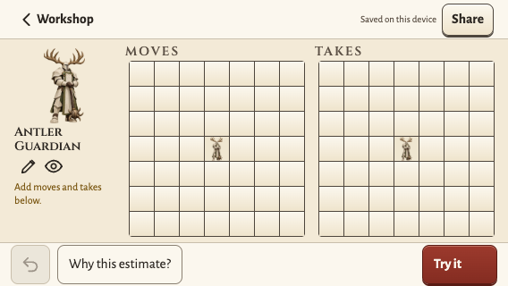
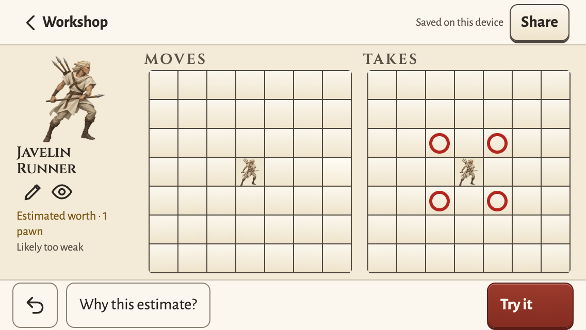

# 08: Both boards and Try it in view on a landscape phone

**What to build:** On a 568×320 phone the player sees both boards and Try it without a scroll, so they can edit and test at once. One media query, for landscape screens at most 500 px high, holds the numbers of the approved mockup: a 44 px header and a 49 px footer; a 120 px card column with an 84 px figure and no thermometer; the two boards side by side with 27 px cells (197 px boards), 14 px titles and no mode or forward line; the Apply-to select and the rest below, in the scroll. The fit function also caps the cell by height in short landscape and runs on an orientation change; its 24 px floor replaces the 28 px minimum of revision 3. Other layouts do not change.

**Blocked by:** 07

**Status:** ready-for-agent

Owner-approved: 2026-10-07 docs/specs/retro-2026-10-06/mockups/landscape-568x320-mockup.png (the thermometer hidden; 36 px header buttons and 28 px pen, eye and Take-by select, as in the mockup).

- [x] At 568×320: both boards and Try it pass `insideViewport` with the scroll at the top; cells are 27 px; the thermometer, the mode lines and the forward lines are hidden.
- [x] At 568×320, `minTarget` passes at 36 px for the header buttons, 28 px for the pen, the eye and the Take-by select, and 44 px for every other control.
- [x] At 320×568, 390×844, 768×1024 and 1280×900: after a scroll to each board, the whole board passes `insideViewport`; Try it passes `insideViewport`; there is no sideways scroll.
- [x] At all five sizes, each cell is 24 px or more.
- [x] A turn from 320×568 to 568×320 and back refits the cells without a reload.
- [x] At the four other sizes, the card and board boxes equal their boxes before this ticket (the builder records them first).
- [x] The review's fix 11 (full grid at 568×320) now has a check.
- [x] A 568×320 screenshot from the runner folder is in Comments, beside the mockup.
- [x] `npm test` and `npm run check:browser workshop` pass.

**Verify:** `npm test`; `npm run check:browser workshop`

**Owns:** src/workshop/workshop.css, src/workshop/dialog.ts, tools/verify-workshop.mjs

## Comments

- **Before boxes** (recorded first, build `d63c763`, a new Antler Guardian piece, scroll at the top, [x, y, w, h]): 320x568 card [16, 64, 288, 289], boards [16, 541, 288, 288] and [16, 961, 288, 288], cell 40 px; 390x844 card [16, 64, 358, 283], boards [37, 535, 316, 316] and [37, 983, 316, 316]; 768x1024 card [84, 68, 600, 283], boards [50, 539, 316, 316] and [402, 539, 316, 316]; 1280x900 card [112, 76, 320, 346], boards [479, 240, 316, 316] and [841, 240, 316, 316]; cells 44 px. The check holds them in `BEFORE`; the build gives the same boxes. At 568x320 before: boards at y 535 and 983 (44 px cells), workspace 211 px high.
- **568x320 after:** header 44 px, footer 49 px, workspace 227 px; card column [12, 50, 120, 186]; boards [144, 68, 197, 197] and [356, 68, 197, 197]; cells 27 px; Try it [472, 274, 84, 44]. These are the numbers of the mockup.
- **Screenshot:** build `08-landscape-568x320-build.png` (from the runner folder, `workshop/568x320-landscape.png`) beside the mockup `../../retro-2026-10-06/mockups/landscape-568x320-mockup.png`.

   
- **Code:** `workshop.css` has one block `@media (orientation: landscape) and (max-height: 500px)` with the mockup numbers (no `--cell` in it). `fit()` in `dialog.ts` caps the cell by the room from the board top to the workspace bottom in short landscape, has a 24 px floor, and also runs on a change of `(orientation: landscape)`, also while the name field has the focus. The stale comment "Under 360 px and in phone landscape" now says "Under 360 px" (its rule is width-only).
- **Check groups** in `tools/verify-workshop.mjs`: `fix11FullGridLandscape` (acceptance 1, 2, 4 at 568x320, the screenshot), `boardsInView` at the four other sizes (acceptance 3, 4, 6), `turnRefits` (acceptance 5). `cardLayout` now runs at all five sizes; `targetsFit` accepts 36 px for the card header buttons and 28 px for the pen, the eye and the Take-by select in short landscape, 44 px for the rest. `blankCast` asserts no thermometer in short landscape. Ticket 09 can name `fix11FullGridLandscape` for fix 11.
- **Red, then green:** the check failed first with "short landscape: no thermometer" (the boards were at y 535). Two hand mutations, each reverted: with no resize listener the check passes (the orientation listener refits); with neither listener it fails with "a turn to 568x320: the cells are 40 px, not 27 px".
- **Commands:** `npm run check:browser workshop workshop-cast` (ok 58.2 s and 12.3 s). `npm test` after the merge of the integration tip `e68a4a5`: exit 0 (vitest 64 files, 1263 tests; node tests 42 of 42); the merge brought no app code, so the browser checks stand. Other runs at a load average of about 25 (other builders) failed one or two unrelated tests by the 5 s vitest limit (`gate.test.ts`, `judge.test.ts` random designs, `piece-activity.test.ts`); each passes alone.
- **Not here:** `docs/WORKSHOP.md` lines 102 and 1640 still say 28 px cells in the shortest landscape (revision 3); ticket 12 moves revision 3 to a dated file. Owner point: in short landscape the empty card says "Add moves and takes below.", but the boards are beside it.

