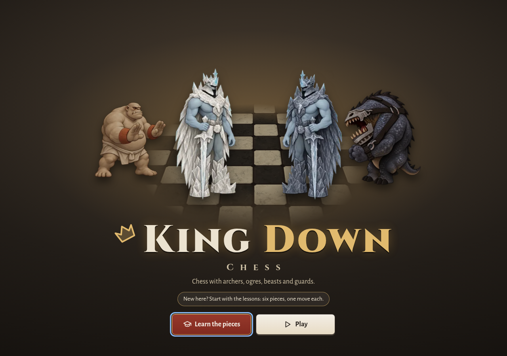
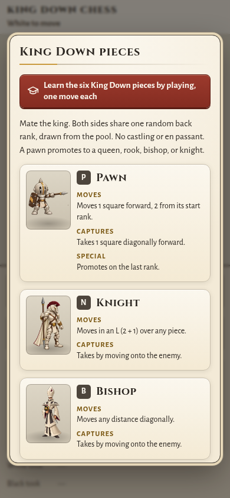

# Visual design and UX pass — 2026-10-02

Owner request (2026-10-02): improve graphic design and UX, so the game looks designed and in keeping
with its painted storybook pieces and stone board, and is easier to start and to use. This folder holds
the design note, the checks and the before/after screenshots.

## Round 2 — owner requests (2026-10-02)

The owner asked for three things; screenshots (from the production build) in [round2/](round2/).

1. **"For the main screen - include a lineup of all of the pieces."** The title screen now has a row of
   all twelve pieces under the two kings, standing on a stone ledge with their names in small capitals.
   The armies alternate (black Pawn, white Knight, black Bishop, white Rook…), and each figure is sized
   as it stands on the board (the Ogre tallest, the Maester smallest). They rise in one after another
   (not with reduced motion) and lift with a gold glow under the pointer. Two rows of six on a phone;
   Learn and Play stay on screen at 390×844. The figures are the Guide's cuts of the painted sheets.
   [desktop](round2/title-desktop.webp) · [phone](round2/title-phone.webp)
2. **"Ogre and rook/rock, for the white side - they have skin color, but it needs to be the same base
   color as the other pieces."** [`ivory-skin.py`](ivory-skin.py) recolours the white half of the Ogre
   and Rook sheets (`docs/2d-first-pieces/ogre/ogre.png`, `rook/rook.png`, their WebP copies; the
   board, the trial, the strikes, the trailer, the title and the Guide all use these). It samples the
   ivory from the other white figures (Guard, Beast, Knight, Bishop, Paladin, Queen), masks the skin by
   hue, saturation and brightness with soft edges (the Ogre's red wristbands, the Rook's stone and
   glowing eyes, the loincloth and the outlines stay as painted), matches the skin's brightness to the
   ivory's so the shading is kept, and takes hue and saturation from the ivory at that brightness. The
   black half of each PNG is pixel-for-pixel unchanged; the WebP copies are re-encoded as
   `web-art.py` does (black half within 1/255 on average). It reads the originals from git (commit
   `84fb194`), so it can be rerun. [before/after](round2/ivory-ogre-rook-before-after.webp) ·
   [close-up](round2/ivory-closeup-before-after.webp) · [black unchanged](round2/charcoal-unchanged-before-after.webp)
3. **"Improve the presentation of available moves and takes when clicking on a piece."** New markers
   on the painted board ([`src/render/marks.ts`](../../src/render/marks.ts)), all drawn on the canvas.
   Each kind has its own shape, so colour is never the only cue:

   | Kind | Marker |
   |---|---|
   | Move | A gold cut gem floating over a soft glow where the feet will stand; a glint crosses it now and then. |
   | Capture | A crimson ring at the enemy's feet and four corner brackets that breathe inwards. |
   | Archer shot | The same, plus a turning gun-sight over the target's body and a dashed outer ring. |
   | Maester swap | Two violet arrows chasing round the friend's feet. |
   | Ogre shove | A teal ring and chevrons marching out on the side the piece will be pushed to. |
   | King's power | A blue rune circle (six-point star) under the square; armed power moves get blue gems. Freeze, Ice Wall and Sacrifice targets show the rune. |
   | Selected piece | A warm glow and a gold ring at its feet. |

   When a piece is selected its markers pop in, rippling out from it (300 ms each, 38 ms later per
   square of distance). Pointing at a move shows a see-through copy of the piece standing there on a
   gold ring; pointing at a capture turns its brackets and ring gold. The keyboard cursor previews the
   same way. With Animations off or reduced motion the markers appear at once and stay still. Pulses
   ride the selected figure's ~30 fps idle; only the pop-in asks for full-rate frames. The clay look
   keeps its tile tints (Freeze/Ice Wall/Sacrifice targets now tint amber there too).
   [moves](round2/moves-desktop.webp) · [phone](round2/moves-phone.webp) ·
   [preview](round2/moves-hover-move-desktop.webp) · [capture under the pointer](round2/moves-hover-capture-desktop.webp) ·
   [Archer](round2/special-archer-desktop.webp) · [Ogre](round2/special-ogre-desktop.webp) ·
   [Maester](round2/special-maester-desktop.webp) · [Flight](round2/special-flight-desktop.webp) ·
   [Freeze](round2/special-freeze-desktop.webp) · [reduced motion](round2/moves-reduced-motion-desktop.webp) ·
   [video](round2/markers.webm) (recorded in real time in headless Chromium, so the frame rate is lower than on a device)

## Round 3 — a simpler New game (2026-10-03)

Owner: "the first menu after the first screen should be simplified. there should be only very few
choices, and 3 top buttons as suggested game modes and setups. also, simplify the menu of picking a king
by showing the "emblems" of each king as a button. also, the default non-power kings should be the spirit
for white and the shadow for black."

- **Three games at the top** (one radio group): *Play the computer* (the default: you play White, no
  powers), *Kings' powers* (against the computer, each king brings one power) and *Two players* (one
  device, or the game link). Below them: the computer's level as one row (Beginner, Casual, **Club**,
  Strong), or for two players a *Kings' powers* box. Then **Start game** and Cancel.
- **King picker** (Kings' powers, or Two players with the box): per side, six emblem buttons in the rules'
  order (Frost, Flame, Stratus, Mud, Spirit, Shadow), then that king's two powers and *No power*, with the
  official count and one-line rule of the chosen power under them. White is **Spirit** and Black is
  **Shadow** by default; with powers on, each king starts with its first power. A game with no powers
  keeps plain kings in the rules.
- **More options** (folded): the side you play, and the army (Random King Down army, Today's army, Chess
  starting army, Custom army…, the example armies and Ogre practice).
- The dialog edits a copy: Cancel drops the changes, Start game keeps them for next time
  (`localStorage['kingdown.new-game']`; a save from before reads as its own setup).
- The level, side and players of the game in progress no longer change from the dialog; they change with
  a new game. `?players=human,ai` (White, then Black) sets them for a lab page and the browser checks.
- Emblems: [`make-emblems.py`](make-emblems.py) cuts each king's emblem to a 256 px WebP: the four
  element emblems of 2019 (`art-src/emblems-logo/`: water = Frost, fire = Flame, air = Stratus,
  earth = Mud) and the Spirit and Shadow emblems painted for this dialog on 2026-10-03 (`--spirit`,
  `--shadow`; their PNG masters are not in `art-src/` yet).
- Check: `tools/verify-new-game.mjs`. Screenshots: [desktop](new-game/desktop-computer.jpg) ·
  [desktop, Kings' powers](new-game/desktop-powers.jpg) · [phone](new-game/phone-computer.jpg) ·
  [phone, Kings' powers](new-game/phone-powers.jpg)

## What changed

| Area | Before | After |
|---|---|---|
| Opening | The game opened straight onto a random army. | A title screen: the King Down wordmark over the painted kings on the stone board, with **Continue** (when a game is saved), **Learn the pieces** and **Play**. A first visit leads with the lessons. Shown once per browser tab; never over a game link, `?fen=` or `?army=`; `?title=0` skips it. |
| Type | System sans and Georgia. | Cinzel for the wordmark, headings and the result; Alegreya Sans for everything else. |
| Look | Black-and-white pixel HUD (2 px ink borders, hard drop shadows). | Parchment surfaces, stone edges and borders, one burgundy accent, gold ornament. |
| Buttons | Text only. | The menu and Hint/Undo/Resign show an icon over the label; primary actions are burgundy. |
| Guide | A four-column table (stacked on phones). | One card per piece with its painted figure, letter, moves, captures and specials. |
| Promotion | Letter buttons. | Each choice shows its painted figure (in the promoting side's colour). |
| Result | Plain dialog. | The two painted kings; the beaten one lies toppled (none after a draw). |
| Lessons | Text in the panel. | A six-step progress bar and the task in a lesson card. |
| Threats | — | Settings → **Show threats** (off by default): a red ring at the feet of each of your pieces the other side can take, and a red dot on each empty square it covers. Uses only the engine's exported `pseudoMoves` and `isAttacked`. |
| Refused moves | The tap did nothing, or deselected silently. | The help line says why: "That is Black's rook. White to move…", "This bishop has no legal move…", "Not allowed: that bishop move would leave your king in check.", "Not allowed: a guard can only be taken by a king.", "Not allowed: the rook cannot reach b2…", "The computer is thinking…". |
| Keyboard | Panel buttons only; the board needed a pointer. | Tab to the board; arrow keys move a square cursor (it follows the board's orientation), Enter or Space selects and moves, Shift+Enter is the Ogre push shortcut, Escape cancels. Moves in the list are buttons. |
| Screen readers | Help and moment lines only. | Every move by either side is announced ("White pawn e2 to e4.", "Black archer on c7 takes the knight on d6 without moving."), plus Undo, and the cursor's square and piece. |
| Phones | Mixed control heights. | Every control in the panel and the dialogs is at least 44 px; visible focus everywhere. |

Every element id is kept. Two kinds of tool selectors changed: the Guide's `#rules-rows tr` became
`#rules-rows .piece-card` (cards keep the "A Archer" text), and each browser tool now sets
`sessionStorage['kingdown.title-seen'] = '1'` to skip the title screen.

## Fonts (SIL Open Font License 1.1, self-hosted)

| Face | Use | Files | Licence |
|---|---|---|---|
| [Cinzel](https://github.com/NDISCOVER/Cinzel) (variable, 400–900) | wordmark, header, dialog headings, piece names, result | `public/fonts/cinzel-latin.woff2` (24 KB) | [OFL-Cinzel.txt](../../public/fonts/OFL-Cinzel.txt) |
| [Alegreya Sans](https://github.com/huertatipografica/Alegreya-Sans) 400, 400 italic, 700 | body, buttons, labels | `public/fonts/alegreya-sans-{regular,italic,bold}-latin.woff2` (19–20 KB each) | [OFL-AlegreyaSans.txt](../../public/fonts/OFL-AlegreyaSans.txt) |

Source: the `google/fonts` repository. Subset with `pyftsubset` to Basic Latin, Latin-1 and the
punctuation the game prints (— – … ‘ ’ “ ” · × ← →), as woff2: 82 KB in all, so the game still works
offline. Cinzel's classical capitals suit kings and stone; Alegreya Sans is a humanist sans with a
calligraphic touch that stays readable at 12–15 px.

## Tokens (`src/style.css`, `:root`)

- **Colour.** `--parchment #f3ead7` (panel), `--vellum #fbf7ee` (dialogs, cards, fields),
  `--parchment-deep #e7d8b8`; text `--ink #2b2621` and `--ink-soft #5b5045`; stone `--stone-100/300/500/700/900`;
  `--accent #842c21` (primary buttons, checked boxes), `--accent-deep #5a1c14`; `--gold #c99a3e` (ornament),
  `--gold-ink #7a5712` (gold as text); `--danger #b0251b` (threats, check); `--focus #1c5bb0`;
  `--night #221d18`, `--on-night`, `--on-night-soft` (title screen).
- **Type.** `--font-display`, `--font-body`; sizes `--fs-xs 12.5` · `--fs-sm 14` · `--fs-md 15.5` (body) ·
  `--fs-lg 18` · `--fs-xl 23` · `--fs-2xl 30`; `--lh 1.45`.
- **Space and shape.** `--space-1…6` = 4 · 8 · 12 · 16 · 24 · 32 px; `--radius-sm 5`, `--radius 8`, `--radius-lg 14`;
  `--tap 44px`; `--lift`, `--shadow-card`, `--shadow-float`.

## Contrast (WCAG 2.2 AA)

`node docs/visual-design/contrast.mjs` checks 26 text/surface and UI pairs read from the tokens
([contrast.json](contrast.json)); all pass. Lowest text pairs: `--gold-ink` on parchment 5.49:1, `--danger`
on parchment 5.62:1, `--ink-soft` on `--stone-100` (disabled labels) 6.30:1. Body text is 12.5:1 on the
panel and 14.0:1 in dialogs. UI parts: focus ring 5.5:1, borders 3.6–7.9:1.

## Checks

- `PLAYABLE_URL=… PLAYABLE_BROWSER=chromium node docs/visual-design/verify.mjs` — title screen (first visit,
  returning player, never over links/`?fen=`/`?title=0`), keyboard play of e2-e4 with both announcements,
  move-list buttons, Show threats on a known position (1 ring, 15 dots), five refusal messages, Guide cards
  and promotion figures, and every phone control ≥ 44 px. Results: [checks.json](checks.json).
- `PLAYABLE_URL=… node tools/verify-new-game.mjs` — the New game dialog: defaults, the game each mode
  starts, the picker's power lines, Cancel, memory, custom army, keyboard, phone.
- `node docs/visual-design/shots.mjs <url> before|after` — the screenshots below.
- `python3 docs/visual-design/make-ui-art.py` — re-cuts `public/ui/` from the painted sheets.

## Screenshots (1280×900 and 390×844)

| View | Before | After |
|---|---|---|
| Title / first load | [desktop](before/title-desktop.png) · [phone](before/title-phone.png) | [desktop](after/title-desktop.png) · [phone](after/title-phone.png) · returning: [desktop](after/title-returning-desktop.png) · [phone](after/title-returning-phone.png) |
| Game (d-pawn selected) | [desktop](before/game-desktop.png) · [phone](before/game-phone.png) | [desktop](after/game-desktop.png) · [phone](after/game-phone.png) |
| Show threats | — | [desktop](after/threats-desktop.png) · [phone](after/threats-phone.png) |
| New game | [desktop](before/new-game-desktop.png) · [phone](before/new-game-phone.png) | [desktop](after/new-game-desktop.png) · [phone](after/new-game-phone.png) |
| Settings | [desktop](before/settings-desktop.png) · [phone](before/settings-phone.png) | [desktop](after/settings-desktop.png) · [phone](after/settings-phone.png) |
| Guide | [desktop](before/guide-desktop.png) · [phone](before/guide-phone.png) | [desktop](after/guide-desktop.png) · [phone](after/guide-phone.png) |
| Lesson | [desktop](before/lesson-desktop.png) · [phone](before/lesson-phone.png) | [desktop](after/lesson-desktop.png) · [phone](after/lesson-phone.png) |
| Promotion | [desktop](before/promotion-desktop.png) · [phone](before/promotion-phone.png) | [desktop](after/promotion-desktop.png) · [phone](after/promotion-phone.png) |
| Capture or push | [desktop](before/capture-or-push-desktop.png) · [phone](before/capture-or-push-phone.png) | [desktop](after/capture-or-push-desktop.png) · [phone](after/capture-or-push-phone.png) |
| Result | [desktop](before/result-desktop.png) · [phone](before/result-phone.png) | [desktop](after/result-desktop.png) · [phone](after/result-phone.png) |

## Limits

- The board itself (squares, markers, coordinates, figures) is drawn by the painted scene, which the
  motion track owns; this pass did not change it. Threat markers and the keyboard cursor are a separate
  layer over the canvas, placed with `view.screenOf()`.
- In the clay 3D look, threat markers follow the camera frame by frame, but they sit flat over the
  view, not on the tilted squares.
- The before screenshots were taken in a cloud container without Georgia, so the old header shows a
  fallback serif.
- Not tested with a real screen reader (NVDA, VoiceOver); the live regions and labels were checked by
  their text in a headless browser.
- No new art: the title uses the existing King, Ogre and Beast figures and the stone board. A dedicated
  title illustration would be a later art task.
